# 连续时间的世界线 Worm 算法

## 概述

考虑一个晶格系统的哈密顿量 $\hat{H}$, 对于完备的基矢量 $\alpha$，配分函数可以写为：

$$
\mathcal{Z} =  {\rm Tr} (e^{-\beta\hat{H}}) = \sum_{\alpha} \langle \alpha  |   e^{-\beta\hat{H}} |\alpha \rangle
$$

在这里，哈密顿量可以视为 Fock 空间中的矩阵，$|\alpha\rangle$ 是选定基底中的多体态。若哈密顿量退化为普通数值权重，配分函数就回到经典模型的构型求和；量子模型的额外困难在于 $e^{-\beta\hat H}$ 是算符，需要在虚时方向插入完备基并求和所有演化历史。世界线表示正是这种“态随虚时演化”的构型语言。

虚时 $\tau$ 可以从实时演化经 Wick rotation 得到。在有限温路径积分中，$\tau\in[0,\beta]$，而 $\beta=1/T$ 是虚时方向的总长度。不同量子 Monte Carlo 方法的差别，主要在于如何把 $e^{-\beta\hat H}$ 改写成可抽样的构型权重。

常见路线包括：

- **费曼图 Monte Carlo**：从相互作用表象和格林函数出发，对微扰展开中的图形构型抽样。
- **行列式 Monte Carlo / DQMC**：对二次型费米子使用 trace-determinant 恒等式，对相互作用项用 Hubbard-Stratonovich 变换引入辅助场。
- **随机级数展开 / SSE**：直接展开 $e^{-\beta\hat H}$，把量子统计问题改写成基态与算符串的求和。

连续时间世界线 worm 方法属于世界线 QMC：构型由虚时中的占据数片段、kink 事件和 worm 端点组成。

## 配分函数空间

配分函数空间 $\mathcal Z$ 由闭合世界线构型组成。
对于世界线的 **Worm** 算法，其将虚时 $\beta$ 离散化为等分的 $N$ 段，即取小量 $\tau = \beta / N$, 再通过插入完备基矢量的方法可以将配分函数写为如下的积和式：

$$
\boxed{\mathcal{Z} = \sum_{\lbrace \alpha^{(i)} \rbrace} \prod_{i=0}^{N-1} \langle \alpha^{(i+1)} | e^{-\tau \hat{H}} | \alpha^{(i)} \rangle
=\sum_{\lbrace \alpha^{(i)} \rbrace}  W(\lbrace \alpha^{(i)} \rbrace)}
$$

其中 $\alpha^{(0)}$ 与 $\alpha^{(N)}$ 表示同一世界面。它们来自原始求迹

$$
{\rm Tr}\left(e^{-\beta\hat H}\right)
=
\sum_{\alpha}
\langle \alpha|e^{-\beta\hat H}|\alpha\rangle
$$

中 $e^{-\beta\hat H}$ 左右两边所夹的同一个基矢量。求和符号下标

$$
\{\alpha^{(i)}\}
$$

表示对整条基矢量序列求和，该序列包含

$$
\alpha^{(0)},\alpha^{(1)},\cdots,\alpha^{(N-1)}
$$

共 $N$ 项。最后，

$$
W(\{\alpha^{(i)}\})
=
\prod_{i=0}^{N-1}
\langle \alpha^{(i+1)}|
e^{-\tau\hat H}
|\alpha^{(i)}\rangle
$$

记为这条序列对应的构型权重。

求和形式包含所有基态序列，但只有每一步矩阵元非零的序列才贡献权重。哪些相邻态可以相连由非对角哈密顿量决定；在格点玻色或自旋模型中，这通常对应 hopping、pairing 或 flipping 等局域事件。

### 构型的权重

对配分函数其中的一个重复单元有:

$$
\langle \alpha^{(i+1)} |e^{-\tau \hat{H}} | \alpha^{(i)} \rangle  \approx 
e^{-\tau H_0} \langle \alpha^{(i+1)} | e^{-\tau \hat{V}}| \alpha^{(i)}\rangle \approx 
e^{-\tau H_0} \langle \alpha^{(i+1)} | {\bf 1} - \tau \hat{V}| \alpha^{(i)}\rangle
$$

其中 $\boxed{\hat{H} = \hat{H}_0 + \hat{V}}$ , 前者为所选基矢量下的对角项，后者是非对角项。第一个近似利用到了 Trotter 分解，即：

$$
e^{-\tau\hat{H}} = e^{-\tau\hat{H}_0} e^{-\tau\hat{V}} + \mathcal{O}(\tau^2)\approx e^{-\tau\hat{H}_0} e^{-\tau\hat{V}}
$$

第二个近似是对小虚时步长的泰勒展开。连续时间极限的关键不是保留一个固定有限的 $\tau$，而是让 kink 事件在 $[0,\beta]$ 中连续取时刻；同一虚时时刻发生多个局域事件的测度为零，因此构型可以按有序 kink 序列组织。

这里的 $H_0$ 是对应基态上的对角能量。由于配分函数空间中的世界线满足虚时周期边界，使用相邻片段左端或右端的对角能量只会改变离散化记号；连续时间极限中对应同一个对角作用量积分。

通常非对角项 $\hat{V}$ 会改变原本的态，因此根据表达式

$$
e^{-\tau H_0} \langle \alpha^{(i+1)} | {\bf 1} - \tau \hat{V}| \alpha^{(i)}\rangle
=
e^{-\tau H_0} \langle \alpha^{(i+1)}| \alpha^{(i)} \rangle - \tau e^{-\tau H_0}  \langle \alpha^{(i+1)}| \hat{V} |\alpha^{(i)} \rangle 
$$

若相邻两个态没有变化，单位算符项贡献权重；若相邻两个态由某个允许的 $\hat V$ 事件连接，非对角矩阵元贡献权重；若二者既不同又不能由 $\hat V$ 连接，则该序列权重为零。

将相邻态发生改变的次数记为 $\mathcal K$。在连续时间语言中，$\mathcal K$ 就是 kink 事件数。构型权重可写为：

$$
\boxed{W(\lbrace \alpha^{(i)} \rbrace) \approx W(\mathcal{K},i(k),\lbrace \alpha^{(i(k))} \rbrace) = (-\tau)^{\mathcal{K}} \prod_{k = 0}^{\mathcal{K}-1}\langle \alpha^{(i(k)+1)}|\hat{V} | \alpha^{(i(k))} \rangle \exp \left({-\sum_{i=0}^{N-1} H_0^{(i)} \tau} \right)}
$$

其中 $i(k)$ 表示第 $k+1$ 个发生改变的虚时层数。对于 $\mathcal{K} \geq 2$ 情况下，$\lbrace \alpha^{(i(k))} \rbrace$ 表示发生改变前的 $\mathcal{K}$ 个态组成的序列； $\mathcal{K} = 0$ 时，世界线上的态均一致，不会发生变化，因此仅表示一个态组成的序列；而 $\mathcal{K} = 1$ 通常不可能发生，这是因为改变一次态之后，需要至少再改变一次才能回到初态，满足世界线为首尾相连圈的要求。相比原始形式的求和，上述形式的权重相当于将序列根据发生改变次数进行分类，关系如下：

$$
\sum_{\lbrace \alpha^{(i)} \rbrace} W(\lbrace \alpha^{(i)} \rbrace) \rightarrow \sum_{\mathcal{K}=0}^{\infty}  \sum_{i(0) = 0}^{N-1} \sum_{i(1) = i(0)}^{N-1} \cdots \sum_{i(\mathcal{K}-1)=i(\mathcal{K}-2)}^{N-1} \sum_{\lbrace \alpha^{(i(k))} \rbrace } W(\mathcal{K},i(k),\lbrace \alpha^{(i)} \rbrace) 
$$

注意，虽然改变次数 $\mathcal{K}$ 可以从 0 取到 $\infty$, 但对于 $\mathcal{K} = 0,1$ 的时候，需要特殊考虑。 而改变发生的时刻的虚时层数 $i(k)$ 也有如上的取值方法，遍历了所有可能的情况。除此之外，发生改变的格点位置并未指定，仍需要通过求和 $\sum_{\lbrace \alpha^{(i(k))} \rbrace}$ 来筛选满足 $\langle \alpha^{(i+1)} |\hat{V}|\alpha^{(i)} \rangle \neq 0$ 的构型，其中 $\lbrace \alpha^{(i(k))} \rbrace$ 在不同 $\mathcal{K}$ 值的情况下要分类讨论。

这一写法比原始 trace 形式更长，但它把世界线构型分解为三类对象：对角作用量、kink 时刻、kink 矩阵元。后续更新的接受率都来自这些因子的权重比。

当 $N\rightarrow\infty$, 可将小量 $\tau$ 取为微元 $d\tau$, 同时原本离散的序列也变为连续的函数 $\alpha(\tau)$, 可将权重写为连续变量的形式，更符合路径积分的风格：

$$
W(\mathcal{K},\tau(k),\lbrace \alpha(\tau(k)) \rbrace) = (-d\tau)^{\mathcal{K}} \prod_{k=0}^{\mathcal{K}-1}\langle \alpha({\tau}(k) + d\tau)|\hat{V} | \alpha({\tau}(k)) \rangle \exp \left({-\int_{0}^{\beta} H_0(\tau') d\tau'} \right)
$$

其中 $\tau(k)$ 表示第 $k+1$ 个发生改变的虚时时刻。可将配分函数写为如下的求和形式：

$$
\sum_{\mathcal{K}=0}^{\infty}  \int_{0}^\beta \int_{\tau(0)}^\beta \cdots \int_{\tau(\mathcal{K}-2)}^\beta \sum_{\lbrace \alpha(\tau(k)) \rbrace} W(\mathcal{K},\tau(k),\lbrace \alpha(\tau(k)) \rbrace) 
$$

算法推导中保留离散事件记号更方便，因为实现中仍需维护有限个 segment、kink 和端点；连续时间极限则体现在 kink 时刻作为连续变量抽样。

### 几种常见的非对角项
权重表达式中的核心输入是非对角矩阵元 $\langle \alpha^{(i+1)}|\hat V|\alpha^{(i)}\rangle$。不同模型的 worm 更新差异，主要来自这些局域矩阵元允许哪些事件。

下图给出 $N=7$ 个世界面的示意构型：

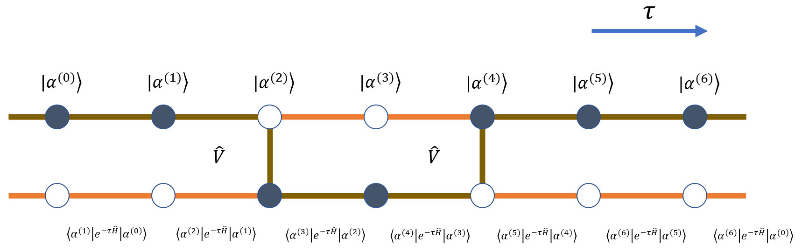

世界面上的态由 $|\alpha^{(0)}\rangle$ 到 $|\alpha^{(6)}\rangle$ 表示，相邻态之间的传播矩阵元决定该段世界线的权重。虚时演化作用在两个世界面之间，因此更像时间方向上的 bond，而不是单个世界面上的 site。只要各世界面上的态确定，中间线段的画法只是表示约定；图中用相邻世界面之间的线段表示左端态沿虚时延伸。

当相邻态发生变化时，例如 $|\alpha^{(1)}\rangle$ 与 $|\alpha^{(2)}\rangle$ 之间，说明该虚时位置存在一个非对角事件。图中以 hopping 为例，用连接线标出参与跃迁的两个格点。

连续时间图示通常只保留 segment 和 kink，而不逐层画出所有世界面。kink 位置的点只表示“这里发生非对角事件”，不再承载完整基态信息。

(1) hopping 项 :

$$
\hat{V} = -t \sum_{\langle ij \rangle} \left(
   \hat{b}_i^\dagger \hat{b}_j + \hat{b}_j^\dagger \hat{b}_i
\right)
$$

该矩阵元非零要求相邻两个态之间只差一个最近邻 hopping。严格地说，$e^{-\tau\hat V}$ 的一阶展开只描述短虚时片内发生一次 hopping 的贡献。连续时间极限中，同一虚时时刻发生多个事件的测度为零，因此构型可以组织成按虚时排序的 kink 序列；若模型显式允许同一时刻的多算符事件，则必须重新写出对应的高阶矩阵元。

考虑一个从格点 $i$ 跃迁到格点 $j$ 的过程贡献：

$$
\boxed{-t\langle \alpha^{(i+1)} |\hat{b}_j^\dagger \hat{b}_i |\alpha^{(i)} \rangle =-t\sqrt{n_i(n_j+1)} \quad ({\rm site} ~i\rightarrow {\rm site} ~j)}
$$

记号上，$\alpha^{(i)}$ 中的 $i$ 标记世界面，$\hat b_i$ 中的 $i$ 标记空间格点。

其中 $n_i$ 与 $n_j$ 表示跃迁发生之前格点 $i$ 与 格点 $j$ 所拥有的粒子数。
对应的局域矩阵元如下图所示：
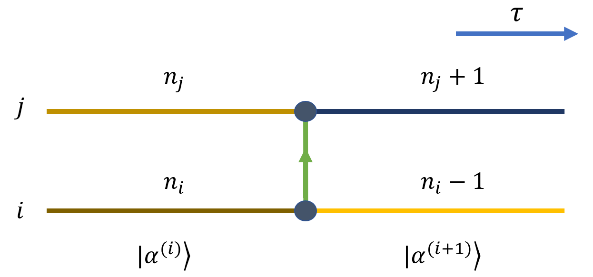
从图中可以形象的将系数理解为沿着虚时方向，跃迁粒子所在世界线段上的粒子数乘积的根值。

(2) pairing 项 ：

$$
\hat{V} = -t \sum_{\langle ij \rangle} \left(
   \hat{b}_i^\dagger \hat{b}_j^\dagger + \hat{b}_j \hat{b}_i
\right)
$$

上式表明，$\langle \alpha^{(i+1)} |\hat{V}|\alpha^{(i)} \rangle$ 项不为 0 即要求构型 $|\alpha^{(i+1)} \rangle$ 和 $|\alpha^{(i)} \rangle$ 之间相差一个最近邻的 pairing. 

考虑从某一虚时刻，格点 $i$ 和格点 $j$ 同时增加一个粒子的贡献为：

$$
\boxed{-t\langle \alpha^{(i+1)} |\hat{b}_j^\dagger \hat{b}_i^\dagger |\alpha^{(i)} \rangle =-t\sqrt{(n_i+1)(n_j+1)}}
$$

对应图像与 hopping 类似：
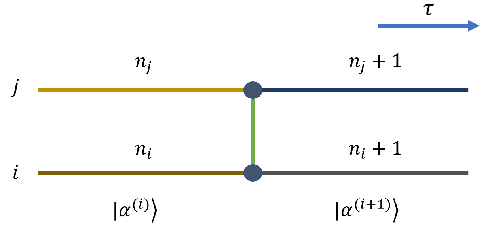
可以看出，系数是增加之后 (或减少之前) 的粒子数乘积的根值。

(3) flipping 项 ：

$$
\hat{V} = -h\sum_{i}\hat{\sigma}_i^x
$$

上式表明，$\langle \alpha^{(i+1)} |\hat{V}|\alpha^{(i)} \rangle$ 项不为 0 即要求构型 $|\alpha^{(i+1)} \rangle$ 和 $|\alpha^{(i)} \rangle$ 之间在同一格点相差一个 flipping. 

考虑一个 $|\uparrow\rangle$ 态在某一虚时刻改变为 $|\downarrow\rangle$ 态，其贡献为：

$$
\boxed{-h\langle \alpha^{(i+1)} |\hat{\sigma}^x_i |\alpha^{(i)} \rangle =-h}
$$

其中 $x$ 方向 Pauli 矩阵翻转自旋态。对自旋 $1/2$ 的这种局域翻转，非零矩阵元为常数：
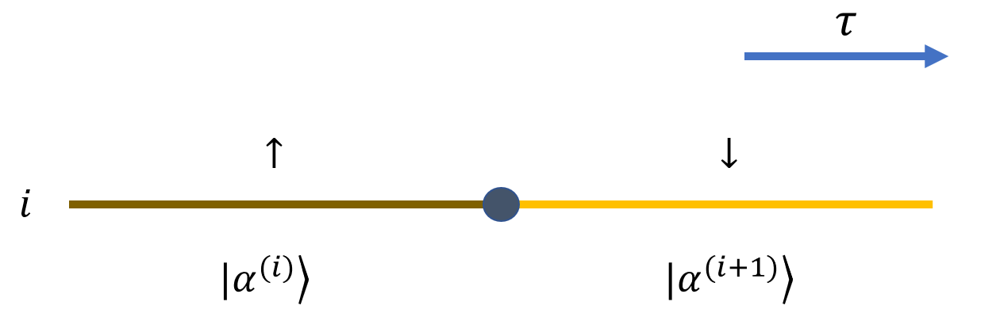

## 格林函数空间

格林函数空间 $\mathcal G$ 由带两个 worm 缺陷的世界线构型组成。
上述闭合世界线构型组成配分函数空间 $\mathcal Z$。worm 更新再引入带两个缺陷端点的扩展空间 $\mathcal G$。由于 $\mathcal G$ 的权重与松原格林函数的时空求和相对应，它也称为格林函数空间。完整抽样空间写为：

$$
\boxed{\mathcal{Z}_w = \mathcal{Z} + \omega_G \mathcal{G}}
$$

其中 $\omega_G$ 为可调的参数，用于控制两空间的占比。

在玻色系统中，两个缺陷分别由产生算符 $\hat b^\dagger_M$ 与湮灭算符 $\hat b_I$ 表示，并位于虚时 $\tau_M$ 与 $\tau_I$。定义

$$
g(I,M,\tau_I,\tau_M) =   
{\rm Tr}[\mathcal{T} \hat{b}_I(\tau_I)\hat{b}^\dagger_M(\tau_M)  e^{-\beta\hat{H}}]
$$

其中产生、湮灭算符均在海森堡绘景下，$\mathcal T$ 为虚时排序算符。虚时 $\tau_M,\tau_I\in[0,\beta]$，$I,M$ 是格点标号。若 $\tau_M<\tau_I$，代入海森堡绘景的虚时演化可得：

$$
{\rm Tr}[e^{-(\beta - \tau_I - \tau_M)\hat{H}}  \hat{b}_I e^{-(\tau_I - \tau_M) \hat{H}} \hat{b}_M^\dagger e^{-\tau_M \hat{H}}]
$$

反之 $\tau_M > \tau_I$ 也是类似的。上式的物理意义十分清晰，即在 $\tau_M$ 与 $\tau_I$ 虚时时刻，世界线某一格点上的粒子态增加或减少了一个粒子。

连续时间极限中，同一虚时时刻同时出现两个事件的测度为零。因此若 $\tau_M$ 与 $\tau_I$ 已经放置了 worm 端点，通常不再在完全相同的虚时时刻放置 $\hat V$ kink。对应的局部因子可写为：

$$
\langle \alpha^{(i(I)+1)}|\hat{b}_I e^{-\tau \hat{H}} | \alpha^{(i(I))} \rangle \rightarrow e^{-\tau H_0} \langle \alpha^{(i(I)+1)}|\hat{b}_I| \alpha^{(i(I))} \rangle
$$

其中 $i(I)$ 表示 $\tau_I$ 对应的虚时层数。类似地，也可以定义 $i(M)$. 严格来说，上式需要额外再加一层完备基矢量，然而由于同一虚时只发生一次改变的要求，故加的基矢量是没有自由度的，只能与 $|\alpha^{(i(I))} \rangle$ 相同才有贡献，即：

$$
\langle \alpha^{(i(I)+1)}|\hat{b}_I | \alpha^{(i(I))} \rangle \langle \alpha^{(i(I))} |   e^{-\tau \hat{H}} | \alpha^{(i(I))} \rangle
$$

因此不需要为同一时刻再引入额外世界面。若模型需要描述端点与其他事件的复合局域过程，则应显式引入中间态并重新写出局部矩阵元，例如

$$
\langle \alpha^{(i(I)+1)}|\hat{b}_I | \alpha^{(i(I)')} \rangle \langle \alpha^{(i(I)')} |   e^{-\tau \hat{H}} | \alpha^{(i(I))} \rangle
$$

这里的中间态 $|\alpha^{i(I)'}\rangle$ 表示复合事件的局域分解。

将端点矩阵元和闭合世界线权重合并，$g$ 的展开形式为：

$$
\sum_{\lbrace \alpha^{(i)} \rbrace} \langle \alpha^{(i(M)+1)}|\hat{b}^\dagger_M| \alpha^{(i(M))} \rangle \langle \alpha^{(i(I)+1)}|\hat{b}_I| \alpha^{(i(I))} \rangle W(\lbrace \alpha^{(i)} \rbrace)
$$

其中多出来的缺陷 (worm head) 的权重的贡献： $\sqrt{n_I (n_M + 1)}$, 而 $n_I$ 与 $n_M$ 分别为相应算符作用前的粒子数。对于硬核玻色子 (hard-core) 的情况，这个系数通常是 1. 

相应地，松原格林函数可以定义为：

$$
\boxed{G(I,M,\tau_I,\tau_M) = \left \langle \hat{b}_I(\tau_I) \hat{b}^\dagger_M(\tau_M) \right \rangle = \frac{g(I,M,\tau_I,\tau_M)}{\mathcal{Z}} }
$$

可以看出，测量上述的格林函数，只需统计两缺陷的时空分布（直方图）即可，这在格林函数空间 $\mathcal{G}$ 是可以直接测量的，十分方便。

此外，该空间当中的配分函数写为:

$$
\mathcal{G} = \sum_{p_I,p_M = 0}^{N-1} \sum_{I,M=0}^{N_s-1} g(I,M,p_I\tau,p_M\tau) \tau^2 = \sum_{p_I,p_M = 0}^{N-1} \sum_{I,M=0}^{N_s-1} W_{\mathcal{G}}
$$

这表示对两个端点的所有时空位置求和。严格地说，同一格点同一虚时时刻的端点重合构型应与 $\mathcal Z$ 空间分开处理，因为它等价于端点湮灭后的闭合构型，只差局部系数。这里 $N_s$ 是空间格点数，$N$ 是世界面数，$p_I,p_M$ 是虚时层编号。离散求和中的 $\tau^2$ 对应连续极限下的 $d\tau_I d\tau_M$。

端点测度和 kink 测度的来源不同。配分函数空间中的 $\tau^{\mathcal K}$ 来自 $\mathcal K$ 个非对角事件的虚时时刻；格林函数空间中的 $\tau^2$ 来自两个外部端点坐标的积分。格点坐标本身是离散求和，不需要额外间隔因子；虚时坐标在连续极限中必须带有积分测度。

格林函数空间权重可写为：

$$
\boxed{W_{\mathcal{G}} (\mathcal{K},i(k), i(I), i(M),\lbrace \alpha^{(i(k))},\alpha^{(i(I))},\alpha^{(i(M))} \rbrace) = \tau^2 \sqrt{n_I (n_M + 1)} W(\mathcal{K},i(k),\lbrace \alpha^{(i(k))} \rbrace)}
$$

对应的求和可以写为：

$$
\sum_{p_I,p_M = 0}^{N-1} \sum_{I,M=0}^{N_s-1} \sum_{\mathcal{K}=0}^{\infty}  \sum_{i(0) = 0}^{N-1} \sum_{i(1) = i(0)}^{N-1} \cdots \sum_{i(\mathcal{K}-1)=i(\mathcal{K}-2)}^{N-1} \sum_{\lbrace \alpha^{(i(k))},\alpha^{(i(I))},\alpha^{(i(M))} \rbrace} W_{\mathcal{G}}
$$

对于自旋体系，也可以有类似定义：
$$
g(I,M,\tau_I,\tau_M) = {\rm Tr}[\mathcal{T} \hat{\sigma}_I^{x}(\tau_I) \hat{\sigma}_M^{x}(\tau_M) e^{-\beta\hat{H}}]
$$

格林函数空间构型可以从原始世界线表示理解。两个缺陷算符作用在线段上，最近邻端点结构如下：
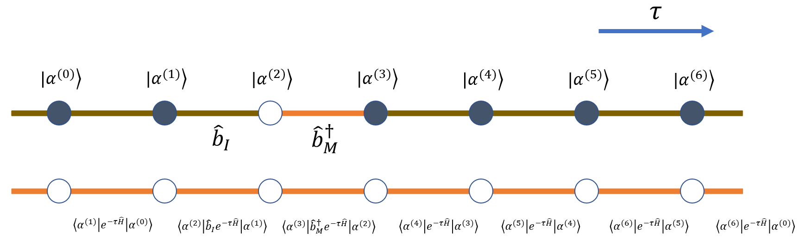

其中态 $|\alpha^{(1)}\rangle$ 先经湮灭算符变为 $|\alpha^{(2)}\rangle$，再经产生算符变为 $|\alpha^{(3)}\rangle$。端点之间的开放片段正是格林函数空间相对于闭合空间多出的局域结构。

让两缺陷距离稍远一些，则可以表示为下图的结构：
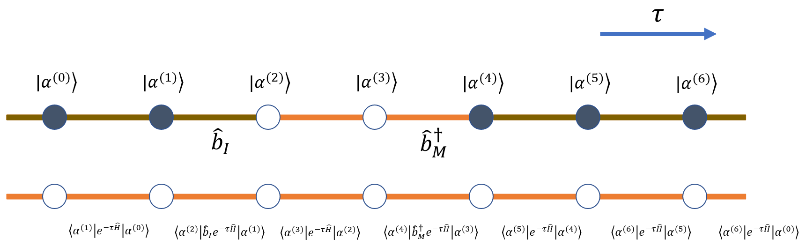

在格点连续时间算法中，这类结构通常可简化为 segment 和端点；在连续空间算法中，相邻世界面的坐标几乎总不同，端点与自由传播子的关系必须更仔细处理。

## 构型的更新
连续时间表示不保存所有虚时切片，而是保存占据数不变的 segment、segment 端点和 kink 事件。这样空间复杂度由离散切片表示的 $O(NN_s)$ 降为与实际事件数成正比，典型量级为 $O(\beta N_s)$。

一般地，构型更新在 $\mathcal{Z}_w = \mathcal{Z} + \omega_G\mathcal G$ 中进行。某些模型不需要显式进入格林函数空间，例如横场 Ising 模型：

$$
\hat{H_0} = - t \sum_{\langle ij \rangle} \hat{\sigma}_i^z \hat{\sigma}_j^z \quad \hat{V} = -h \sum_i \hat{\sigma}_i^x 
$$

这类模型中，单个格点世界线的翻转事件由 $\hat V$ 局域产生，不需要通过两个 worm 端点在空间中移动来制造 hopping。发生改变的虚时点可称为 cut；移动 cut 或成对创建、删除 cut 就能更新一条世界线。对应有两类基本更新：

### `Shift Cut`

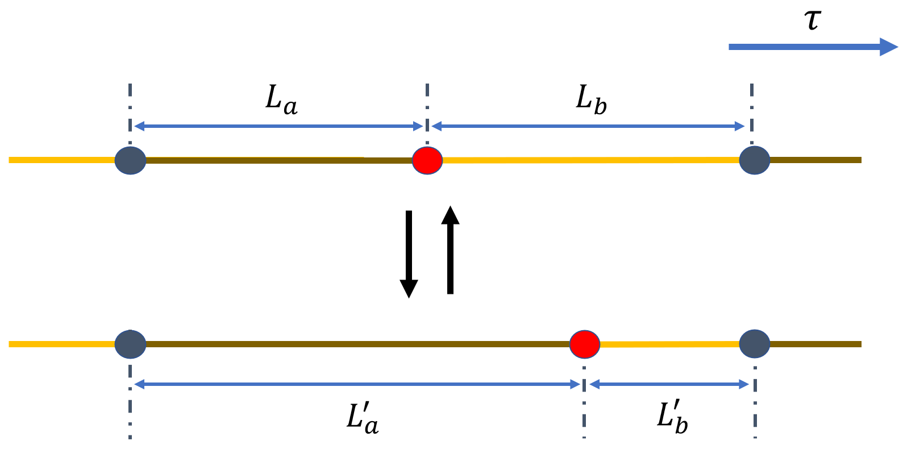

以概率 $p_{\rm shift}$ 触发该操作后，从 $N_{\rm seg}$ 个世界线片段中随机选中一个片段。若片段是没有 cut 的完整闭合圈，则该更新无效。移动对象取为片段右端的 cut；新位置从相邻两个 cut 之间、总长度 $L_a+L_b$ 的区间中均匀抽样。离散虚时步长为 $\tau$ 时，细致平衡等式为：

$$
W(\nu) \cdot \frac{p_{\rm shift}}{N_{\rm seg}} \cdot \frac{\tau}{L_a + L_b} \cdot P_{\rm acc}^{(\nu\rightarrow\nu')}  = W(\nu') \cdot \frac{p_{\rm shift}}{N_{\rm seg}} \cdot \frac{\tau}{L_a' + L_b'} \cdot P_{\rm acc}^{(\nu'\rightarrow\nu)}
$$

旧构型记为 $\nu$，新构型记为 $\nu'$。反向过程在长度 $L_a'+L_b'$ 的相邻片段中抽样。由此得到接受概率：

$$
\boxed{P_{\rm acc}^{(\nu\rightarrow\nu')} = {\rm min} \left[1,  e^{{-\sum [H_0(\nu') - H_0(\nu)] \tau} }   \right]}
$$

因此该更新只需要比较移动 cut 前后的对角作用量。

### `Create/Delete Segment`

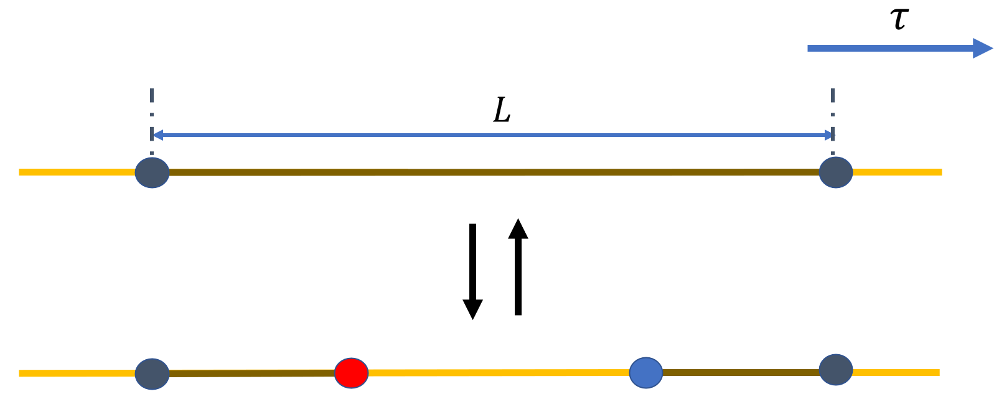

以概率 $p_{\rm creseg}$ 触发创建片段后，从 $N_{\rm seg}$ 个片段中随机选中一个长度为 $L$ 的片段，并在其中随机选择两个时刻作为新片段的起点和终点。两个端点的前后顺序等价，因此相同长度的 proposal 概率带有因子 $2$。删除更新则选择已有片段并直接删除。细致平衡等式为：

$$
W(\nu) \cdot p_{\rm cresg} \cdot \frac{1}{N_{\rm seg}} \cdot \frac{2 \tau^2}{L^2} \cdot P_{\rm acc}^{(\nu\rightarrow\nu')}  = W(\nu') \cdot p_{\rm delsg} \cdot \frac{1}{N_{\rm seg}'} \cdot P_{\rm acc}^{(\nu'\rightarrow\nu)}
$$

* `Create Segment`

创建片段的接受概率为：

$$
\boxed{P_{\rm acc}^{(\nu\rightarrow\nu')} = {\rm min} \left[1, \frac{p_{\rm delsg}}{p_{\rm cresg}} \cdot \frac{N_{\rm seg}}{N_{\rm seg}'} \cdot \frac{L^2}{2}
\cdot \langle \alpha^{(i(k)+1)}  |\hat{V}| \alpha^{i(k)} \rangle^2
\cdot e^{{-\sum [H_0(\nu') - H_0(\nu)] \tau} }   \right]}
$$

对横场 Ising 模型，$\langle \alpha^{(i(k)+1)}|\hat V|\alpha^{i(k)}\rangle=-h$。新构型权重中多出的 $\tau^2$ 与 proposal 测度中的 $\tau^2$ 相互抵消。

* `Delete Segment`

删除片段的接受概率为：

$$
\boxed{P_{\rm acc}^{(\nu'\rightarrow\nu)} = {\rm min} \left[1, \frac{p_{\rm cresg}}{p_{\rm delsg}} \cdot \frac{N_{\rm seg}'}{N_{\rm seg}} \cdot \frac{2}{L^2}
\cdot \frac{1}{\langle \alpha^{(i(k)+1)}  |\hat{V}| \alpha^{i(k)} \rangle^2}
\cdot e^{{-\sum [H_0(\nu) - H_0(\nu')] \tau} }   \right]}
$$

常用的尝试概率满足：

$$
p_{\rm cresg} + p_{\rm delsg} + p_{\rm shift} = 1 \quad \quad p_{\rm cresg} + p_{\rm delsg} = p_{\rm shift}
$$

横场 Ising 模型也可以改写基底后用 worm 型更新处理。例如把哈密顿量写成

$$
\hat{V} = - t \sum_{\langle ij \rangle} \hat{\sigma}_i^x \hat{\sigma}_j^x \quad \hat{H_0} = -h \sum_i \hat{\sigma}_i^z 
$$

从而利用 Holstein-Primakoff 变换可以将 $\hat{V}$ 变为硬核玻色子的 hopping 和 pairing 项，从而进行 Worm 更新。

下面以只含 hopping 项的 Bose-Hubbard 模型为例说明 $\mathcal Z_w$ 空间中的 worm 更新：

$$
\hat{V} = -t \sum_{\langle ij \rangle} \left(
   \hat{b}_i^\dagger \hat{b}_j + \hat{b}_j^\dagger \hat{b}_i
\right) \quad \hat{H_0} = \frac{U}{2} \sum_i \hat{n}_i(\hat{n}_i - 1) - \mu \sum_i \hat{n}_i  
$$

存在 hopping 项的玻色格点系统通常需要三类更新：worm 端点沿虚时移动、worm 端点在空间格点间移动、以及 $\mathcal Z$ 与 $\mathcal G$ 空间之间的创建/湮灭。常见约定是固定 $\hat b^\dagger_M$，只移动 $\hat b_I$。

### `Shift Worm`

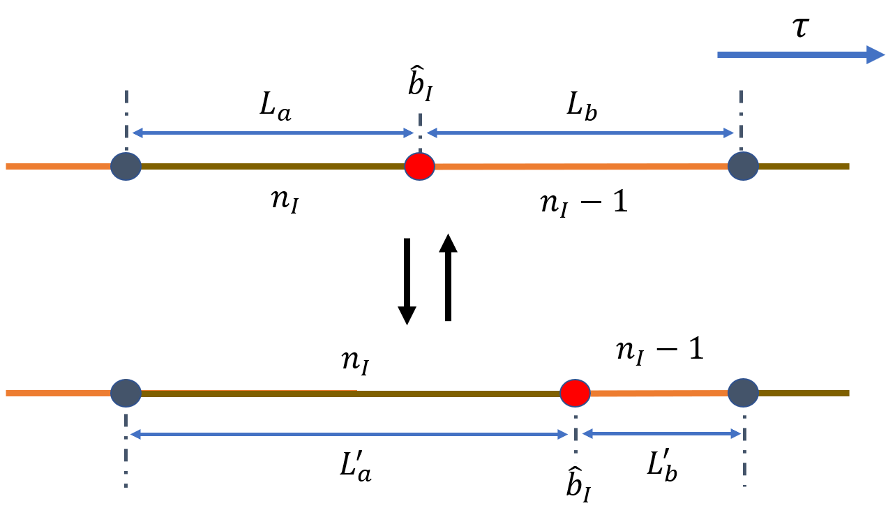

`Shift Worm` 与 `Shift Cut` 类似，但更新发生在 $\mathcal G$ 空间，因此细致平衡中要包含 $\omega_G$：

$$
\omega_G W_{\mathcal{G}} (\nu) \cdot p_{\rm shift} \cdot \frac{\tau}{L_a + L_b} \cdot P_{\rm acc}^{(\nu\rightarrow\nu')} = \omega_G W_{\mathcal{G}} (\nu') \cdot p_{\rm shift} \cdot \frac{\tau}{L_a' + L_b'} \cdot P_{\rm acc}^{(\nu'\rightarrow\nu)}
$$

由此得到该更新的接受概率如下：

$$
\boxed{P_{\rm acc}^{(\nu\rightarrow\nu')} = {\rm min} \left[1,  e^{{-\sum [H_0(\nu') - H_0(\nu)] \tau} }   \right]}
$$

### `Create/Delete Kink`

除了让 $\hat b_I$ 沿虚时方向移动，还需要让它在空间格点之间移动。最简单的空间移动保持端点虚时时刻不变，只改变端点所在格点。由于湮灭算符会改变端点前后的占据数，接受率需要区分新增 hopping kink 位于 $\hat b_I$ 之前还是之后。

先考虑新增 kink 位于 $\hat b_I$ 之前的情形。

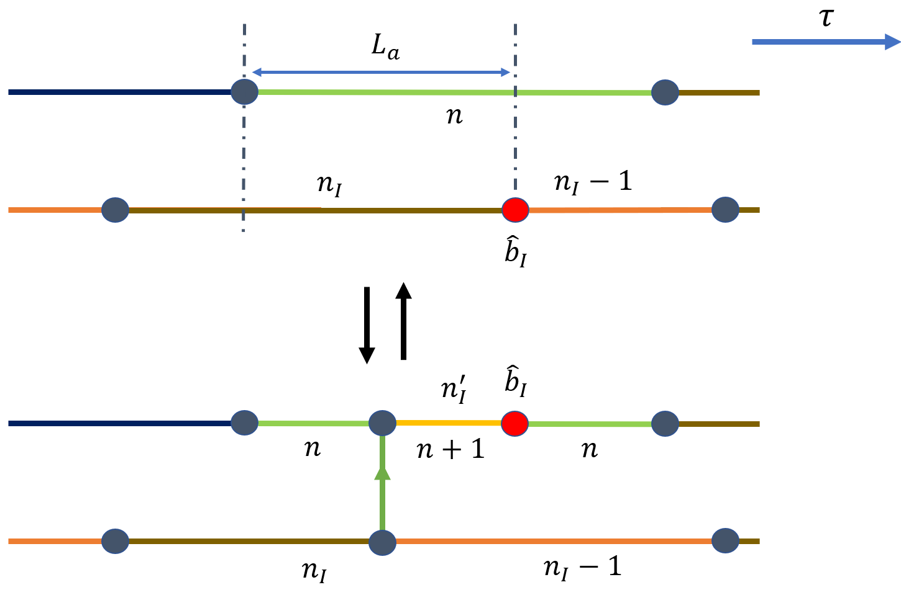

以概率 $p_{\rm crekb}$ 选择该更新后，从 $\hat b_I$ 所在格点的最近邻中选取一个目标格点，并在长度为 $L_a$ 的片段中抽取 kink 虚时时刻。旧构型中端点前的粒子数记为 $n_I$，新构型中对应粒子数记为 $n_I'$。反向删除更新沿端点前方的 kink 把 $\hat b_I$ 移回原格点。细致平衡等式为：

$$
\omega_G W_{\mathcal{G}} (\nu) \cdot p_{\rm crekb} \cdot \frac{1}{z} \cdot \frac{\tau}{L_a} \cdot P_{\rm acc}^{(\nu\rightarrow\nu')} = \omega_G W_{\mathcal{G}} (\nu') \cdot p_{\rm delkb} \cdot P_{\rm acc}^{(\nu'\rightarrow\nu)}
$$

其中 $z$ 是最近邻配位数。接受率同时包含 worm head 的矩阵元和新增 kink 的 hopping 矩阵元：

* `Create Kink Before`

$$
\boxed{P_{\rm acc}^{(\nu\rightarrow\nu')} = {\rm min} \left[1,  \frac{p_{\rm delkb}}{p_{\rm crekb}} \cdot z L_a \cdot \frac{\sqrt{n_I'(n_M'+1)}}{\sqrt{n_I(n_M+1)}} \cdot [- \langle \alpha^{(i(k)+1)}  |\hat{V}| \alpha^{i(k)} \rangle]  \cdot e^{{-\sum [H_0(\nu') - H_0(\nu)] \tau} }   \right]}
$$

对于 Bose-Hubbard 模型有
$\langle \alpha^{(i(k)+1)}|\hat V|\alpha^{i(k)}\rangle=-t\sqrt{n_I n_I'}$。由于 $\hat b_M^\dagger$ 固定，$n_M=n_M'$，worm head 与 kink 权重合并后给出 $t n_I'=t(n+1)$。

* `Delete Kink Before`

$$
\boxed{P_{\rm acc}^{(\nu'\rightarrow\nu)} = {\rm min} \left[1, \frac{p_{\rm crekb}}{p_{\rm delkb}} \cdot \frac{1}{z L_a} \cdot \frac{\sqrt{n_I(n_M+1)}}{\sqrt{n_I'(n_M'+1)}} \cdot \frac{-1}{\langle \alpha^{(i(k)+1)}  |\hat{V}| \alpha^{i(k)} \rangle} \cdot e^{{-\sum [H_0(\nu) - H_0(\nu')] \tau} }   \right]}
$$

对于删去操作，worm head 和 Kink 的权重综合起来的贡献为 $\frac{1}{t n_I'} = \frac{1}{t (n+1)}$.

当新增 kink 位于 $\hat b_I$ 之后时，步骤相同，但 kink 时刻从长度为 $L_b$ 的片段中抽样，并且端点后方的占据数关系不同。

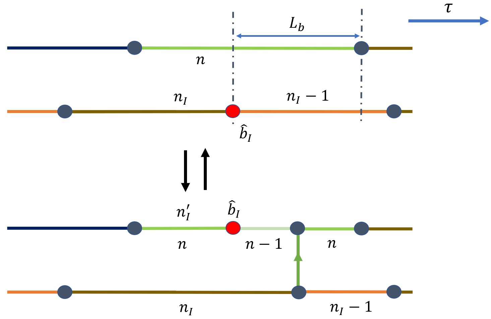

从而有类似的细致平衡的等式：

$$
\omega_G W_{\mathcal{G}} (\nu) \cdot p_{\rm creka} \cdot \frac{1}{z} \cdot \frac{\tau}{L_b} \cdot P_{\rm acc}^{(\nu\rightarrow\nu')} = \omega_G W_{\mathcal{G}} (\nu') \cdot p_{\rm delka} \cdot P_{\rm acc}^{(\nu'\rightarrow\nu)}
$$

以及增加和删除的接受概率：

* `Create Kink After`

$$
\boxed{P_{\rm acc}^{(\nu\rightarrow\nu')} = {\rm min} \left[1,  \frac{p_{\rm delka}}{p_{\rm creka}} \cdot z L_b \cdot \frac{\sqrt{n_I'(n_M'+1)}}{\sqrt{n_I(n_M+1)}} \cdot [- \langle \alpha^{(i(k)+1)}  |\hat{V}| \alpha^{i(k)} \rangle] \cdot e^{{-\sum [H_0(\nu') - H_0(\nu)] \tau} }   \right]}
$$

对于这里的增加操作，worm head 和 Kink 的权重综合起来的贡献为 $t n_I' = t n$.

* `Delete Kink After`

$$
\boxed{P_{\rm acc}^{(\nu'\rightarrow\nu)} = {\rm min} \left[1, \frac{p_{\rm creka}}{p_{\rm delka}} \cdot \frac{1}{z L_b} \cdot \frac{\sqrt{n_I(n_M+1)}}{\sqrt{n_I'(n_M'+1)}} \cdot \frac{-1}{\langle \alpha^{(i(k)+1)}  |\hat{V}| \alpha^{i(k)} \rangle} \cdot e^{{-\sum [H_0(\nu) - H_0(\nu')] \tau} }   \right]}
$$

对于这里的删去操作，worm head 和 Kink 的权重综合起来的贡献为 $\frac{1}{t n_I'} = \frac{1}{t n}$.

### `Create/Delete Worm`
最后，对于 $\mathcal{Z}$ 空间和 $\mathcal{G}$ 之间的转换，情况略微复杂一些。若处于 $\mathcal{G}$ 空间当中，则以 $p_{\rm delw}$ 的概率选中删除 Worm 的操作，并判断 $\hat{b}_I$ 和 $\hat{b}_M^\dagger$ 是否在一个片段的两端，若满足则删除 Worm.

当构型属于 $\mathcal{Z}$ 空间时，以 $p_{\rm crew}$ 的概率尝试产生 Worm, 通常设 $p_{\rm crew} = 1$. 首先从 $N_{\rm seg}$ 个片段中随机选择其中之一，若片段为非圈的情况，此时如下两图，在其长度 $L$ 当中抽出两个时刻作为 $\hat{b}_I$ 和 $\hat{b}_M^\dagger$ 的时间位置，并且它们之间的前后位置产生的效果略有不同，如下两图所示：

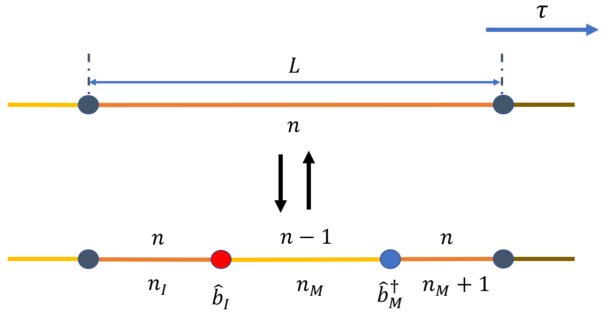

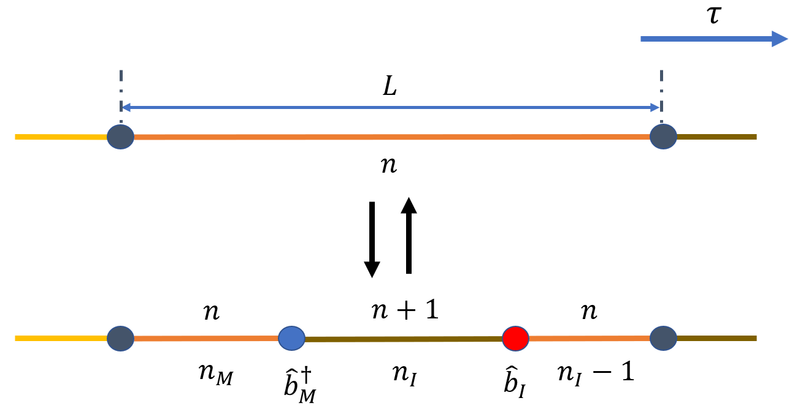

对应的细致平衡等式为：

$$
W (\nu) \cdot p_{\rm crew} \cdot \frac{1}{N_{\rm seg}}  \frac{\tau^2}{L^2} \cdot P_{\rm acc}^{(\nu\rightarrow\nu')} = \omega_G W_{\mathcal{G}} (\nu') \cdot p_{\rm delw} \cdot P_{\rm acc}^{(\nu'\rightarrow\nu)}
$$

可得创建和删除 Worm 的接受概率分别为：

* `Create Worm`

$$
\boxed{P_{\rm acc}^{(\nu\rightarrow\nu')} = {\rm min} \left[1, \frac{p_{\rm delw}}{p_{\rm crew}} N_{\rm seg} \omega_G \sqrt{n_I (n_M + 1)} L^2 e^{{-\sum [H_0(\nu') - H_0(\nu)] \tau} }   \right]
}
$$

* `Delete Worm`

$$
\boxed{P_{\rm acc}^{(\nu'\rightarrow\nu)} = {\rm min} \left[1, \frac{p_{\rm crew}}{p_{\rm delw}} \frac{1}{N_{\rm seg}} \frac{1}{\omega_G} \frac{1}{\sqrt{n_I (n_M + 1)}} \frac{1}{L^2} e^{{-\sum [H_0(\nu) - H_0(\nu')] \tau} }   \right]
}
$$

若抽到的片段是完整闭合圈，创建 worm 的局部结构如下：

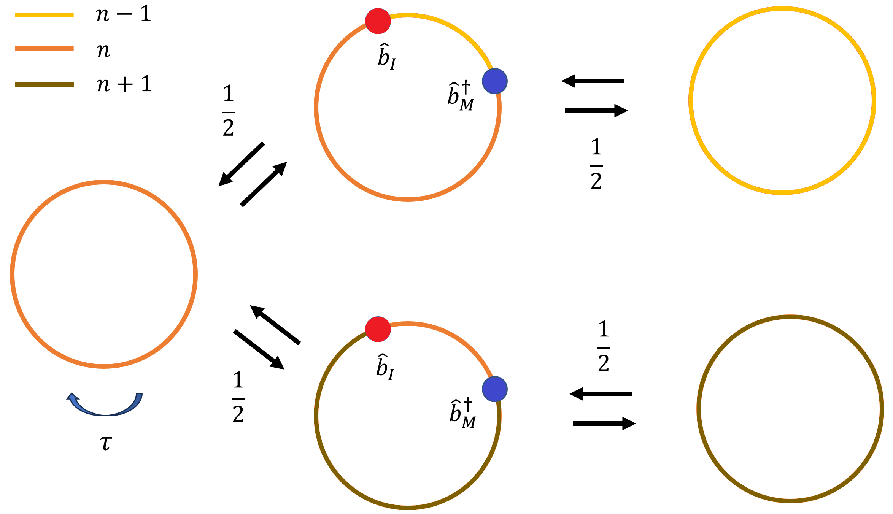

需要以 $1/2$ 的概率选择端点之间的粒子数分配。反向删除 worm 时也有同样的 $1/2$ 因子，因此细致平衡等式为：

$$
W (\nu) \cdot p_{\rm crew} \cdot \frac{1}{N_{\rm seg}}  \frac{1}{2} \frac{\tau^2}{L^2} \cdot P_{\rm acc}^{(\nu\rightarrow\nu')} = \omega_G W_{\mathcal{G}} (\nu') \cdot p_{\rm delw} \cdot \frac{1}{2}\cdot P_{\rm acc}^{(\nu'\rightarrow\nu)}
$$

两侧的 $1/2$ 相互抵消，接受概率形式不变；更新本身仍需区分闭合圈上的两种局部连接。

常用尝试概率满足：

$$
p_{\rm shift} + p_{\rm crek} + p_{\rm delk} + p_{\rm delw} = 1 \quad \quad p_{\rm crek} + p_{\rm delk} = p_{\rm shift} = p_{\rm delw}
$$

$$
p_{\rm crekb} = p_{\rm creka} = \frac{p_{\rm crek}}{2} = p_{\rm delkb} = p_{\rm delka} = \frac{p_{\rm delk}}{2}
$$

为保持 $\mathcal Z$ 与 $\mathcal G$ 的访问频率平衡，常取 $\omega_G\sim 1/(\beta N_s)$ 或与典型 segment 数同阶。`Shift Worm` 等更新还可限制虚时移动距离，避免过大的作用量变化导致接受率过低。

## 补充
