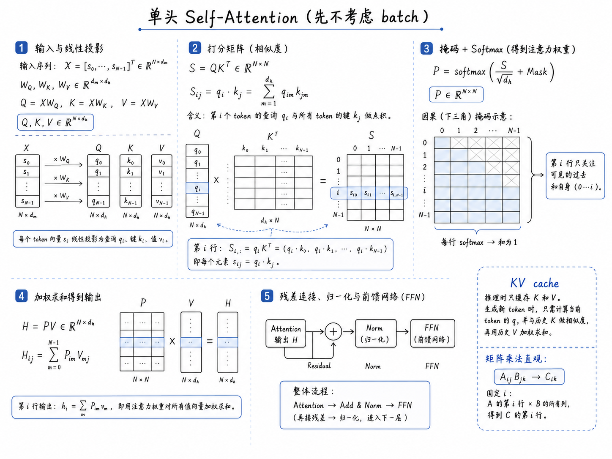

# Attention 机制

Attention 的作用是让每个 token 位置从其他位置读取信息。它把“读什么”和“读多少”都交给数据学习。

本页可以按下面的顺序读：

```text
X
  -> Q, K, V
  -> attention score
  -> softmax weights
  -> weighted sum of V
  -> multi-head concat
  -> output projection
```

最后输出仍然是一组 token 向量，只是每个 token 已经吸收了上下文信息。

## 输入从哪里来

进入 attention 之前，原始输入通常已经经过两步：

1. token id 查 embedding 表。
2. 加上位置编码或位置 embedding。

设 token id 张量为：

$$
T\in\mathbb{N}^{B\times N},
$$

embedding 表为：

$$
E\in\mathbb{R}^{V\times d_{\rm model}},
$$

查表后得到：

$$
X_{\rm tok}=E[T]\in\mathbb{R}^{B\times N\times d_{\rm model}}.
$$

再加位置向量：

$$
X=X_{\rm tok}+X_{\rm pos},
\qquad
X_{\rm pos}\in\mathbb{R}^{B\times N\times d_{\rm model}}
\text{ 或 }
\mathbb{R}^{1\times N\times d_{\rm model}}.
$$

所以 attention 的输入 $X$ 已经不是离散 token 本身，而是一组连续向量：

$$
X=[x_0,x_1,\ldots,x_{N-1}],
\qquad
x_i\in\mathbb{R}^{d_{\rm model}}.
$$

这些 $x_i$ 可以看成“裸 token 表示”：它们知道 token 类型和位置，但还没有通过 attention 读取上下文。

## Query、Key、Value 的直觉

可以把 attention 想成一次检索：

- Query $q_i$：第 $i$ 个位置想找什么。
- Key $k_j$：第 $j$ 个位置提供什么索引。
- Value $v_j$：第 $j$ 个位置真正被读取的内容。

第 $i$ 个位置会用 $q_i$ 和所有 $k_j$ 做相似度，再按权重加权所有 $v_j$。

也就是说，第 $i$ 个 token 的新表示来自所有可见 token 的 value：

$$
\tilde x_i \sim \sum_j a_{ij}v_j.
$$

这里 $a_{ij}$ 是 attention 学出来的混合权重。

## 单头 Attention

输入：

$$
X\in\mathbb{R}^{B\times N\times d_{\rm model}}.
$$

这里先约定 $d_h$ 表示 attention 内部用于 query、key、value 的向量维度。单头 attention 中，$d_h$ 可以直接取 $d_{\rm model}$，也可以取一个单独设置的投影维度。到了多头 attention 中，通常会令：

$$
d_h={d_{\rm model}\over h},
$$

让 $h$ 个头拼接后仍然回到 $d_{\rm model}$ 维。

线性投影：

$$
Q=XW^Q,\qquad K=XW^K,\qquad V=XW^V,
$$

其中：

$$
W^Q,W^K,W^V
\in\mathbb{R}^{d_{\rm model}\times d_h}.
$$

于是：

$$
Q,K,V\in\mathbb{R}^{B\times N\times d_h}.
$$

打分矩阵：

$$
S={QK^{\mathsf T}\over\sqrt{d_h}}
\in\mathbb{R}^{B\times N\times N}.
$$

这里 $S_{ij}$ 表示第 $i$ 个位置对第 $j$ 个位置的原始注意力打分。

权重矩阵：

$$
A=\mathrm{softmax}(S)
\in\mathbb{R}^{B\times N\times N}.
$$

softmax 沿最后一维进行，所以对固定的 $i$，有：

$$
\sum_j A_{ij}=1.
$$

输出：

$$
H=AV
\in\mathbb{R}^{B\times N\times d_h}.
$$

这时 $H_i$ 已经是第 $i$ 个位置读完上下文后的表示：

$$
H_i=\sum_{j=0}^{N-1}A_{ij}v_j,
\qquad
H_i\in\mathbb{R}^{d_h}.
$$

## 为什么要除以 $\sqrt{d_h}$

若 $q$ 和 $k$ 的各分量方差约为 $1$，点积：

$$
q\cdot k=\sum_{\ell=1}^{d_h}q_\ell k_\ell
$$

的方差会随 $d_h$ 增大。softmax 输入过大时，权重会接近 one-hot，梯度容易变小。

缩放后：

$$
{q\cdot k\over\sqrt{d_h}}
$$

可以让打分尺度更稳定。

## Mask

Mask 在 softmax 前加入。常见两类：

| mask | 用途 |
| --- | --- |
| padding mask | 忽略补齐用的 padding token |
| causal mask | 阻止 decoder 看到未来 token |

以 causal mask 为例：

$$
\tilde S_{ij}
=
\begin{cases}
S_{ij}, & j\le i,\\
-\infty, & j>i.
\end{cases}
$$

再做：

$$
A=\mathrm{softmax}(\tilde S).
$$

未来位置的权重就会变成 $0$。

在 encoder 中通常只需要 padding mask；在 decoder 中一定需要 causal mask。这个差别决定了 encoder 是双向表征模型，decoder 是自回归生成模型。

## 单头 Self-Attention 一图总览 {#single-head-self-attention-overview}

下面这张图把前面几个步骤串成了完整的矩阵流。这里先不考虑 batch，也不拆成多头，只看一个 head 中发生了什么。



图中的主线可以读成：

```text
X
  -> 线性投影得到 Q, K, V
  -> QK^T 得到 token-token 打分矩阵 S
  -> 加 causal mask 并沿每一行 softmax，得到注意力权重 P
  -> P V 得到 attention 输出 H
  -> residual / norm / FFN 进入后续 block
```

如果只盯住第 $i$ 行，它表示第 $i$ 个 token 如何读取上下文：

$$
S_{i,:}
=
q_iK^{\mathsf T}
=
\left(q_i\cdot k_0,\ q_i\cdot k_1,\ \ldots,\ q_i\cdot k_{N-1}\right).
$$

经过 mask 和 softmax 后得到：

$$
P_{i,:}
=
\mathrm{softmax}\left({S_{i,:}\over\sqrt{d_h}}+\mathrm{Mask}_{i,:}\right).
$$

最后第 $i$ 个位置的输出是所有 value 的加权和：

$$
h_i
=
\sum_{m=0}^{N-1}P_{im}v_m.
$$

对于 decoder-only 模型，causal mask 会让第 $i$ 行只能关注 $0,\ldots,i$ 这些位置。图右侧的 KV cache 注释对应推理阶段：历史 token 的 $K,V$ 可以缓存，新 token 只需要重新计算自己的 $Q,K,V$，再用新 $Q$ 去读取缓存中的历史 $K,V$。

## 多头 Attention

多头 attention 把表示维度拆成多个子空间。前面已经用 $d_h$ 表示单个 head 的内部维度；在多头结构里通常具体取：

$$
d_h={d_{\rm model}\over h}.
$$

这样每个 head 产生 $d_h$ 维输出，$h$ 个 head 拼接后维度为：

$$
h d_h=d_{\rm model}.
$$

每个 head 独立计算：

$$
H_a=\mathrm{Attention}(Q_a,K_a,V_a).
$$

其中：

$$
H_a\in\mathbb{R}^{B\times N\times d_h}.
$$

再拼接：

$$
H=\mathrm{Concat}(H_1,\ldots,H_h)
\in\mathbb{R}^{B\times N\times (h d_h)}
=\mathbb{R}^{B\times N\times d_{\rm model}}.
$$

最后做输出投影：

$$
\mathrm{MHA}(X)=HW^O,
\qquad
W^O\in\mathbb{R}^{d_{\rm model}\times d_{\rm model}}.
$$

因此：

$$
\mathrm{MHA}(X)\in\mathbb{R}^{B\times N\times d_{\rm model}}.
$$

多头的意义在于让模型同时学习多种关系，而不是把所有依赖挤在一个相似度矩阵里。

## Dressed Token 表示

从输入输出形状看，attention 前后都是一组 token 向量：

$$
X\in\mathbb{R}^{B\times N\times d_{\rm model}},
\qquad
\mathrm{MHA}(X)\in\mathbb{R}^{B\times N\times d_{\rm model}}.
$$

区别在于语义。输入的 $x_i$ 主要来自第 $i$ 个 token 自己的 embedding 和位置编码；attention 输出的 $\tilde x_i$ 已经混入了其他位置的信息：

$$
\tilde x_i
=
\sum_j A_{ij}v_j
\quad
\text{再经过多头拼接和 }W^O.
$$

因此可以把 attention 输出理解成“被上下文 dressed 过的 token representation”：

| 类比 | Transformer 中的对象 |
| --- | --- |
| bare token vector | $x_i$：只含 token 与位置的初始表示 |
| interaction / mixing weights | $A_{ij}$：第 $i$ 个位置读取第 $j$ 个位置的权重 |
| dressed token vector | $\tilde x_i$：吸收上下文后的有效表示 |

这个类比和场论中的 dressed propagator 有相似直觉：对象经过相互作用后变成有效对象。需要注意的是，Transformer 里的 $\tilde x_i$ 是学习出来的特征表示，没有严格的 Dyson 方程或自能修正含义；它更像一个帮助理解的图像。

多层 Transformer 会重复这个过程：

```text
bare embedding
  -> dressed by layer 1
  -> dressed by layer 2
  -> ...
  -> task-specific representation
```

层数越深，每个位置能够通过多次 attention 和 FFN 形成越复杂、越非局域的上下文化表示。

## 复杂度

Self-attention 的主要代价来自 $QK^{\mathsf T}$：

$$
O(BhN^2d_h)=O(BN^2d_{\rm model}).
$$

因此当序列长度 $N$ 很大时，attention 的内存和计算会快速增加。这也是长序列 Transformer 需要稀疏 attention、线性 attention 或分块策略的原因。

## 一个 Shape 检查

设：

```text
B = 2
N = 5
d_model = 12
h = 3
d_h = 4
```

则：

| 张量 | 形状 |
| --- | --- |
| $X$ | $[2,5,12]$ |
| $Q,K,V$ | $[2,3,5,4]$ |
| $QK^{\mathsf T}$ | $[2,3,5,5]$ |
| attention output | $[2,3,5,4]$ |
| concat 后 | $[2,5,12]$ |

只要每一步 shape 对得上，Transformer 的很多实现 bug 就能提前排掉。

## 招聘考点

!!! question "代表题：为什么 attention 要除以 $\sqrt{d_h}$？"
    如果 $q,k$ 各维近似独立且方差为 1，那么点积 $q\cdot k$ 的方差会随 $d_h$ 增大。除以 $\sqrt{d_h}$ 可以把 score 尺度拉回常数级，避免 softmax 过早饱和。完整题解见 [Transformer 与 LLM 题](../interview/transformer_llm.md)。

!!! question "代表题：Q、K、V 分别负责什么？"
    Query 表示当前位置想找什么，Key 表示每个位置可被匹配的特征，Value 表示被读走的信息。$QK^{\mathsf T}$ 只决定权重，真正被加权求和的是 $V$。完整题解见 [Transformer 与 LLM 题](../interview/transformer_llm.md)。
