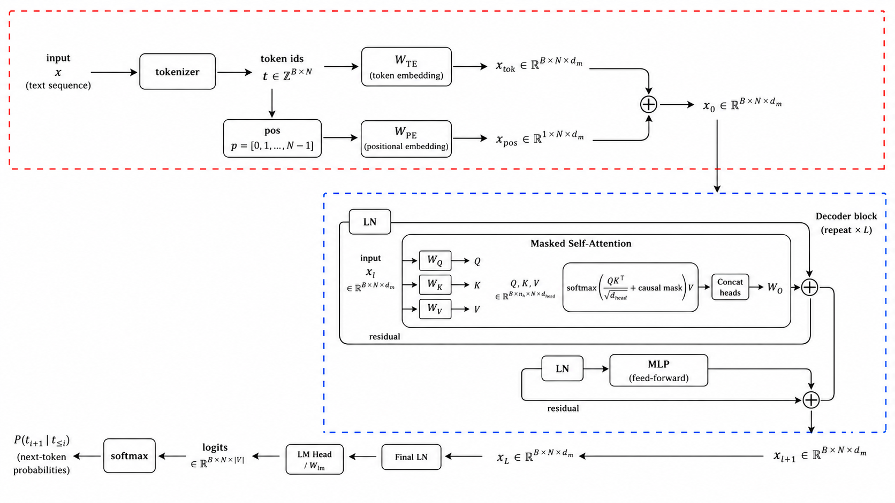

# Decoder 的基本结构

Decoder 的核心任务是自回归预测：给定左侧上下文，预测下一个 token。

$$
P(t_0,\ldots,t_{N-1})
=
\prod_{i=0}^{N-1}P(t_i\mid t_{<i}).
$$

GPT 和教学版 NNQS 中的 `AmplitudeTransformer` 都属于这个思路。区别在于：语言模型预测自然语言 token，NNQS 预测 orbital pair token。

## 输入是什么

输入 token id 先经过 embedding 与位置编码：

$$
T\in\mathbb{N}^{B\times N}
\quad\longrightarrow\quad
X\in\mathbb{R}^{B\times N\times d_{\rm model}}.
$$

这里：

- $B$：batch size。
- $N$：序列长度。
- $d_{\rm model}$：每个 token 的隐藏维度。

进入 decoder block 的 $X$ 已经是一组连续向量，不再是离散 token id。



## 一个 Decoder Block

一个 decoder block 可以看成：

```text
layer norm
  -> masked self-attention
  -> residual add
  -> layer norm
  -> feed-forward network
  -> residual add
```

常见现代实现使用 Pre-LN：

$$
Y=X+\mathrm{MHA}(\mathrm{LayerNorm}(X)),
$$

$$
Z=Y+\mathrm{FFN}(\mathrm{LayerNorm}(Y)).
$$

其中 $X,Y,Z$ 的形状都相同：

$$
X,Y,Z\in\mathbb{R}^{B\times N\times d_{\rm model}}.
$$

这也是 Transformer block 容易堆叠的原因：每一层输入输出形状保持一致。

上图中最容易被一眼带过、但对 decoder 很关键的部件有四个：

| 模块 | 作用 |
| --- | --- |
| LayerNorm | 稳定每一层输入的数值尺度，方便深层训练。 |
| residual connection | 保留原始信息，并给梯度一条更直接的传播路径。 |
| 多头拼接后的 $W^O$ | 把不同 attention head 的信息重新混合成统一表示。 |
| LM head | 把 hidden state 从 $d_{\rm model}$ 维映射到词表大小，得到每个 token 的 logits。 |

下面把它们放回 decoder 的数据流里看。

## LayerNorm

LayerNorm 作用在每个 token 自己的 hidden vector 上。若某一层输入为：

$$
X\in\mathbb{R}^{B\times N\times d_{\rm model}},
$$

则第 $b$ 个样本、第 $i$ 个位置的向量为：

$$
x_{b,i}\in\mathbb{R}^{d_{\rm model}}.
$$

LayerNorm 对这个向量的最后一维单独计算均值和方差：

$$
\mu_{b,i}
=
{1\over d_{\rm model}}
\sum_{j=1}^{d_{\rm model}}x_{b,i,j},
$$

$$
\sigma_{b,i}^2
=
{1\over d_{\rm model}}
\sum_{j=1}^{d_{\rm model}}
(x_{b,i,j}-\mu_{b,i})^2.
$$

然后归一化：

$$
\hat x_{b,i,j}
=
{x_{b,i,j}-\mu_{b,i}
\over
\sqrt{\sigma_{b,i}^2+\epsilon}}.
$$

最后再加上可学习的缩放和平移：

$$
\mathrm{LN}(x_{b,i,j})
=
\gamma_j\hat x_{b,i,j}+\beta_j,
\qquad
\gamma,\beta\in\mathbb{R}^{d_{\rm model}}.
$$

所以 LayerNorm 不改变 shape：

$$
\mathrm{LN}:
\mathbb{R}^{B\times N\times d_{\rm model}}
\rightarrow
\mathbb{R}^{B\times N\times d_{\rm model}}.
$$

直观上，它是在每一层计算前先把每个 token 的特征向量整理到比较稳定的数值范围里。这样经过很多层 decoder block 后，hidden state 不容易因为尺度漂移而让训练变得不稳定。

## Residual Connection

Residual connection 就是把子层输出作为“修正量”加回原输入。Pre-LN decoder block 中，attention 子层写成：

$$
Y=X+\mathrm{MHA}(\mathrm{LN}(X)),
$$

MLP 子层写成：

$$
Z=Y+\mathrm{MLP}(\mathrm{LN}(Y)).
$$

也就是说，attention 和 MLP 不需要完全重写当前表示，而是学习：

$$
\Delta X_{\rm attn}=\mathrm{MHA}(\mathrm{LN}(X)),
\qquad
\Delta Y_{\rm mlp}=\mathrm{MLP}(\mathrm{LN}(Y)).
$$

于是 block 更像是在不断做：

$$
\text{当前表示}
\leftarrow
\text{当前表示}+\text{一点修正}.
$$

Residual 重要的地方有两点。第一，原始信息不会被每一层完全覆盖；第二，反向传播时：

$$
{ \partial (X+f(X)) \over \partial X}
=
I+{\partial f\over\partial X}.
$$

这里的恒等项 $I$ 让梯度可以沿着 residual path 更直接地往前传。因此深层 Transformer 不是让每一层都从头变换表示，而是让很多层在同一个主干表示上逐步修正。

## Masked Self-Attention

Decoder 的 self-attention 与普通 self-attention 的差别在 mask。第 $i$ 个位置只能读取 $j\le i$ 的 token：

$$
\tilde S_{ij}
=
\begin{cases}
S_{ij}, & j\le i,\\
-\infty, & j>i.
\end{cases}
$$

其中：

$$
S={QK^{\mathsf T}\over\sqrt{d_h}}.
$$

softmax 后，未来位置的权重为 $0$，所以第 $i$ 个位置的输出只依赖左侧上下文。

单头 self-attention 的完整矩阵流可以对照 [Attention 机制：单头 Self-Attention 一图总览](attention.md#single-head-self-attention-overview)。

## 多头与输出投影

设有 $h$ 个 head，每个 head 的维度为：

$$
d_h={d_{\rm model}\over h}.
$$

每个 head 独立计算：

$$
H_a=\mathrm{Attention}(Q_a,K_a,V_a),
\qquad
H_a\in\mathbb{R}^{B\times N\times d_h}.
$$

拼接后：

$$
H=\mathrm{Concat}(H_1,\ldots,H_h)
\in\mathbb{R}^{B\times N\times d_{\rm model}}.
$$

拼接只是把不同 head 的结果并排放在一起。真正把这些 head 融合回统一表示的是输出投影 $W^O$：

$$
\mathrm{MHA}(X)=HW^O,
\qquad
W^O\in\mathbb{R}^{d_{\rm model}\times d_{\rm model}}.
$$

所以 attention 子层输出仍然是：

$$
\mathrm{MHA}(X)\in\mathbb{R}^{B\times N\times d_{\rm model}}.
$$

如果把不同 head 看成不同“专家”，concat 只是把专家意见摆在一排，$W^O$ 则负责做线性汇总。它有三个作用：

- 融合不同 head 学到的关系，例如局部依赖、长距离依赖、语法关系或格式信息。
- 保证 attention 子层输出回到 $d_{\rm model}$，从而可以和 residual 中的 $X$ 相加。
- 允许模型学习不同 head 输出之间的线性组合，而不是让每个 head 永远只占据自己的维度区间。

## FFN 的角色

Attention 负责让不同位置交换信息。FFN 对每个位置独立做非线性变换：

$$
\mathrm{FFN}(x)
=
\sigma(xW_1+b_1)W_2+b_2.
$$

其中：

$$
W_1\in\mathbb{R}^{d_{\rm model}\times d_{\rm ff}},
\qquad
W_2\in\mathbb{R}^{d_{\rm ff}\times d_{\rm model}}.
$$

常见选择是：

$$
d_{\rm ff}\approx 4d_{\rm model}.
$$

FFN 不混合不同 token 位置；它只把每个位置已经聚合到的上下文信息再加工一次。

## LM Head 与输出 Logits

堆叠 $L$ 个 decoder block 后得到：

$$
X_L\in\mathbb{R}^{B\times N\times d_{\rm model}}.
$$

许多 decoder-only 模型会先过 final LayerNorm：

$$
H=\mathrm{LN}(X_L).
$$

LM head 再把每个位置的 hidden state 映射到词表大小：

$$
\mathrm{logits}=HW_{\rm lm}+b_{\rm lm},
\qquad
W_{\rm lm}\in\mathbb{R}^{d_{\rm model}\times V}.
$$

于是：

$$
\mathrm{logits}\in\mathbb{R}^{B\times N\times V}.
$$

这里 $V=|\mathcal{V}|$ 是词表大小。第 $i$ 个位置会输出 $V$ 个 raw scores：

$$
\mathrm{logits}_{b,i}
=
[\ell_1,\ell_2,\ldots,\ell_V].
$$

这些 logits 还不是概率。沿词表维度做 softmax 后才得到 next-token probability：

$$
P(t_{i+1}=v\mid t_{\le i})
=
{e^{\ell_v}\over\sum_{u\in\mathcal{V}}e^{\ell_u}}.
$$

也就是说：

$$
h_i
\rightarrow
\mathrm{logits}_i
\rightarrow
P(t_{i+1}\mid t_{\le i}).
$$

训练时常写成：

```text
输入: [BOS, t0, t1, ..., t_{N-2}]
目标: [t0,  t1, t2, ..., t_{N-1}]
```

很多 decoder-only 模型还会使用 weight tying。输入侧 token embedding 为：

$$
W_{\rm TE}\in\mathbb{R}^{V\times d_{\rm model}},
$$

输出侧 LM head 可以共享同一个矩阵：

$$
W_{\rm lm}=W_{\rm TE}^{\mathsf T}.
$$

直观上，输入时每个 token 有一个 embedding；输出时，模型拿当前位置的 hidden state 去和每个 token embedding 做相似度比较，越匹配的 token logit 越高。

## 训练：并行但不能看未来

训练时可以把整段序列一次送入模型。虽然每个位置通过 causal mask 看不到未来，所有位置的矩阵乘法仍然可以并行计算。

这就是 decoder-only Transformer 的一个妙处：

```text
信息流是自回归的
计算图是并行的
```

所以训练时通常不需要 KV cache。

## 推理：逐 Token 生成

推理或采样时，模型不能一次知道完整目标序列，只能一步一步生成：

```text
[BOS]
  -> t0
[BOS, t0]
  -> t1
[BOS, t0, t1]
  -> t2
```

如果每一步都重算整个前缀，历史 token 的 key/value 会被重复计算。KV cache 用来缓存每一层的历史 $K,V$，下一步只计算新 token 的 $Q,K,V$，再让新 query 读取历史 cache。

单步推理时，新输入形状为：

$$
X_{\rm new}\in\mathbb{R}^{B\times 1\times d_{\rm model}}.
$$

历史 cache 形状为：

$$
K_{\rm cache},V_{\rm cache}
\in
\mathbb{R}^{B\times h\times n\times d_h}.
$$

新 token 产生：

$$
Q_{\rm new},K_{\rm new},V_{\rm new}
\in
\mathbb{R}^{B\times h\times 1\times d_h}.
$$

拼接后用：

$$
K_{\rm all},V_{\rm all}
\in
\mathbb{R}^{B\times h\times (n+1)\times d_h}
$$

计算当前 token 的 attention 输出。完整细节见 [KV Cache](kv_cache.md)。

## 对 NNQS 的对应

在教学版 NNQS 中，decoder-only Transformer 建模 pair token 的条件概率：

$$
P_\theta(t_i\mid t_{<i}).
$$

把所有位置的 log probability 相加：

$$
\log P_\theta(x)
=
\sum_i\log P_\theta(t_i\mid t_{<i}).
$$

由于采样概率对应波函数模方：

$$
P_\theta(x)=|\psi_\theta(x)|^2,
$$

振幅部分为：

$$
\log A_\theta(x)
=
{1\over 2}\sum_i\log P_\theta(t_i\mid t_{<i}).
$$

因此 decoder 的 causal mask 对 NNQS 很关键：它保证每个 orbital pair token 的概率只依赖左侧已经生成的 pair token。

## 招聘考点

!!! question "代表题：LayerNorm、residual、$W_O$、LM head 分别解决什么问题？"
    LayerNorm 稳定每层输入尺度；residual 保留原信息并改善梯度传播；多头拼接后的 $W_O$ 把不同 head 的输出重新混合回统一 hidden representation；LM head 把最终 hidden state 映射到词表 logits。相关题目见 [Transformer 与 LLM 题](../interview/transformer_llm.md)。

!!! question "代表题：Decoder-only 为什么适合自回归生成？"
    decoder-only 使用 causal self-attention，训练目标和推理过程都围绕 $P(t_i\mid t_{<i})$。训练时可并行计算所有位置，推理时逐 token 生成；KV cache 则用显存换速度。完整题解见 [Transformer 与 LLM 题](../interview/transformer_llm.md)。
