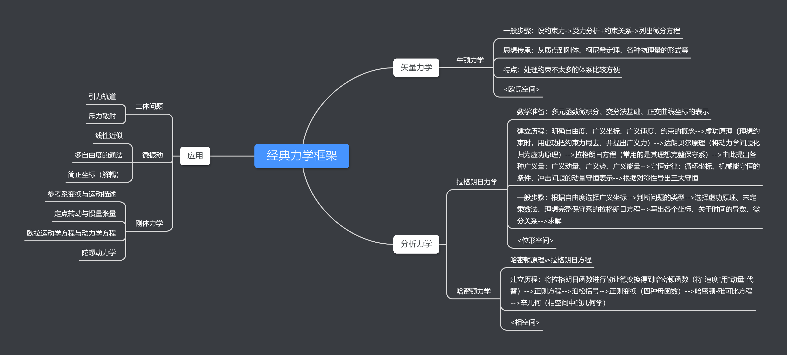

# 经典力学简述

> 原发布于 B 站专栏：[经典力学简述](https://www.bilibili.com/read/cv11215922/)
> 发布日期：2021-05-09

**推荐路径：周衍柏《理论力学》->刘川《理论力学》+朗道《力学》->……**

大致框架如下：（可放大查看）

*框架梳理*

限于作者水平，难免存在错误，恳请读者指出，感激不尽！

## 总述

总体而言，力学问题无非就是**设坐标、列方程、解方程**这三个步骤。尽管三种力学表述（牛顿力学、拉格朗日力学、哈密顿力学）所给出的结果完全一致，但在进行这三个步骤的时候，体现出完全不同的力学观点，也正是拉格朗日力学和哈密顿力学（合称为分析力学）全新的观点，推动了现代物理的发展，使得物理学的框架有了更加统一的表述。以下是关于三个步骤的对比：

**设坐标**

牛顿力学所设的坐标就是在**三维欧氏空间**中选取的，这一点和我们日常生活十分相像，所以特别容易接受。虽然能解决生产生活中的大部分问题，但当研究对象增多，如果还局限在狭小的三维欧氏空间，就会带来许多麻烦。由此，分析力学将目光放的更长远，采用广义坐标（设有s个广义坐标），并由此产生了**s维的位形空间或2s维的相空间**，进而具有能够处理更多复杂问题的可能性，甚至能够利用微分几何、辛几何的观点来看待问题。此外，相空间的概念在其他物理分支中也有重要应用，例如统计物理的系综理论就是在相空间中进行的计算、固体物理当中的k空间其实就是相空间的子空间，等等。

**列方程**

牛顿力学最基本的方程就是$\vec{F}=\frac{d\vec{p}}{dt}$，虽然简单易懂，但力$\vec{F}$这概念十分的唯象，在研究电磁动力学、量子力学等时不太好用，而且力学问题的约束越多，求解越困难。在分析力学中，以变分的视角，引入作用量，得到最基本的原理：**最小作用量原理**

$\boxed{\delta S=\delta\int L(q,\dot{q},t)dt=0}$

由此可以导出E-L方程、正则方程、和H-J方程等等，不仅仅和牛二等价，还能兼容更多的物理（例如量子力学、相对论等等），甚至能够直接导出Maxwell方程组（详见朗道《场论》）

**解方程**

牛顿力学的方程就是一个简单的**ODE**，只不过要将所有约束力都设出来，才能进行求解，处理约束少的问题比较便捷，但复杂的约束问题求解就会有些困难。然而，分析力学中，要先处理的是**PDE**，由此再得到和牛顿力学一致的ODE。虽然看起来过程更多了，但只要写出拉氏量或是哈密顿量，不需要另外设约束力。而且，利用H-J方程还能比较容易的找到守恒量。

## 牛顿力学

牛顿力学的主要内容已经在“力学总结”中写出来了，见以下链接：[力学总结](../general_physics/mechanics.md)

其中要强调的是，之后的分析力学仍然需要一些传承性质的东西，例如：坐标系和参考系的选取、从质点到质点系的处理技巧、柯尼希定理的技巧、引入物理量的范式等等。

## 拉格朗日力学

对于拉格朗日力学，首先要明确系统的广义坐标、广义速度和约束类型等等，**由广义坐标张成的空间称为位形空间**。对于静力学问题，利用虚功的概念$\delta W=\vec{F}\cdot\delta\vec{r}$，甩掉理想约束力，只分析主动力，根据独立坐标即可得到定量关系，此外根据广义坐标还可以定义所谓广义力$Q_\alpha=\vec{F}\cdot\frac{\partial \vec{r}}{\partial q_\alpha}$；至于动力学，引入惯性力即达朗贝尔原理，可以同样将问题化归为静力学的问题。在达朗贝尔原理的基础之上，利用一些多元函数微分学的技巧，再引入由广义坐标、广义速度和时间组成的拉氏量L，可以得到E-L方程:$\boxed{\frac{d}{dt}\frac{\partial L}{\partial \dot{q}_\alpha}-\frac{\partial L}{\partial q_\alpha}=Q'_\alpha}$(其中$Q'_\alpha$为非保守力).

由此，拉格朗日力学的基本逻辑就完成了。有了E-L方程和之前的各种概念，可以定义广义动量$p_\alpha=\frac{\partial L}{\partial \dot{q}_\alpha}$、广义能量、广义势以及循环坐标的概念，对拉氏量$L$进行各种变换，利用对称性就可以得到各种守恒量。此外，冲击问题也有一些数学技巧需要掌握。

## 哈密顿力学

将拉氏量$L$进行勒让德变换（分部积分+换元）将广义速度换成广义动量，就可得到哈密顿量$H$。**由广义坐标和广义动量张成的空间称为相空间。**对比$H$的全微分展开就可以得到著名的正则方程（亦可用最小作用量推得):

$\boxed{\frac{\partial H}{\partial q}=-\dot{p}\quad
\frac{\partial H}{\partial p}=\dot{q}}$

有时候为了简便符号记法，引入泊松括号（注意朗道《力学》的泊松括号与大部分书差了个负号），除了可以简化表达力学量之间的微分关系外，还与量子力学中的对易子有一一映射的关系（注意并不是等价关系）。有时为了寻找一组好的广义坐标和广义动量（含有更多守恒量的形式），可以利用“拉氏量$L$任意添加$f(q,t)$关于时间导数的项不改变方程的解”的性质，得到正则变换的必要条件，由此开始正则变换。变换的关键在于母函数（生成函数）的选取，母函数由新旧坐标或动量组合，一共有4种，所生成的正则变换分母是$q,P$就为正,是$p,Q$就为负。当令变换之后的哈密顿量为0时，即可得到著名的H-J方程:

$\boxed{\frac{\partial S}{\partial t}+H(q,\frac{\partial S}{\partial q},t)=0}$

解此方程需要一些数学技巧，但只要解出了，就可以得到各种守恒量，使得力学问题变得简单，甚至可以得到薛定谔方程的一些启示。

## 应用

通常的教材都会用分析力学去研究以下三大问题，前两种的势能比较经典，分别对应位力定理:$n<V>=2<T>$中的$n=-1$与$n=2$的情况，研究价值很大。另外，刚体力学是对经典力学的综合运用，在工程领域以及量子力学的磁矩研究等等都有很大的启示。

**中心力场**

通常先利用之前牛顿力学中折合质量$\mu=\frac{m_1m_2}{m_1+m_2}$的技巧，化归为单体问题。对于引力场问题，采用极坐标来列方程，即选取$r$和$\theta$作为广义坐标。由拉氏量$L$中不含$\theta$，故为循环坐标，所以角动量守恒。利用角动量守恒和能量守恒，即可确定轨迹和各个时刻的解，具体技术就不展开说了（比耐方程、有效势能等）。除此之外还有个拉普拉斯-龙格-楞次矢量也是守恒的，对应着轨道是封闭的（即无进动），一旦势能的对称性被打破，就会进动。对于排斥场，主要是卢瑟福散射那一套方法和公式，详见“原子物理总结”

**微振动**

对于一个多自由度的微振动，利用简谐近似(泰勒展开取前几项)，利用线性代数将系统的动能与势能用广义坐标表示（一般为角度，但不限于此），代入E-L方程，得到矩阵形式的ODE。利用对角化等操作，可以将各个坐标解耦，得到简正坐标，使得问题简化。这套方法也是固体物理中晶格振动分析的范式，具有重要的地位。

**刚体力学**

首先选取坐标系并利用矩阵对刚体转动进行描述，注意要分清三种坐标系的区别。利用角速度和角动量矢量等式，引入惯量张量的定义（从而角动量的方向与角速度可以不一致），开始定点转动的研究。由欧拉角的定义和角动量定理进一步得到欧拉运动学和动力学方程，最后讨论几种可解析的陀螺。

## 补充内容

0.通常默认研究的都是具有理想约束的完整系统。

1.在相对论中也可利用最小作用量来处理力学问题，只不过这里的S是对洛伦兹标量的积分。

2.相空间和位形空间的联系：相空间是位形空间的余切丛

3.对于相空间的讨论还有很多，例如绝热不变量、相积分和角变换、刘维尔定量等等

...

---

只有把重要的几个公式亲手推导一遍，才能理解分析力学的趣味。分析力学证明推导的基本操作：
配分（分清是否加dt），全微分展开(包括各项比较法)、二阶偏导交换次序、勒让德变换（令新函数代入）、两个拉格朗日关系、拉格朗日方程代换（注意选择合适的形式）
