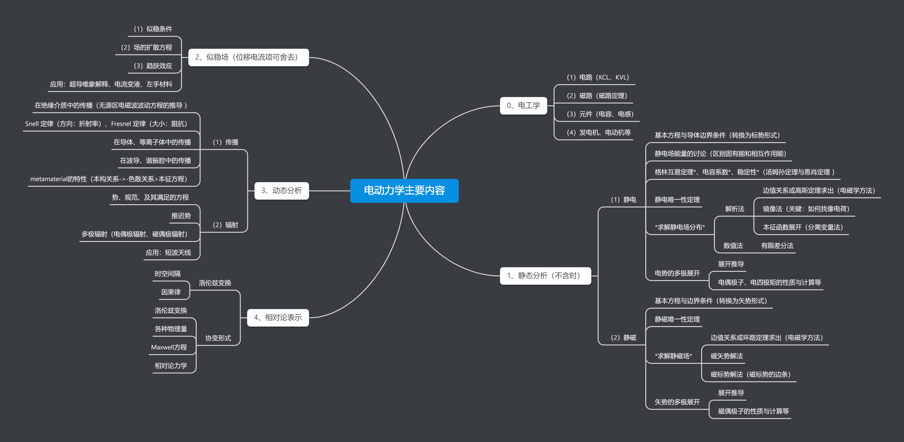
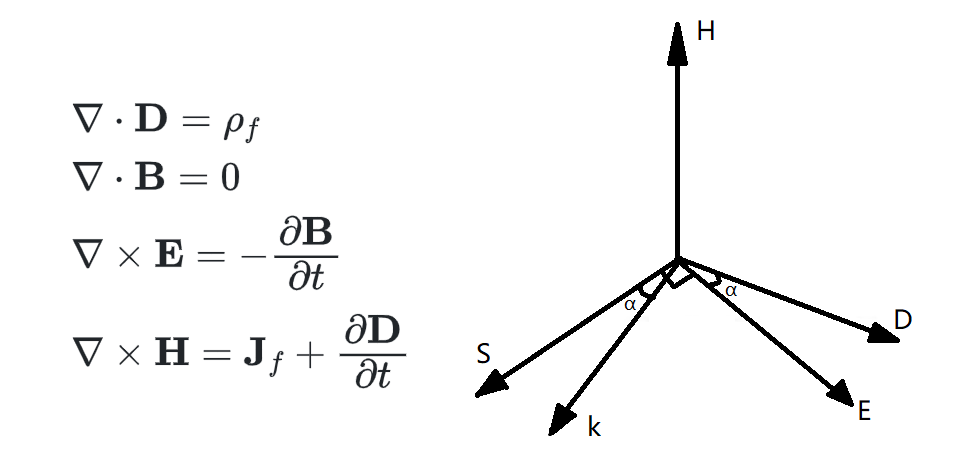
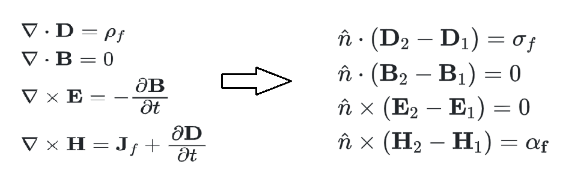
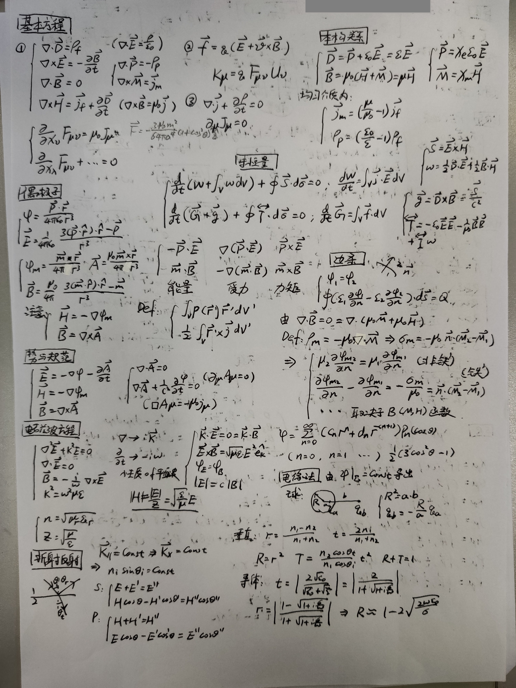
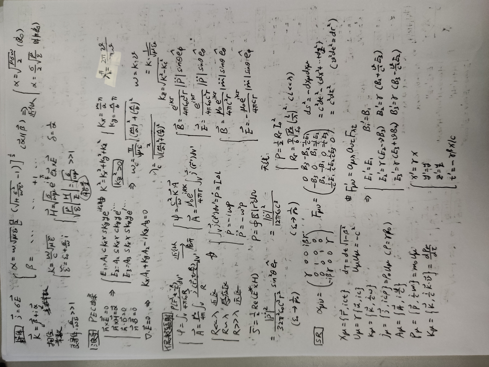

# 电动力学简述

> 原发布于 B 站专栏：[电动力学简述](https://www.bilibili.com/read/cv11258657/)
> 发布日期：2021-05-12

**推荐路径：周磊《电动力学讲义》+郭硕鸿《电动力学》->朗道《场论》+Jackson…**

大致框架如下：（可放大查看）

*框架梳理*

限于作者水平，难免存在错误，恳请读者指出，感激不尽！

## 总述

作为电磁学课程的延续，电动力学的内核更加精简和清晰。一开始就把基本的方程和假设说得明明白白。其中电动力学的灵魂所在就是Maxwell方程组，但真正能从如此简洁的Maxwell方程组中看出多少东西，只有研究过具体的问题，才能略知一二，这也正是电动力学的内容所在。此外，在理解Maxwell方程中培养的对场论符号的条件反射，对学习其他相关课程也有很大帮助，例如流体力学，传热学（据说当年建立电磁理论的时候，就是从传热学的方程得到的启发）等。最后，如果稍加留意便会发现，在研究电磁波的传播时，也能得到许多量子力学的类比和启示。

*Maxwell方程组和能流密度S、波矢k、场矢量的关系*

## 数学基础：

在学习之初，许多同学会被符号较为复杂的矢量场论所吓到，繁杂的公式令人对电动力学的第一印象就是无聊的数学计算。事实上，之后真正用到的公式也就是那么几个而已，如果掌握了$\nabla$算符以及矢量运算对应的爱因斯坦求和表示，现推出来不是问题。具体可以参考允文君矢量场论的视频。**此外，注意区分$r$和$r'$分别代表从原点指向观测点和场源的位置矢量。**

在求解具体方程时，需要用到在数学物理方法中学到的分离变量法（主要是球函数和柱函数）以及格林函数法等。

## 绪论

*绪论框架*

从最初的三大实验定律（库仑定律、毕奥-萨伐尔定律、法拉第电磁感应定律）以及其他各种电磁实验，提出“电磁场”的概念，将实验定律中的“力”与“场”分离。

**力的方面：**总结为了**洛伦兹力**（其实对电磁场张量进行洛伦兹变换便可看出洛伦兹力的形式，同时也可解释了动生电动势的来源）

$\boxed{\mathbf{F}=q(\mathbf{E}+\mathbf{v}\times\mathbf{B})}$

**场的方面：**总结为了**Maxwell方程组**。当然，关于从静态方程过渡到动态方程，并且能够保证理论的完备性的部分，主要由Maxwell完成，其中最精彩的部分就是Maxwell通过研究“电流连续性方程”（或电荷守恒）与“毕奥-萨伐尔定律”的矛盾，提出了位移电流的假说，从而预言了电磁波

$\boxed{\begin{array}{l}
\nabla \cdot \mathbf{E} =\cfrac{\rho}{\varepsilon _0} \\
\nabla \cdot \mathbf{B} = 0 \\
\nabla \times \mathbf{E} = -\cfrac{\partial \mathbf{B}}{\partial t } \\
\nabla \times \mathbf{B} = \mu _0\mathbf{J} + \mu _0\varepsilon_0 \cfrac{\partial \mathbf{E}}{\partial t }
\end{array} }$

在研究介质对电磁场的响应时，除了“力”和“场”的方程，还需要介质材料的**本构关系**。一般地，对于绝缘介质而言，体现在外加电场的极化$\mathbf{P}$或外加磁场的磁化$\mathbf{M}$；对于金属而言，体现在电流密度矢量$\mathbf{j}$与电场$\mathbf{E}$的关系上。此外，对于色散介质，铁磁质等等，都有各自特殊的本构关系。正是这些本构关系的不同，构成了多姿多彩的世界。

从各种实验中总结出三条基本方程：**洛伦兹力方程、Maxwell方程组、本构方程**。可以说，这几乎就是电动力学的全部了，只要数学足够好，完全可以自己将电动力学的理论全部推导出来。以下对一些最基本的推导进行说明:

(1)**边值关系**：通常是在两种介质的交界面，取一个高度趋于0的圆柱或者环路，利用Maxwell方程组便可得到边值关系。事实上，不严谨的来说，直接将方程组中的**$\nabla$**符号改为介质曲面的法向量**$\hat{n}$**，再将场量写成差分形式，最后将体密度改为面密度并去掉关于时间导数的项，即可得到边值关系，如下图。要强调的是，边值关系是十分重要的约束条件，例如关于描述折射反射能量分配的**Fresnel公式**便是由边值关系推导而来。

*默认n矢量方向为1指向2介质*

(2)**电流连续性方程**：由于Maxwell在提出位移电流的时候，已经在方程中嵌入了电流连续性方程，因此只要对第四条方程两边同时取散度，再通过其他方程的代换和矢量场论的运算法则，很容易就得到了电流连续性方程。

$\nabla\cdot\mathbf{j}=-\frac{\partial \rho}{\partial t}$

(3)**能量守恒**：根据洛伦兹力，磁场对粒子不做功，因此只考虑电场对粒子的功率。通过矢量场论运算法则和Maxwell方程的代换，可以写成“流”守恒的形式（同电流连续性方程的形式）.进而**引入能流密度：**$\mathbf{S}=\mathbf{E}\times\mathbf{H}$，**能量密度：**$u=\frac{1}{2}(\mathbf{E}\cdot\mathbf{D}+\mathbf{B}\cdot\mathbf{H})$。这两个分析问题常用的物理量。整个式子体现了空间中电磁场的能量守恒。**（此外注意相互作用能和固有能的微妙区别）$\frac{dW}{dt}=\int\mathbf{j}\cdot\mathbf{E}d\tau\quad\Rightarrow\quad-\frac{d}{dt}[W+\int ud\tau]=\oint\mathbf{S}\cdot d\mathbf{A}$**

(4)**动量守恒**：和能量守恒推导类似，利用洛伦兹力得到粒子所受力，再通过矢量场论运算法则和Maxwell方程的代换，同样得到“流”守恒的形式。**引入动量流密度：$\mathcal{T} =u\mathcal{I}-\mathbf{D}\mathbf{E}-\mathbf{B}\mathbf{H}$，动量密度：$\mathbf{g}=\mathbf{D}\times\mathbf{B}$**以便计算电磁场中物体的受力。这也体现了电磁场是一种物质，具有动量的属性。

**$\frac{d\mathbf{G}}{dt}=\int (\rho\mathbf{E}+\mathbf{j}\times\mathbf{B})d\tau\quad\Rightarrow\quad \frac{d\mathbf{G}}{dt}=-\oint d\mathbf{A}\cdot\mathcal{T}-\frac{d}{dt}\int \mathbf{g} d\tau$**

（P.S.以上的能量守恒和动量守恒利用的矢量场论的推导，几乎使用了所有常用的场论公式，因此尝试自己动手follow两种守恒定律之后，矢量场论的使用也会更加熟练了！）

(5)**频域的Maxwell方程组**：有时为了研究单频电磁波的性质，可以代入场的谐振形式，通过矢量场论的运算，将角频率、波矢的关系显示出来。**（类似的，不严谨的说，可以将$\nabla$符号改为$ik$,对时间的偏导改为$-i\omega$即可）**

有了之前绪论的铺垫，就可以来讨论具体的问题了。总的来说，大部分的电动力学教材都分为三大部分：静态分析、动态分析（包括似稳场）、相对论表示。

## 静态分析：

所谓静态，就是体系不随时间变化，即Maxwell方程组中所有的关于时间的导数均为0。由此Maxwell方程组得以简化，再通过引入电势、磁矢势或是磁标势，可以进一步转化为Poisson方程：

**$\nabla^2\varphi(\mathbf{r})+\frac{\rho(\mathbf{r})}{\varepsilon }=0$**

若区域内无体源分布，可以再变为Laplace方程。有了这些PDE，再根据之前的边值关系得到PDE的边界条件，就可以相互求解源和势。**简而言之，这一部分主要围绕已知电荷或电流分布，求势；或者已知势，求电荷或电流分布。**

通常在求解之前，会先讨论一些原则性质的定律和简化求解的方法。静电、静磁唯一性定理的讨论保证**当本构关系满足单值单调性**时，给定边界条件，那么满足边界条件的解就是唯一的。以此作为理论依据，可以通过“镜像法”将面电荷分布等效为在区域外的像电荷分布（通常为点电荷）。从而在不破坏边界条件的情况下，简化计算（对于磁场的某些情况，镜像法也同样适用）。此外，还有观测点和场源之间的关系——格林互易定理、导体系统的电容系数以及利用变分极值讨论稳定性（汤姆孙定理&恩肖定理）的内容，虽然这些也很重要，但由于水平有限就不讨论了TωT

在解析法计算势分布时，除了镜像法，更多的时候都是老老实实求解PDE方程。对于球体、柱面、平行板或是类似的变体，可以直接展开勒让德函数、贝塞尔函数、三角函数等代入边界条件进行计算，由于体系通常都有对称的，因此展开的项数不会超过2。**（这里难点在于寻找边界条件，尤其是用磁标势计算铁磁体的边条）$\varphi =\sum_{l=0}^\infty[A_lr^l+B_lr^{-(l+1)}]P_l(cos\theta)$**

当求解对称性极差的一般体系时，可以采用数值法求解。思路大致是分割成许多小区域，利用有限差分、有限元的思想进行计算。例如在COMSOL软件中绘制CAD进行计算。

有趣的是，当观测点距离源较远且源的尺度较小时，可以利用多极展开（泰勒展开）的方法研究势的“成分”。通过对电势展开可以得到：点电荷、电偶极子、电四极子、电八极子等等（对于磁场也类似）。各种极子的值其实体现着体系的对称性，用的最广泛的应该是偶极子，例如介质球放在均匀场下的响应就偶极子的形式。对于这些极子在电磁场中的能量和受力问题可以通过施加使体系保持平衡的力求得。**（对于各种极子的自由度，利用球谐函数多极展开更容易看出）**

最后，来讨论一下电磁场界面连续性的细节。由边值关系可以看出，电磁场突变（不连续）的原因在于源的面分布。而面分布可以看作是体分布的近似，当某一个方向的尺度极小时，体分布退化为面分布。但是实际情况是自然界根本就不存在面分布，即使是导体表面的电荷分布也是一个薄层而已，仍然具有厚度的。而正是这一厚度导致薄层两边的电磁场突变，假设薄层均匀分布即可证明一点。**简而言之，电磁场在界面两侧的突变正是来自忽略了厚度而产生的代价！**

## 动态分析：

当频率或波长满足一定条件，电磁场在某介质中变化的相对比较缓慢，可以不考虑Maxwell方程组中的位移电流项，此时的电磁场即**似稳场**。其特点就是大部分的能量就集中在源附近，而几乎不向外辐射。

通过数量级的简单估计，对于尺度相对波长较小的系统来说，尽管电磁场是交变的，但仍然可以用静态分析的方法来计算。比如**电流变液体系、光镊体系、唯象解释的伦敦方程**等。此外，将似稳场的Maxwell方程组与电导率本构关系进行联立，可以得到电磁场的扩散方程，由此方程可以导出电磁学中未推导的趋肤效应的电流密度分布情况。

**$\frac{\partial\mathbf{H}}{\partial t}=\frac{1}{\mu\sigma_c}\nabla^2\mathbf{H}\qquad\frac{\partial\mathbf{E}}{\partial t}=\frac{1}{\mu\sigma_c}\nabla^2\mathbf{E}$**

当完整的考虑Maxwell方程组，可以研究电磁波的**传播**和**辐射**。

关于传播最基本的讨论：首先，考虑在绝缘介质的自由空间中，通过矢量场论公式导出平面电磁波的波动方程和其性质（注意：推导波动方程之后，会丢失一部分Maxwell方程组的信息，在写边界条件的时候要补上）。其次，在传播过程中，（为了简便起见，这里不讨论色散的情况，仅考虑单频电磁波）电磁波在不同介质会发生折射和反射（彻底理解要学QED？），通过分析波矢的几何关系可以得到Snell公式，即确定传播的方向；通过电磁场的边值关系可以得到Fresnel公式，即确定折射与反射的能量分配和相位变化。（当然，通过“超材料”的方法调控可以实现“反常”现象）

在导体或等离子体中，由于特殊的本构关系（位移电流和传导电流差一个一阶导）使得电磁波存在耗散。数学上体现在介质的波矢为复数：

**$k=\frac{\omega}{c}\sqrt{\mu\varepsilon}\qquad\varepsilon=\varepsilon_0+i\frac{\sigma}{\omega}$**

根据色散关系得到复数的介电常数。由此，可以导出趋肤深度、电磁场能量之比、电磁场相位差等等。由于介电常数是频率的函数，因此色散是必然的，利用Drude模型可以导出金属中电导率的表达式，从而引入等离子共振频率，描述紫外区的电磁波行为。

在波导或谐振腔中，利用PEC边界条件可以导出电磁波在其中的传播模式。经过推导得到波导在xy平面是驻波形式，在z方向是行波。根据边界条件，必须引入2个量子数来描述电磁波的模式，且不存在TEM波，只可能是TE波或是TM波。再根据波矢的关系，导出若电磁波频率小于某值时，波矢会出现复数进而快速耗散不能有效传播，称为波导的截止频率。将波导两边堵住就变成了谐振腔，同理可得其有3个量子数。

关于辐射，主要思路是以“势”的形式研究，再通过势生成电磁场。由于电磁场是规范场，因此首先要明确选择何种规范。

**$\mathbf{E}=-\nabla\varphi-\frac{\partial \mathbf{A}}{\partial t}\quad\mathbf{B}=\nabla\times\mathbf{A}\qquad\nabla\cdot\mathbf{A}=0\quad \nabla\cdot\mathbf{A}+\frac{1}{c^2}\frac{\partial \varphi}{\partial t}=0$**

库伦规范虽然可以使得其中一个方程形式简单但标势和矢势并没有解耦，通常用洛伦兹规范使得两者解耦。由此得到达朗贝尔方程，通过格林函数的方法求解达朗贝尔方程得到推迟势，再将推迟势展开研究电偶极辐射:

**$\mathbf{B}=\frac{e^{ikr}}{4\pi\varepsilon_0c^3r}|\omega^2p|sin\theta\hat{e}_{\varphi}\quad\mathbf{E}=\frac{e^{ikr}}{4\pi\varepsilon_0c^2r}|\omega^2p|sin\theta\hat{e}_{\theta}$**

和磁偶极辐射:

**$\mathbf{B}=\frac{\mu_0e^{ikr}}{4\pi c^2r}|\omega^2m|sin\theta\hat{e}_{\theta}\quad\mathbf{E}=-\frac{\mu_0e^{ikr}}{4\pi cr}|\omega^2m|sin\theta\hat{e}_{\varphi}$**

这里的核心在于偶极子的表达形式，**一般都是谐振的，为了方便用复指数表达。**最后将短波天线抽象成偶极子，进行最简单的讨论。

## 相对论表示：

在力学总结中所展示最简单的相对论原理的基础之上，将时间和空间联系起来，用四维坐标表示物理量（目前见过两种版本，将时间放在第一项或放在最后一项，由此导致之后讨论的数学形式不同，但物理原理都是一样的）。此外，将洛伦兹变换写成矩阵变换，也称这个矩阵为洛伦兹变换矩阵：

$$
x'_\mu=\alpha_{\mu\nu}x_\nu,\qquad
\alpha_{\mu\nu}=
\begin{pmatrix}
\gamma & 0 & 0 & i\beta\gamma \\
0 & 1 & 0 & 0 \\
0 & 0 & 1 & 0 \\
-i\beta\gamma & 0 & 0 & \gamma
\end{pmatrix}
$$

在寻找电磁动力学的相对论表示之前，应该先明确什么是洛伦兹标量、矢量、二阶张量等。经过洛伦兹变换不变的称为标量，满足洛伦兹变换旋转关系的称为矢量，满足洛伦兹张量变换的称为张量。根据以上标准，可以凑出：四维坐标、四维速度、四维波矢、四维电流密度、四维势、四维动量、四维力等。由此可以简洁表达：电荷守恒、洛伦兹规范、达朗贝尔方程。

利用四维势可以写出电磁场张量，由此可以将Maxwell四个方程浓缩为两个。此外，将电磁场张量用洛伦兹变换进行张量变换，可以得到电磁场在不同惯性系下的变换。最后，电磁场张量将电磁现象相统一，这种新的形式使得物理上的表达更加简洁，但代价是理解起来更加抽象了。

(最后附上当年考试前总结的两张纸，嘿嘿)

*1*

*2*

补充内容：

1、关于本构方程，仍要由量子力学等建立物质的微观模型，才能用第一性原理推导出来。

2、大多数教材还涉及许多前沿内容，比如高斯光束、光子晶体等等

...
