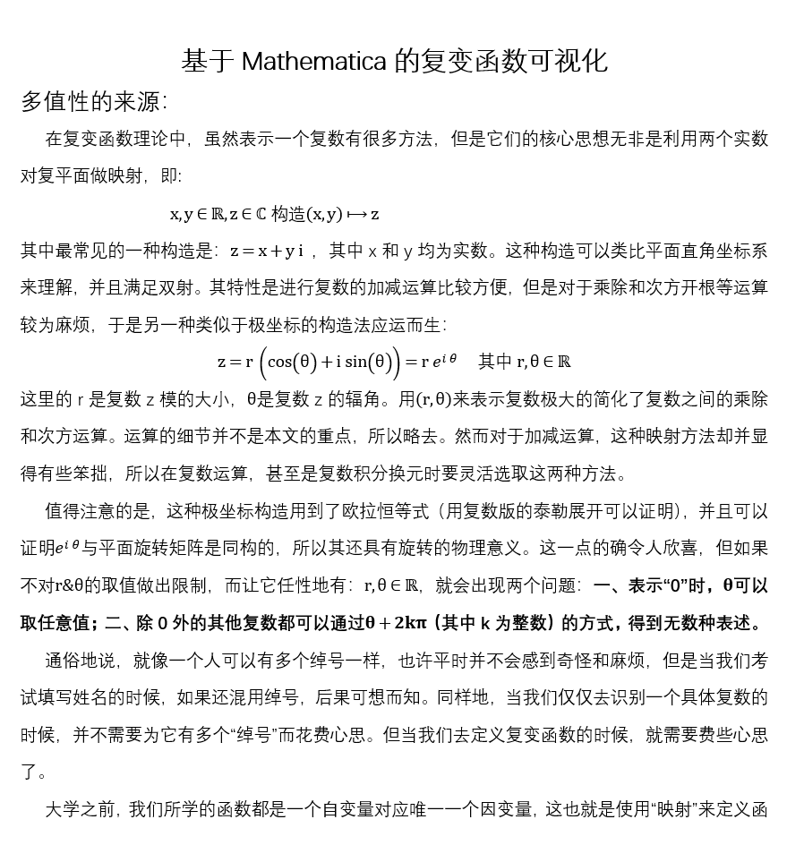
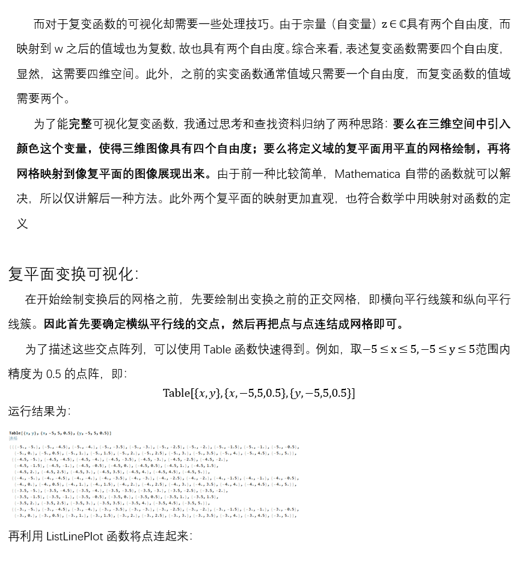
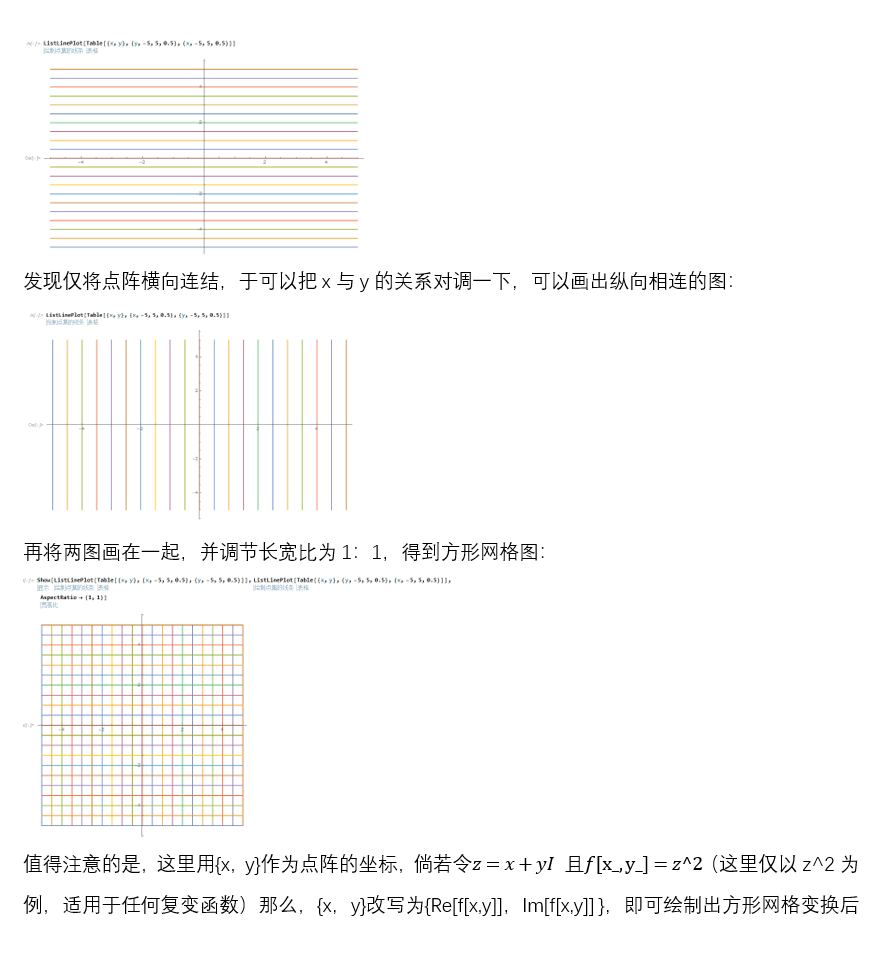
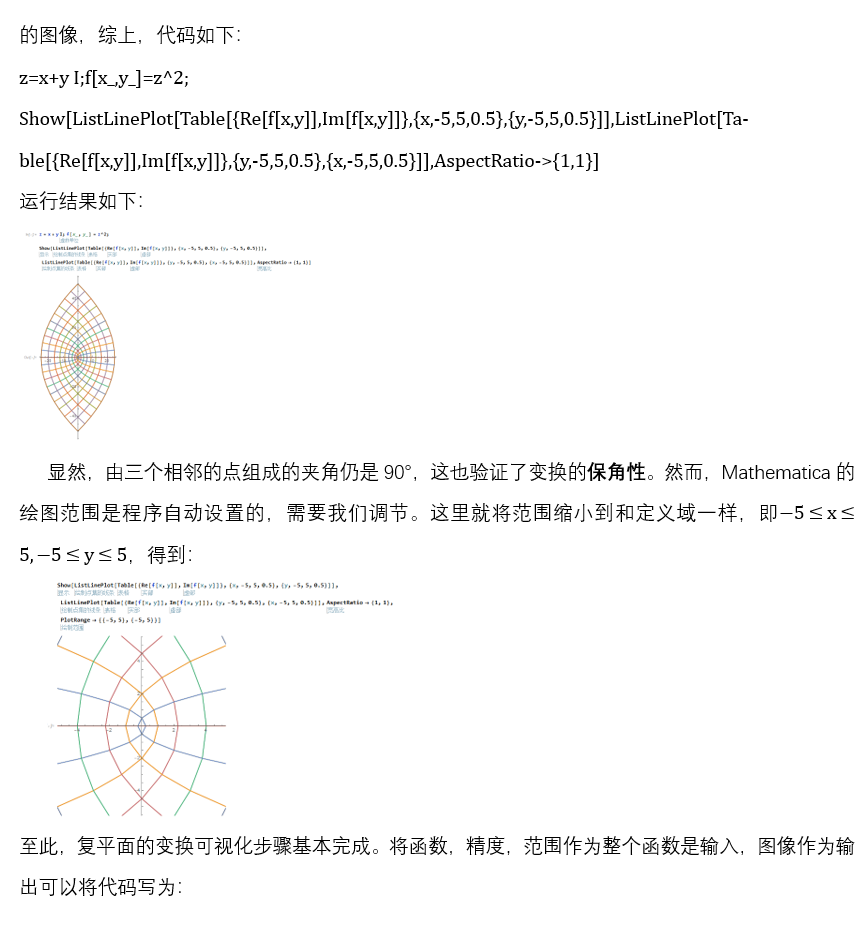
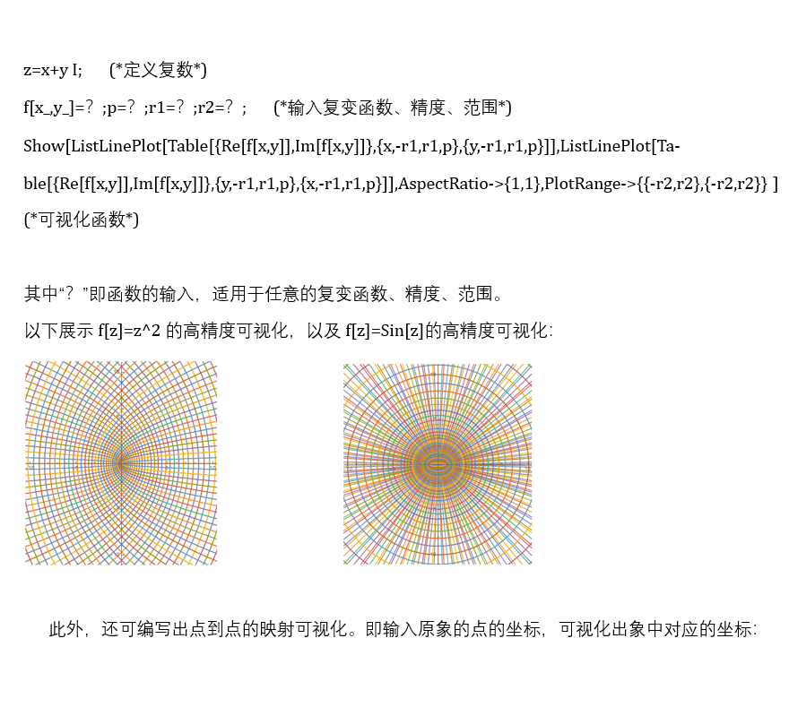
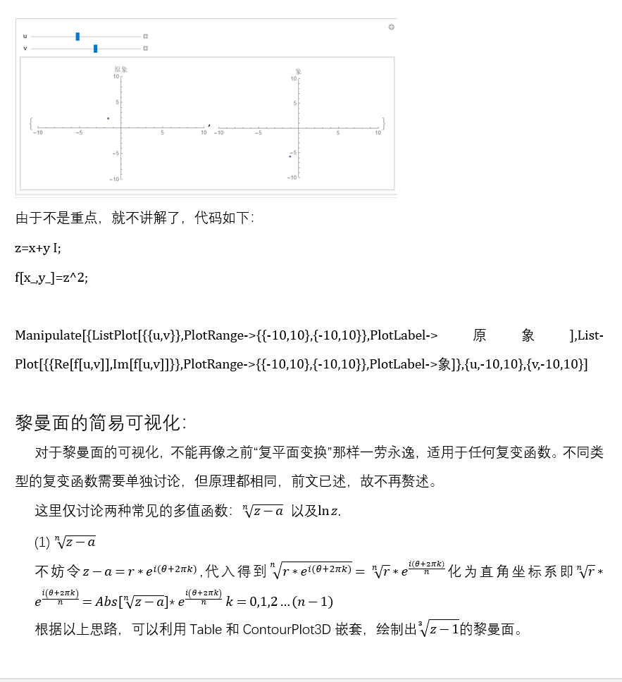
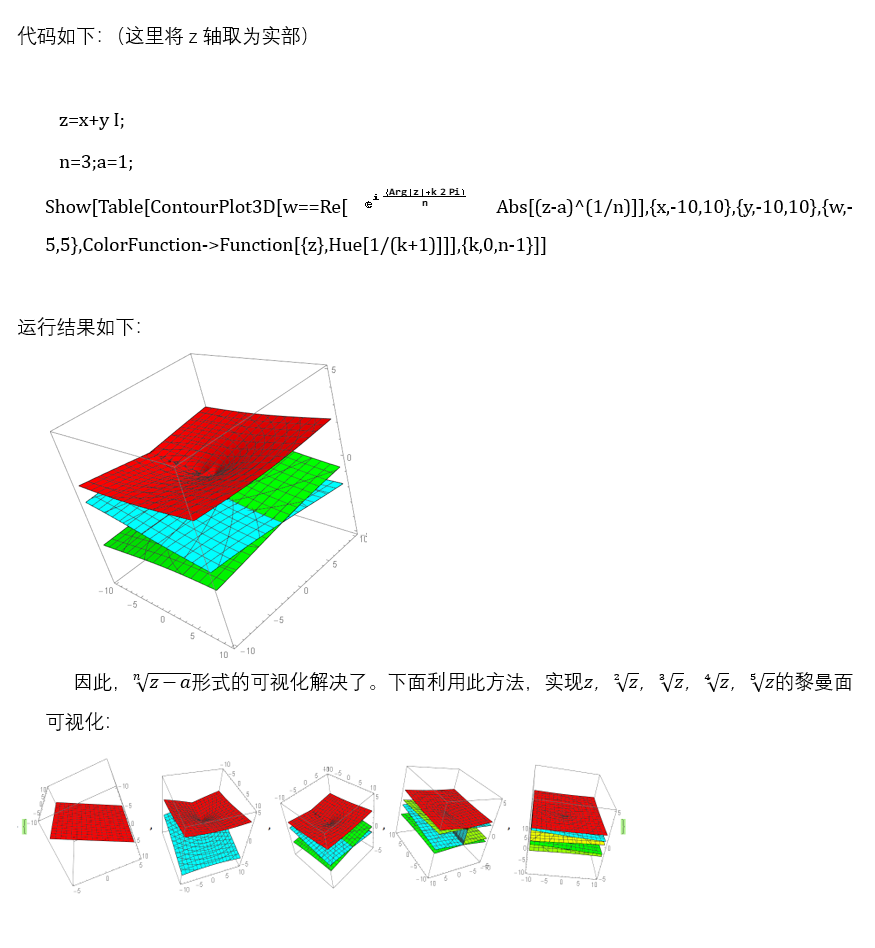
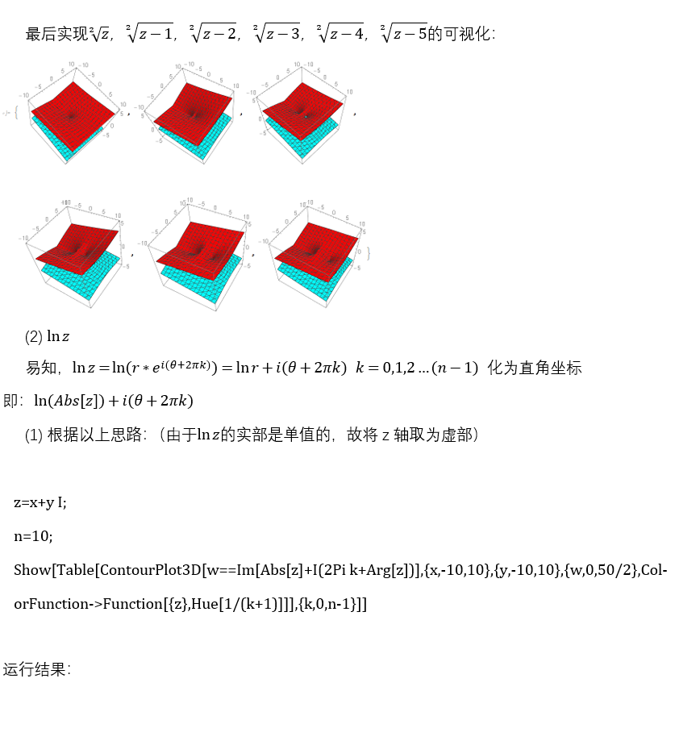
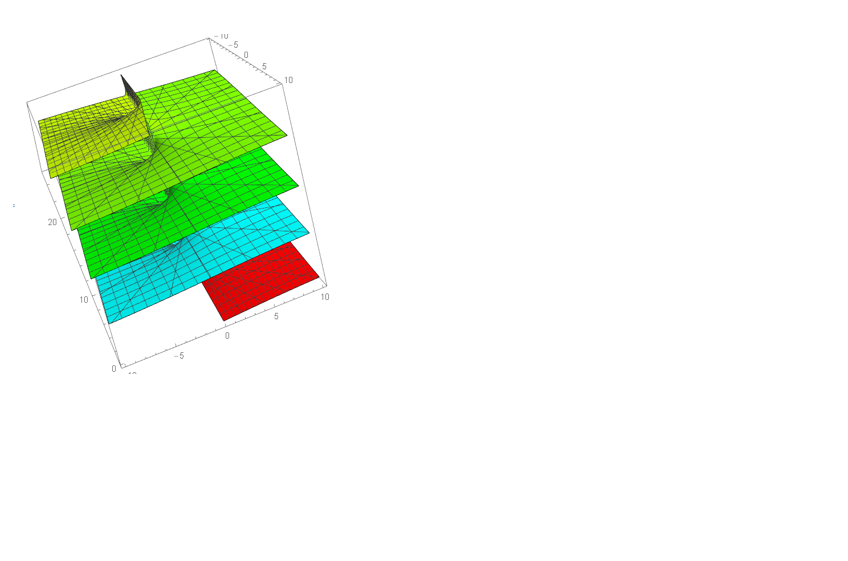

# 基于Mathematica的复变函数可视化

> 原发布于 B 站专栏：[基于Mathematica的复变函数可视化](https://www.bilibili.com/read/cv3730708/)
> 发布日期：2019-10-07

本学期的数理方法课程需要交一篇学习报告，要求选择一个专题进行讨论。由于我在复变函数多值性这块掌握的不是很好，很多概念很难想清楚，所以我决定迎难而上，将这方面作为我的学习报告主题。

在此期间，我利用了mma绘制一些复变函数可视化的图像，方便理解，同时这也为我的报告提供了素材，嘿嘿。

以下就是正文了，前半部分主要讲理论和自己的感悟，需要耐心点看；之后，都是mma可视化的步骤简介。（ps.本来是想练习LaTex写文章的，但是老师要求word写，也就懒得去学LaTex _(:3」∠)_）

文章最后会有代码，可以直接cv搬运（滑稽）

水平有限，难免存在错误，恳请读者指出，感激不尽。

