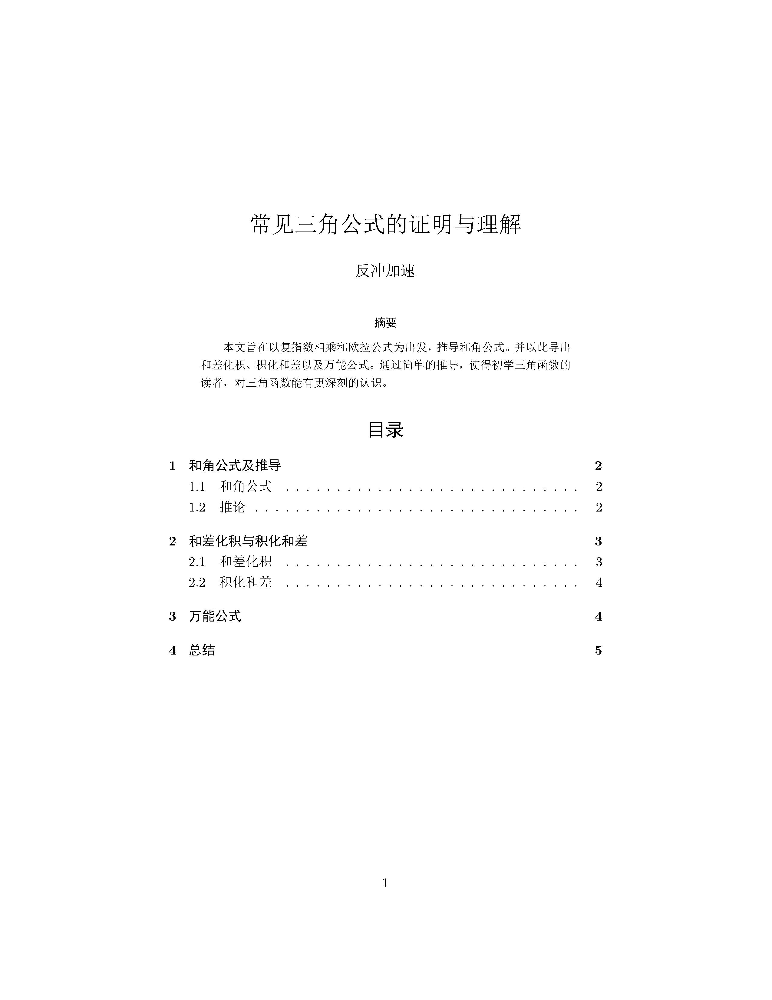
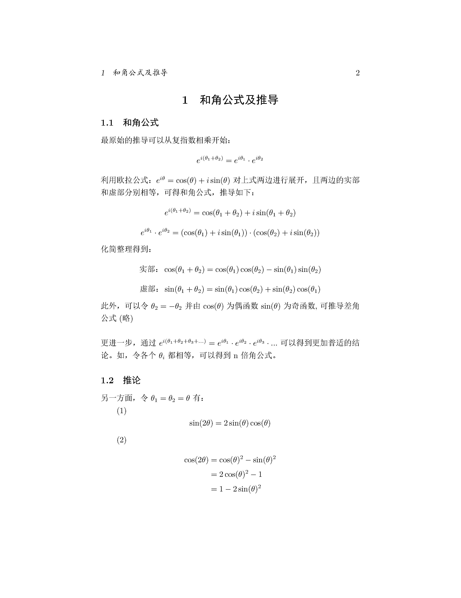
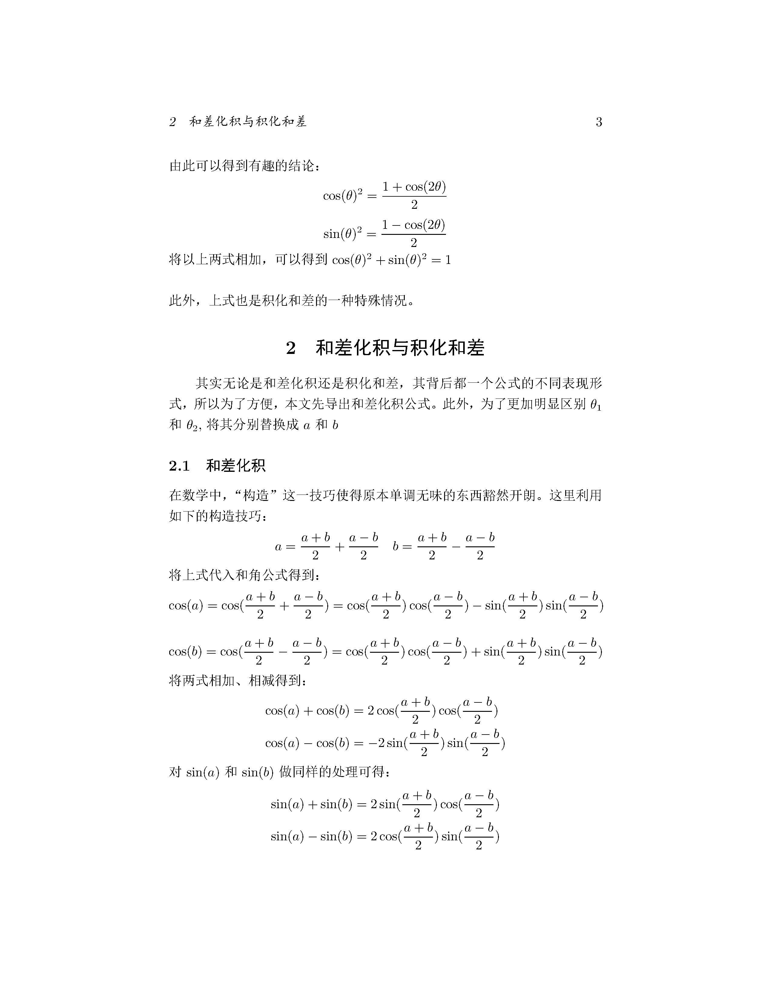
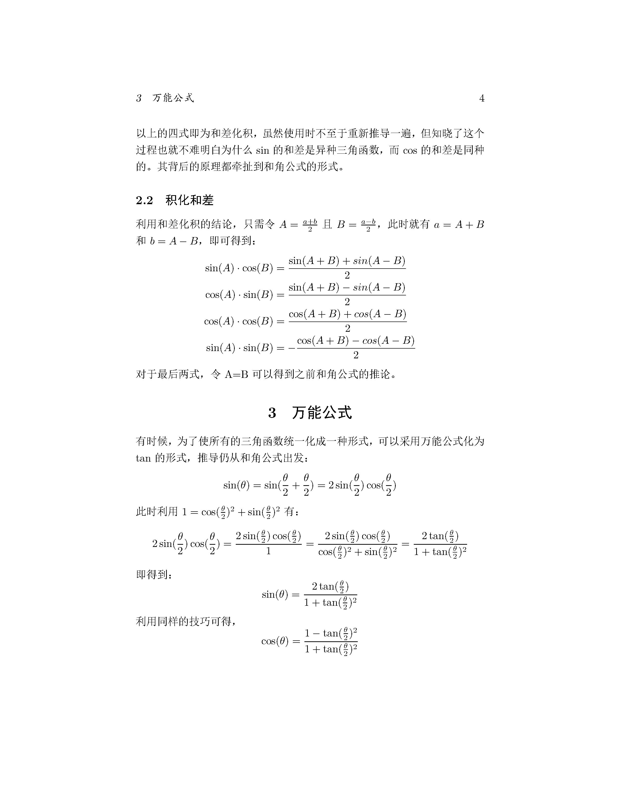
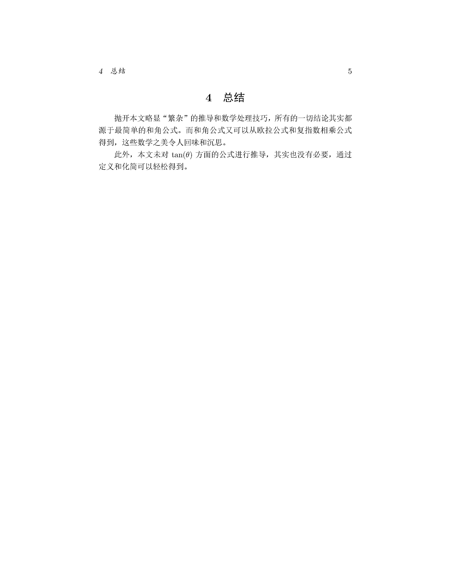

# 常见三角公式的证明与理解by.LaTex

> 原发布于 B 站专栏：[常见三角公式的证明与理解by.LaTex](https://www.bilibili.com/read/cv5343037/)
> 发布日期：2020-03-29

虽然本文的知识都很trivial，甚至都是常识。但我觉得还是能帮助一些初学三角函数的读者加深理解。尤其是某些高中老师直接跳过推导，“空降”各种公式的时候，可以根据本文的思路把逻辑理顺。此外，本文没有采用高中课本上的向量法或平面解析几何，而是利用更加自然的欧拉公式作为推导的开始，由此开阔初学者的眼界。

P.S.作者第一次用LaTex写文章，一次成稿难免有错误，欢迎读者指出，感激万分。

*封面*

*和角公式*

*和差化积与积化和差*

*万能公式*

*简短的总结*
