# 第一章 经典计算

量子计算并不是凭空出现的一套新语言。它首先继承了经典计算中的许多基本问题: 什么叫“可计算”? 一个计算过程需要多少资源? 哪些逻辑门足以组成任意计算? 为什么可逆计算会特别重要?

这一章的作用,就是先把经典计算的地基铺好。后面讲量子线路时,我们会不断遇到 CNOT、Toffoli、可逆门、复杂度类这些概念;如果先在经典情形中理解它们,进入量子计算时就不会觉得这些东西突然冒出来。

## 一、最基本的计算机模型: 图灵机(Turing Machine)

### 1、图灵机的基本思想

计算机是读写、存储信息的设备。因此,可以把信息抽象为纸带(Tape)上的字节,把计算过程抽象为读写头(Head)对纸带上各个字节进行的操作。它虽然简陋而理想化,但确实蕴含了计算的基本思想。

图灵机看起来不像我们平时使用的电脑,但它抓住了计算最核心的三件事:

- 信息要有地方存放,这就是纸带。
- 程序要能读取和改写信息,这就是读写头。
- 程序要有“当前做到哪一步”的记忆,这就是状态。

从这个角度看,图灵机不是为了模拟键盘、屏幕或 CPU 的工程细节,而是为了回答一个更基础的问题: 只要允许机械地读、写、移动和切换状态,到底有哪些任务原则上可以被算法完成?

### 2、图灵机(单带)的构造与运作

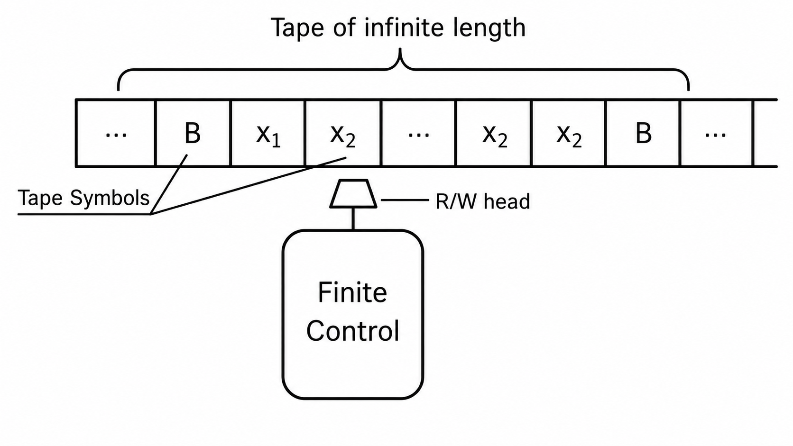

图灵机的大致构造如上图,一个方格表示一个比特。只要将程序设定好,读写头就将按照预定的规则进行计算。

- (1) 图灵机中的变量:状态、比特内容、移动方向。
- ①状态 s: 代表读写头的状态。在不同状态下,读写头遇到同一个比特后所做的操作不同。可以看成是一套程序中定义的若干个小函数,程序中需要在不同的小函数之间切换。其中,需要让图灵机在完成计算后停下来,因此需要一种特殊的状态 H, 称为停机状态(Halt)。
- ②比特内容 a: 代表图灵机所遇到的比特内容,一般取 0 或 1,或者空白 b。
- ③移动方向 d: 图灵机完成读写之后的移动,可以左移一格、右移一格或留在原地,分别用 l、r、0 表示。
- (2)图灵机的程序(指令,Instruction):本质上是一个映射,从上一步的 s、a 决定下一步中图灵机的 s、a、d。

$$(s,a) \mapsto (s',a',d)$$

完整的程序就是一个个这种对应关系的列表,并要逻辑自洽、有停机语句。 例如下表:

| s     | a | $s'$  | $a'$ | d |
|-------|---|-------|------|---|
| $s_1$ | b | $s_2$ | b    | l |
| $s_2$ | b | $s_3$ | b    | l |
| $s_2$ | 1 | $s_2$ | 1    | l |
| $s_3$ | b | H     | b    | 0 |
| $s_3$ | 1 | $s_4$ | b    | r |
| $s_4$ | b | $s_2$ | 1    | l |

给定一个合适的初始状态和初始纸带,图灵机将按照这一程序进行操作,最终停机。

读这张表时,可以把它想象成一个很小的自动机: 它每次只看“当前状态”和“当前格子里的符号”,然后决定三件事: 接下来切到哪个状态、把当前格子改成什么、读写头往哪里走。真正的程序只是把很多这样的局部规则排在一起。

### 3、通用图灵机

可以证明,存在一个通用的图灵机 U,它能够模拟任何图灵机 T 的功能。只要给每个图灵机 T 赋予一个图灵数  $n_T$  (相当于机器编号),那么对 U 输入该机器的图灵数和要处理的信息 x,就可以按 T 的方式处理 x。

$$U(n_T, x) = T(x)$$

这一步非常关键。普通图灵机像一台“专用机器”,只会做某个固定任务;通用图灵机则像现代电脑,程序本身也可以被编码成数据输入进去。也就是说,同一台机器只要读入不同程序,就可以模拟不同算法。

从量子计算的角度看,这也解释了为什么我们关心“计算模型”。经典图灵机、概率图灵机、量子线路模型看起来形式不同,但它们都在问同一个问题: 在某套允许的操作规则下,哪些问题可以高效解决?

### 4、其他类型的图灵机

(1) 多带图灵机:控制器控制多个读写头同时操控多条纸带,程序中的语句要写明对每一条纸带的操作,以及处理信息后每个读写头的移动情况。

$$(s, a_1, ..., a_k) \mapsto (s', a'_1, ..., a'_k, d_1, ..., d_k)$$

适当增加纸带,可以更方便地编写、执行程序,额外的纸带还可以起到储存信息的作用。

- (2) 概率性图灵机:每一步操作不是完全确定的,而是在一系列可能的操作中进行随机选择。**随机计算的好处是更好地遍历问题的各种可能性。**
### 5、Church-Turing 命题

在图灵机上可计算的所有函数的类,等价于可以用算法来计算的所有函数的类。
- (1)命题的意义:定义了"可计算"的概念,使得这一概念第一次有了数学的严格定义(就是可以用图灵机计算)。该命题尚未被严格证明,但也没有找到任何可以用来证伪的反例。
- (2)加强版命题:概率性的图灵机可以模拟任何计算模型,其所需的操作数与问题规模至多呈多项式关系增长。
### 6、停机问题

给图灵机输入一个数,图灵机需要根据算法回答,该数是否能够让它停机。实际上,这个问题是无法由算法来计算的,因为存在一个逻辑矛盾:如果输入的数不会让它停机,那么它输出答案之后不能结束运行,而是必须一直处于运转状态。如果它给出了答案"不能停机",然后又像正常程序一样停下了,那就是自相矛盾。因此,这种死循环的问题不可能由算法来解决。

停机问题提醒我们,“能不能算”和“算得快不快”是两类不同的问题。有些问题根本不存在通用算法;另一些问题原则上能算,但可能需要指数级时间,大到在现实中不可用。后面的复杂度理论主要讨论的是后一类问题。

## 二、二进制运算与逻辑门

### 1、比特与二进制加法

计算机储存和处理信息的最小单位是比特(bit),虽然实际的物理机制可以不同(电压开闭/自旋上下),但数学上总是相当于一个二进制位,只能取 0 或者 1。一个 n 位的二进制数需要 n 个比特来表示;二进制数的加法满足"满二进一",如下表,其中 s 表示 a+b 的原位,c 为进位(Carry bit)。

| а | b | s | С |
|---|---|---|---|
| 0 | 0 | 0 | 0 |
| 0 | 1 | 1 | 0 |
| 1 | 0 | 1 | 0 |
| 1 | 1 | 0 | 1 |

这里的重点不是加法本身,而是: 复杂计算最终可以拆成非常简单的局部逻辑关系。只要能实现这些逻辑关系,就可以层层组合出加法器、乘法器、内存访问和更复杂的程序。

### 2、逻辑门的真值表与符号

(1) 恒等门(Identity)

| a | a |
|---|---|
| 0 | 0 |
| 1 | 1 |

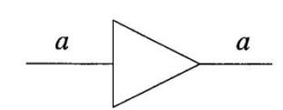

(2) 非门(NOT):  $\overline{a} = 1 - a$ .

| а | ā |
|---|---|
| 0 | 1 |
| 1 | 0 |

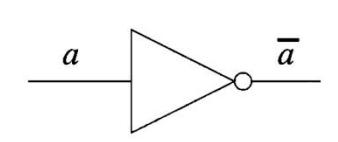

(3) 与门(AND):  $a \wedge b = ab$ 。(有一假即为假)

| а | b | $a \wedge b$ |
|---|---|--------------|
| 0 | 0 | 0            |
| 0 | 1 | 0            |
| 1 | 0 | 0            |
| 1 | 1 | 1            |

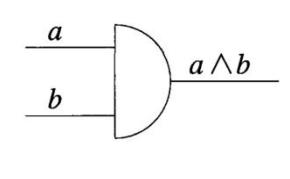

(4) 或门 (OR):  $a \lor b = \text{sgn}(a+b) = a+b-ab$ 。 (有一真即为真)

| a | b | $a \lor b$ |
|---|---|------------|
| 0 | 0 | 0          |
| 0 | 1 | 1          |
| 1 | 0 | 1          |
| 1 | 1 | 1          |

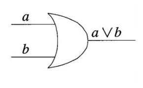

(5) 异或门(XOR): a 与 b 相异得 1, 相同得 0。  $a \oplus b = (a+b) \mod 2$ 。

| a | b | $a \oplus b$ |
|---|---|--------------|
| 0 | 0 | 0            |
| 0 | 1 | 1            |
| 1 | 0 | 1            |
| 1 | 1 | 0            |

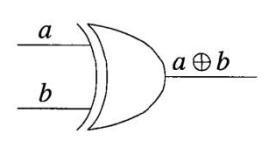

★两个一位二进制数 a 与 b 相加时,原位为 a ⊕ b ,进位为 a ∧ b 。

$$a,b = 0$$

或 $1 \Rightarrow a+b = 2(a \land b) + (a \oplus b)$ 

根据这一逻辑可以制作二进制加法器。

(6) 与非门(NAND): 与门的相反逻辑,当且仅当a与b均为1时才得0。

$$a \uparrow b = 1 - ab$$

| a | b | $a \uparrow b$ |
|---|---|-----|
| 0 | 0 | 1   |
| 0 | 1 | 1   |
| 1 | 0 | 1   |
| 1 | 1 | 0   |

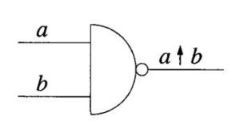

(7) 或非门 (NOR): 或门的相反逻辑, 当且仅当 a 与 b 均为 0 时才得 1 。  $a \downarrow b = 1 - (a \lor b) = 1 - \mathrm{sgn}(a + b)$ 

| a | b | $a \downarrow b$ |
|---|---|-------------|
| 0 | 0 | 1           |
| 0 | 1 | 0           |
| 1 | 0 | 0           |
| 1 | 1 | 0           |

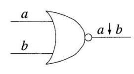

**根据逻辑学的 De Morgan 律,有**

$$a \uparrow b = \overline{a \land b} = \overline{a} \lor \overline{b}, \ a \downarrow b = \overline{a \lor b} = \overline{a} \land \overline{b}$$

这两个公式可以较好地将 NAND 与 NOR 门转化为 AND、OR、NOT 门,反过来也是。

这些逻辑门的直观区别可以这样记:

| 逻辑门 | 什么时候输出 1 |
| --- | --- |
| AND | 两个输入都为 1 |
| OR | 至少一个输入为 1 |
| XOR | 两个输入不同 |
| NAND | 不是“两者都为 1” |
| NOR | 不是“至少一个为 1” |

★逻辑门记忆方法: 在记住 Identity、AND、OR 的基础上,NOT、NAND、NOR 就是在右侧加上圆圈,XOR 则是在 OR 左侧加一道弧线。

(8) FANOUT (COPY): 对一个比特进行复制。

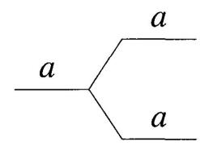

FANOUT 在经典计算中非常自然: 一个比特是 0 或 1,直接复制就行。但这件事在量子计算里会变得很微妙,因为未知量子态不能任意克隆。后面讲量子纠错时,这个差别会非常重要。

(9) SWAP (CROSSOVER):将两个比特进行交换。有两种画法。

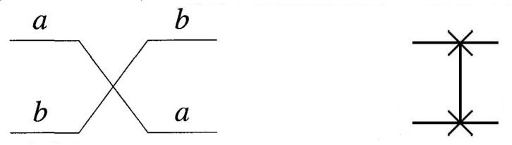

### 3、半加器与全加器

(1) 半加器(Half Adder, HA):可以实现两个一位二进制数的加法,给出原位和进位。具体逻辑操作已在前面说明。

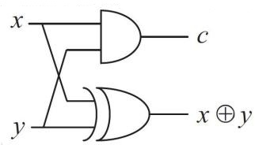

半加器其实就是前面真值表的电路化:

$$
s = a \oplus b, \qquad c = a \land b.
$$

其中 $s$ 是这一位留下来的结果,$c$ 是向高位传递的进位。

(2)全加器(Full Adder,FA):可以实现多位数的加法。每一位上的加法都要兼顾前一位的进位(下图中的 c),因此需要两个 HA 结合。

$$x + y + c = 2\{(x \land y) \lor [(x \oplus y) \land c]\} + (x \oplus y \oplus c)$$

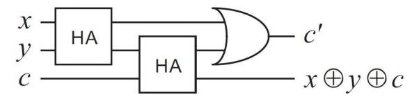

全加器说明了“组合”的力量: 单个逻辑门只会处理一两个比特,但把它们连起来,就能处理任意位数的整数加法。经典计算的硬件层面基本就是这种思想的不断扩展。

### 4、通用经典计算

逻辑运算中有多种逻辑门,但它们并不是完全独立的,可以互相代替。其中,只要能找到一组逻辑门能表示所有逻辑门,那么这组逻辑门就是通用的;其他逻辑门如果可以和它们等价,那么也都是可行的通用计算。

(1) 最基本的一组通用运算: AND、NOT、OR、FANOUT。

所谓“通用”,不是说这组门使用起来最方便,而是说它们表达能力足够强: 任何从有限个输入比特到有限个输出比特的布尔函数,都可以由这些门拼出来。

之所以说是最基本,是因为它们在逻辑上最容易被理解,也是用于证明的一组逻辑门。事实上,对于任意一个从 n 比特映射到 m 比特的函数

$$f: \{0,1\}^n \to \{0,1\}^m$$

总是可以将它拆成 m 个对应到单比特的函数

$$f_i: \{0,1\}^n \to \{0,1\}, i = 1,2,...,m$$

逻辑上, $f_i(a) = 1$ 等价于"a等于使 $f_i$ 为 1 的二进制数(记为  $a^{(l)}$ )",因此对  $f_i$ 取值的判断可以转化成对 a 值的判断。

$$f_i(a) = 1 \iff a = a^{(1)}, ..., a^{(k)}$$

令小项函数为

$$
f_i^{(l)}(a) =
\begin{cases}
1, & a = a^{(l)}, \\
0, & \text{其他}.
\end{cases}
$$

于是

$$f_i(a) = f_i^{(1)}(a) \lor f_i^{(2)}(a) \lor ... \lor f_i^{(k)}(a)$$

而每个小项函数又可以转化成  $a = a^{(l)}$ 每一位的校对:

$$a = (a_{n-1}a_{n-2}...a_0), \ f_i^{(l,p)}(a) = \begin{cases} 1, \ a_p = a_p^{(l)} \\ 0, \ a_p \neq a_p^{(l)} \end{cases} = \begin{cases} a_p, \ a_p^{(l)} = 1 \\ \overline{a}_p, \ a_p^{(l)} = 0 \end{cases}$$

$$f_i^{(l)}(a) = f_i^{(l,0)}(a) \wedge f_i^{(l,1)}(a) \wedge ... \wedge f_i^{(l,n-1)}(a)$$

 $f_i^{(l,p)}$ 内含 NOT 操作,通过 AND 操作得到  $f_i^{(l)}$ ,  $f_i^{(l)}$ 又通过 OR 操作得到  $f_i$ 。为了让 a 进入每个小项函数,需要对 a 进行复制,从而涉及 FANOUT 操作。这样就说明了 AND、NOT、OR、FANOUT 构成一组通用计算。

- (2) 其他等价的通用计算集合
- ①AND、NOT、FANOUT。可以用这些运算得到 OR。  $a \lor b = \overline{\overline{a} \land \overline{b}}$
- ②NAND, FANOUT.  $\overline{a} = a \uparrow a$ ,  $a \land b = \overline{a \uparrow b} = (a \uparrow b) \uparrow (a \uparrow b)$ .
- ③NOR、FANOUT。  $\overline{a} = a \downarrow a$ ,  $a \land b = \overline{\overline{a} \lor \overline{b}} = (a \downarrow a) \downarrow (b \downarrow b)$ 。

这里最值得记住的是 NAND 的特殊地位: 只用 NAND 加上复制,就能构造所有经典逻辑。这也是为什么在数字电路中,NAND/NOR 常被视为非常基础的门。

## 三、计算复杂度

### 1、问题规模与资源增长

显然,问题规模越大(例如输入的位数越多),需要的时间和存储空间就越大,二者是一种单调递增的关系,而这种递增究竟有多快,就是由问题内在的性质决定的。设输入位数为n,一个计算问题的复杂度将取决于时间资源、存储空间资源随n增长的**阶数**1。
- (1) 简单问题:解决该问题所需的资源量是n 的多项式函数。例如,计算两个n 位整数相加的结果所需的时间<u>通常</u>与n 成正比,而计算二者乘积所需的时间则**通常**与 $n^2$  成正比(不排除有更方便的算法)。
- (2) 困难问题:解决该问题所需的资源量可能比n的多项式更高阶。例如,旅行商问题的精确求解通常会遇到组合爆炸;质因数分解问题虽然还没有已知的经典多项式时间算法,但在量子计算中有 Shor 算法这一重要突破。这里要记住的是: “困难”通常不是指不能算,而是指已知方法所需资源增长得太快。
### 2、函数阶数的比较(计算学科常用符号)

设有两个非负函数 f(n)与 g(n)。

复杂度符号只关心输入规模很大时增长得有多快,通常会忽略常数因子和低阶项。例如 $3n^2+10n+5$ 与 $n^2$ 在复杂度意义下属于同一类,因为当 n 很大时,主导增长的是 $n^2$。

- (1) 若存在常数 c 与整数  $n_0$  使得  $n \ge n_0$  时恒有  $f(n) \le cg(n)$  ,则 f(n) = O[g(n)] 。
- (2) 若存在常数 c 与整数  $n_0$  使得  $n \ge n_0$  时恒有  $f(n) \ge cg(n)$ ,则  $f(n) = \Omega[g(n)]$ 。
- (3) 若 f(n) = O[g(n)]且  $f(n) = \Omega[g(n)]$ ,即存在常数  $c_1$ 、 $c_2$  与整数  $n_0$  使得  $n \ge n_0$  时恒有  $c_1g(n) \le f(n) \le c_2g(n)$ ,则  $f(n) = \Theta[g(n)]$ 。

可以用一句话区分:

- $O$ 是上界: 不会比它更糟太多。
- $\Omega$ 是下界: 至少要这么多。
- $\Theta$ 是同阶: 上下都被夹住,增长速度基本一致。

其他性质:

$$f(n) = O[g(n)] \Leftrightarrow g(n) = \Omega[f(n)]$$

$$f(n) = \Theta[g(n)] \Leftrightarrow g(n) = \Theta[f(n)]$$

$$\begin{cases} e(n) = O[f(n)] \\ g(n) = O[h(n)] \end{cases} \Rightarrow e(n)g(n) = O[f(n)h(n)]$$

### 3、时间复杂类

(1) 利用确定性图灵机,能够在O[f(n)]时间内处理的问题记为TIME[f(n)]。

1 可以看成微积分里面无穷大的阶数,只不过这里使用的符号会稍有不同。

利用非确定性图灵机,能够在O[f(n)]时间内处理的问题记为NTIME[f(n)]。

(2)利用确定性图灵机,在 $O(n^k)$ 时间内处理的问题统称为多项式时间问题(P问题)。

$$P = \bigcup_{k} TIME(n^{k})$$

P 类通常被看成“经典计算中可有效求解的问题”。这里的“有效”不是说一定很快,而是说当输入规模 n 变大时,所需时间只是按照 $n,n^2,n^3,\dots$ 这样的多项式增长。多项式增长虽然也可能很大,但和指数增长相比要温和得多。

利用确定性图灵机,在指数 $O(2^{n^k})$ 时间内处理的问题统称为指数时间问题 (EXP 问题)。

$$EXP = \bigcup_{k} TIME(2^{n^{k}})$$

EXP 类的问题通常被认为非常困难。因为指数函数增长太快: 如果输入长度增加一点点,需要枚举的可能性可能就翻倍、平方倍甚至更高。很多“暴力搜索”算法的困难,本质上就来自这种指数爆炸。

利用非确定性图灵机,在多项式时间内处理的问题(确定性图灵机未必只要多项式时间)统称为 NP 问题。(P 是 NP 的子集)

$$NP = \bigcup_{k} NTIME(n^{k})$$

其中, NP 问题用确定性图灵机未必能在多项式时间内解决,但给定一个答案后,总是可以在多项式时间内验证它的对错(验证答案比寻找答案更容易)。

这里最容易误解的一点是: NP 不是“不是 P”的意思,而是“答案容易验证”的问题。比如数独、旅行商路径、布尔公式可满足性等问题,如果别人直接给出一个候选答案,我们通常可以很快检查它对不对;真正困难的是从零开始把这个答案找出来。

对于某一个 NP 型决策问题,如果其他所有 NP 问题都可以在多项式时间内约化到它,则称它是一个 NP 完全问题(NP complete, NPC)。如果 NPC 被解决,所有 NP 问题都将解决。

对于某一个问题,如果其他所有 NP 问题都可以在多项式时间内约化到它,则称它是一个 NP 难问题(NP hard)。NP 难问题本身不一定属于 NP,也不一定是决策问题。

“约化”可以理解成把一个问题翻译成另一个问题。如果所有 NP 问题都能被高效翻译成某个问题,那这个问题至少和整个 NP 家族里最难的部分一样难。NP 完全问题既在 NP 里面,又足够难;NP 难问题则不要求它自己一定属于 NP。

- (3)人们试图证明 P = NP,如果这一论断正确,那么很多困难问题可以约化到多项式时间内解决,大大加快计算效率。目前还没有找到证明,并且很多人认为  $P \neq NP$  的可能性较大。
### 4、空间复杂类

主要指计算一个问题所需的内存空间大小。
- (1) 利用确定性图灵机,能够在O[f(n)]空间内处理的问题记为SPACE[f(n)]。同理可定义NSPACE[f(n)]、PSPACE、NPSPACE。此外,有

$$
L = SPACE(\log n),\qquad NL = NSPACE(\log n).
$$

- (2) 萨维奇(Savitch)定理:  $f(n) \ge \log n \Rightarrow \text{NSPACE}[f(n)] \subseteq \text{SPACE}[f^2(n)]$ 。 由此可以推知 NPSPACE = PSPACE,即存储空间的 P 与 NP 是一致的。
### 5、随机与量子复杂类

有时还会讨论另外两个涉及误差的时间复杂类。
- (1) BPP: 有限误差的概率多项式时间,即通过随机性算法能够在多项式时间内实现超过  $1/2 + \delta$  ( $\delta > 0$ )的正确概率(部分教材定义为超过 2/3)。
- (2) BQP: 与 BPP 类似,但算法可以使用量子计算,并在多项式时间内以有界误差给出答案。

BPP 和 BQP 都允许“有小概率犯错”。这不是因为计算不严谨,而是因为很多算法可以通过重复运行来把错误率压得非常低。BPP 对应经典随机算法,BQP 对应量子算法。量子信息中常说的“量子计算可能更强”,更准确地说就是: 有些问题可能不在经典的 BPP 里,但在量子的 BQP 里。

### 6、不同复杂类的关系
- (1) L $\subseteq$ NL $\subseteq$ P $\subseteq$ NP $\subseteq$ PSPACE $\subseteq$ EXP。其中,P $\neq$ EXP,NL $\neq$ PSPACE。
- (2) L⊆NL⊆P⊆BPP⊆BQP⊆PSPACE⊆EXP。这里,人们通常推测 BPP≠BQP,因为一些量子算法显示出经典随机算法难以达到的潜在优势。

可以把这些复杂类先记成下面这张“地图”:

| 复杂类 | 直观含义 |
|---|---|
| P | 经典确定性计算机能在多项式时间内解决 |
| NP | 给出答案后,经典计算机能在多项式时间内验证 |
| BPP | 经典随机算法能在多项式时间内高概率解决 |
| BQP | 量子算法能在多项式时间内高概率解决 |
| PSPACE | 经典计算机能用多项式空间解决,时间可能很长 |

后面学习量子算法时,不要只问“量子计算能不能算”,因为经典计算也能模拟量子计算,只是可能极慢。真正重要的问题是: 量子计算能不能把某些问题从“不可承受的慢”变成“多项式时间内可做”。

## 四、计算与能量、可逆门

### 1、为什么需要可逆计算

正如兰道尔原理所说,信息的擦除与写入都涉及能量的消耗。如果要减少耗能,就应该在信息处理过程中保证信息没有流失,即所做的计算应该是可逆的。

所谓可逆,就是从输出能够唯一恢复输入。例如 NOT 是可逆的,因为输出 0 一定来自输入 1,输出 1 一定来自输入 0。但 AND 不是可逆的,因为输出 0 可能来自 00、01、10,无法反推出原来的输入。

量子计算中这一点尤其关键: 孤立量子系统的演化由幺正变换描述,而幺正变换天然是可逆的。因此在进入量子门之前,先理解经典可逆门,会让后面的量子线路自然很多。

### 2、控制非门(CNOT)

控制非门是一个重要的可逆门。
- (1) 运算规则:输入a、b两个比特,由a的值来决定对b的操作。如果a为0,则不对b做任何操作;如果a为1,则对b进行 NOT 操作。此外,为了实现可逆运算,除了要输出b的运算结果,还要把a原样输出。此算法总结为

 $CNOT(a,b) = (a, a \oplus b)$ 

真值表和电路符号如下。

| a | b | a' | b' |
|---|---|----|----|
| 0 | 0 | 0  | 0  |
| 0 | 1 | 0  | 1  |
| 1 | 0 | 1  | 1  |
| 1 | 1 | 1  | 0  |

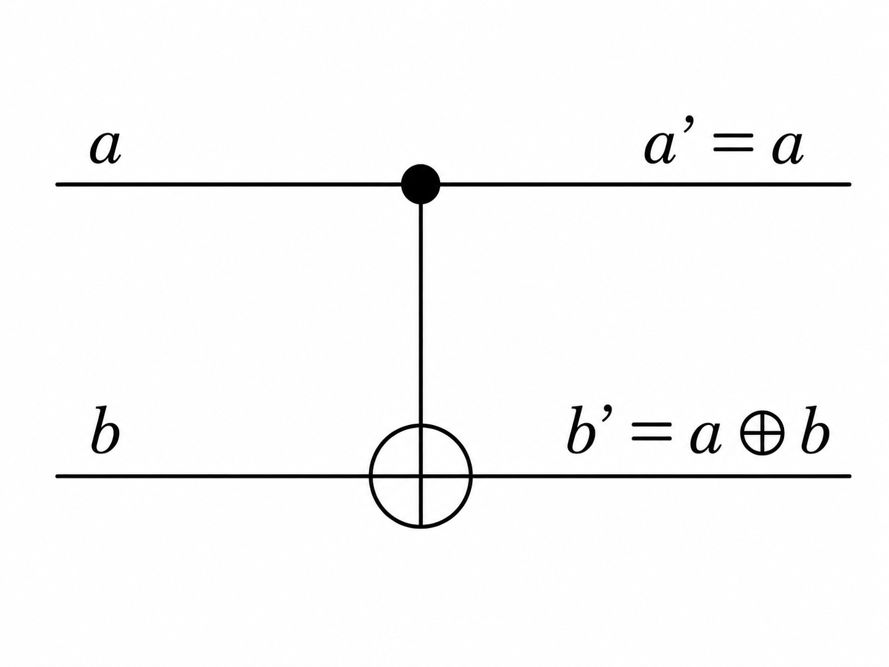

为什么 CNOT 是可逆的? 因为如果再作用一次 CNOT,就会回到原来的输入:

$$
a \oplus (a \oplus b) = b.
$$

也就是说,同一个门既可以看成“计算”,也可以看成“反计算”。这种性质在量子算法中很常见,例如常常先把某些辅助信息算出来,用完之后再反向擦除,避免留下不需要的纠缠或垃圾信息。

- (2) 用 CNOT 门实现常见运算(具有可逆性)
- ①NOT: 由于 $\bar{a} = a \oplus 1$ , 故只要令b = 1即可实现对a的 NOT门。
- ②FANOUT: 由于 $a = a \oplus 0$ , 故只要令b = 0即可将a复制到下面比特上。

这里的 FANOUT 只适用于经典比特。到了量子比特时,未知量子态不能被任意复制,这就是后面会遇到的 no-cloning theorem。也正因为如此,量子线路虽然长得像经典电路,但很多直觉不能直接照搬。

### 3、Toffoli 门

Toffoli 门是一个三比特逻辑门,本质是"控制-控制非门"(CCNOT)。
- (1) 运算法则:输入a、b、c 三个比特,a、b 原样输出,二者一起控制对c 的操作;只有a=b=1时才对c进行 NOT 操作,否则不操作。

 $CCNOT(a,b,c) = (a,b,c \oplus ab)$ 

| a | b | c | a' | b' | c' |
|---|---|---|----|----|----|
| 0 | 0 | 0 | 0  | 0  | 0  |
| 0 | 0 | 1 | 0  | 0  | 1  |
| 0 | 1 | 0 | 0  | 1  | 0  |
| 0 | 1 | 1 | 0  | 1  | 1  |
| 1 | 0 | 0 | 1  | 0  | 0  |
| 1 | 0 | 1 | 1  | 0  | 1  |
| 1 | 1 | 0 | 1  | 1  | 1  |
| 1 | 1 | 1 | 1  | 1  | 0  |

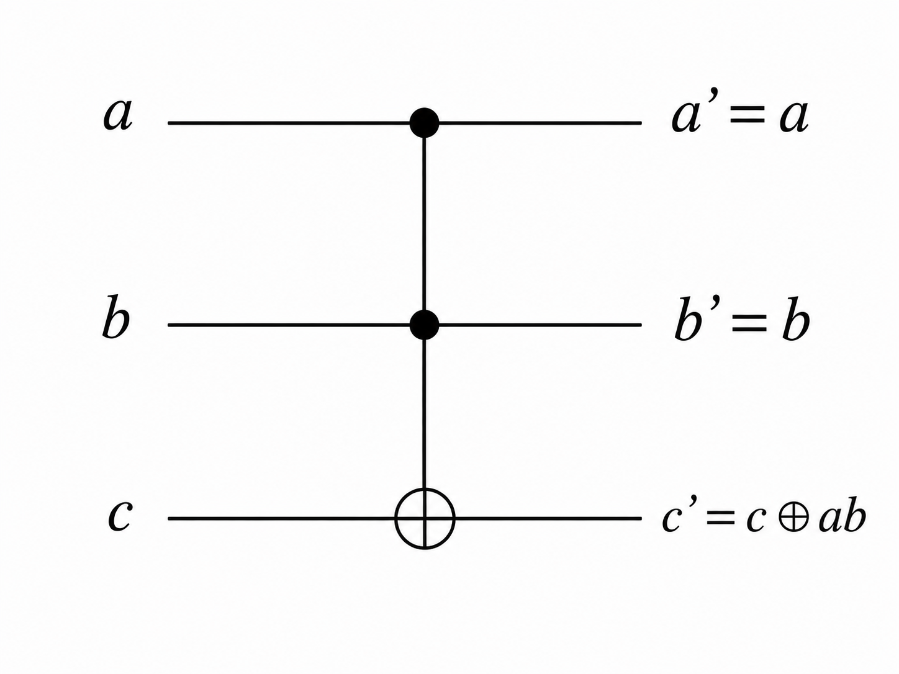

- (2) 用 Toffoli 门实现通用计算
- ①AND:  $ab = 0 \oplus ab$ , 令 c = 0 即可在 c' 端输出  $a \wedge b$  。
- ②NOT:  $\bar{a} = 1 \oplus a \cdot 1$ , 令 b = c = 1 即可在 c' 端输出  $\bar{a}$  。
- ③FANOUT:  $a=0\oplus a\cdot 1$ ,令 b=1、c=0 即可在 c' 端复制 a。 因此 Toffoli 门可以实现通用的可逆运算。

Toffoli 门的重要性在于: 它说明“可逆”并不会削弱经典计算的表达能力。普通的 AND、NOT、FANOUT 看起来会丢信息,但只要引入辅助比特并把原输入保留下来,就可以把经典逻辑嵌入到可逆计算里。

其他运算:

- ④NAND:  $a \uparrow b = \overline{ab} = 1 \oplus ab$ ,令 c = 1 即可在 c' 端实现 NAND 运算。
- ⑤SWAP: 可以验证SWAP(a,b) = (b,a) = ( $a \oplus (a \oplus b)$ , $b \oplus (a \oplus b)$ ),所以SWAP门可以用三个CNOT门实现。

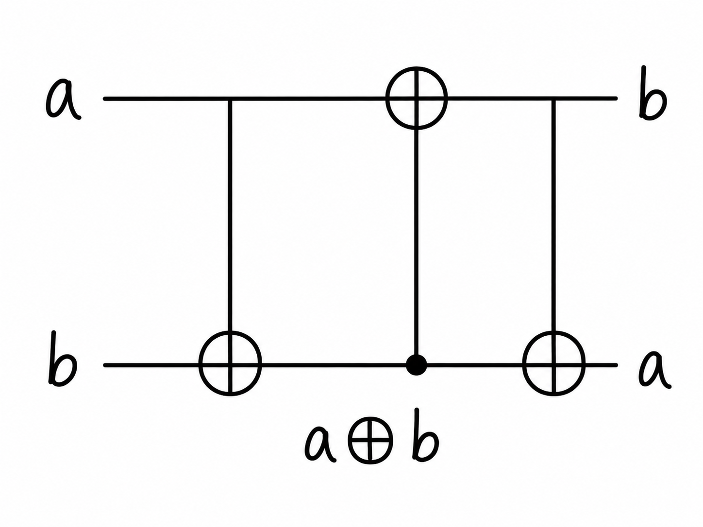

### 4、Fredkin 门

Fredkin 门是一个三比特逻辑门,本质是"控制交换门"(CSWAP)。
- (1) 运算法则: 输入 a、b、c 三个比特,a 作为控制位原样输出;只有 a = 1 时交换 b、c,否则 b、c 保持不变。

| a | b | c | a' | b' | c' |
|---|---|---|----|----|----|
| 0 | 0 | 0 | 0  | 0  | 0  |
| 0 | 0 | 1 | 0  | 0  | 1  |
| 0 | 1 | 0 | 0  | 1  | 0  |
| 0 | 1 | 1 | 0  | 1  | 1  |
| 1 | 0 | 0 | 1  | 0  | 0  |
| 1 | 0 | 1 | 1  | 1  | 0  |
| 1 | 1 | 0 | 1  | 0  | 1  |
| 1 | 1 | 1 | 1  | 1  | 1  |

- (2) 用 Fredkin 门实现(可逆)通用计算
- ①FANOUT、NOT: 令 b = 0、c = 1,则 b' = a, $c' = \overline{a}$ 。此时的 Fredkin 门可以同时实现 NOT 和 FANOUT。
- ②AND: 令 c=0,可以验证当且仅当 a=b=1 时才有 b'=a, c'=1,否则 c'=0 。 此时在 c' 处可实现 AND 运算。

本章可以抓住一条主线: 图灵机告诉我们“什么叫可计算”,逻辑门告诉我们“计算可以怎样被电路实现”,复杂度告诉我们“计算需要多少资源”,可逆门则把经典计算自然连接到量子计算。后面进入量子比特和量子门时,这些概念会反复出现。
