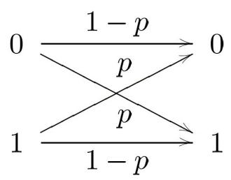
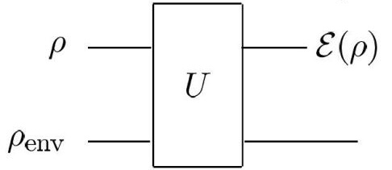
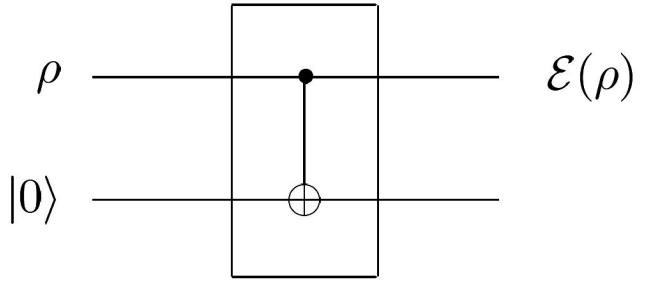
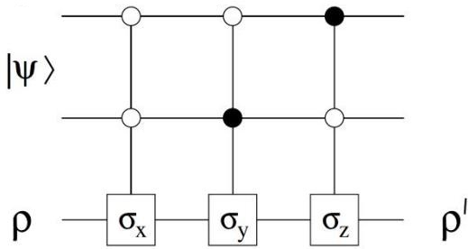
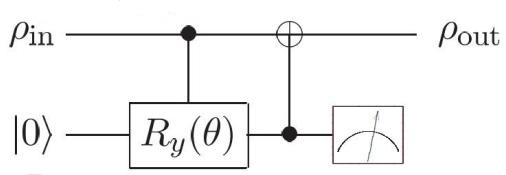
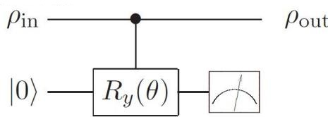

# 第七章 量子噪声和量子操作

## 一、噪声及其抽象模型
- 1、任何计算系统都是在有限温度下运行,环境的热噪声难免对系统造成影响, 不论是量子的还是经典的。
- 2、经典比特的噪声:有一定概率从0翻转至1,或从1翻转至0。

在物理上,一般把经典热噪音描述为马尔科夫过程(Markov Process),也就是每个时刻的随机演化都与之前的演化统计独立。

3、量子计算的热噪音则是环境对系统的量子操作(Quantum Operation)。

由于涉及叠加态,量子比特的热涨落不能简单地用翻转概率来描述,而是要用算符来描述。如上图,在经过了环境的作用之后,系统的密度算符表示为

$$\varepsilon(\hat{\rho}) = \operatorname{tr}_{\text{env}}[\hat{U}(\hat{\rho} \otimes \hat{\rho}_{\text{env}})\hat{U}^{+}]$$

有时会用辅助比特来代替环境 env, 以模拟量子操作的效果, 如下图。

这就是开放量子系统的基本图景:真实系统并不是孤立演化的,它会和周围环境发生相互作用。如果我们只记录系统本身,而不记录环境中发生了什么,就必须对环境自由度求偏迹。系统的局部状态因此可能从纯态变成混合态。

一个特别常见的噪声是退相干。若

$$
|\psi\rangle=\alpha|0\rangle+\beta|1\rangle,
$$

理想纯态密度矩阵含有非对角元 $\alpha\beta^*$ 与 $\alpha^*\beta$ ,它们记录了 $|0\rangle$ 与 $|1\rangle$ 之间的相干相位。退相干会压低这些非对角元:

$$
\begin{pmatrix}
|\alpha|^2 & \alpha\beta^*\\
\alpha^*\beta & |\beta|^2
\end{pmatrix}
\longrightarrow
\begin{pmatrix}
|\alpha|^2 & \gamma\alpha\beta^*\\
\gamma^*\alpha^*\beta & |\beta|^2
\end{pmatrix},
\qquad |\gamma|<1 .
$$

这不是简单的“比特从 0 变 1”,而是相位关系逐渐变得不可观测。量子信道就是对这类有效演化的抽象描述。

## 二、量子操作的"算符和"表示: Kraus 算符
- 1、设环境的基矢量为 $|e_k\rangle$ ,初始时处在 $|e_0\rangle$ 。系统和环境先共同经历一个幺正演化,随后只保留系统、对环境求偏迹,系统的状态为

$$\varepsilon(\hat{\rho}) = \operatorname{tr}_{\text{env}}[\hat{U}(\hat{\rho} \otimes |e_0\rangle\langle e_0|)\hat{U}^+] = \sum_{k} \langle e_k | \hat{U}(\hat{\rho} \otimes |e_0\rangle\langle e_0|)\hat{U}^+ |e_k\rangle$$

定义 Kraus 算符:

$$\hat{E}_{k} = \langle e_{k} | \hat{U} | e_{0} \rangle$$

这里 $\hat{U}$ 同时作用在系统和环境,将其中属于环境的部分取 $\langle e_k | \cdot | e_0 \rangle$ 矩阵元,剩余的就是对系统作用的算符 $\hat{E}_k$ 。最终可以得到

$$\varepsilon(\hat{\rho}) = \sum_{k} \hat{E}_{k} \hat{\rho} \hat{E}_{k}^{+}$$

可以认为这个结果是对环境不同不可见结果求和后的有效描述。交叉项在对环境求偏迹后不再出现在系统的约化态中,所以系统可能从纯态变成混合态。注意,“可能变混合”不是“必然变混合”: 如果只有一个 Kraus 算符且演化等价于系统上的幺正门,纯态仍会保持纯态。由于这个密度算符是一系列算符的和,所以称为算符和表示(Operator-sum Representation)。

从信息论角度看,Kraus 表示把“系统与环境整体仍按幺正规律演化”与“我们只能看见系统”这两件事连接起来。环境的不同不可见结果对应不同 Kraus 算符;把这些结果求和,就得到系统上的信道。第八章讨论量子纠错时,所谓“错误”并不只是某一个确定门,而是这类信道作用后的有效偏离。

**2、量子操作的性质**

(1) 完备性:

$$
\sum_{k}\hat{E}_{k}^{+}\hat{E}_{k}
=
\sum_{k}
\langle e_{0}|\hat{U}|e_{k}\rangle
\langle e_{k}|\hat{U}|e_{0}\rangle
=
\hat{I}.
$$

(2) 保迹性(Trace-preserving, TP):

$$\operatorname{tr}[\varepsilon(\hat{\rho})] = \operatorname{tr}\left(\sum_{k} \hat{E}_{k} \hat{\rho} \hat{E}_{k}^{+}\right) = \operatorname{tr}\left(\hat{\rho} \sum_{k} \hat{E}_{k}^{+} \hat{E}_{k}\right) = \operatorname{tr}\hat{\rho}$$

(3) 凸线性(Convex Linear): 对任意  $0 \le p_1, p_2 \le 1$ 且 $p_1+p_2=1$ ,有

$$\varepsilon(p_1\hat{\rho}_1 + p_2\hat{\rho}_2) = p_1\varepsilon(\hat{\rho}_1) + p_2\varepsilon(\hat{\rho}_2)$$

- (4) 正定性:  $\varepsilon(\hat{\rho}) \geq 0$ 。
- (5) 完全正定性(Completely Positive, CP):  $(I \otimes \varepsilon)(\hat{\rho}') \ge 0$ 。

完全正定的意思是指,即使该系统作为子系统存在于更大的系统中,该量子 操作得到的结果依然是正定的。这是一个比普通的正定性更强的性质。例如,对 正定矩阵进行转置后仍得到正定矩阵,说明转置操作是正定操作(这里不涉及其 他系统);但是,如果将这一矩阵与其他矩阵进行直积、使之成为子系统,那么 在大矩阵中对这个子系统进行的部分转置(后面会提到)不能保证大矩阵正定, 说明对该系统的转置操作不是完全正定操作。

- (6) 如果一个量子操作能够满足 $\varepsilon(\hat{I}) = \hat{I}$ ,则称该操作是单位的(Unital)。
- 3、部分转置(Partial Transpose)
  - (1)转置(Transpose):将一个矩阵的行列交换。有两种表达形式:

$$\hat{M} = \sum_{jk} M_{jk} |j\rangle\langle k| \Rightarrow \hat{M}^{\mathrm{T}} = \sum_{jk} M_{kj} |j\rangle\langle k| = \sum_{jk} M_{jk} |k\rangle\langle j|$$

两种写法是一样的,可以认为是对行号、列号的交换,也可以认为是行列号 不动、对元素的值进行交换(萝卜的移动/坑的移动)。

不难看出,算符 $\hat{M}$ 与 $\hat{M}$ T的正定性一致、本征值一致、奇异值一致。

(2) 部分转置:对于直积形成的矩阵,将直积的一方进行转置。

也可以这样写:

$$
\hat{M}=\hat{M}_A\otimes\hat{M}_B
\Rightarrow
\begin{cases}
\hat{M}^{T_A}
=
\sum_{jk} M_{kj,il}|ij\rangle\langle kl|
=
\sum_{jk} M_{ij,kl}|kj\rangle\langle il|, \\
\hat{M}^{T_B}
=
\sum_{jk} M_{il,kj}|ij\rangle\langle kl|
=
\sum_{jk} M_{ij,kl}|il\rangle\langle kj|.
\end{cases}
$$

也可以这样写:

$$
\hat{M}=\hat{M}_A\otimes\hat{M}_B
\Rightarrow
\begin{cases}
\hat{M}^{T_A}=\hat{M}_A^T\otimes\hat{M}_B, \\
\hat{M}^{T_B}=\hat{M}_A\otimes\hat{M}_B^T.
\end{cases}
$$

正如前面所说,部分转置可以看成是对其中一个子系统的量子操作。它不同 干对整个大矩阵的转置:

$$\hat{M}^{\mathrm{T}} = \sum_{jk} M_{kl,ij} |ij\rangle\langle kl| = \sum_{jk} M_{ij,kl} |kl\rangle\langle ij| = \hat{M}_{A}^{\mathrm{T}} \otimes \hat{M}_{B}^{\mathrm{T}}$$

此外,从这些式子中容易看出:  $\hat{M}^{T_B} = (\hat{M}^{T_A})^T$ 。

- 4、量子纠缠与分离
- (1) 可分离(Separable):对于两个系统的量子态,如果其密度算符可以表示 成一系列直积算符的凸线性组合,则它是可分离的。

$$\hat{\rho} = \sum_{i} p_{i} \hat{\rho}_{i}^{A} \otimes \hat{\rho}_{i}^{B}, \ 0 \leq p_{i} \leq 1$$

(2) 若两个系统的密度算符不是可分离的,则它们是纠缠的。

注意,纠缠态与混合态是没有必然联系的,前者主要是看两个系统之间是否 有互相关联,后者是看系统的状态能否由 Hilbert 空间的一个态矢表示。

- (3) 纠缠、分离态的判断准则: PPT 准则
- ①若两个系统的密度算符可分离,则它是部分转置正定的(Positive Partial

Transpose, PPT), 即 $\hat{\rho}^{T_A} \geq 0$ 且等价地 $\hat{\rho}^{T_B} \geq 0$ .

- ②若两个系统的密度算符不是 PPT 的,则它是纠缠的。
- ③若 $\hat{\rho}$ 的维度小于等于 6,则反过来也成立:若两个系统的密度算符是 PPT 的,则它是可分离的。

## 三、单比特量子操作

1、对于单个量子比特,其状态等价于 Bloch 矢量,因此量子操作可以从 Bloch 矢量的变化来理解。任意单比特 CPTP 映射都会把 Bloch 球仿射地映到球内,形式上包括旋转、压缩和可能的平移。

$$\vec{r}' = \hat{M}\vec{r} + \vec{c}$$

如果不指定具体的 Bloch 矢量,而是看量子操作对任意态矢的作用,那么可以认为是对整个 Bloch 球进行了压缩和平移。

2、几种典型的量子操作(初始 Bloch 矢量 $\vec{r} = (x, y, z)^{T}$ )

| 名称 | 实际意义 | Kraus 算符 | $\vec{r}' = \hat{M}\vec{r} + \vec{c}$ | 对 Bloch 球的操作 |
| --- | --- | --- | --- | --- |
| Bit flip | 量子比特以概率 p 在 0 和 1 之间翻转 | $\hat{E}_0 = \sqrt{1-p}\hat{I}$, $\hat{E}_1 = \sqrt{p}\hat{X}$ | $\begin{pmatrix} x \\ (1-2p)y \\ (1-2p)z \end{pmatrix}$ | 在 y 和 z 方向压缩 |
| Phase flip | 0 和 1 的相对相位以概率 p 反号 | $\hat{E}_0 = \sqrt{1-p}\hat{I}$, $\hat{E}_1 = \sqrt{p}\hat{Z}$ | $\begin{pmatrix} (1-2p)x \\ (1-2p)y \\ z \end{pmatrix}$ | 在 x 和 y 方向压缩 |
| Bit-phase flip | 比特翻转与相位翻转的组合 | $\hat{E}_0 = \sqrt{1-p}\hat{I}$, $\hat{E}_1 = \sqrt{p}\hat{Y}$ | $\begin{pmatrix} (1-2p)x \\ y \\ (1-2p)z \end{pmatrix}$ | 在 x 和 z 方向压缩 |
| Depolarization | $\varepsilon(\hat{\rho}) = (1-p)\hat{\rho} + \frac{p}{2}\hat{I}$ | $\hat{E}_0 = \sqrt{1-\frac{3p}{4}}\hat{I}$, $\hat{E}_{1,2,3} = \frac{\sqrt{p}}{2}(\hat{X},\hat{Y},\hat{Z})$ | $(1-p)\begin{pmatrix} x \\ y \\ z \end{pmatrix}$ | 球半径缩为 $1-p$ 倍 |
| Amplitude damping | 描述从 $\lvert1\rangle$ 向 $\lvert0\rangle$ 的能量耗散 | $\hat{E}_0 = \begin{pmatrix} 1 & 0 \\ 0 & \sqrt{1-\gamma} \end{pmatrix}$, $\hat{E}_1 = \begin{pmatrix} 0 & \sqrt{\gamma} \\ 0 & 0 \end{pmatrix}$ | $\begin{pmatrix} \sqrt{1-\gamma}x\\ \sqrt{1-\gamma}y\\ \gamma+(1-\gamma)z \end{pmatrix}$ | 三个方向压缩,z 方向平移 |
| Phase damping | 描述相位信息损失,不改变布居 | $\hat{E}_0 = \begin{pmatrix} 1 & 0 \\ 0 & \sqrt{1-\lambda} \end{pmatrix}$, $\hat{E}_1 = \begin{pmatrix} 0 & 0 \\ 0 & \sqrt{\lambda} \end{pmatrix}$ | $\begin{pmatrix} \sqrt{1-\lambda}x \\ \sqrt{1-\lambda}y \\ z \end{pmatrix}$ | 等价于 phase flip $p = \frac{1-\sqrt{1-\lambda}}{2}$ |

可以根据 Bloch 矢量的具体形式进行画图,从而明确 $\theta$ 和 $\varphi$ 的变化,理解这些操作的形象含义。

**3、量子操作的线路**

(1) Bit flip、phase flip 和 bit-phase flip 可以统一在一个线路中。

这里用两个辅助比特 $|\psi\rangle$ 来控制各个量子门。不难发现,当 $|\psi\rangle$ = $|00\rangle$ 时只执行 $\hat{X}$ , $|\psi\rangle$ = $|01\rangle$ 时只执行 $\hat{Y}$ , $|\psi\rangle$ = $|10\rangle$ 时只执行 $\hat{Z}$ , $|\psi\rangle$ = $|11\rangle$ 时不执行任何操作(也就是执行 $\hat{I}$ )。如果希望有一定概率执行各个量子门,只要将辅助系统制备成相应的叠加态并在最后忽略辅助系统即可。例如,在这张线路的约定下,设 $|\psi\rangle = \sqrt{p}|00\rangle + \sqrt{1-p}|11\rangle$ ,则有p的概率执行 $\hat{X}$ 、有1-p的概率执行 $\hat{I}$ ,从而实现 bit flip 通道。

(2) Depolarization: 通过 CSWAP 门(即 Fredkin 门)来实现。

$$I/2 \xrightarrow{\rho}$$

$$(1-p)|0\rangle\langle 0| + p|1\rangle\langle 1|$$

(3) Amplitude damping: 如下图。

原理:

$$|0\rangle - R_y(\theta)$$

$$\hat{R}_y(\theta) = \cos\frac{\theta}{2}\hat{I} - i\sin\frac{\theta}{2}\hat{Y} = \begin{bmatrix} \cos\frac{\theta}{2} & -\sin\frac{\theta}{2} \\ \sin\frac{\theta}{2} & \cos\frac{\theta}{2} \end{bmatrix}$$

$$\hat{U} = (\hat{I} \otimes |0\rangle\langle 0| + \hat{X} \otimes |1\rangle\langle 1|)\left[|0\rangle\langle 0| \otimes \hat{I} + |1\rangle\langle 1| \otimes \hat{R}_{y}(\theta)\right]$$

$$\begin{split} \hat{E}_0 &= \langle 0|\hat{U}|0\rangle = |0\rangle\langle 0| + |1\rangle\langle 1|\langle 0|\hat{R}_y(\theta)|0\rangle = |0\rangle\langle 0| + \cos\frac{\theta}{2}|1\rangle\langle 1| = \begin{pmatrix} 1 & 0 \\ 0 & \cos\frac{\theta}{2} \end{pmatrix} \\ \hat{E}_1 &= \langle 1|\hat{U}|0\rangle = \hat{X}|1\rangle\langle 1|\langle 1|\hat{R}_y(\theta)|0\rangle = \sin\frac{\theta}{2}|0\rangle\langle 1| = \begin{pmatrix} 0 & \sin\frac{\theta}{2} \\ 0 & 0 \end{pmatrix} \end{split}$$

其中 $0 \le \theta \le \pi$ 。 令 $\sin \frac{\theta}{2} = \sqrt{\gamma}$ ,即可得到标准形式的 Kraus 算符。

(4) Phase damping: 如下图。

## 四、两状态相近程度的衡量: 迹距离与保真度

1、两个矢量的距离可以用勾股定理计算,本质上是范数。两个密度矩阵的相近程度(也是一种距离)同样可以用范数表示,也就是迹距离(Trace Distance):

$$D(\hat{\rho}, \hat{\tau}) = \frac{1}{2} \|\hat{\rho} - \hat{\tau}\|_{1} = \frac{1}{2} \operatorname{tr} |\hat{\rho} - \hat{\tau}|$$

其中  $|\hat{A}| = \sqrt{\hat{A}^{+}\hat{A}}$ ,而 $\operatorname{tr}|\hat{A}|$ 表示迹范数。迹距离反映了两个量子态的相近程度。

- (1) 完全正且保迹的量子操作(CPTP map)使得迹距离不增:  $D[\varepsilon(\hat{\rho}), \varepsilon(\hat{\tau})] \leq D(\hat{\rho}, \hat{\tau})$ 。
- (2) 对于单比特状态,如果将密度矩阵写成 Bloch 矢量的形式,那么迹距离就可以表示成 Bloch 矢量间的距离,更加体现出"相近程度"的意义。

$$\begin{aligned}
\hat{\rho} &= \frac{\hat{I} + \vec{r} \cdot \hat{\sigma}}{2}, \\
\hat{\tau} &= \frac{\hat{I} + \vec{s} \cdot \hat{\sigma}}{2}
\end{aligned}
\quad \Rightarrow \quad
|\hat{\rho} - \hat{\tau}| = \frac{1}{2} |\vec{r} - \vec{s}| \hat{I}
\quad \Rightarrow \quad
D(\hat{\rho}, \hat{\tau}) = \frac{1}{2} |\vec{r} - \vec{s}|.$$

(3) 迹距离体现相近程度,从而可以衡量区分两个状态的难度——如果两个量子态 $\hat{\rho}$ 和 $\hat{\tau}$ 各以 1/2 的经典概率出现,那么通过测量区分两个状态的最大概率为

$$p_{\text{max}} = \frac{1 + D(\hat{\rho}, \hat{\tau})}{2}$$

- 2、保真度(Fidelity):体现两个状态的重叠程度。一般其中一个态为纯态,并且以之为基准,考察另一个状态的偏差程度。
  - (1) 纯态的保真度:

$$\begin{aligned}
\hat{\rho} &= |\psi\rangle\langle\psi|, \\
\hat{\tau} &= |\varphi\rangle\langle\varphi| \\
\Rightarrow F(\hat{\rho}, \hat{\tau}) &= |\langle\psi|\varphi\rangle|^{2}.
\end{aligned}$$

(2) 混合态的保真度(也可以用于纯态):

若 $\hat{\rho}$ 为混合态,而 $\hat{\tau} = |\varphi\rangle\langle\varphi|$ 为纯态,则

$$F(\hat{\rho}, \hat{\tau}) = \langle\varphi|\hat{\rho}|\varphi\rangle = \operatorname{tr}(\hat{\rho}|\varphi\rangle\langle\varphi|) = \operatorname{tr}(\hat{\rho}\hat{\tau}).$$

- (3) 失真度(Infidelity):  $\varepsilon(\hat{\rho},\hat{\tau})=1-F(\hat{\rho},\hat{\tau})$ 。
- (4) 保真度的意义:可以理解为将测量算符 $\hat{M}_1 = |\varphi\rangle\langle\varphi|$ 、 $\hat{M}_2 = \hat{I} - |\varphi\rangle\langle\varphi|$ 作用到 $\hat{\rho}$ 上,得到第一种结果的概率。 $\hat{\rho}$ 与 $\hat{\tau}$ 越相近,该测量得到 $\hat{\tau}$ 的概率显然越大。
- (5) 用 Bloch 矢量表示单比特的保真度。若 $\hat{\tau}$ 为纯态,则:

$$\begin{aligned}
\hat{\rho} &= \frac{\hat{I} + \vec{r} \cdot \hat{\vec{\sigma}}}{2}, \\
\hat{\tau} &= \frac{\hat{I} + \vec{s} \cdot \hat{\vec{\sigma}}}{2}
\end{aligned}
\quad \Rightarrow \quad
F(\hat{\rho}, \hat{\tau}) = \operatorname{tr}(\hat{\rho}\hat{\tau}) = \frac{1}{2}(1 + \vec{r} \cdot \vec{s}).$$

(6) 保真度的更一般表示: 两个状态都可以是混合态。

$$F(\hat{\rho}, \hat{\tau}) = \left[ \text{tr} \sqrt{\hat{\rho}^{1/2} \hat{\tau} \hat{\rho}^{1/2}} \right]^2 = \left[ \text{tr} \sqrt{\hat{\tau}^{1/2} \hat{\rho} \hat{\tau}^{1/2}} \right]^2 = \left\| \sqrt{\hat{\rho}} \sqrt{\hat{\tau}} \right\|_1^2$$

(7) 完全正且保迹的量子操作(CPTP map)使得保真度不减:  $F[\varepsilon(\hat{\rho}), \varepsilon(\hat{\tau})] \geq F(\hat{\rho}, \hat{\tau})$ 。直观上,噪声会让状态更难区分,所以重叠程度不会降低。

(8) 保真度与迹距离的关系

$$1-\sqrt{F(\hat{\rho},\hat{\tau})} \leq D(\hat{\rho},\hat{\tau}) \leq \sqrt{1-F(\hat{\rho},\hat{\tau})}$$

对于两个纯态,容易验证  $D(\hat{\rho},\hat{\tau}) = \sqrt{1-F(\hat{\rho},\hat{\tau})}$ 。
