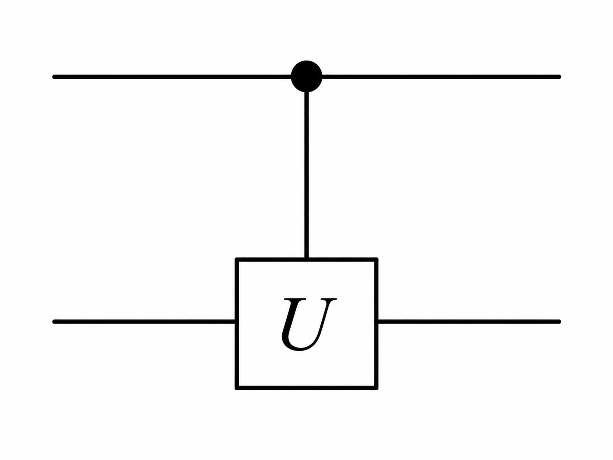
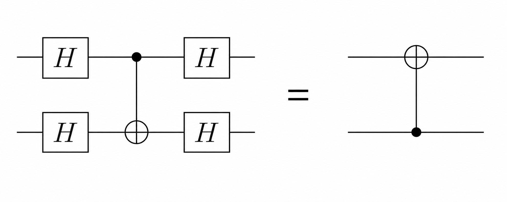
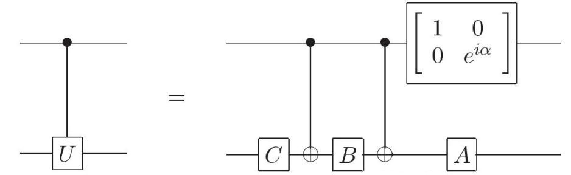
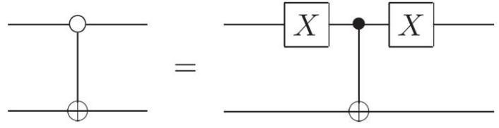
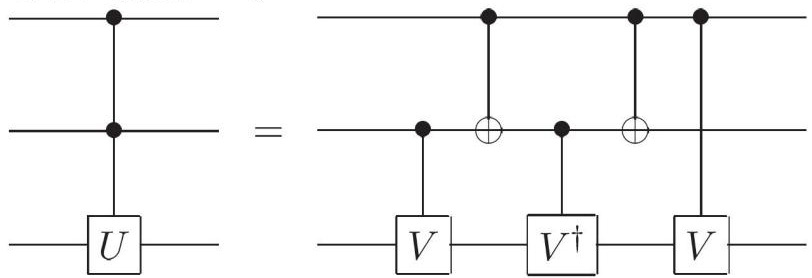
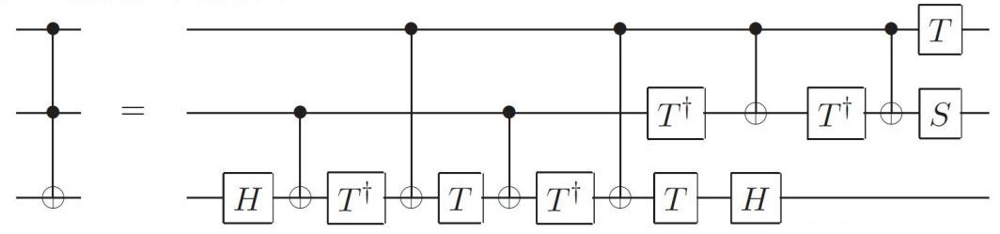
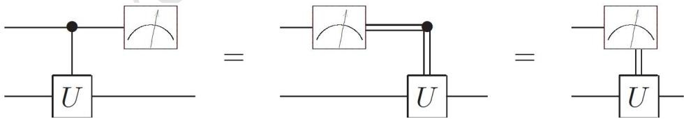

# 第三章 量子线路

## 一、单比特量子逻辑门
- 1、在量子力学中,比特的状态是态矢,因此对比特进行的逻辑门操作应是幺正变换,可以用矩阵来表示。单比特的操作对应二维幺正矩阵。
- 2、常见的单比特逻辑门
- (1) 恒等门: 单位矩阵。
- (2) 泡利矩阵:  $\hat{X}$ 、 $\hat{Y}$ 、 $\hat{Z}$ 。其中,由于 $\hat{X}|0\rangle = |1\rangle$ , $\hat{X}|1\rangle = |0\rangle$ ,所以 $\hat{X}$ 就是单比特的**非门**。
- (3) Hadamard 门:  $\hat{H} = \frac{1}{\sqrt{2}} \begin{pmatrix} 1 & 1 \\ 1 & -1 \end{pmatrix}$ 。不难发现:

$$\hat{H}|0\rangle = \frac{|0\rangle + |1\rangle}{\sqrt{2}} = |\uparrow\rangle_x, \quad \hat{H}|1\rangle = \frac{|0\rangle - |1\rangle}{\sqrt{2}} = |\downarrow\rangle_x$$

因此 Hadamard 门可以看成是一个旋转操作,它将 $\hat{Z}$ 本征态变为 $\hat{X}$ 本征态。

(4) 相位门(Phase Gate):  $\hat{S} = \begin{pmatrix} 1 & 0 \\ 0 & i \end{pmatrix}$ 。可以对两个本征态的相对相位进行改变,没有经典操作与之对应。

(5) $\pi/8$ 门(T 门):

$$\hat{T} = e^{i\frac{\pi}{8}} \begin{pmatrix} e^{-i\frac{\pi}{8}} & 0 \\ 0 & e^{i\frac{\pi}{8}} \end{pmatrix} = \begin{pmatrix} 1 & 0 \\ 0 & e^{i\frac{\pi}{4}} \end{pmatrix}.$$

几个常用单比特门可以先放在同一张表中比较:

| 门 | 矩阵 | 主要作用 | Clifford? |
| --- | --- | --- | --- |
| $\hat{I}$ | $\begin{pmatrix}1&0\\0&1\end{pmatrix}$ | 不改变态 | 是 |
| $\hat{X}$ | $\begin{pmatrix}0&1\\1&0\end{pmatrix}$ | 交换 $\lvert0\rangle$ 与 $\lvert1\rangle$ | 是 |
| $\hat{Y}$ | $\begin{pmatrix}0&-i\\i&0\end{pmatrix}$ | 同时包含比特翻转和相位变化 | 是 |
| $\hat{Z}$ | $\begin{pmatrix}1&0\\0&-1\end{pmatrix}$ | 改变 $\lvert1\rangle$ 的相位 | 是 |
| $\hat{H}$ | $\frac{1}{\sqrt{2}}\begin{pmatrix}1&1\\1&-1\end{pmatrix}$ | 在 $Z$ 基与 $X$ 基之间变换 | 是 |
| $\hat{S}$ | $\begin{pmatrix}1&0\\0&i\end{pmatrix}$ | 施加四分之一周期相位 | 是 |
| $\hat{T}$ | $\begin{pmatrix}1&0\\0&e^{i\pi/4}\end{pmatrix}$ | 施加八分之一周期相位 | 否 |

3、单比特逻辑门的关系

(1) 泡利矩阵恒等式:

$$
\hat{Y}\hat{X}\hat{Y}
=
\hat{Z}\hat{X}\hat{Z}
=
-\hat{X},
$$

$$
\hat{X}\hat{Y}\hat{X}
=
\hat{Z}\hat{Y}\hat{Z}
=
-\hat{Y},
$$

$$
\hat{X}\hat{Z}\hat{X}
=
\hat{Y}\hat{Z}\hat{Y}
=
-\hat{Z}.
$$

(2) Hadamard 门与泡利矩阵:

$$
\hat{H}\hat{X}\hat{H}=\hat{Z},
\qquad
\hat{H}\hat{Z}\hat{H}=\hat{X},
\qquad
\hat{H}\hat{Y}\hat{H}=-\hat{Y}.
$$

也可以把 Hadamard 门写成 Pauli $X$ 和 $Z$ 的线性组合:

$$
\hat{H}
=
\frac{1}{\sqrt{2}}
\begin{pmatrix}
0 & 1 \\
1 & 0
\end{pmatrix}
+
\frac{1}{\sqrt{2}}
\begin{pmatrix}
1 & 0 \\
0 & -1
\end{pmatrix}
=
\frac{\hat{X}+\hat{Z}}{\sqrt{2}}.
$$

(3) 几个相位操作的关系:

$$
\hat{Z}=\hat{S}^{2}=\hat{T}^{4}.
$$

**4、二维复空间的旋转操作**

(1) 一个恒等式: 若  $\hat{A}^2 = \hat{I}$  , 则

$$\exp(ik\hat{A}) = \sum_{n=0}^{\infty} \frac{(ik\hat{A})^n}{n!} = \sum_{n=0}^{\infty} \frac{(-1)^n k^{2n}}{(2n)!} \hat{A}^{2n} + \sum_{n=0}^{\infty} \frac{(-1)^n ik^{2n+1}}{(2n+1)!} \hat{A}^{2n+1}$$

$$= \sum_{n=0}^{\infty} \frac{(-1)^n k^{2n}}{(2n)!} \hat{I} + \sum_{n=0}^{\infty} \frac{(-1)^n ik^{2n+1}}{(2n+1)!} \hat{A} = (\cos k)\hat{I} + i(\sin k)\hat{A}$$

(2) 对于二维复空间中的矢量,可以施加如下的旋转操作:

$$\hat{R}_{\hat{n}}(\theta) = \exp\left(-\frac{1}{2}i\theta\hat{n}\cdot\hat{\vec{\sigma}}\right) = \cos\frac{\theta}{2}\hat{I} - i\sin\frac{\theta}{2}\hat{n}\cdot\hat{\vec{\sigma}}$$

其中 $\hat{n}$ 为单位矢量。此算符的作用是让系统的 Bloch 矢量绕 $\hat{n}$  轴转 $\theta$ 角(绕转 方向满足右手法则)。可能会在态矢前乘上一个整体相位,但是这一整体相位对 态本身没有影响。

- (3)性质:  $\hat{R}_{\hat{n}}^+(\theta) = \hat{R}_{\hat{n}}(-\theta)$ ,  $\hat{R}_{\hat{n}}(\alpha)\hat{R}_{\hat{n}}(\beta) = \hat{R}_{\hat{n}}(\alpha+\beta)$ ,  $\hat{R}_{\hat{n}}(\theta')\hat{R}_{\hat{n}}(\theta)\hat{R}_{\hat{n}}^+(\theta') = \hat{R}_{\hat{n}'}(\theta)$ ,  $\hat{X}\hat{R}_{v}(\theta)\hat{X} = \hat{R}_{v}(-\theta)$ ,  $\hat{X}\hat{R}_{z}(\theta)\hat{X} = \hat{R}_{z}(-\theta)$ .
- (4) 任意一个二维幺正矩阵总是可以写成如下形式:

$$\hat{U} = e^{i\alpha} \begin{pmatrix} e^{-i\frac{\beta+\delta}{2}} \cos\frac{\gamma}{2} & -e^{i\frac{-\beta+\delta}{2}} \sin\frac{\gamma}{2} \\ e^{i\frac{\beta-\delta}{2}} \sin\frac{\gamma}{2} & e^{i\frac{\beta+\delta}{2}} \cos\frac{\gamma}{2} \end{pmatrix}$$

$$\hat{n} = \frac{1}{\sqrt{\sin^2 \frac{\gamma}{2} + \cos^2 \frac{\gamma}{2} \sin^2 \frac{\beta + \delta}{2}}} \begin{pmatrix} \sin \frac{\gamma}{2} \cos \frac{\beta - \delta}{2} \\ -\sin \frac{\gamma}{2} \sin \frac{\beta - \delta}{2} \\ \cos \frac{\gamma}{2} \sin \frac{\beta + \delta}{2} \end{pmatrix}$$

则有 $\hat{U} = e^{i\alpha} \hat{R}_{\hat{n}}(\theta)$ 。这直接说明二维幺正矩阵对应二维复空间的旋转操作。

- (5) 二维幺正矩阵的其他写法
- ①Z-Y 分解:  $\hat{U} = e^{i\alpha} \hat{R}_{z}(\beta) \hat{R}_{y}(\gamma) \hat{R}_{z}(\delta)$ 。
- ②任意两正交转轴分解: 也可以选取两条互相垂直的转轴 $\hat{n}$ 与 $\hat{m}$ ,将任意单比特幺正门写成三次旋转的乘积,例如  $\hat{U} = e^{i\alpha} \hat{R}_{\hat{n}}(\beta) \hat{R}_{\hat{m}}(\gamma) \hat{R}_{\hat{n}}(\delta)$ 。Z-Y 分解就是取 $\hat{n}=\hat{z}$ 、 $\hat{m}=\hat{y}$ 的特例。

③推论: 令

$$
\hat{A}
=
\hat{R}_z(\beta)\hat{R}_y\left(\frac{\gamma}{2}\right),
$$

$$
\hat{B}
=
\hat{R}_y\left(-\frac{\gamma}{2}\right)
\hat{R}_z\left(-\frac{\delta+\beta}{2}\right),
\qquad
\hat{C}
=
\hat{R}_z\left(\frac{\delta-\beta}{2}\right).
$$

则可以得到

$$
\hat{U}
=
e^{i\alpha}\hat{A}\hat{X}\hat{B}\hat{X}\hat{C},
\qquad
\hat{A}\hat{B}\hat{C}=\hat{I}.
$$

5、单比特逻辑门在线路中通常画成标有门名的方框。例如,标记为 H 的方框表示 Hadamard 门。

6、如果对同一个比特进行多次操作,那么相应的矩阵就是各个变换矩阵的乘积。 注意,先进行的操作在右,后进行的操作在左。

## 二、双比特门

1、大部分双比特的操作就是单比特操作的直积,也就是对两个比特各做一个幺正变换,且两个操作彼此独立。例如,对第一个比特执行 $\hat{U}_1$ ,对第二个比特执行 $\hat{U}_2$ ,则相应的双比特操作为 $\hat{U}_1\otimes\hat{U}_2$ 。在线路图中,只需用两根导线表示两个比特,各自施加相应的操作即可。例如 $\hat{H}\otimes\hat{I}$ 表示只在第一个比特上施加 Hadamard 门。一般而言,上方的导线表示第一个比特,下方的导线表示第二个。

**2、受控门**

双比特的受控门一般是由上方比特控制,作用在下方比特。

上图即为比特 1 控制比特 2 的受控 U 门,记为  $C_{12}(U)$ 。由于两个比特互相影响,因此这一操作不能直接表示成单比特操作的直积,而是如下的分块矩阵,或者说两个直积的和:

$$C_{12}(U) = |0\rangle\langle 0| \otimes \hat{I} + |1\rangle\langle 1| \otimes \hat{U} = \begin{pmatrix} \hat{I} & 0 \\ 0 & \hat{U} \end{pmatrix}$$

意义非常明确:上方比特为0时执行 $\hat{I}$ ,上方比特为1时执行 $\hat{U}$ 。例如,经典计算中重要的 CNOT 门,在量子计算中就可表示为

$$
\mathrm{CNOT}
=
C_{12}(X)
=
\begin{pmatrix}
\hat{I} & 0 \\
0 & \hat{X}
\end{pmatrix}
=
\begin{pmatrix}
1 & 0 & 0 & 0 \\
0 & 1 & 0 & 0 \\
0 & 0 & 0 & 1 \\
0 & 0 & 1 & 0
\end{pmatrix}.
$$

其线路符号与经典计算一致。

**3、关于 CNOT 门的恒等式**

以下公式中,下标 1、2 表示对哪个比特进行的操作。例如, $\hat{X}_1 = \hat{X} \otimes \hat{I}$ ,而  $\hat{X}_2 = \hat{I} \otimes \hat{X}$ 。 $\hat{C}$  表示 CNOT。

- $(1) \ \hat{C}\hat{X}_{1}\hat{C} = \hat{X}_{1}\hat{X}_{2}, \ \hat{C}\hat{Y}_{1}\hat{C} = \hat{Y}_{1}\hat{X}_{2}, \ \hat{C}\hat{Z}_{1}\hat{C} = \hat{Z}_{1} \ .$
- (2)  $\hat{C}\hat{X}_2\hat{C} = \hat{X}_2$ ,  $\hat{C}\hat{Y}_2\hat{C} = \hat{Z}_1\hat{Y}_2$ ,  $\hat{C}\hat{Z}_2\hat{C} = \hat{Z}_1\hat{Z}_2$ .
- (3)  $\hat{R}_{z,1}(\theta)\hat{C} = \hat{C}\hat{R}_{z,1}(\theta), \hat{R}_{x,2}(\theta)\hat{C} = \hat{C}\hat{R}_{x,2}(\theta)$ .
- (4) 如果要将 1 控制 2 的 CNOT 变换为 2 控制 1 的 CNOT, 有两种方法:

$$C_{21}(X) = (\hat{H} \otimes \hat{H}) \begin{pmatrix} \hat{I} & 0 \\ 0 & \hat{X} \end{pmatrix} (\hat{H} \otimes \hat{H}) = \hat{I} \otimes |0\rangle \langle 0| + \hat{X} \otimes |1\rangle \langle 1| = \begin{pmatrix} 1 & 0 & 0 & 0 \\ 0 & 0 & 0 & 1 \\ 0 & 0 & 1 & 0 \\ 0 & 1 & 0 & 0 \end{pmatrix}$$

其线路图如下:

4、根据 $\hat{U} = e^{i\alpha} \hat{A} \hat{X} \hat{B} \hat{X} \hat{C}$ , 一般的控制门可以分解为单比特门和 CNOT 门:

原理:上比特为 0,则 CNOT 门不起作用,系统受到  $\hat{A}\hat{B}\hat{C}=\hat{I}$  操作,不发生改变;上比特为 1,则 CNOT 门起作用,系统受到的操作为  $e^{i\alpha}\hat{A}\hat{X}\hat{B}\hat{X}\hat{C}=\hat{U}$ 。相位  $e^{i\alpha}$  可看成对上比特的作用,并且只在上比特为 1 时有作用,即最后的矩阵。5、另一种控制门:当控制比特为 0(而不是 1)时才进行 U 操作。以 CNOT 为例,其线路可以这样表示:

也就是让控制比特先反转再控制传统的 CNOT 门。

6、交换门: 在经典计算中已经将 SWAP 转换为三个 CNOT。

因此, 在量子计算中可以表示为

$$SWAP = \begin{pmatrix} 1 & 0 & 0 & 0 \\ 0 & 1 & 0 & 0 \\ 0 & 0 & 0 & 1 \\ 0 & 0 & 1 & 0 \end{pmatrix} \begin{pmatrix} 1 & 0 & 0 & 0 \\ 0 & 0 & 0 & 1 \\ 0 & 0 & 1 & 0 \\ 0 & 1 & 0 & 0 \end{pmatrix} \begin{pmatrix} 1 & 0 & 0 & 0 \\ 0 & 1 & 0 & 0 \\ 0 & 0 & 0 & 1 \\ 0 & 0 & 1 & 0 \end{pmatrix} = \begin{pmatrix} 1 & 0 & 0 & 0 \\ 0 & 0 & 1 & 0 \\ 0 & 1 & 0 & 0 \\ 0 & 0 & 0 & 1 \end{pmatrix}$$

常见双比特和多比特门的角色如下:

| 门 | 功能 | Clifford? | 说明 |
| --- | --- | --- | --- |
| CNOT | 控制比特为 1 时翻转目标比特 | 是 | 量子线路中最基本的纠缠门之一 |
| CZ | 控制比特和目标比特都为 1 时加负相位 | 是 | 与 CNOT 可通过 Hadamard 互相转换 |
| SWAP | 交换两个量子比特 | 是 | 可由三个 CNOT 构造 |
| Toffoli | 两个控制比特都为 1 时翻转目标比特 | 否 | 可实现经典可逆计算,但不是 Clifford 门 |

## 三、多比特控制门

1、如果在三个比特中,有两个比特控制另一比特上的 U 操作,则称为"控制-控制 U 门",记作  $C^2(U)$ 。  $C^2(U)$ 可以用双比特的受控门来实现,如下图,其

中 $\hat{V}$ 是幺正算符,满足 $\hat{V}^2 = \hat{U}$ 。

2、如果只用 Hadamard 门、相位门、 $\pi/8$  门和 CNOT 实现 CCNOT 门(即 Toffoli 门),则有如下线路图:

## 四、量子线路中的测量

1、量子线路中,有时需要测量一个比特,并将测量后的状态用于后续线路。对单比特的测量可以用一个仪表来表示,并且一般是指投影测量。

2、推迟测量原理: 若某段线路中无其他逻辑门(控制比特不算),那么在这段线路中间测量该比特,就等价于在线路最后测量该比特。数学形式:

$$\hat{M}_{i} = |j\rangle\langle j| \otimes \hat{I} \Rightarrow \hat{M}_{i}C(U) = C(U)\hat{M}_{i}$$

此原理对控制门有较大意义。对于受计算基控制的门,控制比特如果处于叠加态,整体演化仍然是相干的受控幺正演化,不是在节点处“随机选择”某一个分支。推迟测量原理说的是: 如果后续操作只把该比特当作计算基控制位使用,那么把计算基测量提前或推迟,对最终可观测的概率分布没有影响。换句话说,这类被测量的控制比特可以等效地看成经典比特来控制后面的逻辑门(图中双线)。

3、隐含测量原理:如果某些输出量子比特后续不再参与任何操作,而且我们只关心其余比特的测量统计,那么可以把这些未终结的量子连线看成被丢弃或被测量后忘记结果。数学上这对应对这些子系统求偏迹;它不会改变其他子系统的约化密度矩阵。

## 五、通用量子门

理解通用量子门时,需要先区分 Clifford 门和非 Clifford 门。Clifford 门的定义是:在共轭作用下把 Pauli 算符仍然变成 Pauli 算符,即

$$
\hat{U}\hat{P}\hat{U}^{+}\in \{\pm1,\pm i\}\{I,X,Y,Z\}^{\otimes n}.
$$

典型 Clifford 门包括 $\hat{H}$ 、 $\hat{S}$ 和 CNOT,并且多比特 Clifford 群可以由它们生成。Clifford 线路非常重要,因为它们在稳定子纠错、综合征测量和许多容错操作中都很自然;但只由 Clifford 门构成的线路可以被经典计算机高效模拟,这就是 Gottesman-Knill 定理的核心内容。因此,仅靠 Clifford 门不能提供通用量子计算能力。

要得到通用量子计算,必须加入某种非 Clifford 资源。最常见的选择是 T 门。直观上,Clifford 门给出了稳定、可纠错、结构清楚的一大类操作,而 T 门这样的非 Clifford 门提供了离开稳定子世界的能力。后面讨论容错量子计算时,魔法态注入和魔法态蒸馏/培育正是为了解决“如何可靠地产生非 Clifford 资源”这个问题。

- 1、二维空间所有幺正变换可以实现通用的量子计算(精确)。(二级矩阵分解)
- 2、单比特门和 CNOT 能实现通用的量子计算(精确)。(Gray 码方法) 使用这一方法所需的资源量为  $O(n^24^n)$ 。
- 3、Hadamard 门、相位门、CNOT 门和 T 门能实现通用的量子计算(有误差)。 这种方法主要是相位操作,但实际操作中无法做到完全精确。

## 六、幺正算符的逼近与误差

1、正如前面所说,理想状态下的幺正算符 $\hat{U}$ 可以连续取值,但实际情况所能制造的量子门 $\hat{V}$ 必然是分立取值的。为此,需要估计近似操作产生的误差。

**2、范数**

- (1) 矢量的范数就是长度,即 $\|v\| = \sqrt{\langle v|v\rangle}$ 。
- (2) 算符(矩阵)自由度高,因此范数有多种定义。设算符 $\hat{A}$ 的奇异值为 $\{s_i\}$ 。

① $p$-范数:

$$
\|\hat{A}\|_{p}
=
\left(\sum_{j} s_{j}^{p}\right)^{1/p}.
$$

这个定义和其他学科的定义可能不同,本课程以这里为准。

②1-范数:

$$
\|\hat{A}\|_{1}
=
\sum_{j} s_{j}
=
\operatorname{tr}\sqrt{\hat{A}^{+}\hat{A}}.
$$

③2 范数:即 Hilbert-Schmidt 范数,是 Hilbert-Schmidt 内积的特殊情况。

$$\left\|\hat{A}\right\|_{2} = \sqrt{\sum_{j} s_{j}^{2}} = \sqrt{\operatorname{tr}(\hat{A}^{+}\hat{A})}$$

④无穷范数:

$$\left\|\hat{A}\right\|_{\infty} = \lim_{p \to +\infty} \left\|\hat{A}\right\|_{p} = \lim_{p \to +\infty} \left(\sum_{j} s_{j}^{p}\right)^{1/p} = \max\{s_{j}\}$$

在量子信息中,无穷范数使用较多,因此省去下标记为 $|\hat{A}|$ ,也称为"算符范数"(Operator Norm)。

(3) 对于厄米算符,有

$$
s_j = \left| \lambda_j \right| .
$$

因此

$$
\left\| \hat{A} \right\| = \max_j\left| \lambda_j \right|,
\qquad
\left\| \hat{A} \right\|_2 = \sqrt{\sum_j \lambda_j^2}.
$$

**3、算符误差**

- (1) 定义:  $E(\hat{U},\hat{V}) = \max_{|\psi\rangle} \left\| (\hat{U} - \hat{V}) |\psi\rangle \right\|$ , 其中 $\hat{U},\hat{V}$ 是幺正算符。
- (2) 一些性质

$$(1) E(\hat{U}_{m} \hat{U}_{m-1} ... \hat{U}_{1}, \hat{V}_{m} \hat{V}_{m-1} ... \hat{V}_{1}) \leq \sum_{j=1}^{m} E(\hat{U}_{j}, \hat{V}_{j}) _{\circ}$$

②对于幺正算符 $\hat{U},\hat{V},\hat{W_1},\hat{W_2}$ ,有 $E(\hat{W_1}\hat{U}\hat{W_2},\hat{W_1}\hat{V}\hat{W_2}) = E(\hat{U},\hat{V})$ 。

③ 可用上一条性质证明:

$$
E[\hat{R}_{\hat{n}}(\alpha),\hat{R}_{\hat{n}}(\alpha+\beta)]
=
\left|1-\exp\left(\frac{i\beta}{2}\right)\right|
=
2\left|\sin\frac{\beta}{4}\right|.
$$

④测量误差: 记 $P_U = \langle \psi | \hat{U}^+ \hat{M} \hat{U} | \psi \rangle$ ,  $P_V = \langle \psi | \hat{V}^+ \hat{M} \hat{V} | \psi \rangle$ , 其中 $\hat{M}$  为投影测量对应的效应算符,则常用估计为  $|P_U - P_V| \leq 2E(\hat{U}, \hat{V})$ 。

这个界足以说明: 如果每个门的算符误差很小,最终测量概率的误差也可以被控制。
