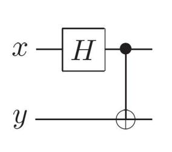
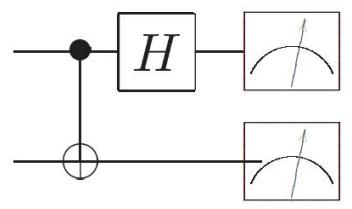
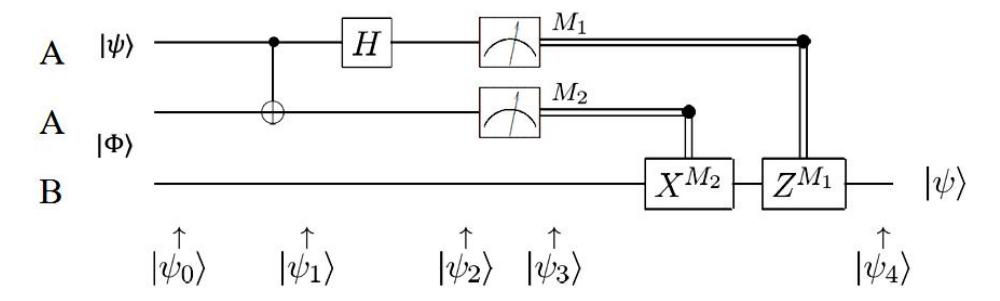
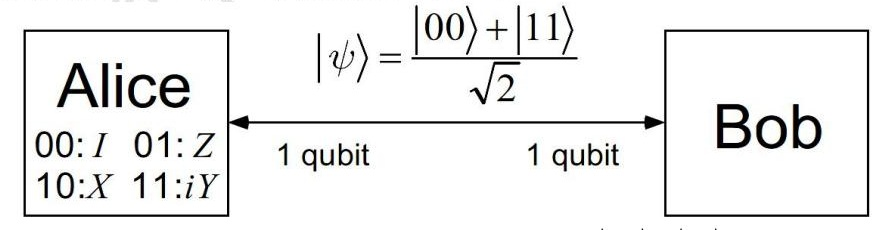

# 第六章 量子通信

## 一、量子隐形传输

- 1、量子隐形传态(Teleportation)把一个未知量子态从 Alice 端转移到 Bob 端。它依赖预先共享的纠缠资源,还需要 Alice 把测量结果通过经典信道告诉 Bob;纠缠本身不能独立传递可控信息,因此这一协议并不违反不能超光速通信的限制。
- 2、贝尔态 (Bell States): 四个典型的纠缠态。

(1) 定义: 
$|\Phi_{\pm}\rangle = \frac{|00\rangle \pm |11\rangle}{\sqrt{2}}, |\Psi_{\pm}\rangle = \frac{|01\rangle \pm |10\rangle}{\sqrt{2}}$

这四个状态是正交归一的,构成了两粒子 Hilbert 空间的一组正交归一基。

(2) 贝尔态的制备: 可以通过控制门来实现,对应关系如下表。

| In | Out |
| --- | --- |
| $\lvert00\rangle$ | $\lvert\Phi_+\rangle = (\lvert00\rangle + \lvert11\rangle)/\sqrt{2}$ |
| $\lvert01\rangle$ | $\lvert\Psi_+\rangle = (\lvert01\rangle + \lvert10\rangle)/\sqrt{2}$ |
| $\lvert10\rangle$ | $\lvert\Phi_-\rangle = (\lvert00\rangle - \lvert11\rangle)/\sqrt{2}$ |
| $\lvert11\rangle$ | $\lvert\Psi_-\rangle = (\lvert01\rangle - \lvert10\rangle)/\sqrt{2}$ |

(3)有时需要通过测量来确定两个粒子处于哪个贝尔态,称为贝尔测量(Bell Measurement)。贝尔测量的具体线路其实就是将产生贝尔态的线路进行反转,最后再对两比特进行测量:

当输入的状态为某一个贝尔态时,经过 CNOT 门和 Hadamard 门就会成为非纠缠态。对应关系恰好也是前述表格的反转:

| In | Out |
| --- | --- |
| $\lvert\Phi_+\rangle = (\lvert00\rangle + \lvert11\rangle)/\sqrt{2}$ | $\lvert00\rangle$ |
| $\lvert\Phi_-\rangle = (\lvert00\rangle - \lvert11\rangle)/\sqrt{2}$ | $\lvert10\rangle$ |
| $\lvert\Psi_+\rangle = (\lvert01\rangle + \lvert10\rangle)/\sqrt{2}$ | $\lvert01\rangle$ |
| $\lvert\Psi_-\rangle = (\lvert01\rangle - \lvert10\rangle)/\sqrt{2}$ | $\lvert11\rangle$ |

可见,贝尔测量本质上是以四个 Bell 态为基的一组投影测量。在线路实现上,常先用 CNOT 和 Hadamard 把 Bell 基变换到计算基,再测量 $\lvert00\rangle,\lvert01\rangle,\lvert10\rangle,\lvert11\rangle$ 。如果输入确实是某个 Bell 态,这个过程会确定地区分它是哪一个。

**3、量子隐形传态的线路与步骤**

Alice(A)和 Bob(B)想要实现隐形传态,那么二者之间需要分享一对纠缠粒子 $|\Phi\rangle = \frac{|00\rangle + |11\rangle}{\sqrt{2}}$ (即每人拥有其中一个粒子),同时 Alice 还有一个需要传输的量子比特 $|\psi\rangle = \alpha|0\rangle + \beta|1\rangle$ ,其中的信息就是系数 $\alpha$ 和 $\beta$ 。初始状态可以写成 $|\psi\rangle$ 和 $|\Phi\rangle$ 的直积:

$$|\psi_0\rangle = |\psi\rangle|\Phi\rangle = \frac{1}{\sqrt{2}}[\alpha|0\rangle(|00\rangle + |11\rangle) + \beta|1\rangle(|00\rangle + |11\rangle)]$$

(1) Alice 将 $|\psi\rangle$ 和 EPR 对中的一个粒子一起进行操作,让它们经过贝尔测量的 线路。作用过程如下:

$$|\psi_1\rangle = \frac{1}{\sqrt{2}} [\alpha |0\rangle (|00\rangle + |11\rangle) + \beta |1\rangle (|10\rangle + |01\rangle)]$$

$$\left|\psi_{2}\right\rangle = \frac{1}{2}\left[\alpha(\left|0\right\rangle + \left|1\right\rangle)(\left|00\right\rangle + \left|11\right\rangle) + \beta(\left|0\right\rangle - \left|1\right\rangle)(\left|10\right\rangle + \left|01\right\rangle)\right]$$

由于 Bob 只拥有一个 EPR 粒子, 所以以上态矢中更适合把前两个粒子写在 一起,以讨论 Bob 的测量结果。

$$\left|\psi_{2}\right\rangle = \frac{1}{2}\left[\left|00\right\rangle(\alpha\left|0\right\rangle + \beta\left|1\right\rangle) + \left|01\right\rangle(\alpha\left|1\right\rangle + \beta\left|0\right\rangle) + \left|10\right\rangle(\alpha\left|0\right\rangle - \beta\left|1\right\rangle) + \left|11\right\rangle(\alpha\left|1\right\rangle - \beta\left|0\right\rangle)\right]$$

从这里可以看到,Bob 的粒子已经和 $\alpha$、$\beta$ 有关,但在 Alice 公布测量结果之前,Bob 还不知道自己需要做哪一种修正,也不能单靠本地测量恢复未知态。协议中的量子资源来自共享纠缠,可用信息的传递仍依赖后面的经典通信。

(2) Alice 得到贝尔测量的结果,记为  $M_1$  和  $M_2$ 。这时前两个粒子的状态已经坍 缩,从而 Bob 的粒子也坍缩了,但未必坍缩成 $|\psi\rangle = \alpha|0\rangle + \beta|1\rangle$ ,毕竟还有其他的 可能性。因此, Alice 需要告诉 Bob 贝尔测量的结果, 从而让 Bob 确定自己粒子 所处的状态,然后通过适当的操作还原成 $|\psi\rangle$ 。具体对应如下表:

| 贝尔测量结果 $\lvert M_1M_2\rangle$ | Bob 粒子的状态 | Bob 恢复 $\lvert\psi\rangle$ 所需的操作 |
| --- | --- | --- |
| $\lvert00\rangle$ | $\alpha\lvert0\rangle + \beta\lvert1\rangle$ | $\hat{I}$ |
| $\lvert01\rangle$ | $\alpha\lvert1\rangle + \beta\lvert0\rangle$ | $\hat{X}$ |
| $\lvert10\rangle$ | $\alpha\lvert0\rangle - \beta\lvert1\rangle$ | $\hat{Z}$ |
| $\lvert11\rangle$ | $\alpha\lvert1\rangle - \beta\lvert0\rangle$ | $\hat{Z}\hat{X}$ |

不难看出,Bob 得到 $|\psi\rangle$ 所需的操作恰好是 $\hat{Z}^{M_1}\hat{X}^{M_2}$ 。因此,只要 Alice 将  $M_1$ 和  $M_2$  的值告诉 Bob,Bob 就可以得到  $|\psi\rangle$ 。"告诉"的过程是经典信息的传输, 在图中用双划线表示,相当于经典比特 M1和 M2控制的门。

## 二、密集编码(Superdense Coding)

- 1、密集编码说明共享纠缠可以改变通信资源的账本:在 Alice 和 Bob 预先共享一对纠缠粒子的前提下,Alice 只发送自己手中的一个量子比特,Bob 就能区分四种编码,从而恢复两个经典比特。
- 2、密集编码的具体步骤:仍然需要纠缠粒子。

(1) Alice 和 Bob 分享2一对纠缠粒子,处于 $|\Phi\rangle = \frac{|00\rangle + |11\rangle}{\sqrt{2}}$ 。Alice 根据图中的 法则给 Bob 发送信息,也就是把两比特密码 00、01、10、11 对应成四个不同的 算符,通过对纠缠态的改变来传输信息。容易验证,若密码为 k1k2,则对应的算 符就是 $\hat{Z}^{k_2}\hat{X}^{k_1}$ 。

(2) Alice 将  $\hat{Z}^{k_2}\hat{X}^{k_1}$  作用到她的粒子上,然后再把这个粒子发送给 Bob。此时两个粒子都在 Bob 这里,因此他可以直接进行贝尔测量,判断两粒子状态,从而得到 $k_1k_2$ 的值。这里的“分享”指 Alice 和 Bob 在编码前各持有纠缠对中的一个粒子。

| 密码 | 对应算符 | 算符作用后的状态 | Bob 贝尔测量结果 |
| --- | --- | --- | --- |
| 00 | $\hat{I}$ | $\lvert\Phi_+\rangle = (\lvert00\rangle + \lvert11\rangle)/\sqrt{2}$ | $\lvert00\rangle$ |
| 01 | $\hat{Z}$ | $\lvert\Phi_-\rangle = (\lvert00\rangle - \lvert11\rangle)/\sqrt{2}$ | $\lvert10\rangle$ |
| 10 | $\hat{X}$ | $\lvert\Psi_+\rangle = (\lvert01\rangle + \lvert10\rangle)/\sqrt{2}$ | $\lvert01\rangle$ |
| 11 | $\hat{Z}\hat{X} = i\hat{Y}$ | $\lvert\Psi_-\rangle = (\lvert01\rangle - \lvert10\rangle)/\sqrt{2}$ | $\lvert11\rangle$ |

Alice 编码只对自己手中的一个粒子进行,但这个局域操作会把两粒子的共享态映射到四个两两正交的 Bell 态之一。Bob 收到 Alice 的粒子后拥有整对粒子,就可以通过 Bell 测量区分这四种正交态。密集编码的根本原因不是“一个粒子本身携带了两个比特”,而是预先共享的纠缠加上后来传送的一个量子比特共同构成了可区分的两粒子状态。

## 三、经典密码学(背景介绍,与量子密码对比)
- 1、密码的本质就是将原始的信息通过某种法则(协议, Protocol)对应成看起来 混乱的代码,从而对原始信息起到保护的作用。为此,对应法则一般是比较复杂、 不容易破译的。
- 2、凯撒密码(Caeser Cypher):对一串代码进行轮换处理。

$$
i \rightarrow i + j \pmod{k},
\qquad
i = 0,1,2,\ldots,k-1.
$$

例如,对于 26 个字母,可以规定  $A \rightarrow B$ ,  $B \rightarrow C$ ,...,  $Z \rightarrow A$ , 本质上就是 将它们进行重新排列。这种密码在古时难以破译, 但现在非常容易。

- 3、Vernam 密码: 随机密钥。
- (1) 基本想法:对于一个二进制序列  $p_i$  (由 0 和 1 组成),可以随机地生成相 同长度的一串二进制序列  $k_i$ ,称为密钥(Secret Key);密码为  $c_i = p_i \oplus k_i$ 。在解 密时, 只要知道  $k_i$  的值, 则有  $p_i = c_i \oplus k_i$ 。
- (2) 好处:如果密钥真正随机、长度不短于明文、只使用一次、并且只被通信双方知道,一次一密可以达到信息论安全。
- (3) 坏处: 一套密钥只能使用一次(One-time Pad),如果多次使用,就可能通过数据的统计关联来破译密码。并且,密钥必须事先安全共享,这正是量子密钥分发试图解决的问题。注意,一次一密本身不会自动发现窃听;窃听检测属于密钥分发协议的任务。
- 4、公钥系统:加密用的钥是公开的,但每个人都有一个的私钥用来解密,并且 私钥只有自己一个人知道。
- (1) 与密钥系统的比较:密钥必须事先秘密交换,比较麻烦,而公钥已经公开, 不必秘密交换;同一套密钥既用于加密也用于解密,但公钥系统加密和解密所用 的钥不同;密钥一般只用一次,公钥可以多次使用。
- (2) 陷门函数 (Trap-door Function): f本身易求,但没有陷门信息时反函数  $f^{-1}$ 不易求;有陷门信息时反而容易求。在公钥系统中,f本身 可用于加密(公钥),陷门信息可用于解密(私钥)。这里不要简单等同于 NP 完全问题;密码学依赖的是具体问题在已知算法下的计算困难性假设。
- (3) RSA 编码:利用大整数分解在经典计算中没有已知高效通用算法这一事实来设计协议。整数分解属于 NP,但并不知道它是 NP 完全问题。
- ①Bob 随机选取较大的质数 p 和 q,计算 N = pq。
- ②Bob 随机选取整数 d, 满足 d 和 (p-1)(q-1) 互质。
- ③Bob 计算 d 模 (p-1)(q-1) 的倒数 e,即  $de = 1 \mod(p-1)(q-1)$ 。

- ④Bob 将(e, N)公开,作为公钥,而 d 则是保密的(私钥)。
- ⑤Alice 有一段代码  $m_i$  目  $m_i < N$ ,利用如下的法则加密:

$$m_i' = m_i^e \mod N$$

⑥Bob 解密的方法是:

$$m_i = m_i^{\prime d} \mod N$$

(数学上可以证明, 若 $a = 1 \mod(p-1)(q-1)$ , 则 $m_i^a = m_i \mod N$ )

由于质数p 和q 比较大,所以在已知N 的情况下寻找p 和q 的过程会非常困难,从而难以确定d 的值。也就是说,质数分解问题的困难性保证了RSA 的安全性,但是,随着更高效算法的问世(如量子算法),RSA 的安全性也在降低。

## 四、量子密码学

1、不可克隆定理:不可能实现任意状态的复制。

该定理是指"不是所有状态都可复制",不是指"任何状态都不可复制"。 具体而言,如果存在可复制的矢量 $|0\rangle$ 和 $|1\rangle$ ,那么它们的叠加态将不可复制。

假设幺正算符 $\hat{U}$ 可以实现 $|0\rangle$ 和 $|1\rangle$ 的复制:

$$\hat{U}|0\rangle|\psi\rangle = |0\rangle|0\rangle, \quad \hat{U}|1\rangle|\psi\rangle = |1\rangle|1\rangle$$

那么它将无法复制叠加态:

$$\hat{U}(\alpha|0\rangle + \beta|1\rangle)|\psi\rangle = \alpha|0\rangle|0\rangle + \beta|1\rangle|1\rangle \neq (\alpha|0\rangle + \beta|1\rangle)(\alpha|0\rangle + \beta|1\rangle)$$

究其原因,在于复制操作是非线性的。它的效果是让两个比特之间产生纠缠,而不是产生两个相同且可以独立使用的比特,因此不具有可加性。实际操作中,对某个量子门或许可以找到少数可复制的态,但绝不可能将复制操作应用在一般的态上。

值得注意的是,不可克隆未必是坏事。窃听者不能在完全不扰动未知量子态的情况下保留一份完美副本;若她试图测量或截获重发,通常会在不相容基的统计中引入可检测误差。这正是量子密钥分发能够发现窃听的重要原因。

2、BB84 协议

- (1) 字母表: 量子态所用的基。如果传输的比特是 $\hat{Z}$ 本征态 $|0\rangle$ 或 $|1\rangle$ ,则称为 z 字母表; 如果传输的比特是 $\hat{X}$ 本征态 $|0\rangle_x = \frac{|0\rangle + |1\rangle}{\sqrt{2}}$ 或 $|1\rangle_x = \frac{|0\rangle - |1\rangle}{\sqrt{2}}$ ,则称为 x 字母表。
- (2) BB84 协议的基本内容:利用不确定关系建立两套字母表。
- ①Alice 产生一段需要传送的代码,由 0 和 1 组成。Alice 将这些 0 和 1 制备成量 子态 $|0\rangle$ 、 $|1\rangle$ 或 $|0\rangle_x$ 、 $|1\rangle_x$ ,但每个比特使用的字母表是完全随机的,各有 50%的概率选择 z 字母表或 x 字母表。她将这些比特传给 Bob。
- ②Bob 对这些比特进行测量,但测量的轴也是随机的,各有 50%的概率选择  $\hat{Z}$  或  $\hat{X}$  进行测量。显然,对于某个比特而言,如果 Bob 选择的轴和 Alice 选择的字母 表不同,那么 Bob 的测量结果会有 1/2 的出错概率。
- ③Alice 和 Bob 通过经典的公开渠道进行联络,核对每个比特使用的字母表。他们将字母表不一致的比特全部删除,留下一致的,被称为生钥(Raw Key)。
- ④Alice 和 Bob 通过经典公开渠道对一部分生钥进行比较,若出错概率 *R* 较小,则进行信息调整 (Information Reconciliation )和保密增强 (Privacy Amplification )。
- (3)信息调整:由于环境噪声或窃听者的破坏,两人的生钥可能也会有不同,因此要对生钥的信息进行校对,具体操作是检查宇称(Parity)。两人将生钥分

为若干段,每段长度为l,并且 $Rl \ll 1$ ;将每一段的最后一个比特略去(防止窃听者从公开校验信息中获得过多有效比特信息),然后将其他比特全部用 XOR 连接,称为宇称:  $P = b_1 \oplus b_2 \oplus ... \oplus b_{l-1}$ 。如果两人得到的宇称不同,说明里面有奇数个错误,可以利用二分法来检查——将这一段比特一分为二,对每一半都重复前面的操作,也就是略去最后一个比特并求异或。尽管这种二分法不能保证 100% 的校对成功率,但进行多轮信息协调后可以把双方密钥差异压低。

- (4) 保密增强: 进一步减少窃听者关于最终密钥的信息。在进行信息调整之后,可以重新把生钥分成长度为 $l'$ 的段,然后取各段的宇称(去尾→异或)作为最终的密钥。更一般地,实际协议会使用通用哈希函数把较长的生钥压缩成较短的安全密钥,使窃听者的可用信息变得可以忽略。
- 3、E91 协议:与 BB84 类似,但涉及量子纠缠。Alice与 Bob 分享一对纠缠粒子, 处于贝尔态 $|\Psi_{-}\rangle = \frac{|01\rangle - |10\rangle}{\sqrt{2}}$ 。两人通过一部分测量结果生成生钥,再用另一部分测量结果检验 Bell 不等式是否被充分违反,从而判断信道是否存在过强噪声或窃听。
- (1) 回顾第二章: 若纠缠粒子处在 $|\Psi_{-}\rangle$ 态,则沿 $\vec{a}$ 和 $\vec{b}$ 两个方向分别测量时,关联函数为:

$$E_{ij} = \operatorname{tr}[\hat{\rho}(\vec{a}_i \cdot \hat{\vec{\sigma}} \otimes \vec{b}_j \cdot \hat{\vec{\sigma}})] = -\vec{a}_i \cdot \vec{b}_j$$

$$E_{00} + E_{01} + E_{10} - E_{11} \le 2\sqrt{2}$$

量子力学给出的不等式:  $E_{00} + E_{01} + E_{10} - E_{11} \le 2\sqrt{2}$  违反了经典的 CHSH 不等式(右边为 2)。

- (2) E91 协议的基本内容
- ①Alice 与 Bob 分享贝尔态 $|\Psi_{-}\rangle = \frac{|01\rangle - |10\rangle}{\sqrt{2}}$ 。
- ②Alice 随机选择三根轴  $\vec{a}_1$ 、 $\vec{a}_2$ 、 $\vec{a}_3$ 测量她的粒子,Bob 随机选择  $\vec{b}_1$ 、 $\vec{b}_2$ 、 $\vec{b}_3$ 测 量他的粒子。
- ③两人进行公开联络,给出各自在每次测量中使用的轴。某些测量设置用于生成密钥,另一些设置公开测量结果,用来估计 CHSH 量。
- ④如果 CHSH 量达到足够高的违反程度,例如接近理想量子上界  $2\sqrt{2}$ ,则说明共享态仍保留强量子关联,窃听或噪声没有严重破坏信道。在这种情况下,对用于成钥的相同或约定相关测量轴,二人的结果应当高度相关或反相关。实际协议还需要误码率估计、信息协调和保密增强。
- ⑤两人讲行信息调整和保密增强。
