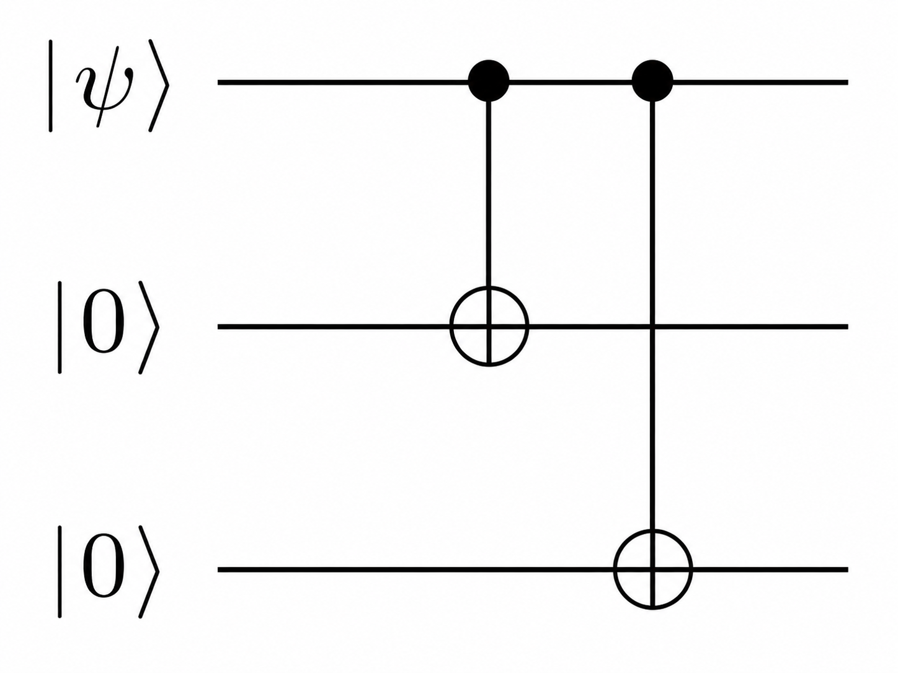
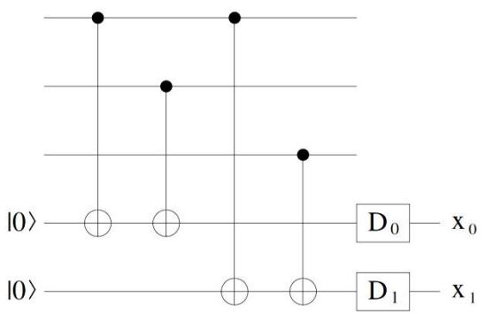
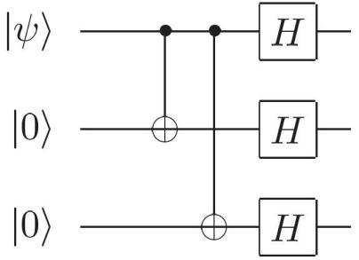
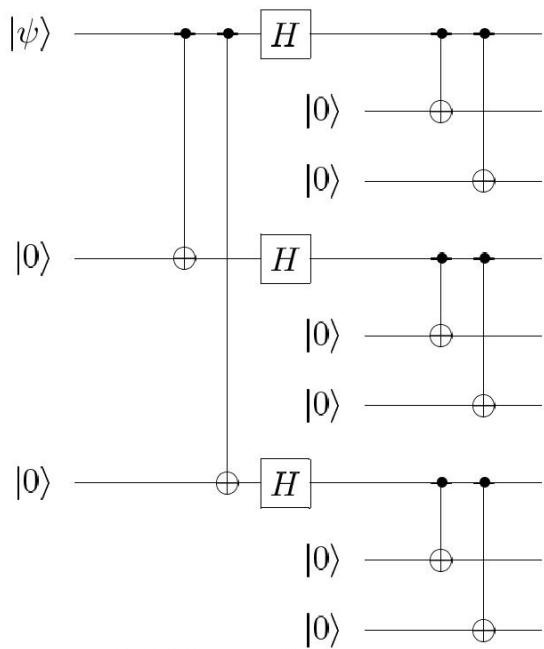

# 第八章 量子纠错

## 一、关于纠错:背景介绍
- 1、第七章讨论了噪音对系统的影响,也就是随机地让系统产生比特、相位上的错误,或者是耗散掉系统的能量与信息。为了更好地保存信息,显然需要有相应的机制对这些错误进行纠正。
- 2、经典纠错:经典比特一定可以克隆,所以纠错相对简单。主要步骤如下。
- (1) 复制:将一个比特复制若干份,则它们同时出错的概率会很小。例如将每个比特复制成三份, $0\rightarrow000$ , $1\rightarrow111$ 。
- (2) 多数投票法(Majority Voting):如果有一个拷贝出错,那么剩余还有两个正确的拷贝,占大多数,因此只要将错误的拷贝纠正为多数的取值即可。这一算法不能处理两个或三个拷贝出错的情况,因为这些情况下错误占大多数,反而会把正确的拷贝改为错误的取值:但是这样的概率已经很小,可认为是不重要的。

设每一个拷贝出错的几率为p,则多数投票法失效等价于有两个或三个拷贝同时出错,相应的概率为

$$p_e = 3p^2(1-p) + p^3 = 3p^2 - 2p^3$$

容易证明,只要  $p < \frac{1}{2}$  (一般可以实现) ,那么  $p_e < p$  ,说明此种纠正算法是可以提高正确率的。

- 3、量子纠错:存在一些难题。
- (1) 不能实现任意量子态的克隆, 所以复制操作难以进行。
- (2) 量子测量对量子系统有影响,可能会直接销毁信息,使之无法使用。
- (3) 实际噪声可以是连续的小旋转、退相干或耗散,并不只是离散的 bit flip / phase flip。量子纠错需要解释为什么连续错误也能用离散综合征来处理。
## 二、三比特翻转码(Three-qubit Bit-flip Code):对比特翻转的纠错
- 1、编码:虽然不能实现任意量子态的克隆,但可以用控制门把一个量子比特编码到更大的 Hilbert 空间中。如下图,准备两个辅助比特,一开始均为 0:

设 $|\psi\rangle=a|0\rangle+b|1\rangle$ ,经过两个 CNOT 之后三个比特的状态为 $a|000\rangle+b|111\rangle$ 。这不是把未知态克隆成三份 $|\psi\rangle|\psi\rangle|\psi\rangle$ ,而是把逻辑信息编码进两个正交码字张成的子空间。将这样得到的两个基矢称为"逻辑 0"和"逻辑 1":

$$|0\rangle_{L} = |000\rangle, \qquad |1\rangle_{L} = |111\rangle$$

- 2、错误检查(症状测量, Syndrome Measurement): 通过测量寻找错误。
- (1) 症状测量所使用的算符:仍然只能探测单个比特出现的错误。以及,这里只考虑比特是否有翻转,不考虑其他形式的错误,如相位错误等。

$$\hat{P}_0 = |000\rangle\langle000| + |111\rangle\langle111|$$

$$\hat{P}_1 = |100\rangle\langle100| + |011\rangle\langle011|$$

$$\hat{P}_2 = |010\rangle\langle010| + |101\rangle\langle101|$$

$$\hat{P}_3 = |001\rangle\langle001| + |110\rangle\langle110|$$

不难看出,算符 $\hat{P}_0$ 对应不出错的情况,而 $\hat{P}_1$ 、 $\hat{P}_2$ 、 $\hat{P}_3$ 则分别对应第一个、第二个、第三个比特出错的情况(这里的出错是指翻转)。

- (2) 一般测量会对比特造成影响,但这里的投影只区分“错误属于哪个症状子空间”,不读取逻辑振幅 a、b 本身。例如,可以验证  $\hat{P}_0(a|000\rangle+b|111\rangle)=a|000\rangle+b|111\rangle$ 、  $\hat{P}_1(a|100\rangle+b|011\rangle)=a|100\rangle+b|011\rangle$ 等关系。它会告诉我们错误类型,却不会把逻辑态坍缩成单独的 $|000\rangle$ 或 $|111\rangle$ ,因此纠错仍能保留被编码的信息。
- 3、信息纠正:根据症状测量的结果对比特进行修改。因为测量没有销毁比特的信息,所以这样做是可行的,也说明纠错是有意义的(准备纠错的比特不应该被销毁)。

| 测量结果 (哪个算符有响应) | 错误 | 纠正措施 |
| --- | --- | --- |
| $\hat{P}_0 = \lvert000\rangle\langle000\rvert + \lvert111\rangle\langle111\rvert$ | 无 | 无 |
| $\hat{P}_1 = \lvert100\rangle\langle100\rvert + \lvert011\rangle\langle011\rvert$ | 第一比特翻转 | $\hat{X}_1$ |
| $\hat{P}_2 = \lvert010\rangle\langle010\rvert + \lvert101\rangle\langle101\rvert$ | 第二比特翻转 | $\hat{X}_2$ |
| $\hat{P}_3 = \lvert001\rangle\langle001\rvert + \lvert110\rangle\langle110\rvert$ | 第三比特翻转 | $\hat{X}_3$ |

其中 $\hat{X}_i$ 表示对第i个比特执行 $\hat{X}$ 。

- 4、症状测量的意义:可以认为是测量 Z 型稳定器。
- (1) 假设对三个比特测量物理量 $\hat{Z}_1\hat{Z}_2$ 和 $\hat{Z}_2\hat{Z}_3$ 。可能的情况如下:

| 测量结果                          | 意义                         | 对应的单比特错误 |
|-------------------------------|----------------------------|----------|
| $Z_1 Z_2 = +1,  Z_2 Z_3 = +1$ | 三个比特都相同                    | 无        |
| $Z_1 Z_2 = -1,  Z_2 Z_3 = +1$ | 比特1和2不同 比特2和3相同         | 第一比特翻转   |
| $Z_1 Z_2 = -1,  Z_2 Z_3 = -1$ | 比特1和2不同 比特2和3不同         | 第二比特翻转   |
| $Z_1 Z_2 = +1,  Z_2 Z_3 = -1$ | 比特 1 和 2 相同 比特 2 和 3 不同 | 第三比特翻转   |

因此对 $\hat{Z}_1\hat{Z}_2$ 和 $\hat{Z}_2\hat{Z}_3$ 的测量可以判断比特中的错误。类似地,也可测量 $\hat{Z}_1\hat{Z}_2$ 和 $\hat{Z}_1\hat{Z}_3$ ,或者测量 $\hat{Z}_1\hat{Z}_3$ 和 $\hat{Z}_2\hat{Z}_3$ ,或者测量 $\hat{Z}_1\hat{Z}_3$ 和 $\hat{Z}_2\hat{Z}_3$ ,效果一致。症状测量的线路就是基于此法:

其中最上面三条线路就是原始的三比特,它们通过 CNOT 门把相邻比特的 Z 型奇偶信息记录在最下面的两个辅助比特上。

- (2)之所以说这样的算符可以实现前面的症状测量,还有一个重要原因,就是稳定器测量不会读取逻辑态中概率幅 *a* 和 *b* 的具体信息。编码态在同一症状子空间内拥有相同的稳定器本征值,因此测量得到症状后仍保留逻辑叠加,随后才可以施加纠正操作。
- (3)从代数上看,可以证明不同错误子空间是 $\hat{Z}_i\hat{Z}_j$ 的不同本征子空间,即 $\hat{Z}_i\hat{Z}_j\hat{P}_k = \pm\hat{P}_k$ 。因此,测量稳定器 $\hat{Z}_1\hat{Z}_2$ 和 $\hat{Z}_2\hat{Z}_3$ 可以区分错误症状,但不会区分逻辑态内部的系数 $a,b$ 。这些用于定义码空间和症状子空间的可观测量称为稳定器(Stabilizer)。
- 5、三比特翻转码与经典纠错一样,只能纠正单比特的错误。如果出现两比特或三比特同时错误,将无法被纠正,这样的概率也和经典纠错一致:

$$p_e = 3p^2(1-p) + p^3 = 3p^2 - 2p^3$$

同样, $p < \frac{1}{2}$ 时 $p_e < p$ ,此纠正算法可以提高正确率。

- 6、通过对保真度的计算,也可以看出纠错算法的作用。
- (1) 若不进行纠错,则系统会经历 bit flip:

$$\hat{\rho} = (1 - p) |\psi\rangle\langle\psi| + p\hat{X} |\psi\rangle\langle\psi| \hat{X}$$

系统相对于原始状态的保真度为

$$F = \langle \psi | \hat{\rho} | \psi \rangle = 1 - p + p |\langle \psi | \hat{X} | \psi \rangle|^2 \ge 1 - p$$

(2) 如果进行纠错,那么出错概率为 $p_e$ 。同理,有

$$F' = \langle \psi | \hat{\rho}' | \psi \rangle \ge 1 - p_e$$

 $p < \frac{1}{2}$ 时  $p_e < p$ ,保真度下限提高,说明此纠正算法可以提高正确率。

7、相位翻转码:如果用 Hadamard 门更换至x字母表,相位信息也需要编码到多个物理比特中保护起来。

由于经过 CNOT 之后三个比特已经完全一致,所以经过 Hadamard 门后它们还是保持一致,只不过变成了 x 字母表:

$$\hat{H}^{\otimes 3}(a|000\rangle + b|111\rangle) = a|000\rangle_x + b|111\rangle_x$$

相应的症状测量只要更换为x字母表即可,可通过测量 $\hat{X}_1\hat{X}_2$ 和 $\hat{X}_2\hat{X}_3$ (或相应的轮换,和z字母表同理)来实现。在完成这些步骤之后,可通过 $\hat{Z}$ 进行纠错,因为x字母表下的非门就是 $\hat{Z}$ 。这种处理方法可以用来监测相位翻转,如果某个比特从 $|0\rangle_x$ 翻转至 $|1\rangle_x$ (或相反),则说明有相位错误。

## 三、Shor码:对任意单比特错误的纠正
- 1、为了显示更多可能的错误,需要更多的辅助比特。Shor 码的基本思想就是用九个比特来储存单比特的信息,如下图。

其基本思想是: 先按三比特码的思想将单比特转化成三比特逻辑 0 和逻辑 1,然后通过 Hadamard 门转换为 x 字母表,再把每个块进一步编码成三比特重复结构。设初始状态 $|\psi\rangle = a|0\rangle + b|1\rangle$ ,则演化过程如下:

$$|\psi\rangle|00\rangle\Rightarrow a|000\rangle+b|111\rangle\Rightarrow a|000\rangle_x+b|111\rangle_x\Rightarrow a|0\rangle_{\rm L}+b|1\rangle_{\rm L}$$

其中,九比特逻辑  $0$  和逻辑  $1$  的定义为

$$|0\rangle_{L} = \frac{(|000\rangle + |111\rangle)(|000\rangle + |111\rangle)(|000\rangle + |111\rangle)}{2\sqrt{2}}$$

$$|1\rangle_{L} = \frac{(|000\rangle - |111\rangle)(|000\rangle - |111\rangle)(|000\rangle - |111\rangle)}{2\sqrt{2}}$$

- 2、Shor 码中有 Hadamard 门(即字母表的变换),因此可以反映相位信息;同时又有比特翻转码的操作,因此也可以反映振幅信息。如果系统出现 bit flip, $|0\rangle_L$ 、 $|1\rangle_L$ 中的数码 0 或 1 会有翻转;如果系统出现 phase flip,那么 $|0\rangle_L$ 、 $|1\rangle_L$ 中的加减号会有翻转;如果出现 bit-phase flip,那么以上两者都有。因此,Shor 码可以综合考察更多类型的错误。
- 3、Shor 码的症状测量:不太适合用投影算符表示,而更适合用稳定器,也就是对应的可观测量来描述。
- (1) 对于 bit flip,与三比特情况一致,需要比较各个拷贝的 z 自旋。按照从上至下的顺序,对应的可观测量是:  $\hat{Z}_1\hat{Z}_2$ ,  $\hat{Z}_2\hat{Z}_3$ ,  $\hat{Z}_4\hat{Z}_5$ ,  $\hat{Z}_5\hat{Z}_6$ ,  $\hat{Z}_7\hat{Z}_8$ ,  $\hat{Z}_8\hat{Z}_9$ 。
  - (2) 对于 phase flip, 需要考察 x 自旋。具体的方法是比较某三个比特和另外三

个比特的x自旋:  $\hat{X}_1\hat{X}_2\hat{X}_3\hat{X}_4\hat{X}_5\hat{X}_6$ ,  $\hat{X}_4\hat{X}_5\hat{X}_6\hat{X}_7\hat{X}_8\hat{X}_9$ 。例如,可以证明:

$$\hat{X}_1 \hat{X}_2 \hat{X}_3 \hat{X}_4 \hat{X}_5 \hat{X}_6 |0\rangle_{L} = |0\rangle_{L}, \ \hat{X}_1 \hat{X}_2 \hat{X}_3 \hat{X}_4 \hat{X}_5 \hat{X}_6 |1\rangle_{L} = |1\rangle_{L}$$

于是,当 $|0\rangle_L$ 、 $|1\rangle_L$ 之间的相位发生翻转时,对 $a|0\rangle_L$ + $b|1\rangle_L$ 的测量结果就会发生改变,从而探测到 phase flip。

- 4、纠错方式: bit flip 用  $\hat{X}$  纠错,phase flip 用  $\hat{Z}$  纠错,bit-phase flip 用  $\hat{Y}$  纠错。 ( $\hat{Z}$ 与 $\hat{X}$ 的乘积其实就正比于 $\hat{Y}$ )
- 5、Shor 码提供了一种纠正一般错误的方法。在一般情况下,环境对系统的量子操作可能是 bit flip、phase flip 和 bit-phase flip 的叠加,即

$$\hat{E}_{k} = e_{k0}\hat{I} + e_{kx}\hat{X} + e_{ky}\hat{Y} + e_{kz}\hat{Z}$$

- 对 Shor 码而言,任意单比特错误都可以展开到 $\hat{I},\hat{X},\hat{Y},\hat{Z}$ 的线性组合中。症状测量会把错误投影到可纠正的症状子空间,随后施加对应恢复操作。因此,量子纠错并不是连续地“测出错误幅度”,而是利用线性性和综合征测量把连续错误归约为离散的可纠正错误类型。
- (1) 不可克隆定理并未被绕过: 编码过程不是复制未知态,而是把一个逻辑量子比特嵌入多个物理量子比特组成的码空间。
- (2) 一般测量可能会销毁比特的信息,但只要让测量不涉及组合系数 a、b 的具体取值,而只读取错误症状,就能保留原比特的信息。
- (3) 错误可以连续变化,但在单比特错误模型下,Pauli 基展开与症状测量足以给出恢复操作。这是量子纠错成立的核心机制,不是说所有实际噪声都已被这个简单码完全解决。

## 四、从量子纠错到容错通用计算

量子纠错的目标不是只把一个静态量子态保存得更久,而是要在噪声存在时仍然能够可靠地执行计算。这就引出容错量子计算(Fault-tolerant Quantum Computation):每一步逻辑门、测量和纠错都要设计成不会把少量物理错误扩散成不可纠正的大错误。

在稳定子码和表面码等体系中,很多 Clifford 操作可以比较自然地以容错方式实现。原因是 Clifford 门会把 Pauli 错误映射成 Pauli 错误,综合征测量仍然能够追踪错误类型。因此,Clifford 门与稳定子纠错之间配合得很好。

但 Clifford 门本身不够通用。只由 Clifford 门、Pauli 制备和 Pauli 测量组成的线路可以被经典计算机高效模拟,所以还需要非 Clifford 资源。最常见的是 T 门:

$$
\hat{T}=
\begin{pmatrix}
1&0\\
0&e^{i\pi/4}
\end{pmatrix}.
$$

在许多容错架构中,直接高保真地实现逻辑 T 门很困难,于是会改用魔法态注入。核心思想是先准备资源态

$$
|A\rangle=\frac{|0\rangle+e^{i\pi/4}|1\rangle}{\sqrt{2}},
$$

再借助 Clifford 门和测量,把这个非 Clifford 资源注入到数据线路中,间接实现 T 门效果。这里的难点转移为:如何以足够低的逻辑错误率制备高质量魔法态。

传统方案是魔法态蒸馏:用许多有噪声的魔法态和纠错检测电路,筛选出更少但更高保真的魔法态。近年的一些方案还研究魔法态培育(cultivation):在小型纠错码中逐步制备逻辑 T 态,再扩展到更大的码中。它们都可以理解为同一个目标下的不同工程路线:为容错通用量子计算提供可靠的非 Clifford 资源。
