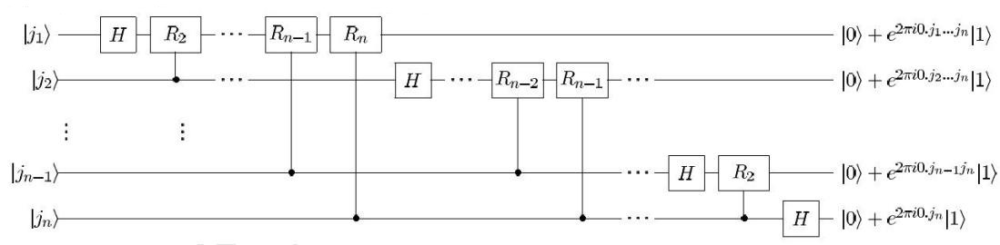
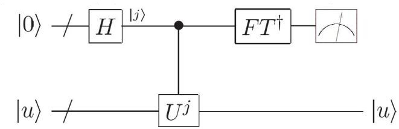
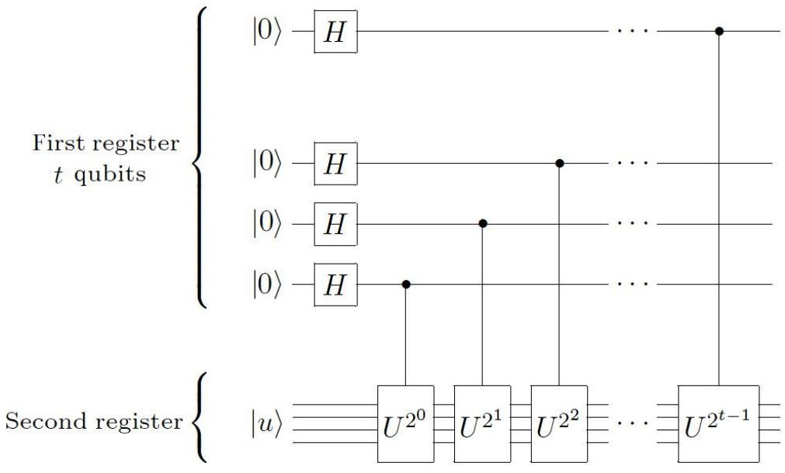
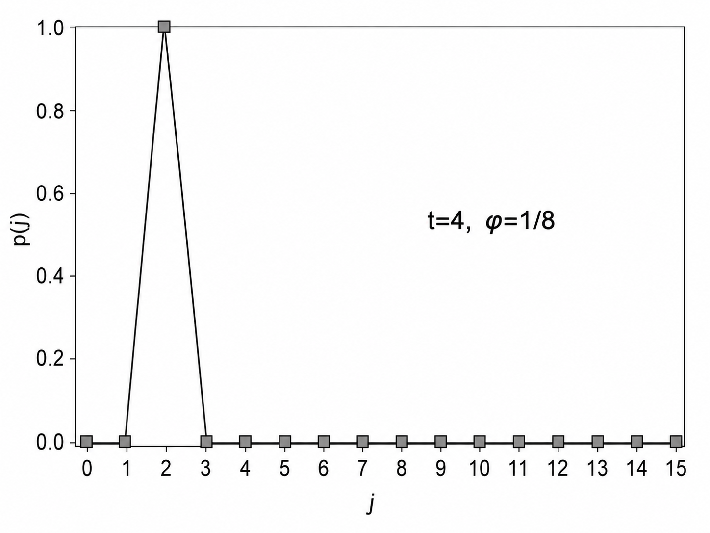
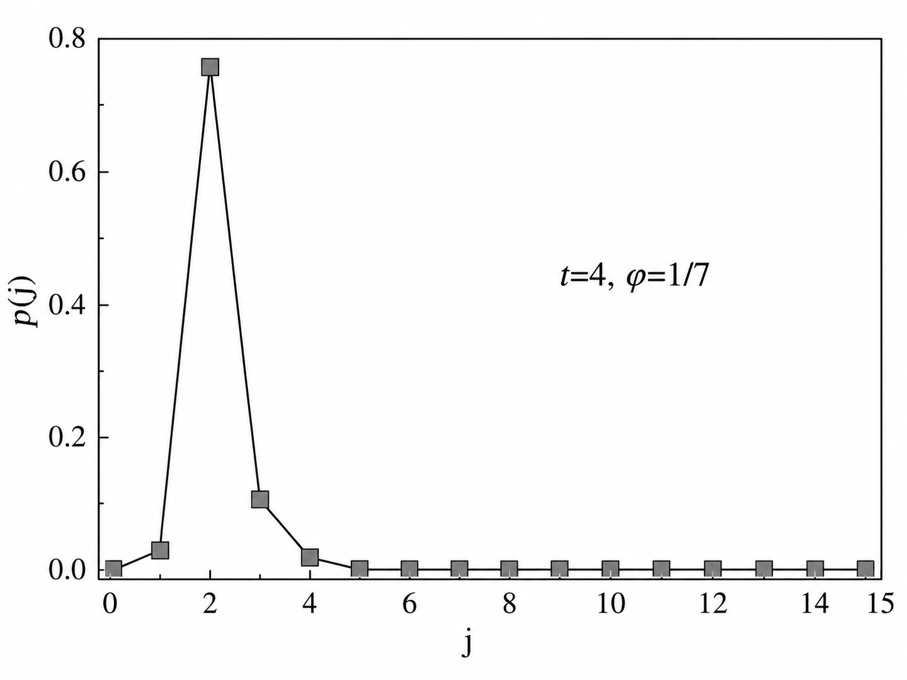
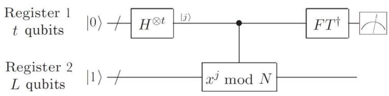

# 第四章 量子 Fourier 变换

## 一、量子 Fourier 变换及其线路

1、数学上较为基本的是对一个连续函数做 Fourier 变换。但是,实际计算机能处理的函数只可能定义在有限分立点上,因此需要变为离散 Fourier 变换(Discrete Fourier Transform,DFT)。其具体形式为:

$$\{x_0,...,x_{N-1}\} \Longrightarrow \{y_0,...,y_{N-1}\}$$

$$F(x_k) = y_k = \frac{1}{\sqrt{N}} \sum_{i} x_i \exp\left(\frac{2ijk\pi}{N}\right), \quad F^{-1}(y_i) = x_i = \frac{1}{\sqrt{N}} \sum_{k} y_k \exp\left(-\frac{2ijk\pi}{N}\right)$$

2、量子 Fourier 变换(QFT)就是从 DFT 发展而来。如果将 DFT 中的  $x_i$  和  $y_k$  都 看成态矢,则 QFT 可以写成态叠加的形式:

$$F(|k\rangle) = \frac{1}{\sqrt{N}} \sum_{j} \exp\left(\frac{2ijk\pi}{N}\right) |j\rangle$$

$$F^{-1}(|j\rangle) = \frac{1}{\sqrt{N}} \sum_{k} \exp\left(-\frac{2ijk\pi}{N}\right) |k\rangle$$

$$F\sum_{k} x_{k} |k\rangle = \frac{1}{\sqrt{N}} \sum_{jk} x_{k} \exp\left(\frac{2ijk\pi}{N}\right) |j\rangle = \sum_{j} y_{j} |j\rangle$$

**3、乘积表示**

如果  $N=2^n$ ,则可以用 n 位二进制数表示每个态:

$$j = (j_1 j_2 ... j_n) = 2^{n-1} j_1 + 2^{n-2} j_2 + ... + 2^0 j_n$$

其中  $j_1, j_2, ..., j_n = 0,1$ 。于是每个二进制位都可以对应于一个量子比特:

$$\sqrt{N} |j\rangle = 2^{n/2} |j_1 ... j_n\rangle = (|0\rangle + e^{2\pi i 0.j_n} |1\rangle)(|0\rangle + e^{2\pi i 0.j_{n-1} j_n} |1\rangle)...(|0\rangle + e^{2\pi i 0.j_{1} j_2 ... j_n} |1\rangle)$$

其中二进制小数的定义为

$$0.j_l j_{l+1}...j_m = \frac{j_l}{2} + \frac{j_{l+1}}{2^2} + ... + \frac{j_m}{2^{m-l+1}}$$

于是态矢 $|j\rangle$ 可以用n个二进制量子比特来表示、处理。

**4、QFT 线路**

其中

$$
\hat{R}_k =
\begin{pmatrix}
1 & 0 \\
0 & e^{2i\pi/2^k}
\end{pmatrix}.
$$

$n$ 个比特需要的逻辑门数量为 $\frac{n(n+1)}{2} = \Theta(n^2)$ 。此外,

可以看到上述线路最后输出的比特是顺序颠倒的,因此还需要用 SWAP 门将它们调整成正确的顺序(图中略去)。

★逆变换: 数学上是对整个算符进行厄米共轭,物理上则是将上图所有量子门取 厄米共轭,再将顺序全部颠倒。

- 5、QFT 的理论非常完善,但需要注意它和经典 DFT 的用途不同。
  - (1) QFT 可以用 $O(n^2)$ 个基本量子门作用在 $n$ 个量子比特上,本身是高效的。
  - (2) 但是测量只能给出一个输出样本,不能一次性读出所有几率幅,所以 QFT 不能直接当作“快速输出整张 DFT 表”的算法。
  - (3) QFT 的优势通常体现在相位估计、周期寻找、求阶等任务中,也就是后续步骤只需要提取某些全局相位或周期信息。
  - (4) 因此,不要简单地说“QFT 加速了傅里叶变换”;更准确地说,它在合适的问题结构下让某些量子算法可以高效提取周期信息。

## 二、量子相位估计

1、相位估计的问题描述

数学理论指出,任意幺正变换 $\hat{U}$ 的本征值均是模为1的复数,可以写成

$$\hat{U}|u\rangle = u|u\rangle, \quad u = \exp(2\pi i\varphi)$$

通过 QFT,可以在一定精度下估计相位 $\varphi$ 的值。这一问题看起来没有实际意义,但其实有很多计算问题都可以归结到相位估计。

2、量子相位估计的实现:利用黑盒子(Black box, Oracle)。

(图中斜杠表明有不止一个比特, 受控 Ui表示黑盒子)

- (1) 基本的线路如以上两图。有如下组成部分:
- ①下面部分(第二寄存器)是制备好的 $\hat{U}$ 本征态 $|u\rangle$ ,它在线路中将会依次经过各个受控的 $\hat{U}^{2^j}$ 门,其中 $j=0,1,\dots,t-1$ 。这里不讨论如何实现受控 $\hat{U}^{2^j}$ 门,只是将它们当成黑盒子,假设已经可以实现。
- ②上面部分(第一寄存器)是 t 个辅助比特,它们将用于控制下方的 $\hat{U}^{2^j}$ 门。这一过程会使得相位 $\varphi$ 被附着在这些比特上,最终通过对它们的测量即可得出 $\varphi$ 的估计值。
- (2)关于黑盒子的作用原理,可以先看第一寄存器的最下面一个比特,考察它与第二寄存器的变化过程。
- ①经过 Hadamard 门:  $|0\rangle|u\rangle \rightarrow \frac{1}{\sqrt{2}}(|0\rangle+|1\rangle)|u\rangle$ 。
- ②经过受控 $\hat{U}^{2^0} = \hat{U}$ 门:  $\frac{1}{\sqrt{2}}(|0\rangle|u\rangle + |1\rangle|u\rangle) \Rightarrow \frac{1}{\sqrt{2}}(|0\rangle|u\rangle + e^{2\pi i 2^0 \varphi}|1\rangle|u\rangle)$ 。

这里的相位 $e^{2\pi i 2^0 \varphi}$ 原本是在 $|u\rangle$ 上产生的,但由于变换后的状态仍是直积态,这个相位在直积中只能给第一寄存器: $\frac{1}{\sqrt{2}}(|0\rangle + e^{2\pi i 2^0 \varphi}|1\rangle)|u\rangle$ 。因此,可以认为受控门等效地改变了第一寄存器的状态。

同理,控制 $\hat{U}^{2^{i}}$ 门的辅助比特在最后将变成 $\frac{1}{\sqrt{2}}(|0\rangle + e^{2\pi i 2^{i} \varphi}|1\rangle)$ 。因此,若要写出所有比特在最后的状态,应该是

$$\frac{1}{\sqrt{2^{t}}}(\left|0\right\rangle+e^{2\pi i2^{0}\varphi}\left|1\right\rangle)\otimes...\otimes(\left|0\right\rangle+e^{2\pi i2^{t-1}\varphi}\left|1\right\rangle)\otimes\left|u\right\rangle$$

如果将第一寄存器的 t 个比特组成一个二进制数,则上述态矢可以写成

$$\frac{1}{\sqrt{2^t}} \sum_{k=0}^{2^t-1} e^{2\pi i k \varphi} |k\rangle |u\rangle$$

第一寄存器的直积组合成了从 0 到 $2^t-1$ 的所有整数,并都带有特定的相位,从而携带了 $\varphi$ 的信息。

(3) 完成黑盒子操作之后,对第一寄存器进行量子傅里叶逆变换,即第一幅图的  $FT^+$ 。根据相关公式,系统的状态将有如下改变:

$$\begin{split} \left|k\right\rangle & \to \frac{1}{\sqrt{2^t}} \sum_{j=0}^{2^t-1} \exp\left(-\frac{2\pi i j k}{2^t}\right) \left|j\right\rangle \\ & \frac{1}{\sqrt{2^t}} \sum_{k=0}^{2^t-1} e^{2\pi i k \varphi} \left|k\right\rangle \left|u\right\rangle \to \left|\widetilde{\varphi}\right\rangle = \frac{1}{2^t} \sum_{j=0}^{2^t-1} \sum_{k=0}^{2^t-1} e^{2\pi i k \varphi} \exp\left(-\frac{2\pi i j k}{2^t}\right) \left|j\right\rangle \left|u\right\rangle = \frac{1}{2^t} \sum_{j=0}^{2^t-1} \sum_{k=0}^{2^t-1} \exp\left[2\pi i k \left(\varphi - \frac{j}{2^t}\right)\right] \left|j\right\rangle \left|u\right\rangle \end{split}$$

3、量子相位估计的性能

测量第一寄存器,可以得到φ的估计值。第一寄存器目前的状态是:

$$\left|\widetilde{\varphi}\right\rangle = \frac{1}{2^t} \sum_{j=0}^{2^t - 1} \sum_{k=0}^{2^t - 1} \exp\left[2\pi i k \left(\varphi - \frac{j}{2^t}\right)\right] |j\rangle |u\rangle$$

它是 $|0\rangle\sim |2^t-1\rangle$ 的线性叠加,其中测量得到 $|j\rangle$ 的概率为

$$p(j) = \frac{1}{4^t} \left| \sum_{k=0}^{2^t - 1} e^{2\pi i k \delta(j)} \right|^2, \quad \delta(j) = \varphi - \frac{j}{2^t}$$

这一求和式的结果是:

$$p(j) = \begin{cases} 1, & \delta(j) = 0, \\ \frac{1}{4^{t}} \left| \frac{1 - \exp[2\pi i 2^{t} \delta(j)]}{1 - \exp[2\pi i \delta(j)]} \right|^2, & \delta(j) \neq 0. \end{cases}$$

$\frac{j}{2^t}$ 越靠近 $\varphi$ ,则 $\delta(j)$ 越小,该式的值通常越大,从而测得 j 的几率越大。反过来,相位差越大,指数项振荡越剧烈,求和越容易互相抵消。对 j 的测量就是对 $\varphi$ 的估计。同时可以发现,这种方法就是以二进制小数来逼近 $\varphi$ 。如果 $\varphi$ 可以被写成二进制的有限小数(例如 1/4、3/8 等),那么只要 t 足够,这种估计可以完全精确,测量时会以 100% 的概率得到精确的 $\varphi$ ,统计结果的直方图将全部集中在这一正确结果。否则,无论 t 多大,都不能完全精准地得到 $\varphi$ ,而是最多精确到  $2^{-t}$ ,从而会有小的概率得到相邻估计值,具体体现为直方图有一定展宽。如下图。

尽管展宽有可能存在,但理论上可以证明这一展宽不会过宽,即测得正确结果的概率不会太低,以致于被淹没。设最靠近 $\varphi$ 的估计值为b,则有

$$p(j=b) \ge \frac{4}{\pi^2} = 0.405$$
  
 $p(|j-b| > k) \le \frac{1}{2(k-1)}$ 

因此基本上不用担心丢失 b 的信息。此外,对于 b 本身而言,需要让它尽量靠近 $\varphi$ ,也就是估计的精度要提高,这时主要是增加第一寄存器的比特数目 t。可以证明,如果需要 b 的精度达到  $2^{-n}$ ,并且有不低于  $1-\varepsilon$  的概率测得 b,则至少需要的比特数为

$$t = n + \left\lceil \log \left( 2 + \frac{1}{2\varepsilon} \right) \right\rceil$$

其中 $\lceil \cdot \rceil$ 表示上取整。

4、叠加态下的相位估计

第二寄存器可能无法制备成单个本征态,而是成为叠加形式:

$$|\psi\rangle = \sum_{u} c_{u} |u\rangle, \quad \hat{U}|u\rangle = e^{2\pi i \varphi_{u}} |u\rangle$$

经过前述线路后,也变成叠加态:

$$\sum_{u} c_{u} |0\rangle |u\rangle \Rightarrow \sum_{u} c_{u} |\widetilde{\varphi}_{u}\rangle |u\rangle = \frac{1}{2^{t}} \sum_{u} \sum_{j=0}^{2^{t}-1} \sum_{k=0}^{2^{t}-1} c_{u} \exp \left[ 2\pi i k \left( \varphi_{u} - \frac{j}{2^{t}} \right) \right] |j\rangle |u\rangle$$

这里的 $|0\rangle$ 表示第一寄存器所有比特全为 0。类似地,测量得到 j 的概率为

$$p(j) = \frac{1}{4^t} \sum_{u} |c_u|^2 \left| \sum_{k=0}^{2^t - 1} e^{2\pi i k \delta(u,j)} \right|^2, \quad \delta(u,j) = \varphi_u - \frac{j}{2^t}$$

也就是说,叠加输入会给出不同本征相位对应结果的概率混合: 测量会以权重 $|c_u|^2$ 偏向相应的 $\varphi_u$ ,而不是直接输出这些相位的算术平均。

## 三、求阶问题

- 1、几个重要的数论概念
- (1) 整除: 若整数 p 除以 q 的商是整数 (p 是 q 的整数倍),则称 "q 整除 p",记为  $q \mid p$ 。
- (2) 同余: 若整数  $x$  与  $y$  除以整数 N 的余数相同,即 $N\mid(x-y)$ ,则称 x 与 y 模 N 同余,记为  $x \equiv y \pmod{N}$ 。

同余有这样一些性质:

$$\begin{aligned}
a &\equiv b \pmod{N}, \\
c &\equiv d \pmod{N}
\end{aligned}
\quad \Rightarrow \quad
a+c \equiv b+d \pmod{N}, \qquad ac \equiv bd \pmod{N}.$$

- (3) 阶: 对于正整数 x 和 N,若 $\gcd(x,N)=1$ 且 x < N,满足  $x^r \equiv 1 \pmod{N}$  的最小正整数 r 称为 x 模 N 的阶(Order)。如果 x 与 N 不互质,这个阶不一定存在;在 Shor 算法中,这种情况反而可以直接通过 $\gcd(x,N)$ 找到非平凡因子。
- ①可以证明:  $r \leq N$ 。
- ②阶的定义看起来比较平淡,实际上并不一般: 如果  $x^r \equiv 1 \pmod{N}$ ,那么显然可得  $x^{r+1} \equiv x \pmod{N}$ ,  $x^{r+2} \equiv x^2 \pmod{N}$  … 因此,阶实际上就是 x 的幂次模 N 的周期,求阶问题本质上就是寻找周期的问题。既然是周期问题,那么傅里叶变换自然就会起到很大的作用。
- ③求阶问题在经典算法下通常较困难,目前没有已知的关于输入位数 $L=\lceil\log_2 N\rceil$ 的经典多项式时间算法可以解决一般求阶问题。

量子方法中利用相位估计和模乘算符的周期结构,可以把求阶转化为可高效处理的量子任务。这里的关键不是“同时算出所有值并逐个读出”,而是让周期信息进入可测的相位分布。

2、将求阶问题转化为相位估计问题

设 $L = \lceil \log_2 N \rceil$ ,即 $2^{L-1} < N \le 2^L$ 。在 $\gcd(x,N)=1$ 时,模乘映射 $y\mapsto xy\bmod N$ 是 $0,\dots,N-1$ 上的置换,因此可以扩展成一个幺正算符。考虑如下的幺正算符,它作用在L个量子比特上:

$$\hat{U}|y\rangle = \begin{cases} |xy \bmod N\rangle, & 0 \le y \le N - 1\\ |y\rangle, & N \le y \le 2^L - 1 \end{cases}$$

这里 y 是一个 L 位的二进制数。可以证明,形如下面表达式的状态

$$|u_s\rangle = \frac{1}{\sqrt{r}} \sum_{k=0}^{r-1} \exp\left(-\frac{2\pi i s k}{r}\right) |x^k \mod N\rangle$$

是 $\hat{U}$ 的本征态,本征值为 $\exp\left(\frac{2\pi i s}{r}\right)$ 。(直接验证 $\hat{U}|u_s\rangle = \exp\left(\frac{2\pi i s}{r}\right)|u_s\rangle$ 即可)

可以看到这里有一个相位, $\varphi = \frac{s}{r}$ 。因此,理论上只要制备一个 $|u_s\rangle$ ,然后利用黑盒子实现 $\hat{U}$ ,就可以估计出 $\varphi$ 的值,进而根据 $\varphi$ 是有理数来估计r的值。

3、求阶问题的量子线路

(1) 在 L 比特的第二寄存器中,很难像前面一样制备本征态 $|u_s\rangle$ ,因为现在还不知道 r 的值。但是,根据 $|u_s\rangle$ 的定义,可以证明

$$\frac{1}{\sqrt{r}} \sum_{s=0}^{r-1} |u_s\rangle = |1\rangle$$

因此可以直接将第二寄存器制备为 $|1\rangle$ ,这比直接制备未知的本征态容易很多。

(2) 图中的 $x^{j} \mod N$  就是执行 $\hat{U}$  的黑盒子,它同样由第一寄存器控制。 该线路中量子态的变化过程和相位估计线路是一致的:

$$\begin{split} &|0\rangle\!|1\rangle = \frac{1}{\sqrt{r}}\sum_{s=0}^{r-1}|0\rangle\!|u_{s}\rangle \xrightarrow{\hat{H}} \frac{1}{\sqrt{r2^{t}}}\sum_{s=0}^{r-1}\sum_{k=0}^{2^{t}-1}|k\rangle\!|u_{s}\rangle \xrightarrow{\hat{U}^{k}} \frac{1}{\sqrt{r2^{t}}}\sum_{s=0}^{r-1}\sum_{k=0}^{2^{t}-1}\exp\left(\frac{2\pi\mathrm{i}sk}{r}\right)\!|k\rangle\!|u_{s}\rangle \\ &\xrightarrow{FT^{+}} \frac{1}{2^{t}}\sqrt{r}\sum_{j=0}^{2^{t}-1}\sum_{s=0}^{r-1}\sum_{k=0}^{2^{t}-1}\exp\left(\frac{2\pi\mathrm{i}sk}{r}\right)\!\exp\!\left(-\frac{2\pi\mathrm{i}jk}{2^{t}}\right)\!|j\rangle\!|u_{s}\rangle \\ &= \frac{1}{2^{t}}\sqrt{r}\sum_{j=0}^{2^{t}-1}\sum_{s=0}^{r-1}\sum_{k=0}^{2^{t}-1}\exp\!\left[2\pi\mathrm{i}k\!\left(\frac{s}{r}-\frac{j}{2^{t}}\right)\right]\!|j\rangle\!|u_{s}\rangle \end{split}$$

这个表达式有些复杂,但实际上只要将相位估计中的相位换成 $s/r$ ,再把第二寄存器的输入看成各个本征态 $|u_s\rangle$ 的等权叠加即可。类似地,测量得到 j 的概率为

$$p(j) = \frac{1}{4^{t} r} \sum_{s=0}^{r-1} \left| \frac{1 - \exp[2\pi i 2^{t} \delta(s, j)]}{1 - \exp[2\pi i \delta(s, j)]} \right|^{2}, \quad \delta(s, j) = \frac{s}{r} - \frac{j}{2^{t}}$$

4、优化方法、连分数

在求阶问题中,被估计的相位 $\varphi$ 是有理数。与前面一样,如果它可以写成二进制的有限小数(也就是 $r\mid 2^t$ ),那么其值可以精确估计。但是,存在一些问题:

- ①求阶问题最终需要的是r而不是 $\varphi$ ,但s和r可能不是互质的,这种情况下从 $\varphi$ 得到的估计值(Estimator) $\hat{r}$ 可能不是r,而是r的一个因子。
- ②如果 $\varphi$ 不能精确估计,那么很可能得到的 $\hat{r}$ 会与r 相差甚远,因为两个很接近 的有理数可能会被写成很不一样的整数相除。

因此,需要采取一些措施来增加成功几率。

(1) 重复测量:若一次测量的成功概率为p,则k次测量后的成功概率为

$$p_k = 1 - (1 - p)^k$$

(2) 连分数方法: 当r不能整除  $2^t$ 时,无法对 $\varphi$ 进行完全准确的估计; 测量所得 到的估计值  $\frac{j}{2^t}$  可能只和 $\varphi$ 相差一点,但具有很大的分母,无法直接用来估计 r。

此时,会考虑写出 $\frac{j}{2^t}$ 的连分数,从中选择合理的估测值 $\hat{r}$ 。

①连分数 (Continued Fraction) 的定义:

$$[a_0,...,a_M] = a_0 + \frac{1}{a_1 + \frac{1}{... + \frac{1}{a_M}}}$$

任何分数都可以被写成连分数,具体方法是"拆分+倒转"。例如:

$$\frac{12}{7} = 1 + \frac{5}{7} = 1 + \frac{1}{\frac{7}{5}} = 1 + \frac{1}{1 + \frac{2}{5}} = 1 + \frac{1}{1 + \frac{1}{\frac{5}{2}}} = 1 + \frac{1}{1 + \frac{1}{2 + \frac{1}{2}}} = [1,1,2,2]$$

②连分数的渐近分数 (Convergent)

对于连分数[ $a_0,...,a_M$ ], 若有 $0 \le n \le M$ , 则取连分数中  $a_0$ 至  $a_n$ 所构成的连分 数 $[a_0,...,a_n]$ 称为连分数 $[a_0,...,a_M]$ 的第n个渐近分数 (n-th Convergent)。注意 a的指标从0开始,因此不是取前n项,而是取前n+1项。

③可以证明,越往后的渐近分数越靠近原始的连分数,即

$$0 \le m < n \le M \Rightarrow |[a_0, ..., a_n] - [a_0, ..., a_M]| < |[a_0, ..., a_m] - [a_0, ..., a_M]|$$

④可以证明,如果分数 $\frac{p}{q}$ 满足 $\left|\frac{p}{q}-\varphi\right| \le \frac{1}{2q^2}$ ,那么 $\frac{p}{q}$ 一定是 $\varphi$ 的某个渐近分数。 这一点指明了量子计算的方向——只要第一寄存器有足够多的比特,对于那些候 选的j(也就是被测到概率很大的j),总可以使 $\frac{s}{r}$ 与相位估计值 $\frac{j}{2^t}$ 非常接近,

满足  $\left| \frac{s}{r} - \frac{j}{2^t} \right| \le \frac{1}{2r^2}$ 。然后,写出  $\frac{j}{2^t}$  的所有渐近分数,那么  $\frac{s}{r}$  应该就在其中;将这 些渐近分数都写成最简分数,分母就作为阶的估计值 $\hat{r}$ 。

- 一般而言,不同渐近分数化简后的分母不同,也就会得到不同的 $\hat{r}$ ;这里选 取**小于等于**N**且最大**的那个分母作为阶的估计值 $\hat{r}$ ,这不是最优的方案,但是和 最优方案相比在效率上没有特别大的差别,本课程中默认使用此方法。
- (3) 连分数方法的进一步优化:根据上面的方案,每个候选的 i 都会给出一串 渐近分数,从而给出一个估计值 $\hat{r}$ 。但是,如果这一串渐近分数被约分过多,比 如s和r不互质,最终得到的 $\hat{r}$ 可能是r的因子。这时可以考虑适当优化:如果

发现有两个估计值  $\hat{r}_1, \hat{r}_2$  都不等于 r,那么就考虑取它们的最小公倍数(LCM)作为新的估计值:

$$\hat{r} = LCM(\hat{r}_1, \hat{r}_2)$$

这个做法可以在一定程度上提升成功几率,后面将会讨论。

- (4) 性能:成功求出阶数的两个条件是,成功估测相位,并且s与r互质。
- ①首先,若需要以不低于  $p_{QPE} = 1-\varepsilon$  的几率成功估测相位,则至少需要的辅助比特数量为

$$t = 2L + 1 + \left\lceil \log \left( 2 + \frac{1}{2\varepsilon} \right) \right\rceil$$

其次,s与r互质的概率  $p_{CP} \ge \frac{1}{\ln r} \ge \frac{1}{\ln N}$ 。两个概率相乘给出单次求阶的成功概率下界,它会随 $\log N$  变大而缓慢下降,但可以通过重复采样与连分数筛选放大成功率。

②精确计算s与r互质的概率:

$$r = p_1^{\alpha_1} \dots p_m^{\alpha_m} \Rightarrow p_{CP} = \prod_{k=1}^m \left(1 - \frac{1}{p_k}\right)$$

③在前述取 LCM 的算法中,先有 $\frac{s_1}{r} = \frac{s_1'}{\hat{r}_1}$ 、 $\frac{s_2}{r} = \frac{s_2'}{\hat{r}_2}$ ,才有了 $\hat{r} = \text{LCM}(\hat{r}_1, \hat{r}_2)$ 这一

步操作。可以证明, $\hat{r} = LCM(\hat{r}_1, \hat{r}_2) = r$ 等价于  $s_1$ 、 $s_2$ 、r 的最大公约数为 1,记为  $gcd(s_1, s_2, r) = 1$ 。一般地,如果取 g 个独立的、均匀随机分布在 0 至 r-1 的整数  $s_1, s_2, ..., s_g$ ,则有

$$p[\gcd(r, s_1, ..., s_g) = 1] = \prod_{k=1}^{m} \left(1 - \frac{1}{p_k^g}\right)$$

对于g=2,可以进一步估算:

$$p^{-1} = \prod_{k=1}^{m} \left( 1 - \frac{1}{p_k^2} \right)^{-1} \le \prod_{k=1}^{\infty} \left( 1 - \frac{1}{p_k^2} \right)^{-1} = \prod_{k=1}^{\infty} \left( 1 + \frac{1}{p_k^2} + \frac{1}{p_k^4} + \dots \right) = \sum_{n=1}^{\infty} \frac{1}{n^2} = \frac{\pi^2}{6}$$

即  $p \ge \frac{6}{\pi^2} = 0.608$ 。 取越多的 s,它们最大公约数为 1 的几率就越大,从而 LCM 方法的成功率越高,因此效率有所提升。

## 四、整数分解

- 1、整数分解是非常著名的计算问题之一。对于 $L$ 比特整数,目前已知最快的通用经典算法是数域筛一类的亚指数算法,复杂度通常写作 $\exp\!\left(O(L^{1/3}(\log L)^{2/3})\right)$ 。Shor 算法则给出关于 $L$ 的多项式时间量子算法;具体门复杂度取决于模乘和算术线路实现,常见估计在 $O(L^2\log L\log\log L)$ 到 $O(L^3)$ 量级。
- 2、将整数分解问题转化成求阶问题
  - (1) 若  $y^2 \equiv 1 \pmod{N}$  且  $y \not\equiv \pm 1 \pmod{N}$ , 则称 y 是该同余方程的非平凡解。
- (2) 可以证明:对于 L 比特的合数 N,若存在  $y$ 满足  $y^2 \equiv 1 \pmod{N}$  且  $y \not\equiv \pm 1 \pmod{N}$ ,则 $\gcd(y-1,N)$ 和 $\gcd(y+1,N)$ 会给出 N 的非平凡因子。这里使用的是同余,不是普通等式。$\gcd$ 可以用欧几里得算法高效计算。
- (3) 进一步转化成求阶: 如果 x 模 N 的阶数 r 是偶数,并且  $x^{r/2} \not\equiv -1 \pmod{N}$ ,那么  $x^{r/2}$  就是要找的非平凡平方根。若在  $1 \leq x \leq N-1$  中随机选择与 N 互质的 x,在 N 不是素数幂且满足 Shor 算法通常预处理条件时,得到可用 r 的概率有常数级下界:

$$N = p_1^{\alpha_1} ... p_m^{\alpha_m} \Rightarrow p \ge 1 - \frac{1}{2^{m-1}}$$

因此,若通过求解获取 $x^{r/2}$ ,将有很大概率获得N的因子。

- 3、整数分解的量子算法:整体步骤
  - (1) 若 N 为偶数,将其中的因子 2 全部挑出,留下奇数部分。
- (2) 若存在整数  $a,b \ge 2$  使得  $N = a^b$ , 直接输出 a, 分解完成。
- (3) 在 2 到 N-1 之间随机选取整数 x。若 gcd(x,N) > 1,则直接输出 gcd(x,N),也就找到了一种分解。
  - (4) 利用求阶算法求出x模N的阶r。
- (5) 若 r 为偶数且  $x^{r/2} \not\equiv -1 \pmod{N}$ ,则输出  $\gcd(x^{r/2} - 1, N)$  和  $\gcd(x^{r/2} + 1, N)$ ,它们都是 N 的因子。
