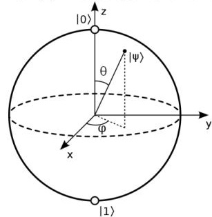

# 第二章 量子力学基础知识

由于不是专门的线性代数和量子力学课程,本课程需要对这些基础知识进行较为详细的讨论。但是,不宜用本课程的资料初学线性代数或量子力学,否则缺少细节的训练与接触,熟练度无法达到本课程的要求。

## 一、与量子力学有关的线性代数

1、在量子力学中,给定哈密顿量,系统的状态须满足薛定谔方程。通过分离变量求解薛定谔方程,将得到一组本征态,物理上习惯用 Dirac 符号表示:

$$|v_1\rangle,...,|v_n\rangle$$

这些状态在坐标表象下是波函数,但它们拥有和矢量一样的线性无关、正交等性质,因此量子力学中习惯将它们看成抽象的矢量。

需要特别区分“抽象态”和“表象下的坐标”。同一个量子态可以写成抽象的右矢 $|\psi\rangle$ ,也可以在坐标表象下写成波函数 $\psi(x)$ ,还可以在一组离散正交基 $\{|i\rangle\}$ 下写成一列复数系数:

$$
|\psi\rangle = \sum_i c_i |i\rangle,\qquad c_i=\langle i|\psi\rangle .
$$

连续表象下也类似:

$$
\psi(x)=\langle x|\psi\rangle .
$$

所以 $|\psi\rangle$ 不是某一串数字本身,而是量子态的抽象对象;波函数和列向量只是它在某个表象下的展开。换一组基,数字会变,但物理态没有变。

2、n 个线性无关的矢量 $|v_1\rangle$ ,..., $|v_n\rangle$ 张成一个n 维矢量空间,该空间中的任何矢量都可以用它们线性表示。

$$|v\rangle = \sum_{i} a_{i} |v_{i}\rangle$$

矢量 $|v_1\rangle$ ,..., $|v_n\rangle$ 称为该空间的一组基(Basis),组合系数 $a_1$ ,..., $a_n$ (一般是复

数)称为矢量 $|v\rangle$ 在这组基下的坐标。可以将坐标组合成列矢量 $\begin{pmatrix} a_1 \\ ... \\ a_n \end{pmatrix}$ 与矢量 $|v\rangle$ 一

一对应,有时就写成 $|v\rangle=\begin{pmatrix}a_1\\\dots\\a_n\end{pmatrix}$ 。实际上 $|v\rangle$ 只表示一个抽象的状态,不能与一组

数完全等同,但运算时几乎都是在数组的表示下进行的,因此这样写无伤大雅。 3、符号 $|v\rangle$ 称为右矢(Ket),与列矢量等价;其厄米共轭是行矢量,称为左矢(Bra),记为 $\langle v|$ 。有 $\langle v|=|v\rangle^+=(a_1^*,...,a_n^*)$ ,这里+表示共轭转置(厄米共轭,Hermitian Conjugate)。

4、从  $n_1$  维矢量空间 V 到  $n_2$  维矢量空间 W,可以定义线性变换。线性变换可以用线性算符  $\hat{A}$  来表示:

$$\hat{A}|v\rangle = |w\rangle$$

线性空间的基可以表示其中的所有矢量,因此它们是线性空间的代表元素。 对空间中任一矢量进行的变换都可以等价地看成对基进行的变换,也就是从V的基到W的基的映射:

$$\hat{A} | v_j \rangle = \sum_i A_{ij} | w_i \rangle$$

因此,抽象的线性变换 $\hat{A}$ 可以用 $n_2 \times n_1$ 矩阵来表示,物理中同样可以看成是一种相等的关系:

$$\hat{A} = \begin{pmatrix} A_{11} & \dots & A_{1n_1} \\ \dots & & & \\ A_{n,1} & \dots & A_{n,n_1} \end{pmatrix}$$

- 5、内积:在矢量空间中常常涉及投影、取模操作,因此需要引入内积。
- (1) 内积的定义不固定,但必须满足三个性质:线性、共轭对称性、正定性(详见线性代数教材或讲义)。在复矢量空间中,满足这三个性质的内积的标准定义是左矢与右矢的系数乘积求和。

$$|x\rangle = \begin{pmatrix} x_1 \\ \dots \\ x_n \end{pmatrix}, |y\rangle = \begin{pmatrix} y_1 \\ \dots \\ y_n \end{pmatrix}$$

$$\langle x|y\rangle = \langle x||y\rangle = (x_1^*, \dots, x_n^*) \begin{pmatrix} y_1 \\ \dots \\ y_n \end{pmatrix} = \sum_i x_i^* y_i$$

- (2) 若两个矢量的内积为 0,则称它们正交(Orthogonal)。正交的矢量必然线性无关(不讨论零矢量);若一组基两两正交,则称它们是一组正交基。
- (3)模/长度/范数(Norm):可以理解为距离,抽象情况下定义为矢量和自身内积的平方根。满足正定性。

$$\|v\| = \sqrt{\langle v | v \rangle} = \sqrt{|v_1|^2 + \dots + |v_n|^2}$$

若矢量的模为 1, 称它是归一的(Normalized)。

若一组基 $|1\rangle$ , $|2\rangle$ ,...两两正交且全部是归一的,则称它们是一组正交归一基 (Orthonormal Basis)。正交归一关系可以记为

$$\langle i | j \rangle = \delta_{ij}$$

(4) Schmidt 正交化: 任意一组线性无关的矢量 $|w_1\rangle,...,|w_n\rangle$ 可以通过如下的程序变成一组正交归一矢量 $|v_1\rangle,...,|v_n\rangle$ 。

$$\begin{aligned}
|v_1\rangle &= \frac{|w_1\rangle}{\|w_1\|}, \\
|u_k\rangle &= |w_k\rangle - \sum_{j<k} |v_j\rangle\langle v_j|w_k\rangle, \\
|v_k\rangle &= \frac{|u_k\rangle}{\|u_k\|}.
\end{aligned}$$

含义:对于第k个矢量 $|w_k\rangle$ ,剔除其中与 $|v_1\rangle$ ,..., $|v_{k-1}\rangle$ 共线的部分,就可以保

证它与 $|v_1\rangle$ ,..., $|v_{k-1}\rangle$ 全都正交,然后归一化即可。由于每一步都是这样操作,所以最终生成的 $|v_1\rangle$ ,..., $|v_n\rangle$ 应当两两正交。

- (5) Cauchy-Schwarz 不等式:  $|\langle v|w\rangle|^2 \le \langle v|v\rangle\langle w|w\rangle = ||v||^2 ||w||^2$ 。
- 6、外积:某些教材中将矢量的叉乘称为外积,但量子力学中一般不是。
  - (1) 外积的定义: 右矢乘左矢,得到一个矩阵。

$$|x\rangle\langle y| = \begin{pmatrix} x_1 \\ \dots \\ x_n \end{pmatrix} (y_1^*, \dots, y_n^*) = \begin{pmatrix} x_1 y_1^* & \dots & x_1 y_n^* \\ \dots & & & \\ x_n y_1^* & \dots & x_n y_n^* \end{pmatrix}$$

这里的矩阵就是按照线性代数中矩阵的乘法法则得到的。

(2) <u>完备性</u>(Completeness):一组正交归一基是完备的,说明它们可以用来表示相应矢量空间内全部的矢量。从外积的层面来看,这是因为它们的外积之和等于单位阵:

$$\sum_{i} |v_{i}\rangle\langle v_{i}| = \hat{I}_{n} = \begin{pmatrix} 1 & 0 & \dots & 0 \\ 0 & 1 & \dots & 0 \\ \dots & & \dots & \\ 0 & 0 & \dots & 1 \end{pmatrix}$$

这是显然的。如果在n维空间中取n个正交归一的矢量 $|v_1\rangle,...,|v_n\rangle$ ,则用它们表示自己,可以得到

$$|v_1\rangle = \begin{pmatrix} 1 \\ 0 \\ \dots \\ 0 \end{pmatrix}, \quad |v_2\rangle = \begin{pmatrix} 0 \\ 1 \\ \dots \\ 0 \end{pmatrix}, \dots, \quad |v_n\rangle = \begin{pmatrix} 0 \\ \dots \\ 0 \\ 1 \end{pmatrix}$$

干是容易得到

$$|v_1\rangle\langle v_1| = \begin{pmatrix} 1 & 0 & \dots & 0 \\ 0 & 0 & \dots & 0 \\ \dots & & \dots & \\ 0 & 0 & \dots & 0 \end{pmatrix}, \quad |v_2\rangle\langle v_2| = \begin{pmatrix} 0 & 0 & \dots & 0 \\ 0 & 1 & \dots & 0 \\ \dots & & \dots & \\ 0 & 0 & \dots & 0 \end{pmatrix}, \dots, |v_n\rangle\langle v_n| = \begin{pmatrix} 0 & 0 & \dots & 0 \\ 0 & 0 & \dots & 0 \\ \dots & & \dots & \\ 0 & 0 & \dots & 1 \end{pmatrix}$$

全部相加则有 $\sum_{i} |v_i\rangle\langle v_i| = \hat{I}_n$ , 因此这组基是完备的。

(3)矩阵的外积分解:很显然, $|v_i\rangle\langle v_j|$ 这个矩阵只有第i行第j列的一个元素是 1,其他矩阵元都是 0。因此,任何n阶方阵都可以分解成外积的线性组合:

$$\hat{A} = \begin{pmatrix} A_{11} & \dots & A_{1n} \\ \dots & & \\ A_{n1} & \dots & A_{nn} \end{pmatrix} = \sum_{ij} A_{ij} |i\rangle\langle j|$$

这一写法将矩阵也写成了矢量的乘积,更加有利于计算。对外积分解的另一种理解是:

$$\hat{A} = \hat{I}\hat{A}\hat{I} = \sum_{ij} |i\rangle\langle i|\hat{A}|j\rangle\langle j|$$

对比两种形式, 可以看到

$$A_{ij} = \left\langle i \left| \hat{A} \right| j \right\rangle$$

- 7、本征值(Eigen Value)与本征态:  $\hat{A}|v\rangle = \lambda|v\rangle$ 。
  - (1) 特征函数:  $c(\lambda) = \det(\hat{A} - \lambda \hat{I})$ 。该函数的根即为本征值。
- (2) 同一个本征值对应的本征态不唯一,并且在加法和数乘下满足封闭性,因此可以形成一个小的矢量空间,称为本征空间(Eigenspace)。若本征空间的维数大于 1,即同一本征值有不止一个线性无关本征态,那么称该本征值是<u>简并</u>的(Degenerate)。
- 8、幺正算符(酉算符,Unitary Operator):  $\hat{U}^+ = \hat{U}^{-1}$ 的算符。有如下性质。
  - (1) 保持内积不变:  $\langle Uv|Uw\rangle = (U|v\rangle)^+U|w\rangle = \langle v|U^+U|w\rangle = \langle v|w\rangle$ 。
  - (2) 保持模长不变: ||U|v|| = ||v||。
  - (3) 将矢量空间的一组正交归一基变换为另一组正交归一基。
- 9、厄米算符(Hermitian Operator):  $\hat{A}^+ = \hat{A}$ 的算符,也叫自伴算符(Self Adjoint Operator)。有如下性质。
  - (1) 本征值都为实数。
  - (2) 不同本征值对应的本征态正交。
  - (3) 可以在正交归一基(幺正变换)下对角化。

$$\hat{U}\hat{A}\hat{U}^{+} = \text{diag}(\lambda_{1},...,\lambda_{n})$$

- 10、正规算符(Normal Operator):满足 $\hat{A}\hat{A}^{+} = \hat{A}^{+}\hat{A}$ 的算符。
- (1) 正规算符在幺正变换下可对角化,但其本征值不一定是实数。
- (2) 任何算符可以分解为厄米的"实部"和"虚部":

$$\hat{A} = \hat{B} + i\hat{C}, \ \hat{B}^+ = \hat{B}, \ \hat{C}^+ = \hat{C}$$

算符 $\hat{A}$ 是正规算符,当且仅当 $\hat{B}\hat{C} = \hat{C}\hat{B}$ 。

- 11、投影算符(Projector)
- (1) 在量子测量中,有时需要从一个叠加态中提取某些部分,例如从 $\frac{|0\rangle+|1\rangle}{\sqrt{2}}$ 中

提取出 $\frac{|0\rangle}{\sqrt{2}}$ (或者说将前者变成后者)。如果 $|0\rangle$ 和 $|1\rangle$ 正交,那么一个比较直接的选择就是 $\hat{P}_0 = |0\rangle\langle 0|$ ,它对 $|1\rangle$ 没有作用,而作用在 $|0\rangle$ 上则依然得到 $|0\rangle$ 。因此,这个算符可以认为是投影出了其中 $|0\rangle$ 的成分;此外,如果将投影后的状态再作用一次这个算符,结果将不会改变,即 $\hat{P}_0^2 = \hat{P}_0$ ,这也是这种算符的重要性质。

- (2)数学中的定义是从性质出发的,即定义一切满足  $\hat{p}^2 = \hat{p}$  的 <u>厄米</u>算符  $\hat{p}$  为投影算符。在这一定义下,投影算符有如下性质:
- ①本征值为0或1。
- ②可以由一组正交归一矢量展开:  $\hat{P} = \sum_{j} |v_{j}\rangle\langle v_{j}|$ 。
- ③单位矩阵是一个特殊的投影算符。
- ④正交互补关系:  $\hat{P}(\hat{I} - \hat{P}) = 0$ 。
- 12、正定、半正定算符
- (1) 一般只考虑厄米算符的正定、半正定性,其他情况不做讨论。
- (2) 半正定算符(Positive Operator) $\hat{A}$ : 对任意矢量 $|v\rangle$ ,  $\langle v|\hat{A}|v\rangle \geq 0$ 。

正定算符(Positive-definite Operator)  $\hat{A}$ : 对任意矢量 $|v\rangle$ ,  $\langle v|\hat{A}|v\rangle \ge 0$ , 并且只有 $|v\rangle = 0$ 时才取等号。(也就是对 $|v\rangle \ne 0$ 都有 $\langle v|\hat{A}|v\rangle > 0$ )

- (3) 半正定算符的性质
- ①必定是厄米算符。
- ②本征值均为非负实数。(正定算符:本征值均为正实数)
- ③对任意算符 $\hat{M}$ ,  $\hat{M}\hat{M}^+$ 与 $\hat{M}^+\hat{M}$ 都必然是半正定的。
- ④投影算符都是半正定算符。
- ⑤存在唯一的平方根。平方根是指满足 $\hat{M}^+\hat{M} = \hat{A}$ 的<u>半正定</u>算符 $\hat{M}$ 。具体的构造方式如下:
- (法一)直接解矩阵方程 $\hat{M}^+\hat{M} = \hat{A}$ ,解出所有可能的矩阵 $\hat{M}$ ,然后取其中半正定的解。
  - (法二)由于半正定算符 à 是厄米算符,首先通过幺正变换将其对角化:

$$\hat{U}\hat{A}\hat{U}^{+} = \Lambda = \operatorname{diag}(\lambda_{1},...,\lambda_{n})$$

其中本征值 $\lambda,...,\lambda$ ,均是非负实数。在这一对角化的表象下,将有

$$\hat{U}\hat{M}\hat{U}^{+} = \sqrt{\Lambda} = \operatorname{diag}(\sqrt{\lambda_{1}},...,\sqrt{\lambda_{n}})$$

因此有

$$\hat{M} = \hat{U}^{+} \sqrt{\Lambda} \hat{U}$$

这样就得到了满足要求的 $\hat{M}$ ,记为 $\hat{M} = \sqrt{\hat{A}}$ 。(事实上,在对 $\Lambda$ 开平方时,各个对角元可以取正也可以取负,不同的组合可以给出所有满足 $\hat{M}^+\hat{M} = \hat{A}$ 的算符,但半正定的只会有一个。)

- 13、★矩阵的直积(张量积,Kronecker 积,Tensor Product)
- (1) 直积的定义:  $m \times n$  矩阵  $\hat{A}$  与  $p \times q$  矩阵  $\hat{B}$  的直积记为  $\hat{A} \otimes \hat{B}$ ,是一个  $mp \times nq$  矩阵,其矩阵元为  $(\hat{A} \otimes \hat{B})_{ij,mn} = a_{im}b_{jn}$  。 也就是说,将  $\hat{A}$  的矩阵元与  $\hat{B}$  的矩阵元任意组合,每种组合就是  $\hat{A} \otimes \hat{B}$  的一个矩阵元。因此,矩阵  $\hat{A} \otimes \hat{B}$  有 mp 行、 nq 列,其中行列的序号与相乘的两个数的行号、列号都有关,只要按一定顺序排列清楚即可。 $k$ 个 $\hat{A}$ 的直积可以用幂次形式记为  $\hat{A}^{\otimes k}$ 。
- (2) 直积的形象表示:可以认为是矩阵 $\hat{a}$ 乘到了 $\hat{a}$ 的每个矩阵元上,形成分块矩阵。例如,对于二阶矩阵,有

$$\begin{pmatrix} a_{11} & a_{12} \\ a_{21} & a_{22} \end{pmatrix} \otimes \begin{pmatrix} b_{11} & b_{12} \\ b_{21} & b_{22} \end{pmatrix} = \begin{pmatrix} a_{11}b_{11} & a_{11}b_{12} & a_{12}b_{11} & a_{12}b_{12} \\ a_{11}b_{21} & a_{11}b_{22} & a_{12}b_{21} & a_{12}b_{22} \\ a_{21}b_{11} & a_{21}b_{12} & a_{22}b_{11} & a_{22}b_{12} \\ a_{21}b_{21} & a_{21}b_{22} & a_{22}b_{21} & a_{22}b_{22} \end{pmatrix} = \begin{pmatrix} a_{11}\hat{B} & a_{12}\hat{B} \\ a_{21}\hat{B} & a_{22}\hat{B} \end{pmatrix}$$

容易验证直积<u>不满足交换律</u>,即 $\hat{A}\otimes\hat{B}\neq\hat{B}\otimes\hat{A}$ 。交换后,直积出的矩阵可能连行列数都不一样。

(3)矢量的直积:矢量原则上是特殊的矩阵,因此直积的规则并无区别,但是在概念上可以有更好的理解。

例如,考虑两个独立的系统 V 和 W,分别有基矢 $|0\rangle_{V}$ 、 $|1\rangle_{V}$ 与 $|0\rangle_{W}$ 、 $|1\rangle_{W}$ 。 如果要表示两个系统总体的状态,显然应该由 V 和 W 的状态组合而成。对 V 和 W 各自而言,两个线性空间都是二维的:

$$|0\rangle_{V} = \begin{pmatrix} 1\\0 \end{pmatrix}, |1\rangle_{V} = \begin{pmatrix} 0\\1 \end{pmatrix}; |0\rangle_{W} = \begin{pmatrix} 1\\0 \end{pmatrix}, |1\rangle_{W} = \begin{pmatrix} 0\\1 \end{pmatrix}$$

而联合的状态空间(复合系统,Composite System)则是四维的:

$$|0\rangle_{\nu}|0\rangle_{w} = \begin{pmatrix} 1\\0\\0\\0 \end{pmatrix}, \quad |0\rangle_{\nu}|1\rangle_{w} = \begin{pmatrix} 0\\1\\0\\0 \end{pmatrix}, \quad |1\rangle_{\nu}|0\rangle_{w} = \begin{pmatrix} 0\\0\\1\\0 \end{pmatrix}, \quad |1\rangle_{\nu}|1\rangle_{w} = \begin{pmatrix} 0\\0\\0\\1 \end{pmatrix}$$

两个二维空间联合成一个四维空间,其中进行的数学操作就是直积。事实上:

$$\begin{aligned}
|0\rangle_V\otimes|0\rangle_W
&= \begin{pmatrix}1\\0\end{pmatrix}\otimes\begin{pmatrix}1\\0\end{pmatrix}
= \begin{pmatrix}1\\0\\0\\0\end{pmatrix}, \\
|0\rangle_V\otimes|1\rangle_W
&= \begin{pmatrix}1\\0\end{pmatrix}\otimes\begin{pmatrix}0\\1\end{pmatrix}
= \begin{pmatrix}0\\1\\0\\0\end{pmatrix}.
\end{aligned}$$

因此,尽管直积运算看起来抽象而复杂,但这种运算内在的排列组合操作实际上非常适合用来表示两个系统的联合态(后者也涉及排列组合)。量子力学中,态矢的直积中可以省去直积符号,一般有如下记号:

$$|v\rangle\otimes|w\rangle=|v\rangle|w\rangle=|v,w\rangle=|vw\rangle$$
  
态矢空间的基。

这些直积态就是联合态矢空间的基。

- (4) 直积的性质
- ①与矩阵乘法可交换顺序:  $(\hat{A} \otimes \hat{B})(\hat{A}' \otimes \hat{B}') = (\hat{A}\hat{A}') \otimes (\hat{B}\hat{B}')$ 。

对态矢而言,有 $(\hat{A} \otimes \hat{B})(|v\rangle \otimes |w\rangle) = (\hat{A}|v\rangle) \otimes (\hat{B}|w\rangle)$ ,这说明如果要构造一个对 V、W 独立作用的算符,只需要将每个空间各自的算符进行直积即可,这也是矩阵直积的物理意义。

$$(\hat{A} \otimes \hat{B})^{-1} = \hat{A}^{-1} \otimes \hat{B}^{-1}, \qquad (\hat{A} \otimes \hat{B})^{+} = \hat{A}^{+} \otimes \hat{B}^{+}.$$

14、矩阵的迹(Trace)

- (1) 定义: 所有对角元的和。 trace  $\hat{A} = \operatorname{tr} \hat{A} = \sum_{i} A_{ii}$ 。
- (2) 迹的性质
- ①轮换对称性:  $\operatorname{tr}(\hat{A}\hat{B}) = \operatorname{tr}(\hat{B}\hat{A})$ 。对多个矩阵乘积,则有  $\operatorname{tr}(\hat{A}_1\hat{A}_2...\hat{A}_n) = \operatorname{tr}(\hat{A}_2...\hat{A}_n\hat{A}_1) = ... = \operatorname{tr}(\hat{A}_n\hat{A}_1\hat{A}_2...\hat{A}_{n-1})$
- ②在相似变换下不变:  $\operatorname{tr}(\hat{U}\hat{A}\hat{U}^{-1}) = \operatorname{tr}(\hat{U}^{-1}\hat{U}\hat{A}) = \operatorname{tr}\hat{A}$ 。
- ③直积的迹:  $\operatorname{tr}(\hat{A} \otimes \hat{B}) = \operatorname{tr} \hat{A} \operatorname{tr} \hat{B}$  。
- ④**重要性质**:对任意态矢 $|\psi\rangle$ ,有

$$\operatorname{tr}(\hat{A}|\psi\rangle\langle\psi|) = \langle\psi|\hat{A}|\psi\rangle$$

这一公式使得量子力学中的密度矩阵有非常重要的价值。

(3) Hilbert-Schmidt 内积:对 *V→V* 的算符,可以定义

$$(\hat{A}, \hat{B}) = \operatorname{tr}(\hat{A}^{+}\hat{B})$$

它满足内积的基本条件,可以认为是算符空间上的内积。

- 15、对易和反对易关系
- (1) 对易(Commute)即可交换。定义两算符的对易子(Commutator)

$$[\hat{A}, \hat{B}] = \hat{A}\hat{B} - \hat{B}\hat{A}$$

若对易子为0,则称两算符对易。

(2) 定义两算符的反对易子(Anticommutator)

$$\{\hat{A}, \hat{B}\} = \hat{A}\hat{B} + \hat{B}\hat{A}$$

若反对易子为0,则称两算符反对易,即二者交换会产生一个负号。

- (3)两厄米算符可同时对角化,等价于它们对易。(同时对角化:在同一组基/同一个幺正变换下对角化)
- 16、矩阵的分解
- (1) 极分解 (Polar Decomposition)

任意线性算符 $\hat{A}$ 可以分解为如下算符的乘积:

$$\hat{A} = \hat{U}\hat{J} = \hat{K}\hat{U}$$

其中 $\hat{J} = \sqrt{\hat{A}^{+}\hat{A}}$ ,  $\hat{K} = \sqrt{\hat{A}\hat{A}^{+}}$ , 而 $\hat{U}$  为幺正矩阵。 $\hat{A} = \hat{U}\hat{J}$  称为左极式分解, $\hat{A} = \hat{K}\hat{U}$  称为右极式分解。

(2) 奇异值分解(SVD 分解,Singular Value Decomposition) 任意方阵  $\hat{A}$  可做如下分解:

$$\hat{A} = \hat{U}\hat{D}\hat{V}$$

其中 $\hat{U}$ 和 $\hat{V}$ 为幺正矩阵, $\hat{D}$ 为对角矩阵(不一定是方阵)且对角元素非负。矩阵 $\hat{D}$ 的对角元 $D_{ii}$ 称为矩阵 $\hat{A}$ 的奇异值。在左极式分解中将 $\hat{J}$ 对角化即得结果。①矩阵 $\hat{A}$ 与 $\hat{A}$ +有相同的非零奇异值。

- ②  $\hat{A}$  奇异值的平方是  $\hat{A}\hat{A}^+$  与  $\hat{A}^+\hat{A}$  的本征值。(即使不做 SVD 分解也能求奇异值)
  - (3) 谱分解 (Spectral Decomposition)

若n阶方阵 $\hat{A}$ 可对角化,则 $\hat{A}$ 必然有n个线性无关的本征矢量。将它们正交归一化,得到一组矢量 $|1\rangle,|2\rangle,...,|n\rangle$ 。若它们对应的本征值分别为 $\lambda_1,...,\lambda_n$ ,则有

$$\hat{A} = \sum_{i} \lambda_{i} |i\rangle\langle i|$$

17、算符函数

在物理中,常常会需要将算符放在指数、分母等位置。在这些情况下,需要 定义算符的函数。

(1) 最严格的定义: 泰勒级数。例如:

$$
e^{\hat{A}} = \sum_{n=0}^{\infty} \frac{\hat{A}^n}{n!},
\qquad
\sin \hat{A} =
\sum_{n=0}^{\infty} (-1)^{n+1}
\frac{\hat{A}^{2n+1}}{(2n+1)!},
\ldots
$$

该级数是否收敛,取决于算符介本征值的范围。

(2) 对于对角矩阵, 其幂次可以直接作用在对角元上, 因此对这类矩阵总是有

$$\hat{A} = \text{diag}(A_{11},...,A_{nn}) \Rightarrow f(\hat{A}) = \text{diag}(f(A_{11}),...,f(A_{nn}))$$

对于非对角矩阵, 利用谱分解也可以做到类似的效果。

$$\hat{A} = \sum_{a} a |a\rangle\langle a| \Rightarrow f(\hat{A}) = \sum_{a} f(a)|a\rangle\langle a|$$

## 二、泡利矩阵:三个重要的二维矩阵

在量子力学的自旋理论中用到了三个泡利矩阵,但它们其实在二维矢量空间 的代数中始终有非常重要的地位。量子信息中用到泡利矩阵,也不只是因为它与 自旋的相关性。

- 1、具体形式:  $\hat{X} = \begin{pmatrix} 0 & 1 \\ 1 & 0 \end{pmatrix}$ ,  $\hat{Y} = \begin{pmatrix} 0 & -i \\ i & 0 \end{pmatrix}$ ,  $\hat{Z} = \begin{pmatrix} 1 & 0 \\ 0 & -1 \end{pmatrix}$ 。也可以记为 $\hat{\sigma}_x$ 、 $\hat{\sigma}_y$ 、 $\hat{\sigma}_z$ ,或者 $\hat{\sigma}_1$ 、 $\hat{\sigma}_2$ 、 $\hat{\sigma}_3$ 。
- 2、三个泡利矩阵都是厄米矩阵,都是幺正矩阵,也都是自反矩阵( $\hat{\sigma}_{i}^{2} = \hat{I}$ )。
- 3、三个泡利矩阵的本征值都是±1,本征态分别为:

$$|\uparrow\rangle_x = \frac{1}{\sqrt{2}} \begin{pmatrix} 1 \\ 1 \end{pmatrix}, \ |\downarrow \rangle_x = \frac{1}{\sqrt{2}} \begin{pmatrix} 1 \\ -1 \end{pmatrix}, \ |\uparrow \rangle_y = \frac{1}{\sqrt{2}} \begin{pmatrix} 1 \\ -i \end{pmatrix}, \ |\downarrow \rangle_y = \frac{1}{\sqrt{2}} \begin{pmatrix} 1 \\ i \end{pmatrix}, \ |\uparrow \rangle_z = \begin{pmatrix} 1 \\ 0 \end{pmatrix}, \ |\downarrow \rangle_z = \begin{pmatrix} 0 \\ 1 \end{pmatrix}$$

量子信息中,为了与二进制一致,一般记  $|\uparrow \rangle_z = |0 \rangle, \ |\downarrow \rangle_z = |1 \rangle$ 。

- 4、三个泡利矩阵的迹都是0。
- 5、对易与反对易关系:  $[\hat{\sigma}_i, \hat{\sigma}_j] = 2i\sum_k \varepsilon_{ijk} \hat{\sigma}_k$ ,  $\{\hat{\sigma}_i, \hat{\sigma}_j\} = 2\hat{I}\delta_{ij}$ .
- 6、在很多式子中,泡利矩阵会依次出现。为了将式子写得更紧致,常常定义矩阵矢量 $\hat{\sigma} = (\hat{\sigma}_x, \hat{\sigma}_y, \hat{\sigma}_z)$ ,在形式上可以看成是三维的矢量。例如:

$$\vec{n} = (n_1, n_2, n_3) \Rightarrow n_1 \hat{\sigma}_x + n_2 \hat{\sigma}_y + n_3 \hat{\sigma}_z = \vec{n} \cdot \hat{\vec{\sigma}}$$

这个点乘只是利用了 $\sum_i a_i b_i$ 的形式,实际的乘法与求和还是与矩阵的相关法则一致。

7、任何一个二维的幺正厄米阵( $\hat{U}^+ = \hat{U}^{-1} = \hat{U}$ ),如果不是正比于单位阵,总是可以写成 $\vec{n} \cdot \hat{\sigma}$ 的形式,其中 $\vec{n}$  是单位矢量。

## 三、量子力学基本假设、量子测量
- 1、量子力学中,系统的状态可以用 Hilbert 空间中的态矢来表示。在量子信息中,
- 一个二进制的比特可以看成二维的自旋空间,有|0>和|1>两个正交归一的定态;
- 一般的态则是二者的线性叠加,即 $|\psi\rangle=a|0\rangle+b|1\rangle$ ,其中 $|a|^2+|b|^2=1$ 。叠加态是经典力学中没有的概念,也是经典比特无法呈现的状态,这将是量子计算的优势所在。
- 2、给定系统的哈密顿量,系统的演化由薛定谔方程描述:

$$i\hbar \frac{\partial}{\partial t} |\psi\rangle = \hat{H} |\psi\rangle$$

这种演化可以看成态矢在复空间的旋转,转动过程由幺正矩阵描述:

$$|\psi(t)\rangle = \hat{U}|\psi(0)\rangle, \quad \hat{U} = \exp\left(-\frac{i\hat{H}t}{\hbar}\right)$$

这里的幺正算符 $\hat{U}$ 被称为时间演化算符。因此,在量子信息中,逻辑门都用幺正矩阵表示,它们将改变量子比特的状态。

**3、量子测量的定义**

量子力学中,对物理量进行测量的可能结果是该物理量的本征值。测量情况由一组测量算符 $\{\hat{M}_{m}\}$ 描述,这组算符给出了得到每个结果的概率:

$$p(m) = \left\langle \psi \left| \hat{M}_{m}^{+} \hat{M}_{m} \right| \psi \right\rangle$$

由于总概率为 1,所以  $\sum_{m}\hat{M}_{m}^{+}\hat{M}_{m}=\hat{I}$ ; 并且,测量完后,系统将坍缩到对应

的状态,即

$$|\psi'\rangle = \frac{\hat{M}_m |\psi\rangle}{\sqrt{p(m)}}$$

- (1)注意,一般测量算符 $\hat{M}_m$ 同时描述“得到结果 m 的概率”和“得到该结果后的状态更新”。如果只关心测量结果的概率分布,对应的是 POVM 元 $\hat{E}_m=\hat{M}_m^\dagger\hat{M}_m$ ;如果要把测量和某个可观测量联系起来,还需要指定本征值如何对应到这些结果。
- (2) 在量子力学的一般理论中,为了更好地普适化、抽象化,往往不指明测量 什么物理量,只是根据算符的性质将它们定义成一组测量,称为一般测量。
- (3) 在二进制计算中,最基本的测量算符是 $\hat{M}_0 = |0\rangle\langle 0|$  和 $\hat{M}_1 = |1\rangle\langle 1|$ 。对于这种测量算符,有

$$
p_0 = \langle \psi | 0 \rangle \langle 0 | \psi \rangle
= |\langle 0 | \psi \rangle|^2,
\qquad
p_1 = \langle \psi | 1 \rangle \langle 1 | \psi \rangle
= |\langle 1 | \psi \rangle|^2 .
$$

这就是量子力学中所说,"叠加态取得某个本征态的概率等于组合系数的模平方"。

- 4、投影测量(Projective Measurement)
- (1)满足以下性质的一组算符 $\{\hat{P}_m\}$ 被称为投影测量:
- ① $\{\hat{P}_m\}$ 均为厄米算符。
- ②完备性:  $\sum_{m} \hat{P}_{m} = \hat{I}_{o}$
- ③正交性:  $\hat{P}_m \hat{P}_{m'} = \hat{P}_m \delta_{mm'}$ 。

在一般情况下,对于测量算符 $\{\hat{M}_m\}$ ,如果令 $\hat{M}_m^+\hat{M}_m=\hat{P}_m$ ,并且 $\{\hat{P}_m\}$ 满足正交性,那么 $\{\hat{P}_m\}$ 就是一组投影测量。例如,当 $\hat{M}_0=|0\rangle\langle 0|$ 、 $\hat{M}_1=|1\rangle\langle 1|$ 时,可以计算得到 $\hat{P}_0=|0\rangle\langle 0|$ 和 $\hat{P}_1=|1\rangle\langle 1|$ ,这便是一组投影测量。测量得到m的概率为

$$p(m) = \left\langle \psi \left| \hat{P}_m \right| \psi \right\rangle$$

并且测量后系统将坍缩到 $|\psi'\rangle = \frac{\hat{P}_m|\psi\rangle}{\sqrt{p(m)}}$ 。

(2) 任何可观测量都可以分解为投影测量算符的谱展开:

$$\hat{O} = \sum_{m} m \hat{P}_{m}$$

其中m是该量的本征值。

(3) 数学期望:

$$\langle \hat{O} \rangle = \sum_{m} mp(m) = \sum_{m} m \langle \psi | \hat{P}_{m} | \psi \rangle = \langle \psi | \hat{O} | \psi \rangle$$

方差:

$$(\Delta \hat{O})^{2} = \langle \hat{O}^{2} \rangle - \langle \hat{O} \rangle^{2} = \langle \psi | \hat{O}^{2} | \psi \rangle - (\langle \psi | \hat{O} | \psi \rangle)^{2}$$

与量子力学课程的结论完全一致。

- 5、POVM(正算符取值测量)
- (1)满足以下性质的一组算符 $\{\hat{E}_{m}\}$ 被称为一组 POVM:
- ① $\{\hat{E}_m\}$ 中的算符均为半正定算符。
- ②完备性:  $\sum_{m} \hat{E}_{m} = \hat{I}_{o}$

这组算符被称为 POVM 元。

这里不要求正交性,因此 POVM 与投影测量并不相同。

- (2)对于某个一般测量  $\{\hat{M}_m\}$  ,只要  $\hat{M}_m^+\hat{M}_m$  都是半正定算符,那么就可以从中构造一组 POVM 元,也就是  $\hat{E}_m = \hat{M}_m^+\hat{M}_m$  。可以证明,如果某个一般测量的 POVM 元就是测量算符本身,即  $\hat{E}_m = \hat{M}_m^+\hat{M}_m = \hat{M}_m$  ,那么该测量必为投影测量。
- 6、用投影测量可以实现一般测量。

对一个量子比特 $|\psi\rangle$ ,有一个一般测量需要进行,对应算符 $\{\hat{M}_m\}$ 。此时,可以增加一个辅助比特(Ancilla Bit) $|0\rangle$ ,从而将一般测量转化为投影测量。第 1 步:做幺正变换 $\hat{U}$ ,使得原始的直积态 $|\psi\rangle|0\rangle$ 变成各种测量后状态的叠加:

$$\hat{U}|\psi\rangle|0\rangle = \sum \hat{M}_{m}|\psi\rangle|m\rangle$$

也就是说,辅助比特需要有足够多的本征态,能够和测量算符一一对应。 第 2 步:对辅助比特进行投影测量,而不直接测量原始比特,即施加

$$\hat{P}_m = \hat{I} \otimes |m\rangle\langle m|$$

这一步操作过后,原始比特看似没有受到影响,其实已经变成了 $\hat{M}_m$ 测量后的状态,因为 $\hat{P}_m$ 相当于从 $\hat{U}|\psi\rangle|0\rangle = \sum_m \hat{M}_m |\psi\rangle|m\rangle$ 中投影出了这个状态。考虑

$$p(m) = \left(\sum_{i} \hat{M}_{i} |\psi\rangle|i\rangle\right)^{+} \hat{P}_{m} \sum_{j} \hat{M}_{j} |\psi\rangle|j\rangle = \sum_{ij} \langle i|\langle\psi|\hat{M}_{i}^{+}|m\rangle\langle m|\hat{M}_{j}|\psi\rangle|j\rangle$$

注意辅助比特的态与原始比特的态要分开计算:

$$p(m) = \sum_{ij} \langle i | m \rangle \langle m | j \rangle \langle \psi | \hat{M}_{i}^{\dagger} \hat{M}_{j} | \psi \rangle = \langle \psi | \hat{M}_{m}^{\dagger} \hat{M}_{m} | \psi \rangle$$

因此测到辅助比特为 $|m\rangle$ 的概率实际上就是测量原始比特得到m的概率;同时还可以验证,原始比特恰好坍缩到了 $\hat{M}_m$ 作用后的状态。因此,可以通过投影测量实现对原始比特的一般测量。

**7、不确定关系**

- (1) Kennard 不等式:  $\Delta x \Delta p \ge \frac{\hbar}{2}$ .
- (2) Robertson 不等式:  $(\Delta \hat{A})(\Delta \hat{B}) \ge \frac{1}{2} |\langle \psi | [\hat{A}, \hat{B}] | \psi \rangle|$ .
- (3) 熵的不确定关系: Maassen-Uffink 不等式

设算符 $\hat{A}$ 的本征基矢为 $|j\rangle$ ,算符 $\hat{B}$ 的本征基矢为 $|k\rangle$ ,则 Shannon 熵满足

$$
H(\hat{A}) + H(\hat{B}) \ge -\log c,
\qquad
c = \max_{j,k} \left| \langle j | k \rangle \right|^2 .
$$

- 8、量子纠缠:有些复合系统的状态不能表示成子系统状态的直积,这种状态称为纠缠态(Entangled State)。在纠缠态下,两个系统的测量结果可以表现出不能由独立局域状态解释的强关联。测量其中一个系统后,另一个系统的条件状态会随测量结果更新,但这不能用来超光速传递可控信息。
- (1) 判断是否为纠缠态的方法: 以两系统的复合为例。

$$|\psi\rangle = \sum_{ij} a_{ij} |i,j\rangle$$

只要验证它是否可以写成如下形式:

$$|\psi\rangle = (\alpha_1|i_1\rangle + ... + \alpha_m|i_m\rangle) \otimes (\beta_1|j_1\rangle + ... + \beta_n|j_n\rangle)$$

即组合系数 $\alpha_1,...,\beta_1,...$ 是否存在。如果不存在,就是纠缠态。

(2) Bell 态: 四个常用的纠缠态。

$$\left|\Phi_{\pm}\right\rangle = \frac{\left|00\right\rangle \pm \left|11\right\rangle}{\sqrt{2}}, \quad \left|\Psi_{\pm}\right\rangle = \frac{\left|01\right\rangle \pm \left|10\right\rangle}{\sqrt{2}}$$

## 四、密度矩阵(Density Matrix)

### 1、纯态与混合态

- (1) 纯态: 系统可以由一个归一化态矢 $|\psi\rangle$ 完整描述。这个态矢可以是某组基下的叠加态,其不同分量之间保留相干相位,因此可以发生干涉。
- (2)混合态: 系统不能由单个态矢完整描述,而是由“以经典概率制备不同纯态”的系综来描述。这里的概率是经典不确定性,不同纯态之间没有固定相干相位,不能简单写成归一化叠加态。例如,一个量子系统处于混合态,有 1/2 的概率取到  $|\psi_1\rangle=|0\rangle$ , 又有 1/2 的概率

取得

$$|\psi_2\rangle = \frac{|0\rangle + |1\rangle}{\sqrt{2}}$$

这并不意味着系统的状态是归一化的 $\frac{|\psi_1\rangle + |\psi_2\rangle}{\sqrt{2}}$ ,否则密度

矩阵中将出现干涉的 $|\psi_1\rangle\langle\psi_2|$ 项。

### 2、密度矩阵的定义

- (1) 纯态的密度矩阵:  $\hat{\rho} = |\psi\rangle\langle\psi|$ 。
- (2) 混合态的密度矩阵: 如果系统有经典概率  $p_i$ 取到纯态  $|\psi_i\rangle$ , 则

$$\hat{\rho} = \sum_{i} p_{i} |\psi_{i}\rangle\langle\psi_{i}|$$

(3)判断一个态是否为纯态,最基本的方法就是看密度矩阵能否写成单个态矢对自身的外积。(后面还会介绍其他方法)

密度矩阵还有一个重要动机:态矢存在整体相位冗余。也就是说,

$$
|\psi\rangle
\quad\text{和}\quad
e^{i\phi}|\psi\rangle
$$

描述的是同一个物理态,所有可观测概率和期望值都不会因为这个整体相位改变。把纯态写成

$$
\hat{\rho}=|\psi\rangle\langle\psi|
$$

之后,整体相位会自动抵消:

$$
e^{i\phi}|\psi\rangle\langle\psi|e^{-i\phi}
=|\psi\rangle\langle\psi| .
$$

从这个角度看,密度矩阵比态矢更接近“物理态本身”。它既能表示纯态,也能表示由经典不确定性产生的混合态,并且期望值可以统一写成

$$
\langle \hat{A}\rangle=\operatorname{tr}(\hat{\rho}\hat{A}) .
$$

### 3、密度矩阵的性质

- (1) 密度矩阵都是厄米矩阵。
- (2) 密度矩阵都是半正定矩阵。
- (3) 密度矩阵的迹必为 1:  $tr(\hat{\rho}) = 1$ 。
- (4) 纯态  $\hat{\rho} = |\psi\rangle\langle\psi|$ ,故  $\hat{\rho}^2 = \hat{\rho}$ ,  $\operatorname{tr}(\hat{\rho}^2) = 1$ ;非纯的混合态满足  $\operatorname{tr}(\hat{\rho}^2) < 1$ 。 因此,判断一个态是否为纯态的另一种方法就是计算  $\operatorname{tr}(\hat{\rho}^2)$  的值。物理上将  $\operatorname{tr}(\hat{\rho}^2)$  称为态的**纯度**(Purity)。

### 4、Bloch 矢量及其密度矩阵

(1) 二维复空间的任意矢量有 4 个自由度; 作为态矢,整体相位不起作用,因此相当于至多只有 3 个自由度(可以将其中一个坐标的相位设定为 0)。对于纯

态,归一化条件使得只有两个自由度,从而可以写成

$$
|\psi(\vec{r})\rangle =
\begin{pmatrix}
\cos\frac{\theta}{2} \\
\sin\frac{\theta}{2}e^{\mathrm{i}\varphi}
\end{pmatrix}.
$$

该态矢与三维矢量 $\vec{r} = (\sin\theta\cos\varphi, \sin\theta\sin\varphi, \cos\theta)$ 一一对应,因此可将该态矢看成单位球面上的点;对于混合态,其模长小于 1(因为缺少干涉),对应的是单位球体内的点 $\vec{r} = (r\sin\theta\cos\varphi, r\sin\theta\sin\varphi, r\cos\theta)$ ,其中 r < 1。这个球被称为 Bloch 球。

(2) Bloch 矢量的密度矩阵:

$$\hat{\rho}(\vec{r}) = \frac{\hat{I} + \vec{r} \cdot \hat{\sigma}}{2} = \frac{\hat{I} + x\hat{\sigma}_x + y\hat{\sigma}_y + z\hat{\sigma}_z}{2}$$

其中(x,y,z)就是 Bloch 矢量的直角坐标。容易看到,纬度角 $\theta$ 反映了系统偏向 0 还是 1,而经度角 $\phi$ 则反映了二者之间的相对相位。这种表示非常成功地将二维 复矢量表示成了三维实矢量,从群论角度说就是实现了 SU(2)和 SO(3)的同态。

此密度矩阵的本征值与本征矢量为:

$$\lambda_{\pm} = \frac{1 \pm r}{2}, \ |+\rangle = \begin{pmatrix} \cos \frac{\theta}{2} \\ \sin \frac{\theta}{2} e^{i\varphi} \end{pmatrix}, \ |-\rangle = \begin{pmatrix} \sin \frac{\theta}{2} \\ -\cos \frac{\theta}{2} e^{i\varphi} \end{pmatrix}$$

### 5、密度矩阵的演化

和态矢一起发生幺正演化。

$$|\psi_{i}\rangle \rightarrow \hat{U}|\psi_{i}\rangle, \quad \hat{\rho} = \sum_{i} p_{i}|\psi_{i}\rangle\langle\psi_{i}| \rightarrow \hat{U}\hat{\rho}\hat{U}^{+}$$

例如,在测量得到m后,系统的密度矩阵就坍缩为 $\frac{\hat{M}_{m}\hat{\rho}\hat{M}_{m}^{+}}{p(m)}$ 。

### 6、复合系统的密度矩阵

(1)前面已经说到,复合系统的状态不一定能表示成子系统状态的直积,但是如果已经确定制备好了每个子系统的状态,那么复合系统的状态就确实是直积态 (此时没有互相的关联)。对应地,密度矩阵也是直积:

$$\hat{\rho} = \hat{\rho}_1 \otimes ... \otimes \hat{\rho}_n$$

(2) 约化密度矩阵: 从复合系统的密度矩阵可以得到子系统的密度矩阵, 具体的方法是求偏迹。

$$\hat{\rho}_A = \operatorname{tr}_B \hat{\rho}_{AB}, \quad \hat{\rho}_B = \operatorname{tr}_A \hat{\rho}_{AB}$$

偏迹(Partial Trace)就是把其中属于某个子系统的部分通过求迹来消去。严格的写法:

$$\hat{\rho}_{A} = \sum_{b} (\hat{I} \otimes \langle b |) \hat{\rho}_{AB} (\hat{I} \otimes | b \rangle)$$

$$\hat{\rho}_{B} = \sum_{a} (\langle a | \otimes \hat{I}) \hat{\rho}_{AB} (|a \rangle \otimes \hat{I})$$

这些公式较为抽象,可以具体来看。

① 杰矢写法: 若用杰矢表示密度矩阵, 即

$$\hat{\rho}_{AB} = \sum_{i_1 i_2, j_1 j_2} \rho_{i_1 i_2, j_1 j_2} \left| i_1 i_2 \right\rangle \left\langle j_1 j_2 \right| = \sum_{i_1 i_2, j_1 j_2} \rho_{i_1 i_2, j_1 j_2} \left| i_1 \right\rangle \left\langle j_1 \right| \otimes \left| i_2 \right\rangle \left\langle j_2 \right|$$

则

$$\hat{\rho}_{A} = \operatorname{tr}_{B} \hat{\rho}_{AB} = \sum_{i_{1}i_{2},j_{1}} \rho_{i_{1}i_{2},j_{1}i_{2}} |i_{1}\rangle\langle j_{1}| \operatorname{tr}(|i_{2}\rangle\langle i_{2}|) = \sum_{i_{1}j_{1}} \sum_{i_{2}} \rho_{i_{1}i_{2},j_{1}i_{2}} |i_{1}\rangle\langle j_{1}|$$

也就是说,对 B 求偏迹时,只要看到右矢和左矢中 B 的状态是一致的项就保留,并将其中 B 的指标省去,变成 A 的态矢构成的矩阵;如果右矢和左矢中 B 的状态不一致,则不属于偏迹的项,应直接舍去。例如:

$$\hat{\rho}_{AB} = \frac{1}{2} ( |00\rangle\langle00| + |00\rangle\langle11| + |11\rangle\langle00| + |11\rangle\langle11|)$$

则

$$\hat{\rho}_A = \frac{1}{2}(|0\rangle\langle 0| + |1\rangle\langle 1|), \quad \hat{\rho}_B = \frac{1}{2}(|0\rangle\langle 0| + |1\rangle\langle 1|)$$

这个例子对应 Bell 态

$$
|\Phi_+\rangle=\frac{|00\rangle+|11\rangle}{\sqrt{2}}.
$$

总系统 $AB$ 是纯态,因为 $\hat{\rho}_{AB}=|\Phi_+\rangle\langle\Phi_+|$ 且 $\operatorname{tr}(\hat{\rho}_{AB}^{2})=1$ 。但只看其中一个子系统时,

$$
\hat{\rho}_A=\hat{\rho}_B=\frac{\hat{I}}{2},
$$

已经是混合态。这正是纠缠的典型特征:整体有确定的纯态描述,局部却只能看到混合的统计结果。这里的“混合”不是因为我们忘记了某个经典标签,而是因为子系统与另一个子系统存在量子关联。

②矩阵写法:可以通过分块矩阵来处理。例如,把  $4\times4$  的复合密度矩阵  $\hat{\rho}_{AB}$  约化成  $2\times2$  的矩阵  $\hat{\rho}_{A}$ ,就是将它分成四块,然后每块求迹:

$$\hat{\rho}_{AB} = \begin{pmatrix} \hat{\rho}_{11} & \hat{\rho}_{12} \\ \hat{\rho}_{21} & \hat{\rho}_{22} \end{pmatrix} \Rightarrow \hat{\rho}_{A} = \operatorname{tr}_{B} \hat{\rho}_{AB} = \begin{pmatrix} \operatorname{tr} \hat{\rho}_{11} & \operatorname{tr} \hat{\rho}_{12} \\ \operatorname{tr} \hat{\rho}_{21} & \operatorname{tr} \hat{\rho}_{22} \end{pmatrix}$$

若要约化到矩阵  $\hat{\rho}_B$ ,需重新组织矩阵的元,使得 B 的地位与上面情况的 A 相同。(否则无法写出简洁的公式)

- (3)两个子系统组成的复合纯态处于纠缠态,当且仅当两个子系统的约化密度矩阵均是混合态,即  $\operatorname{tr}(\hat{\rho}_{A}^2) < 1$ ,  $\operatorname{tr}(\hat{\rho}_{B}^2) < 1$  。
- (4) 复合密度矩阵的 Bloch 矢量写法: 如果系统 A、B 的 Bloch 矢量分别为 $\vec{a}$  和  $\vec{b}$  ,则有

$$\hat{\rho}_{AB} = \frac{1}{4} (\hat{I} \otimes \hat{I} + \vec{a} \cdot \hat{\vec{\sigma}} \otimes \hat{I} + \hat{I} \otimes \vec{b} \cdot \hat{\vec{\sigma}} + \sum_{jk} T_{jk} \hat{\sigma}_{j} \otimes \hat{\sigma}_{k})$$

其中 $T_{ik}$ 对应一个三维矩阵 $\hat{T}$ ,称为关联矩阵。具体计算方法为

$$T_{ik} = \text{tr}[\hat{\rho}_{AB}(\hat{\sigma}_i \otimes \hat{\sigma}_k)]$$

类似地,还有 $\vec{a} = \text{tr}[\hat{\rho}_{AB}(\hat{\vec{\sigma}} \otimes \hat{I})]$ , $\vec{b} = \text{tr}[\hat{\rho}_{AB}(\hat{I} \otimes \hat{\vec{\sigma}})]$ 。从统计的角度不难发现,Bloch 矢量 $\vec{a}$  和 $\vec{b}$  其实是两个粒子自旋的均值,而 $T_{jk} = \langle \hat{\sigma}_j \otimes \hat{\sigma}_k \rangle$ 则是它们的关联函数,这也是为什么 $\hat{T}$  被称为关联矩阵。

### 7、Schmidt 分解

(1) 双系统构成的复合系统总是可以分解为

$$|\psi\rangle = \sum_{i} s_{i} |i_{A}\rangle |i_{B}\rangle$$

其中  $s_i$  为非负数,且满足  $\sum_i s_i^2 = 1$ ,被称为 Schmidt 系数。非零 Schmidt 系数的个数被称为 Schmidt 数。

(2) Schmidt 分解的具体做法: 先将状态写为

$$|\psi\rangle = \sum_{ik} A_{jk} |j\rangle |k\rangle$$

这里 $\hat{A}$ 是一个矩阵,其行序号代表第一个系统的状态,列序号代表第二个系统的状态。将矩阵 $\hat{A}$ 进行 SVD 分解,可得:

$$\hat{A} = \hat{U}\hat{D}\hat{V} \Longrightarrow \left|\psi\right\rangle = \sum_{iik} U_{ji} D_{ii} V_{ik} \left|j\right\rangle \left|k\right\rangle$$

取奇异值 $D_{ii} = s_i$ ,则

$$
|\psi\rangle = \sum_{i} s_{i} |i_{A}\rangle |i_{B}\rangle,
\qquad
|i_{A}\rangle = \sum_{j} U_{ji} |j\rangle,
\qquad
|i_{B}\rangle = \sum_{k} V_{ik} |k\rangle .
$$

(3) 在 Schmidt 分解下,很容易写出系统的约化密度矩阵:

$$\hat{\rho}_A = \sum_i s_i^2 |i_A\rangle\langle i_A|, \ \hat{\rho}_B = \sum_i s_i^2 |i_B\rangle\langle i_B|$$

(4) 纠缠熵:

$$
E(|\psi\rangle)
=
-\sum_{i}s_i^2\log_2 s_i^2.
$$

Schmidt 分解给出了理解纠缠的最直接方式。若只有一个非零 Schmidt 系数,状态就是直积态;若有多个非零 Schmidt 系数,两个子系统之间存在纠缠。数值 $\{s_i^2\}$ 同时也是约化密度矩阵的本征值,因此常被称为纠缠谱。纠缠熵衡量的就是这组本征值分布有多“分散”:越集中,纠缠越弱;越平均,纠缠越强。

在 DMRG 和张量网络中,这组 Schmidt 系数也非常关键。若某个一维量子态在任意切分处只有少数较大的 Schmidt 系数,就可以截断小系数,用较低维的张量网络近似表示原态。这是张量网络在许多低维基态问题中有效的核心原因之一。不过在本笔记中,DMRG 和张量网络只作为这个思想的应用背景,不展开为数值算法主线。

!!! note "进阶旁注: DMRG 和张量网络为什么反复出现密度矩阵"

    DMRG 的核心问题是:在给定保留维数时,怎样为一个子系统选择最重要的有效基。设总系统分为左块 $L$ 和右块 $R$ ,目标态为 $|\Psi\rangle$ ,则左块的约化密度矩阵为

    $$
    \hat{\rho}_{L}=\operatorname{tr}_{R}|\Psi\rangle\langle\Psi|.
    $$

    将它谱分解:

    $$
    \hat{\rho}_{L}=\sum_{\alpha}w_{\alpha}|\alpha\rangle\langle\alpha|.
    $$

    DMRG 保留最大的一批 $w_{\alpha}$ 对应的本征态。若总态做 Schmidt 分解

    $$
    |\Psi\rangle=\sum_{\alpha}\lambda_{\alpha}
    \lvert\alpha_L\rangle\lvert\alpha_R\rangle,
    $$

    则 $w_{\alpha}=\lambda_{\alpha}^{2}$ 。所以 DMRG 的截断本质上就是保留最大的 Schmidt 权重。

    张量网络,尤其是一维 MPS,可以看成把这种 Schmidt 分解沿链逐段组织起来。bond dimension $\chi$ 表示在每个切分处保留多少个重要 Schmidt 态。若约化密度矩阵谱衰减很快,小 $\chi$ 就足够;若态满足体积律纠缠或实时演化后纠缠迅速增长,就需要很大的 $\chi$ ,计算会变难。

### 8、纯化 (Purification)

任何一个系统的混合态都可以与一个辅助系统复合成纯态。具体过程如下: 先将混合态密度矩阵谱展开,即 $\hat{\rho} = \sum_i p_i |\psi_i\rangle\langle\psi_i|$ ,然后定义复合态

$$|\Psi\rangle = \sum_{i} \sqrt{p_{i}} |\psi_{i}\rangle |i\rangle$$

其中 $|i\rangle$ 是辅助系统的量子态。可以说明,此状态是纯态,并且其密度矩阵对辅助系统求偏迹后将回到原系统的密度矩阵。

## 五、量子测量的挑战: EPR 佯谬、Bell 不等式

在量子力学中,测量不是平庸的物理过程,它会改变我们对系统状态的描述,并且在投影测量中会把态更新到相应的测量子空间。这一点与经典物理直觉不同。EPR 佯谬和 Bell 不等式讨论的核心,不是简单地问“测量有没有影响”,而是问自然界的关联能否由局域隐变量模型解释。

### 1、EPR 佯谬

设两个粒子处于纠缠态 $|\Psi_{-}\rangle = \frac{|01\rangle - |10\rangle}{\sqrt{2}}$ 。如果将这个空间看成自旋空间,那么沿同一方向测量时,两粒子的结果总是反关联。于是,当 Alice 测量自己的粒子并得到一个结果后,她可以立刻更新对 Bob 粒子的条件状态描述。这个“条件状态更新”与空间距离无关,但 Bob 在本地看到的约化密度矩阵并不会因为 Alice 选择测量或不测量而发生可观测变化,所以它不能传递超光速信号。EPR 佯谬真正尖锐之处在于:如果坚持局域性和测量前已有确定值,这些强关联能否被解释? Bell 不等式给出了可实验检验的回答。

### 2、局域隐变量模型(Local Hidden Variable, LHV)

(1) 在解释 EPR 佯谬时,有人提出另一种说法:测量只是人认识系统状态的过程,系统的状态其实早在测量之前就已经由某些隐含的变量λ确定了,因此根本不存在坍缩。注意,这一说法本质上仍是反对量子力学,是为了与光速不变原理相融洽才提出的。隐变量模型认为,实际得到的可观测量的概率分布已经在隐变量的自由度上进行了一次平均,即

$$P(x) = \int P(x, \lambda) d\lambda$$

- (2) 在 EPR 佯谬中,假设对第一个粒子测量 $\vec{a}\cdot\hat{\sigma}$ ,对第二个粒子测量 $\vec{b}\cdot\hat{\sigma}$ ,并记二者之积的平均测量值为 $P(\vec{a},\vec{b}) = \left\langle (\vec{a}\cdot\hat{\sigma})\otimes(\vec{b}\cdot\hat{\sigma}) \right\rangle$ 。如果隐变量的假设成立,可以证明 $\left| P(\vec{a},\vec{b}) P(\vec{a},\vec{c}) \right| \le 1 + P(\vec{b},\vec{c})$ (在此从略),这是 Bell 不等式的一种。
- (3) Bell 不等式是局域隐变量模型必须满足的约束,而量子力学预言某些测量设置会违反它。如果用量子力学来计算,则

$$P(\vec{a}, \vec{b}) = \text{tr}[(\vec{a} \cdot \hat{\vec{\sigma}}) \otimes (\vec{b} \cdot \hat{\vec{\sigma}}) | \Psi_{-} \rangle \langle \Psi_{-} |] = -\vec{a} \cdot \vec{b}$$

取一些特殊的轴,就会发现量子预言违反 Bell 不等式。实验结果支持量子力学的预言,并排除了广泛类别的局域隐变量解释。更准确地说,问题不在于 Bell 不等式的数学推导,而在于自然界不满足局域隐变量模型的前提。

### 3、CHSH 游戏

(1) 游戏规则: Alice 与 Bob 在游戏之前可以商定策略,但游戏开始后不能分享任何信息。游戏开始时,裁判将给两人各一个随机二进制位 x 和 y (均取 0 或 1),随后两人又需要各自还给裁判一个二进制数 a 和 b (均取 0 或 1)。如果满足

 $a \oplus b = xy$ , 则判两人赢, 否则两人输。

(2) 经典信息下的策略: 胜利概率是四个条件概率的和。

$$P_W = \frac{1}{4}\left[P(a = b \mid 0,0) + P(a = b \mid 1,0) + P(a = b \mid 0,1) + P(a \neq b \mid 1,1)\right]$$

每个括号最后的数字是 x 和 y 的值。等式右边的四个概率可以和关联函数联系起来——考虑已知 x 和 y 时  $(-1)^{a+b}$  的期望值:

$$E_{xy} = \sum_{a,b} (-1)^{a+b} P(a,b \mid x,y) = P(a=b \mid x,y) - P(a \neq b \mid x,y) = 2P(a=b \mid x,y) - 1$$

于是可以得到

$$P_W = \frac{1}{8}(4 + E_{00} + E_{01} + E_{10} - E_{11})$$

经典情境下,可以用隐变量来研究它的范围。假设关联函数关于隐变量的概率分布为

$$P(a \mid x, \lambda) = \delta(a, a_{x\lambda}) = \begin{cases} 1, & a = a_{x\lambda} \\ 0, & a \neq a_{x\lambda} \end{cases} \qquad P(b \mid y, \lambda) = \delta(b, b_{y\lambda}) = \begin{cases} 1, & b = b_{y\lambda} \\ 0, & b \neq b_{y\lambda} \end{cases}$$

其中  $a_{x\lambda}$  和  $b_{y\lambda}$  是由  $x, y, \lambda$ 决定的 a、b 的值,取值为 0 或 1。因此:

$$E_{xy} = \sum_{a,b} (-1)^{a+b} P(a,b \mid x,y) = \int \sum_{a,b} (-1)^{a+b} P(a \mid x,\lambda) P(b \mid y,\lambda) d\lambda$$

$$= \int \sum_{a,b} (-1)^{a+b} \delta(a,a_{x\lambda}) \delta(b,b_{y\lambda}) d\lambda = \int (-1)^{a_{x\lambda} + b_{y\lambda}} d\lambda$$

从而

$$\begin{split}
E_{00} + E_{01} + E_{10} - E_{11}
&= \int \left[(-1)^{a_{0\lambda} + b_{0\lambda}} + (-1)^{a_{0\lambda} + b_{1\lambda}} + (-1)^{a_{1\lambda} + b_{0\lambda}} - (-1)^{a_{1\lambda} + b_{1\lambda}}\right] d\lambda \\
&= \int \left\{(-1)^{a_{0\lambda}}\left[(-1)^{b_{0\lambda}} + (-1)^{b_{1\lambda}}\right] + (-1)^{a_{1\lambda}}\left[(-1)^{b_{0\lambda}} - (-1)^{b_{1\lambda}}\right]\right\} d\lambda .
\end{split}$$

对每个固定的 $\lambda$ ,方括号中的和与差必有一个为 0,另一个为 $\pm2$ ,所以被积函数满足

$$(-1)^{a_{0\lambda}}\left[(-1)^{b_{0\lambda}} + (-1)^{b_{1\lambda}}\right] + (-1)^{a_{1\lambda}}\left[(-1)^{b_{0\lambda}} - (-1)^{b_{1\lambda}}\right] \le 2.$$

$$\Rightarrow E_{00} + E_{01} + E_{10} - E_{11} \le \int 2 d\lambda = \langle 2 \rangle = 2$$

这是 Bell 不等式的另一种形式。由此可以得到经典情况下的最大获胜概率:

$$P_W = \frac{1}{8} (4 + E_{00} + E_{01} + E_{10} - E_{11}) \le \frac{3}{4}$$

(3) 量子信息下的策略:可以通过对叠加态的测量来实现。

Alice 和 Bob 可以在游戏前制备一个量子态,如 Bell 态 $|\Psi_{-}\rangle = \frac{|01\rangle - |10\rangle}{\sqrt{2}}$ 。并在游戏过程中独立地测量各自比特的自旋投影 $\hat{\sigma}_{n} = \hat{n} \cdot \hat{\sigma}$ 。二人事先不决定做什么测量,而是在拿到x和y之后再做选择。也就是说,测量的轴由x、y 决定:

$$\hat{A}_{x} = \vec{u}_{x} \cdot \hat{\vec{\sigma}}, \quad \hat{B}_{y} = \vec{v}_{y} \cdot \hat{\vec{\sigma}}$$

测量得到的结果就作为二人的 a 和 b 值, 相应的概率也由测量算符描述:

$$P(a,b \mid x,y) = \operatorname{tr}[\hat{\rho}(\hat{A}_{xa} \otimes \hat{B}_{yb})]$$

于是 a 和 b 的关联函数为

$$E_{xy} = \operatorname{tr}[\hat{\rho}(\vec{u}_x \cdot \hat{\vec{\sigma}} \otimes \vec{v}_y \cdot \hat{\vec{\sigma}})] = -\vec{u}_x \cdot \vec{v}_y$$

从而

$$E_{00} + E_{01} + E_{10} - E_{11} = -\vec{u}_0 \cdot \vec{v}_0 - \vec{u}_0 \cdot \vec{v}_1 - \vec{u}_1 \cdot \vec{v}_0 + \vec{u}_1 \cdot \vec{v}_1$$

利用 Tsirelson 不等式(后面讲到),可以证明

$$E_{00} + E_{01} + E_{10} - E_{11} \le 2\sqrt{2}$$

因此可求得量子情形下的最大获胜概率:

$$P_W = \frac{1}{8} (4 + E_{00} + E_{01} + E_{10} - E_{11}) \le \frac{2 + \sqrt{2}}{4} \approx 0.85$$

故量子方法的胜率高于经典方法。

(4) Tsirelson 不等式: 量子最大胜率的证明。设

$$\hat{R} = \sum_{xy} (-1)^{xy} \hat{A}_x \otimes \hat{B}_y = \hat{A}_0 \otimes \hat{B}_0 + \hat{A}_0 \otimes \hat{B}_1 + \hat{A}_1 \otimes \hat{B}_0 - \hat{A}_1 \otimes \hat{B}_1$$

则其平方为

$$\hat{R}^2 = 4\hat{I} - [\hat{A}_0, \hat{A}_1] \otimes [\hat{B}_0, \hat{B}_1]$$

由于

$$[\hat{A}_{0}, \hat{A}_{1}] = \sum_{ij} u_{0i} u_{1j} [\hat{\sigma}_{i}, \hat{\sigma}_{j}] = 2i\sum_{ijk} \varepsilon_{ijk} u_{0i} u_{1j} \hat{\sigma}_{k} = 2i(\vec{u}_{0}\times\vec{u}_{1}) \cdot \hat{\vec{\sigma}}$$

$$[\hat{B}_{0}, \hat{B}_{1}] = 2i(\vec{v}_{0}\times\vec{v}_{1}) \cdot \hat{\vec{\sigma}}$$

由于 $|\vec{u}_{0}\times\vec{u}_{1}|\le 1$ 、 $|\vec{v}_{0}\times\vec{v}_{1}|\le 1$ ,可以得到 $\|\hat{R}^2\|\le 8$ ,于是 $\|\hat{R}\|\le 2\sqrt{2}$ 。因此对任意态 $\hat{\rho}$ 都有

$$\left|E_{00} + E_{01} + E_{10} - E_{11}\right| = |\operatorname{tr}(\hat{\rho}\hat{R})| \le 2\sqrt{2}$$
