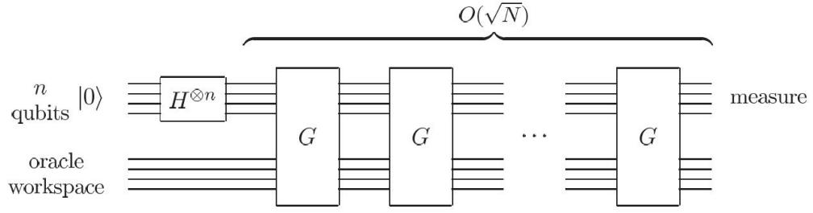
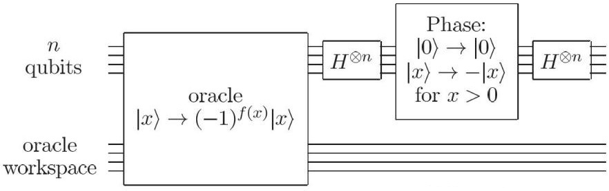
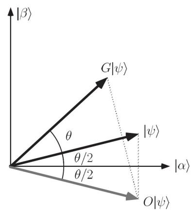
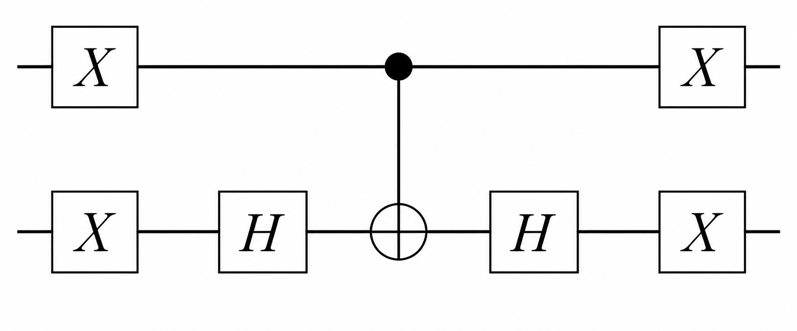
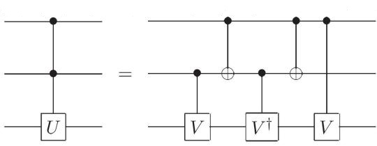
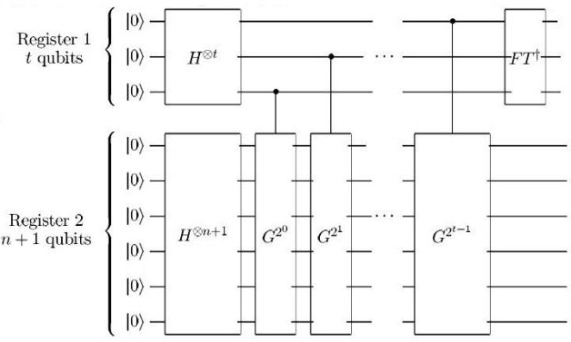

# 第五章 量子搜索算法

## 一、量子搜索的目标、黑盒子
- 1、量子搜索问题的基本内容: 给定 N 个对象 x = 0,1,...,N-1,在其中找出所有满足相应条件的对象。
- 2、由于对象是分立的,不同对象是否满足条件并没有必然联系,所以在无结构黑盒模型中,经典算法通常需要 $O(N/M)$ 次查询才能在 $N$ 个对象、$M$ 个解中找到一个解。Grover 算法把“是否满足条件”的判断封装成 oracle 查询,再用叠加态与振幅放大把查询复杂度减小到  $O(\sqrt{N/M})$ 。当 $M=1$ 时,这就是常见的 $O(\sqrt{N})$ 。
- 3、黑盒(Oracle) 理论
- (1) 在对象中进行搜索,等价于实现下面的函数。

$$f(x) = \begin{cases} 1, & x \text{ 是待搜索的解}, \\ 0, & x \text{ 不是解}. \end{cases}$$

(2) 黑盒的基本思想: 在搜索对象 $|x\rangle$ 和辅助比特 $|q\rangle$ 之间实现黑盒算符 $\hat{O}$ :

$$\hat{O}|x\rangle|q\rangle = |x\rangle|q \oplus f(x)\rangle$$

根据 q 初始状态的不同,该算符的作用也不同。例如,当 q 为基矢量 $|0\rangle$ 或 $|1\rangle$ 时,可以得到

$$\hat{O}|x\rangle|q\rangle = |x\rangle|q \oplus f(x)\rangle = \begin{cases} |x\rangle|\overline{q}\rangle, & f(x)=1, \\ |x\rangle|q\rangle, & f(x)=0. \end{cases}$$

即 $\hat{O}$ 算符受f(x)的值控制,选择是否翻转比特 $|q\rangle$ 。

当

$$|q\rangle = |-\rangle = \frac{|0\rangle - |1\rangle}{\sqrt{2}}$$

时,有

$$\hat{O}|x\rangle|q\rangle = |x\rangle|q \oplus f(x)\rangle = \begin{cases} -|x\rangle|q\rangle, & f(x)=1, \\ |x\rangle|q\rangle, & f(x)=0. \end{cases} = (-1)^{f(x)}|x\rangle|q\rangle$$

与前面章节同理,由于实际处理时 $|x\rangle$ 是叠加态,在直积分解时可以认为这个相位加在了 $|x\rangle$ 上,即 $|x\rangle$ — $\hat{o}$   $\rightarrow$   $(-1)^{f(x)}|x\rangle$ 。(Phase Oracle)

在形式理论中, 不考虑如何实现黑盒子, 只是讨论它的作用。

## 二、Grover 迭代法
- 1、在了解其意义之前,先展示 Grover 算法的线路图。 总线路图如下:

单次 Grover 迭代 G 的内部线路如下:

其中  $N=2^n$ 。

- 2、从开始到一次迭代 G 结束,包含以下步骤。
- (1) 将 n 比特  $|0\rangle$  经过 Hadamard 门:

$$\left|0\right\rangle^{\otimes n} \to \left|\psi\right\rangle = \frac{1}{\sqrt{2^n}} \left(\left|0\right\rangle + \left|1\right\rangle\right)^{\otimes n} = \frac{1}{\sqrt{N}} \sum_{x=0}^{N-1} \left|x\right\rangle$$

于是该寄存器包含了所有搜索对象 $|x\rangle$ 的等权叠加。

- (2) 通过黑盒子对搜索的解进行相位处理。
- (3) 后续存在一个条件相位操作: 对 $|0\rangle$ 不做处理,但对于所有非零的 $|x\rangle$ 都施加 $\pi$ 的相位,即 $|x\rangle \rightarrow -(-1)^{\delta_{x0}}|x\rangle$ 。容易验证,算符 $2|0\rangle\langle 0|-\hat{I}$ 可以实现这一操作。再加上两侧 Hadamard 门的作用,oracle 之后的操作为

$$\hat{H}^{\otimes n}(2|0\rangle\langle 0|-\hat{I})\hat{H}^{\otimes n}=2|\psi\rangle\langle\psi|-\hat{I}$$

因此,一次 Grover 迭代所对应的操作为

$$\hat{G} = (2|\psi\rangle\langle\psi| - \hat{I})\hat{O}$$

- 3、Grover 迭代的几何意义:将态矢转向正确答案张成的子空间。
  - (1) 设搜索问题有N个对象,其中包含M个正确解。定义非解矢量

$$|\alpha\rangle = \frac{1}{\sqrt{N-M}} \sum_{f(x)=0} |x\rangle$$

以及解矢量

$$|\beta\rangle = \frac{1}{\sqrt{M}} \sum_{f(x)=1} |x\rangle$$

在 phase oracle 下,有 $\hat{O}|\alpha\rangle = |\alpha\rangle$ , $\hat{O}|\beta\rangle = -|\beta\rangle$ 。并且, $\langle\alpha|\beta\rangle = 0$ 。

(2) 迭代前的等权叠加态  $|\psi\rangle$  是解矢量和非解矢量的叠加:

$$|\psi\rangle = \frac{1}{\sqrt{N}} \sum_{x=0}^{N-1} |x\rangle = \sqrt{\frac{N-M}{N}} |\alpha\rangle + \sqrt{\frac{M}{N}} |\beta\rangle$$

定义角度参数

$$
\theta = 2 \arcsin \sqrt{\frac{M}{N}},
$$

则有

$$
|\psi\rangle =
\cos \frac{\theta}{2} |\alpha\rangle
+ \sin \frac{\theta}{2} |\beta\rangle .
$$

在几何上,由于 $|\alpha\rangle$ 和 $|\beta\rangle$ 正交,可以将它们看成如下图的一个二维空间的标准正交基,而系统状态 $|\psi\rangle$ 就是在它们之间、与 $|\alpha\rangle$ 夹角为 $\frac{\theta}{2}$ 的单位矢量。

(3)单次迭代对应的几何操作:  $\hat{O}$ 将 $|\psi\rangle$ 沿 $|\alpha\rangle$ 翻折, $2|\psi\rangle\langle\psi|$ - $\hat{I}$ 将 $\hat{O}|\psi\rangle$ 沿 $|\psi\rangle$ 翻折。可以看到,这两步之后得到的态矢为

$$\hat{G}|\psi\rangle = \cos\frac{3}{2}\theta|\alpha\rangle + \sin\frac{3}{2}\theta|\beta\rangle$$

即单次迭代使态矢朝 $|\beta\rangle$ 转动了 $\theta$ 角。继续迭代,会发现每次都是这样转动 $\theta$ ,最终态矢将非常靠近 $|\beta\rangle$ 。

(4) 从算符角度证明上述几何操作: 以 $|\alpha\rangle$ 和 $|\beta\rangle$ 为基,考察该二维空间内的操作,则可以明确写出黑盒等算符的形式。

$$\hat{O}|\alpha\rangle = |\alpha\rangle, \quad \hat{O}|\beta\rangle = -|\beta\rangle \Rightarrow \hat{O} = \hat{Z} = \begin{pmatrix} 1 & 0 \\ 0 & -1 \end{pmatrix}$$

$$|\psi\rangle = \begin{pmatrix} \cos\frac{\theta}{2} \\ \sin\frac{\theta}{2} \end{pmatrix} \Rightarrow 2|\psi\rangle\langle\psi| - \hat{I} = \begin{pmatrix} \cos\theta & \sin\theta \\ \sin\theta & -\cos\theta \end{pmatrix}$$

$$\hat{G} = (2|\psi\rangle\langle\psi| - \hat{I})\hat{O} = \begin{pmatrix} \cos\theta & -\sin\theta \\ \sin\theta & \cos\theta \end{pmatrix} = \exp(-i\theta\hat{Y}) = \hat{R}_{y}(2\theta)$$

如果在 Bloch 球上看,Grover 迭代对应绕 y 轴转动  $2\theta$ ;如果像上图一样在二维空间中看,Grover 迭代对应平面内逆时针旋转 $\theta$ 。

**4、Grover 迭代的性能**

(1) 经过若干次迭代,系统的态矢会靠近 $|\beta\rangle$ ,但由于初始时 $|\psi\rangle$ 与 $|\beta\rangle$ 之间的夹角未必是 $\theta$ 的整数倍,所以 $\hat{G}^k|\psi\rangle$ 未必能够恰好指向 $|\beta\rangle$ ,只能选取与 $|\beta\rangle$ 最近的 $\hat{G}^k|\psi\rangle$ 作为最终结果。因此,对应的迭代次数为

$$R = \text{CI}\left(\frac{\pi - \theta}{2\theta}\right) = \text{CI}\left(\frac{\pi}{2\theta} - \frac{1}{2}\right)$$

其中 CI 表示最接近的整数(Closest integer)。

(2) 对迭代次数的大致估计:

$$R = \operatorname{CI}\left(\frac{\pi}{2\theta} - \frac{1}{2}\right) < \frac{\pi}{2\theta} = \frac{\pi}{4} \left(\frac{\theta}{2}\right)^{-1} \le \frac{\pi}{4} \left(\sin\frac{\theta}{2}\right)^{-1} = \frac{\pi}{4} \sqrt{\frac{N}{M}}$$

$$R = \operatorname{CI}\left(\frac{\pi}{2\theta} - \frac{1}{2}\right) \ge \frac{\pi}{2\theta} - 1 = \frac{\pi}{4} \left(\frac{\theta}{2}\right)^{-1} - 1 \ge \frac{\pi}{4} \left(\tan\frac{\theta}{2}\right)^{-1} - 1 = \frac{\pi}{4} \sqrt{\frac{N-M}{M}} - 1$$

因此

$$
\left\lfloor \frac{\pi}{4}\sqrt{\frac{N-M}{M}} \right\rfloor
\le
R
\le
\left\lfloor \frac{\pi}{4}\sqrt{\frac{N}{M}} \right\rfloor.
$$

从这一估计可以看出,量子搜索算法的查询复杂度随 $\sqrt{N/M}$ 缩放。特别地,只有一个解时为 $O(\sqrt{N})$ ;若解的数量 $M$ 增加,所需迭代次数会相应减少。

**5、条件相位门的线路实现**

条件相位门 $2|0\rangle\langle 0|-\hat{I}$ 可以用普通的量子线路来设计。由于其操作和比特的状态有关,显然需要用受控门实现。具体线路取决于比特数。

**(1) 双比特:**

$$\hat{I} - 2|00\rangle\langle 00| = \hat{X}^{\otimes 2}(\hat{I} - 2|11\rangle\langle 11|)\hat{X}^{\otimes 2}$$

由于

$$\begin{split} \hat{I} - 2|11\rangle\langle11| &= |00\rangle\langle00| + |01\rangle\langle01| + |10\rangle\langle10| - |11\rangle\langle11| \\ &= |0\rangle\langle0|\otimes(|0\rangle\langle0| + |1\rangle\langle1|) + |1\rangle\langle1|\otimes(|0\rangle\langle0| - |1\rangle\langle1|) \\ &= |0\rangle\langle0|\otimes\hat{I} + |1\rangle\langle1|\otimes\hat{Z} = C(\hat{Z}) \end{split}$$

根据第三章受控门的分解,有

$$C(\hat{Z}) = (\hat{I} \otimes \hat{H})CNOT(\hat{I} \otimes \hat{H})$$

所以 $\hat{I}-2|00\rangle\langle 00|=\hat{X}^{\otimes 2}(\hat{I}\otimes\hat{H})\text{CNOT}(\hat{I}\otimes\hat{H})\hat{X}^{\otimes 2}$ 。线路图如下:

**(2) 三比特:**

$$\hat{I} - 2|000\rangle\langle 000| = \hat{X}^{\otimes 3}(\hat{I} - 2|111\rangle\langle 111|)\hat{X}^{\otimes 3}$$

 $\hat{I} - 2|111\rangle\langle111| = |000\rangle\langle000| + |001\rangle\langle001| + \dots + |110\rangle\langle110| - |111\rangle\langle111|$ 

 $= (\left|00\right\rangle\!\left\langle00\right| + \left|01\right\rangle\!\left\langle01\right| + \left|10\right\rangle\!\left\langle10\right|) \otimes (\left|0\right\rangle\!\left\langle0\right| + \left|1\right\rangle\!\left\langle1\right|) + \left|11\right\rangle\!\left\langle11\right| \otimes (\left|0\right\rangle\!\left\langle0\right| - \left|1\right\rangle\!\left\langle1\right|)$ 

$$= (|00\rangle\langle00| + |01\rangle\langle01| + |10\rangle\langle10|) \otimes \hat{I} + |11\rangle\langle11| \otimes \hat{Z} = CC(\hat{Z})$$

在此图中令 $\hat{U} = \hat{Z}$ ,  $\hat{V} = \hat{S} = \text{diag}(1,i)$ 即可。

因此,设计此类线路的常见方法是通过 $\hat{X}$ 将特殊的(不被作用的)比特转为全1的比特。用单位算符减去全1比特,这一项实际上就对应了受控Z。

## 三、量子计数

1、在量子搜索中,有时并不知道正确答案的个数 M。一种比较直接的方法是尝试,也就是分别令  $M = 2^{n-1}, 2^{n-2}, ..., 2^0 = 1$ ,进行 Grover 迭代,看最终输出的效果。这一做法所需的迭代次数为

$$R \le \sum_{j=0}^{n-1} \left| \frac{\pi}{4} \sqrt{\frac{N}{2^j}} \right| \le \sum_{j=0}^{n-1} \frac{\pi}{4} \sqrt{\frac{N}{2^j}} \le \frac{2 + \sqrt{2}}{4} \pi \sqrt{N} = O(\sqrt{N})$$

但是,如果M超过N/2,那么 $\theta$ 将会很大,从而这样的尝试效率较低。在这种情况下,会考虑加入 N 个确定不是解的辅助对象,再在扩展后的搜索空间中计数,让 $\theta$ 保持在更合适的范围。

2、另一种尝试方法是考虑迭代次数。在某个假定的 $\theta$ 下,分别尝试以下次数的 Grover 迭代:

$$R_{\text{try}} = 0,1,2,4,...,2^{\left\lfloor \frac{n}{2} \right\rfloor}$$

可以证明,在合适的随机化或分段尝试方案下,可以在不知道 $M$ 的情况下仍保持 $O(\sqrt{N/M})$ 量级的查询复杂度。这里列出的倍增尝试只是一种直观方法,严格算法通常会随机选择迭代次数以避免反复“转过头”。

以上方法都不是很精确的估计,第一种方法假设了M是 2 的幂次,而第二种方法略显盲目;并且,如果搜索问题根本没有解,这些算法也无法进行较好的判断。标准的量子计数算法会对 Grover 算符做相位估计,从而估计解的个数 $M$ 。在使用 $O(\sqrt{N})$ 次 Grover 查询的典型设置下,其误差量级可以达到 $O(\sqrt{M})$ 。

3、量子计数算法的本质就是把求M的问题转化为相位估计问题。由于Grover 迭代的算符为

$$\hat{G} = \begin{pmatrix} \cos \theta & -\sin \theta \\ \sin \theta & \cos \theta \end{pmatrix}$$

容易算得其本征值为 $e^{\mathrm{i}\theta}$ 和 $e^{\mathrm{i}(2\pi-\theta)}$ 。通过相位估计算法将 $\theta$ 估测出来,然后根据定义即可得到 $M=N\sin^2\frac{\theta}{2}$ 。

4、量子计数的线路图: 就是 Grover 算符相位估计的线路。

(1)一次相位估计所需要的 Grover 迭代次数: 就是第二寄存器上 $\hat{G}$  算符作用的次数。

$$1+2+2^2+...+2^{t-1}=2^t-1\approx 2^t$$

(2) 测量第一寄存器,得到 i 的概率:

$$p(j) = \frac{1}{2 \times 4^{t}} \left| \frac{1 - \exp(i2^{t} \theta_{j}^{+})}{1 - \exp(i\theta_{j}^{+})} \right|^2 + \frac{1}{2 \times 4^{t}} \left| \frac{1 - \exp(i2^{t} \theta_{j}^{-})}{1 - \exp(i\theta_{j}^{-})} \right|^2$$

其中相位偏差为

$$
\theta_j^{\pm} = \pm \theta - \frac{2\pi j}{2^t}.
$$

5、估计的精度:利用一定量的比特可以将 $\theta$ 估计到m位,即

$$|\Delta \theta| \leq 2^{-m}$$

由此可以得到M的精度。

$$\sin^{2} \frac{\theta}{2} = \frac{M}{N}$$

$$\frac{\left|\Delta M\right|}{N} = \left|\sin^{2} \frac{\theta + \Delta \theta}{2} - \sin^{2} \frac{\theta}{2}\right| = \left(\sin \frac{\theta + \Delta \theta}{2} + \sin \frac{\theta}{2}\right) \left|\sin \frac{\theta + \Delta \theta}{2} - \sin \frac{\theta}{2}\right|$$

因为

$$\sin\frac{\theta + \Delta\theta}{2} = \sin\frac{\theta}{2}\cos\frac{\Delta\theta}{2} + \cos\frac{\theta}{2}\sin\frac{\Delta\theta}{2} \le \sin\frac{\theta}{2} + \left|\sin\frac{\Delta\theta}{2}\right| \le \sin\frac{\theta}{2} + \left|\Delta\theta\right|$$

所以

$$\frac{\left|\Delta M\right|}{N} = \left(\sin\frac{\theta + \Delta\theta}{2} + \sin\frac{\theta}{2}\right) \left|\sin\frac{\theta + \Delta\theta}{2} - \sin\frac{\theta}{2}\right| \le \left(2\sin\frac{\theta}{2} + \frac{\left|\Delta\theta\right|}{2}\right) \frac{\left|\Delta\theta\right|}{2}$$

再代入

$$
\sin^2\frac{\theta}{2} = \frac{M}{N},\qquad
|\Delta\theta| \le 2^{-m},\qquad
N = 2^n,
$$

可知

$$\left|\Delta M\right| \le N\left(2\sqrt{\frac{M}{N}} + \frac{2^{-m}}{2}\right)\frac{2^{-m}}{2} = 2^{-m}\sqrt{MN} + 2^{n-2m-2} = O(\sqrt{M})$$

相应地,若测量成功概率不低于 $1-\varepsilon$ ,则第一寄存器所需要的比特数为

$$t = m + 3 + \left\lceil \log \left( 2 + \frac{1}{2\varepsilon} \right) \right\rceil$$
