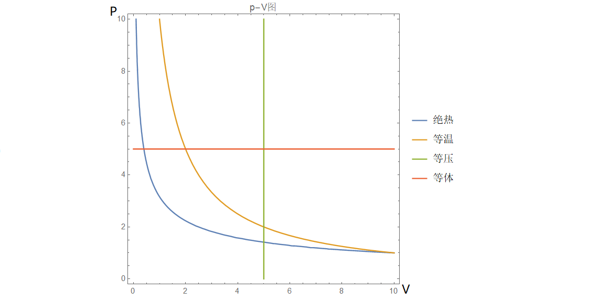

# 理想气体热学过程的相关计算

**★** 1845年焦耳通过**(绝热)自由膨胀实验(由$\delta W=\delta Q=0$导出$dU=0$)**测得焦耳系数$\left(\frac{\partial T}{\partial V}\right)_U=0$，从而根据$U(T,V)$的偏导关系推出气体的内能只是温度的函数，与体积无关，称为**焦耳定律**。(P.S.注意这里的气体是一团粒子数固定的气体)然而，1852年通过节流过程的实验发现内能还和体积有关。究其原因，这种与体积相关的内能来源于分子间的作用力，**因此作为忽视作用力和分子大小的经典理想气体，其内能的确只是温度的函数。**

**★** 对于理想气体，立马得到**属于理想气体**的定体和定压热容定义式，并根据内能只是温度的函数和之前推导的$C_p$和$C_V$的差值：

$$
C_V=\left(\frac{\partial U}{\partial T}\right)_{V}=\frac{dU}{dT}\Rightarrow \boxed{dU=C_VdT}\quad C_p=\left(\frac{\partial H}{\partial T}\right)_{p}=\frac{dH}{dT}\Rightarrow \boxed{dH=C_pdT}
$$

$$
C_p-C_V=\left(\frac{\partial V}{\partial T}\right)_{p} \left[\left(\frac{\partial U}{\partial V}\right)_{T}+p\right]=\left(\frac{\partial V}{\partial T}\right)_{p}p=\boxed{nR}
$$

上式，再根据$\gamma=\frac{C_p}{C_V}$的定义得到(证明题常会使用)：

$$
\boxed{C_V=\frac{nR}{\gamma-1}\quad C_p=\gamma\frac{nR}{\gamma-1}}
$$

此外，可以立马导出对于理想气体任意过程的热容计算式为：

$$
C=\left(\frac{\partial U}{\partial T}\right)_{V}+\frac{dV}{dT}\left[\left(\frac{\partial U}{\partial V}\right)_{T}+p\right]=C_V+p\frac{dV}{dT}
$$

理想气体方程为$pV=nRT$,为了与后续多方过程的$n$指数进行区分，这里暂时写为$pV=\nu RT$
.此外，从方程中的变量可以看出，最简单的三个过程：**等压过程、等体过程、等温过程。**此外根据热一又可以有**绝热过程**。事实上，更一般地来说，这些均为**多方过程**的特殊情况，下面逐个分析。

首先讨论外界对系统做功：

$$
\begin{aligned}
(1)\text{等压过程} \quad& \Delta W  =  -\int_{V_1}^{V_2}pdV  =  -p(V_2-V_1)\\
(2)\text{等体过程} \quad& \Delta W  = -\int_{V_1}^{V_2}pdV =  0\\
(3)\text{等温过程} \quad&\Delta W  =  -\int_{V_1}^{V_2}pdV  =  -\int_{V_1}^{V_2}\frac{\nu RT}{V}dV  = \boxed{ \nu RTln(\frac{V_1}{V_2})  =  \nu RTln(\frac{p_2}{p_1})}  \\
(4)\text{绝热过程} \quad& \Delta W  =  -\int_{V_1}^{V_2}pdV=?(\text{需要通过热一微分式和理想气体方程导出})
\end{aligned}
$$

下面我们使用上面的结论，利用p-V图进行详细讨论：**(Tip：这里要注意区分三类方程：热一微分式、理想气体方程、过程约束方程)**

(1)等压过程：根据理想气体方程得到过程约束方程：$\boxed{p=\mathrm{Const.}}$ 由热一得到：

$$
dU=\delta Q+\delta W\Rightarrow dQ=C_V dT-dW
$$

从而得到：

$$
\Delta U=C_V(T_2-T_1)
$$

$$
\Delta W=-p(V_2-V_1)
$$

$$
\Delta Q=\Delta U-\Delta W=(C_V+\nu R)(T_2-T_1)=C_P(T_2-T_1)=\Delta H
$$

**■** 注意，热容都是系统的内禀属性，通常为已知量。此外，这里用等体热容对理想气体内能变化量的代换是最常见的操作，需要习惯和理解。具体原因可以通过范氏气体的$U(T,V)$微分式触类旁通：

$$
\left(\frac{\partial U}{\partial V}\right)_T=T\left(\frac{\partial p}{\partial T}\right)_V-p=\frac{a\nu^2}{V^2}\Rightarrow dU=C_VdT+\frac{a\nu^2}{V^2}dV
$$

而理想气体$\left(\frac{\partial U}{\partial V}\right)_T$求出来为0，因而可以直接代换。

(2)等体过程：根据理想气体方程得到过程约束方程：$\boxed{V=\mathrm{Const.}}$由热一得到：

$$
dU=\delta Q+\delta W\Rightarrow dQ=C_V dT
$$

从而得到：

$$
\Delta U=C_V(T_2-T_1)
$$

$$
\Delta W=0
$$

$$
\Delta Q=\Delta U=C_V(T_2-T_1)
$$

(3)等温过程：根据理想气体方程得到过程约束方程：$\boxed{pV=\mathrm{Const.}}$ 由热一得到：

$$
dU=\delta Q+\delta W\Rightarrow dQ=C_V dT+\frac{\nu RT}{V}dV
$$

从而得到：

$$
\Delta U=0
$$

$$
\Delta W=\nu RTln(\frac{V_1}{V_2})
$$

$$
\Delta Q=-\Delta W=\nu RTln(\frac{V_2}{V_1})
$$

**注意内能不变只对理想气体成立，由此也可导出其自由膨胀温度不变**

(4)绝热过程：与之前不同，由于过程约束涉及热量$Q$，但并不在理想气体方程中，因此需要借助热一来推出微分式，从而得到过程约束方程。

$$
\delta Q=0\Rightarrow dU=\delta W\Rightarrow C_VdT=-\frac{\nu R T}{V}dV
$$

$$
\int\frac{C_V dT}{T}=-\int\frac{\nu RdV}{V}\Rightarrow TV^{\gamma-1}=Const.\quad or\quad\boxed{ pV^\gamma=Const.}
$$

现在可以推导绝热过程外界对系统做功了：

$$
\Delta W=-\int_{V_1}^{V_2}pdV=-\int_{V_1}^{V_2}\frac{Const.}{V^\gamma}dV=Const.\frac{V^{1-\gamma}_2-V^{1-\gamma}_1}{\gamma-1}
$$

$$
=\frac{Const.V^{1-\gamma}_2-Const.V^{1-\gamma}_1}{\gamma-1}=\frac{p_2V_2^\gamma V^{1-\gamma}_2-p_1V_1^\gamma V^{1-\gamma}_1}{\gamma-1}=\frac{p_2V_2-p_1V_1}{\gamma-1}=\frac{\nu R(T_2-T_1)}{\gamma-1}
$$

综上有：

$$
\Delta U=\frac{\nu R(T_2-T_1)}{\gamma-1}=C_V(T_2-T_1)
$$

$$
\Delta W=\frac{p_2V_2-p_1V_1}{\gamma-1}=\frac{\nu R(T_2-T_1)}{\gamma-1}
$$

$$
\Delta Q=0
$$

**Tip:求状态参量p,V,T时，常借助物态方程和过程约束，而求W,Q,U则利用热一的微分式积分得到。**

以上的热力学过程的约束均可表达为$\boxed{pV^n=Const.}$,其中$n=0$为等压过程、$n=\infty$为等体过程、$n=1$为等温过程、$n=\gamma$为绝热过程。

仅根据此约束方程，易得(计算过程和绝热过程相似，故省略)：

$$
\Delta U=C_V(T_2-T_1)
$$

$$
\Delta W=\frac{p_2V_2-p_1V_1}{n-1}=\frac{\nu R(T_2-T_1)}{n-1}
$$

$$
\Delta Q=\Delta U-\Delta W=\left(C_V-\frac{\nu R}{n-1}\right)(T_2-T_1)
$$

由上式中$\Delta Q=C_n \Delta T$得到多方过程的热容：

$$
\boxed{C_n=C_V-\frac{\nu R}{n-1}=\frac{n-\gamma}{n-1}C_V}
$$

当然也不用这么麻烦，上式也可从热一和多方过程约束方程直接推得。

**★** 最后来研究一下p-V图的关系：想象这样一个过程，方程$pV^n=Const.$中的n从0开始增长到无穷大，即从等压过程逐渐变为等温过程，再到绝热过程，最后成为等体过程。曲线由水平逐渐变陡峭。下图展示了，常见的四种过程。

