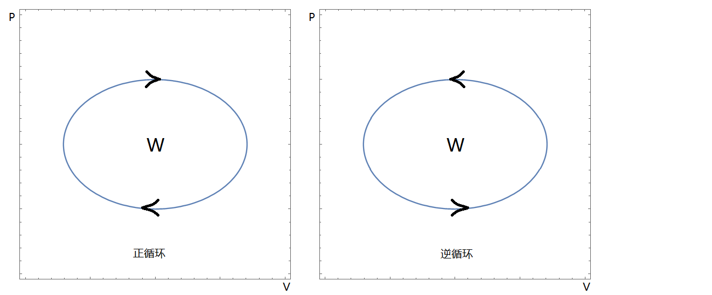
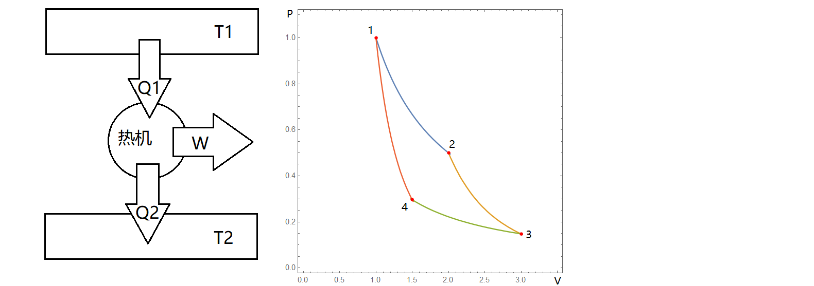
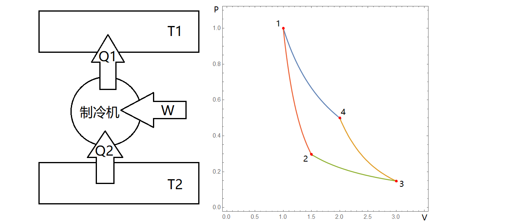

# 卡诺循环以及效率

**★** 首先来讨论循环的概念:系统经历一系列变化，又回到原来的状态称为循环。当为准静态过程时，可以在p-V图上画出封闭的曲线。

注意，循环过程曲线的方向性。根据系统对外做功的定义式：

$$
W_{\text{系统对外}}=\oint pdV
$$

可以看出几何意义为p-V图封闭曲线包围的面积(由于$\Delta U=0$,故面积也为系统的吸热量)，但要注意积分的方向性导致面积有正有负，即系统对外做功的正负。因而通常将循环分为两类：正循环和逆循环。

如图所示，由于内能是状态函数，经历一个循环不改变，因而：(1)正循环:系统从高温热源吸收热量$Q_1$，并且对外做功$W$，也称为热机；(2)逆循环:系统吸收低温热源的热量$Q_2$，并且靠外界对其做功$W$向高温热源放出热量，称为制冷机。且均满足：$Q_1=W+Q_2$.

根据以上机理，从“付出”和“回报”的角度，可以定义循环效率：

$$
\text{热机效率:}\eta =\frac{W}{Q_1}\qquad\text{制冷系数:}\eta=\frac{Q_2}{W}
$$

注意对于热机和制冷机，$Q_1$和$Q_2$代表的意思略有不同，但都是分别与高温和低温热源的热量交换问题。最典型的例子是理想气体的卡诺循环：

**★** 卡诺循环由两个等温过程和两个绝热过程组成，因而有4个转折点。根据p-V图不难分出哪个是等温哪个是绝热过程，且对应的热量-能量转化图可以得到$\boxed{Q_1=Q_2+W}$。详细的效率计算如下(默认$T_1>T_2$)：

(1)卡诺热机p-V图如下，经历1$\sim$4过程作为一个循环。

首先考虑等温过程1$\sim$2和3$\sim$4，求出系统吸收和放出的热量：

$$
Q_1=nRT_1ln(\frac{V_2}{V_1})\qquad Q_2=nRT_2ln(\frac{V_3}{V_4})
$$

**注意由$Q_2$放热产生的正负号问题**，再根据热机效率的定义：

$$
\eta=\frac{W}{Q_1}=1-\frac{Q_2}{Q_1}=1-\frac{T_2ln(\frac{V_3}{V_4})}{T_1ln(\frac{V_2}{V_1})}
$$

再利用2$\sim$3和4$\sim$1的绝热过程有：

$$
T_1V_2^{\gamma-1}=T_2V_3^{\gamma-1}\qquad T_2V_4^{\gamma-1}=T_1V_1^{\gamma-1}
$$

代入得到：

$$
\eta=1-\frac{T_2}{T_1}
$$

此外，对于热容随温度变化的情况，易证效率不变。

(2)卡诺制冷机p-V图如下，经历1$\sim$4过程作为一个循环。

首先根据制冷机效率的定义：

$$
\eta=\frac{Q_2}{W}
$$

由于逆卡诺循环仅仅是过程反了，因而计算的结果不变，直接得到：

$$
\eta=\frac{T_2}{T_1-T_2}
$$

制冷机效率越大说明几乎不用做功就可以实现热传递。

**★** 卡诺循环虽然很简单，但其描述了两个不同温度的热源通过热机做功的问题，*从繁杂的循环中抽出最基本的东西，*使得之后分析基础问题成为可能。当然，也可以利用其他方式进行之后的推导，不过数学过于复杂。
