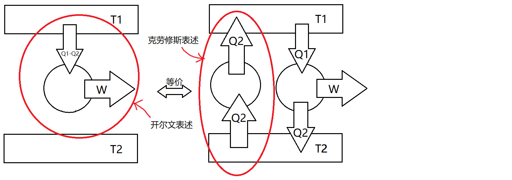

# 热力学第二定律

**★** 热力学第一定律表明能量的守恒，但仅靠这一信息并不能对能量演化的方向性进行约束和判断。有些假想的过程尽管原则上不违背热一，但却是不存在的。由此热力学第二定律应运而生。

**开尔文表述：不可能从单一热源吸热使之完全变为有用的功，而不产生其他影响．**

**克劳修斯表述：不可能把热从低温物体传到高温物体，而不产生其他影响．**

- 如果将热二反过来说，也是正确的。即功可以完全变为热，热可以从高温传到低温，而不产生其他影响。
- 产生其他影响指的是，例如卡诺循环的$Q_2$、制冷机循环的$W$、等温过程的体积膨胀。
- 热力学的相关命题常常通过构造热机进行反证，或者利用p-V图构造违反热二的循环进行证明。

下面来证明两个表述的等价性(默认$T_1>T_2$)：

**★** 热二的等价表述还有许多，甚至无法穷尽地罗列出来。谈及热二中“产生的影响”，往往涉及不可逆过程的概念。不严格地，可以理解为功转化为热的不可逆，即**热功转化的不等价性**，可以形象地理解为“覆水难收”。后续会引入“熵”的概念，来用数学语言进行描述。
