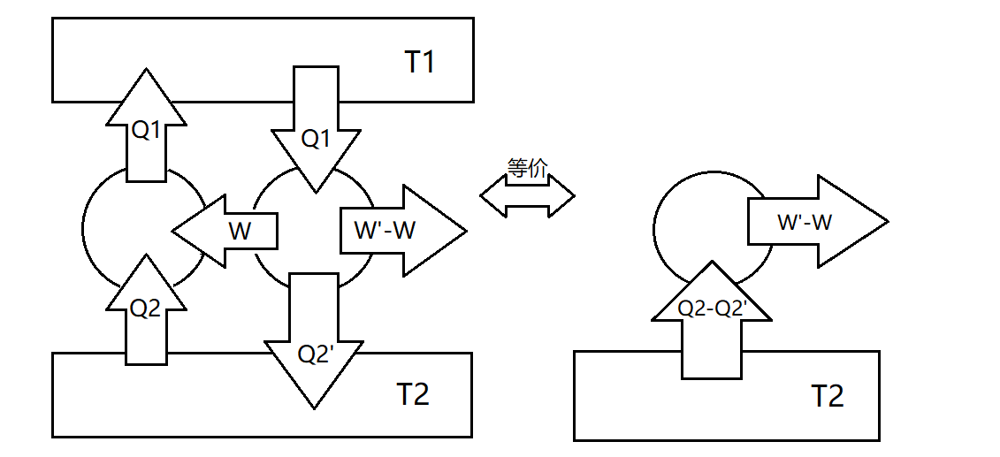

# 卡诺定理、热力学温标存在

**★** 首先要区分可逆和不可逆的概念：

可逆：无耗散或无摩擦的准静态过程，类比可逆的化学反应。此外，**能画在p-V图上的都是可逆过程。**

不可逆：过程所产生的 后果，无论用任何方法，都不可能完全恢复原状而不引起其他变
化，类比自发的化学反应。**并且不能画在p-V图上。**

由于自然界一切热现象都是不可逆过程，因此可逆过程的图景很难想象。然而，可逆过程在分析问题时却很有用，是一种非常好的思维方法。

**★** **卡诺定理：所有工作于两个一定温度之间的热机，$\eta_{\text{可逆}}\geqslant\eta_{\text{未知热机}}$．**

证明如下：假设$\eta_{\text{可逆}}<\eta_{\text{未知热机}}$,且两热机吸收热量$Q_1$相同，可逆热机做功为W，未知热机做功为$W'$。从而有：

$$
\frac{W}{Q_1}<\frac{W'}{Q_1}\Rightarrow W'-W>0
$$

从而未知热机比可逆热机多余出来的功，可以给可逆热机，进行逆循环。此时，两热机组成的整体等价于第二类永动机，从而假设错误，卡诺定理得证。

同理可得，**所有工作于两个一定温度之间的可逆热机，效率相等。**由于卡诺循环满足无摩擦的准静态过程，因而可得可逆热机的效率为$\eta=1-\frac{T_2}{T_1}$

**★** 利用以上结论，可以证明热力学温标的存在。设可逆卡诺热机吸收和放出的热量为$Q_1$和$Q_2$：

$$
\eta=1-\frac{Q_2}{Q_1}\Rightarrow \frac{Q_2}{Q_1}=f(\theta_1,\theta_2 )
$$

另一可逆卡诺热机为$Q_3$和$Q_1$：

$$
\frac{Q_1}{Q_3}=f(\theta_1,\theta_3 )
$$

将第二个热机放出的热量$Q_1$输入给第一个，则整体组成的热机有：

$$
\frac{Q_2}{Q_3}=f(\theta_2,\theta_3)
$$

易得：

$$
\frac{Q_2}{Q_1}=f(\theta_1,\theta_2)=\frac{f(\theta_2,\theta_3)}{f(\theta_1,\theta_3)}\Rightarrow \frac{Q_2}{Q_1}=\frac{f(\theta_2)}{f(\theta_1)}
$$

从而可以选择与$\theta$正比的函数关系定义温标，即热力学温标。**此外可以导出温度恒正，否则会违反热二。**
