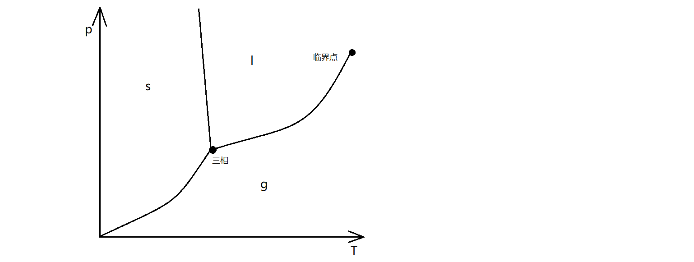

# 克拉伯龙方程

**★** 考虑简单系统的相变，气液通常只有一个相、固体通常可以有多个相。根据不同的相，将p-T图进行区域划分称为相图，如下图所示。

其中三相点为固液气三相平衡共存的状态点，临界点为气态与液态无法区分的临界状态点。从某一相，越过曲线发生相变，会放出或吸收所谓相变潜热。注意，在某一相区域内，其他相仍然可以通过涨落而存在，只是化学势过小。当某两相化学势相等时，就会形成p-T图上的相平衡曲线。因而，分析相变时化学势起到十分关键的作用。

考虑两种相$\alpha$和$\beta$之间的平衡，根据平衡判据，两相必须满足$T,p,\mu$相等，从而化学势的微分也要满足$d\mu^\alpha=d\mu^\beta$,从而：

$$
-s^\alpha dT+v^\alpha dp=-s^\beta dT+v^\beta dp\Rightarrow \frac{dp}{dT}=\frac{s^\beta-s^\alpha}{v^\beta-v^\alpha }
$$

通常相变点处进行的是可逆的等温等压过程，并且相变潜热$L=\Delta H=Q$和$\Delta v$是容易测量的，利用可逆相变的性质得到：

$$
L=\int Tds=T(s^\beta-s^\alpha)\Rightarrow \boxed{\frac{dp}{dT}=\frac{L}{T(v^\beta-v^\alpha)}}
$$

上式即克拉伯龙方程,用于描述相变曲线的斜率。注意此方程的适用条件是一级相变，即吉布斯函数(化学势)连续，而其一阶导不连续(熵和体积有一个跃变)。**基于此，可以定义出$n$级相变，即吉布斯函数从$n$阶导开始突变的相变过程。**对于二级相变，由于熵和体积不变，因而出现$0/0$不定型，利用洛必达法则对$T$和$p$求导得到：

$$
\boxed{\frac{dp}{dT}=\frac{\alpha^{(2)}-\alpha^{(1)}}{\kappa_T^{(2)}-\kappa_{T}^{(1)}}=\frac{c_p^{(2)}-c_p^{(1)}}{Tv(\alpha^{(2)}-\alpha^{(1)})}}
$$

上式为Ehrenfest方程，利用在二级相变中的突变的响应量和热容来表达。

**★** 再回到克拉伯龙方程，谈及一些应用问题。例如，由于冰的摩尔体积比水的大，且从水到冰的相变要放出热量，从而$\frac{dp}{dT}<0$.即压强和相变的温度负相关，从而滑冰时冰刀给予的高压强会使冰熔点下降，从而相变为水降低摩擦系数。

此外，对于相变潜热随温度变化的问题，由凝聚相$\alpha$到蒸气相$\beta$,根据等压的条件有：

$$
\left(\frac{\partial L}{\partial T}\right)_p=\left(\frac{\partial \Delta h}{\partial T}\right)_p=c_p^\beta-c_p^\alpha\Rightarrow L=\int(c_p^\beta-c_p^\alpha)dT+L_0
$$

上式默认等压条件，这也就与**物理化学**中的基尔霍夫方程类似。

最后，为了粗略导出蒸气压方程，考虑摩尔理想气体且**忽略**液相体积和相变潜热随温度的变化，不难得到：

$$
\frac{dp}{dT}=\frac{Lp}{T^2R}\Rightarrow p=p_0e^{\frac{-L}{RT}}
$$
