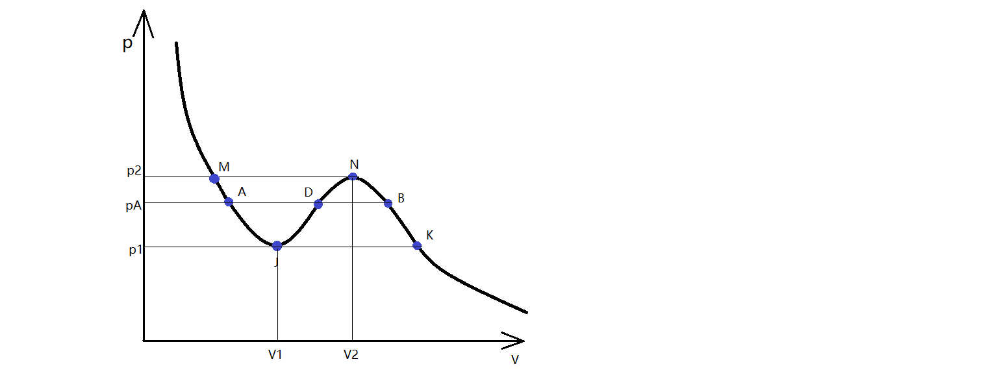

# Maxwell等面积规则、范氏气体临界点位置

**★** 范德瓦尔斯方程因其考虑了分子间的相互作用和分子大小，解释了气液相变和临界点等现象而出名。但其p-V图在相变过程会出现如下图等温线的JN段，即压强越大体积越大的不稳定状态。为了与实验结果吻合，需要进行相关修正，即本节的Maxwell等面积规则。

对上图等温线进行分析，由等温化学势的微分得到：

$$
d\mu=vdp\Rightarrow \mu=\int vdp+\mu_0
$$

注意积分的方向性，分段进行积分：KN段和JM段方向使得压强p增加，从而积分和化学势也增加。NJ段方向使得压强p减少，从而积分和化学势减少。

修正的方法是用一条直线代替中间的不稳定部分。如图直线AB段为修正的相变过程，在此区域化学势为定值，从而：

$$
\int_{\overset{\frown}{BA}}v\,dp=0
$$

不难看出积分意义为正的BND面积加上负的DJA面积，故要使积分为0则两项面积的绝对值应该相等。等价地，在常见的$p$-$v$图上也可写成$\int_{v_l}^{v_g}[p(v)-p_0]\,dv=0$。这就是所谓的Maxwell等面积规则。

当然，也可以从可逆循环的角度得到Maxwell等面积规则：构造一个可逆循环AJDNBDA,由于循环温度T始终不变，根据$\oint dU=\oint TdS-\oint pdV$,将T提出来，再由$\oint dU=0,\oint dS=0$得到$\oint pdV=0$.

此外，亚稳态AJ和NB段分别代表过热液体和过饱和蒸气。下一节将详细讨论。

**★** 现在利用摩尔范氏方程，讨论气液临界点的性质。当等温线的极小值J与极大值N共点时，即达到临界点。从而可将范氏方程代入下式：

$$
\left(\frac{\partial p}{\partial v}\right)_T=0\qquad\left(\frac{\partial^2 p}{\partial v^2}\right)_T=0
$$

上式表示临界点是等温线的拐点。联立求得：

$$
T_c=\frac{8a}{27bR}\qquad p_c=\frac{a}{27b^2}\qquad v_c=3b
$$

消去上式的测量系数，不难发现任何范氏气体应该满足：

$$
\frac{RT_c}{p_cv_c}=\frac{8}{3}
$$

此外,引入无量纲的温度、压强、体积可将范氏方程写作：

$$
T^*=\frac{T}{T_c}\quad p^*=\frac{p}{p_c}\quad v^*=\frac{v}{v_c}\Rightarrow \left(p^*+\frac{3}{{v^*}^2}\right)\left(3v^*-1\right)=8T^*
$$

其中带星号的为对比量，当两个对比量相同时，第三个对比量必定相同，此称为对应态定理。
