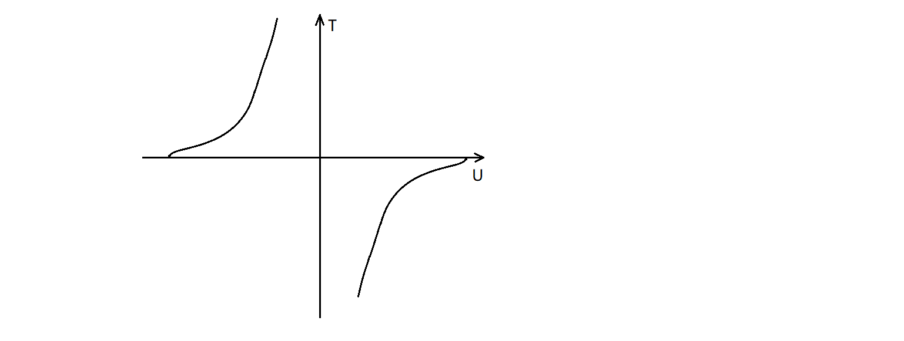

# 二能级系统

%负温度、三能级系统

**★** 二能级系统在物理中应用十分广泛，例如铁磁相变、激光输运等，这里仅讨论近独立的定域二能级系统。为了讨论方便，这里在稀磁系统的背景下，设两个非简并的能级分别为$\varepsilon_1=-\mu B,\varepsilon_2=\mu B$分别代表两种自旋状态:

$$
Z_1=\sum_l\omega_le^{-\beta\varepsilon_l}=e^{\beta\mu B}+e^{-\beta\mu B}=2cosh(\frac{\mu B}{kT})
$$

利用粒子配分函数，不难得到内能和熵的表达式:

$$
U=-N\frac{\partial}{\partial \beta}ln(Z_1)=-N\mu Btanh(\frac{\mu B}{kT})
$$

$$
S=Nk\left(ln(Z_1)-\beta\frac{\partial}{\partial \beta}ln(Z_1)\right)=Nk\left[ln(2cosh(\frac{\mu B}{kT}))-\frac{\mu B}{kT}tanh(\frac{\mu B}{kT})\right]
$$

*熵也可以由$S=-Nk\sum_sP_slnP_s$来求得。*	下面讨论两个有趣的问题：

- “负温度”：从$T=\left(\frac{\partial U}{\partial S}\right)_y$的视角来看待温度$T$,首先需要得到函数$S(U)$，但显然上式很难建立S与U的关系式，因而另辟蹊径：

$$
N=N_++N_-\quad U=\mu B(N_+-N_-)
$$

$$
\Rightarrow N_+=\frac{N}{2}\left(1+\frac{U}{N\mu B}\right)\quad N_-=\frac{N}{2}\left(1-\frac{U}{N\mu B}\right)
$$

根据玻尔兹曼关系，可求出$S(U)$：

$$
S=kln(\Omega)=kln\left(\frac{N!}{N_+!N_-!}\right)\approx k(NlnN-N_+lnN_+-N_-lnN_-)
$$

上式使用了Stirling近似，由此得出温度为：

$$
T=\left(\frac{\partial U}{\partial S}\right)_B=\left[\frac{k}{2\mu B}ln\left(\frac{N\mu B-U}{N\mu B+U}\right)\right]^{-1}
$$

*事实上，也可从$U(T)$导出上式。*具体的温度随内能的变化如下图：

通常这种奇特的现象出现在核自旋系统，因为其相对容易满足两个必要条件：(1)系统的能量有上限(2)系统与任何正温度系统隔绝。

- 肖特基热容：根据内能的表达式和热容定义:

$$
C_V=\frac{\partial U}{\partial T}=\frac{NB^2\mu^2sech(\frac{\mu B}{kT})^2}{kT^2}
$$

不难看出当$T\rightarrow0$和$T\rightarrow\infty$时，热容分别以指数和幂次趋向于0.且在某一温度热容会有极大值。

**★** 下面研究顺磁性与温度的关系,一方面可以从磁矩能量$E=-\mu\cdot B$出发，由于磁矩为定值得到$\delta W=-n\mu dB$,直接利用粒子配分函数得出：

$$
M=\frac{n}{\beta}\frac{\partial}{\partial B}ln(Z_1)=n\mu tanh(\frac{\mu B}{kT})
$$

另一方面也可从二能级出现的概率入手，求出体系的平均磁矩;

$$
P_+=\frac{e^{-\beta \mu B}}{Z_1}\quad P_-=\frac{e^{\beta \mu B}}{Z_1}\Rightarrow M=n(-\mu P_++\mu P_-)=n\mu tanh(\frac{\mu B}{kT})
$$

(1)若体系高温或弱场时：

$$
\frac{\mu B}{kT}\rightarrow0\quad\Rightarrow\quad M\rightarrow n\mu \frac{\mu B}{kT}=\chi H\quad S\rightarrow Nkln2\quad P_\pm\rightarrow \frac{1}{2}
$$

由此可看出居里定律，以及高温下两种能级占据的数量是基本相等的。

(2)若体系低温或强场时：

$$
\frac{\mu B}{kT}\rightarrow\infty\quad\Rightarrow\quad M\rightarrow n\mu \quad S\rightarrow0\quad P_+\rightarrow 0 \quad P_-\rightarrow 1
$$

即在低温或强场下，磁矩均沿着相同的方向。

**★** 除了二能级系统，常常也会考虑三能级系统，例如总自旋为1的定域粒子系统，磁量子数可以取$-1,0,1$三种状态，即三能级系统。如：

$$
Z_1=e^{\beta\mu B}+1+e^{-\beta\mu B}=1+2cosh(\frac{\mu B}{kT})\quad\Rightarrow\quad ln(Z_1)=ln(1+2cosh(\frac{\mu B}{kT}))
$$

可见$ln(Z_1)$与二能级系统相比，对数内部多了$1$这一项，从而导致热力学量性质的差异，但取得近似后，也仅仅是系数上的不同。
